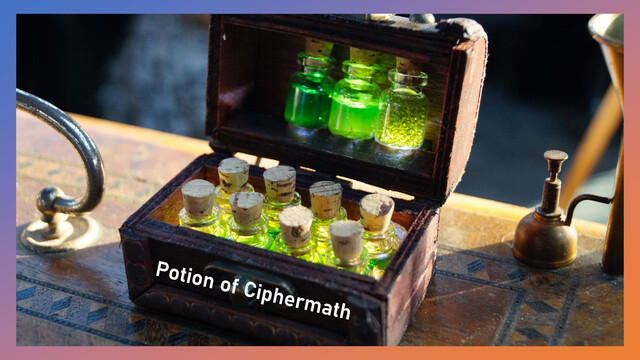

神奇的糊塗魔藥 / Potion of Ciphermath
===

## Summary

* **Thumbnail:** 
* **Song:** https://www.youtube.com/watch?v=jrP24ZSYHts
* **Author:** mystiz
* **Categories:** Misc, Crypto, ★★★★☆
* **Points:** 450
* **Solves:** 1/234 (Secondary: 0/103, Tertiary: 1/65, Open: 0/60, Invited: 0/6)

## Description

> 無視道與理 是與非非 盼待往天飛 卻要撞地
> 在忙亂之中找到勇氣 一片塵埃中起飛

Let's speak in math! Of course we can make it harder by encrypting the numbers, too.

```bash
nc chalp.hkcert21.pwnable.hk 28201
```

## Hints

> 這題被標上 Misc 的原因是它是道 PPC 問題 － 你需要想一個夠快的算法來解決問題。ICPC-ers / OI-ers 心動不如行動吧！
> This is labeled as a misc challenge because that is partly a PPC challenge - that you need to think of an efficient algorithm. ICPC-ers / OI-ers, go ahead!


### Attachments

- [magical-random-potion_d027eaf3f3ee51e40b6253c92476569f.zip](https://github.com/hkcert-ctf/CTF-Challenges/releases/download/CTF2021/magical-random-potion_d027eaf3f3ee51e40b6253c92476569f.zip)

## Flag

`hkcert21{y0u_drunk_th3_m4gic4l_p0t10n_4nd_st4rt_sp34k1n9_m4th_t0_m3_n0w}`
