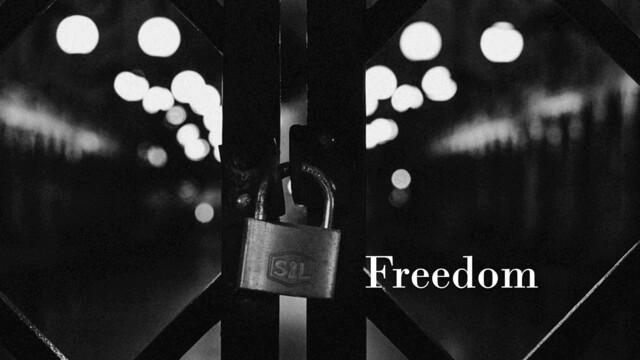

Freedom / Cipher Mode Picker
===

## Summary

* **Thumbnail:** 
* **Song:** https://www.youtube.com/watch?v=HDRP9RiWXOY
* **Author:** mystiz
* **Categories:** Crypto, ★☆☆☆☆
* **Points:** 100
* **Solves:** 21/234 (Secondary: 0/103, Tertiary: 5/65, Open: 10/60, Invited: 6/6)

## Description

> Freedom where's our freedom?
> Freedom what would it be
> Can you tell me what's the reason?
> Reason that meant to be

Every slightest mistake in cryptography would lead to a disastrous result. Let's see what will happen when you allow end-users to pick the mode of operation...

```bash
nc chalp.hkcert21.pwnable.hk 28102
```

### Attachments

- [freedom_ff0173b179d746386dca0e93e6c00d47.zip](https://github.com/hkcert-ctf/CTF-Challenges/releases/download/CTF2021/freedom_ff0173b179d746386dca0e93e6c00d47.zip)

## Flag

`hkcert21{w3_sh0u1d_n0t_g1v3_much_fr3ed0m_t0_us3r5_wh3n_1t_c0m3s_t0_cryp70gr4phy}`
