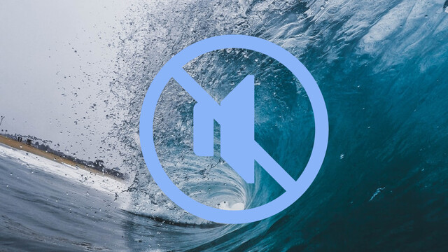

無聲浪 / The Wave of Us
===

## Summary

* **Thumbnail:** 
* **Song:** https://www.youtube.com/watch?v=AGU_FMudl1Y
* **Author:** byronwai
* **Categories:** Forensics, ☆☆☆☆☆
* **Points:** 50
* **Solves:** 152/234 (Secondary: 51/103, Tertiary: 47/65, Open: 48/60, Invited: 6/6)

## Description

> 像密碼 若無線索
> 只好留下困惑

_IEEE Transactions on Signal Processing, Vol.51, (no.4), pp.1020–33, 2003._

How to:

1. Google the description
2. Find the GitHub repository written by Microsoft and meet the description
3. Download the tool and extract the Hex from audio
4. Decode the Hex into ASCII characters
5. Profit

## Hints

Walkthrough:

1. Google the description
2. Find the [GitHub repository](https://github.com/toots/microsoft-audio-watermarking) written by Microsoft 
3. Download the tool (repository) in zip
4. Extract the zip, for example, you extract the zip under `D:\Downloads`
5. Copy the audio file (`waterwave.wav`) to `D:\Download\microsoft-audio-watermarking-master\build\`
6. Open the command prompt and execute the following:
```
D:\Download\microsoft-audio-watermarking-master\build\detect2003.exe D:\Download\microsoft-audio-watermarking-master\build\watermark.wav
```
7. Record ass Hex decoded
7. Convert all Hex it into ASCII characters, there are many [online tools](https://www.binaryhexconverter.com/hex-to-ascii-text-converter) that can be used
8. Profit

有部分參賽者反應 Github 上的工具未能正常執行。請使用命令提示字元(cmd.exe)打開該程式。
There is some contester mentioned that the tool on Github cannot be executed normally. Please use command prompt (cmd.exe) to execute the program.


### Attachments

- [the-wave-of-us_ed82d2616c9d118d8dc8637022902330.zip](https://github.com/hkcert-ctf/CTF-Challenges/releases/download/CTF2021/the-wave-of-us_ed82d2616c9d118d8dc8637022902330.zip)

## Flag

`hkcert21{w0rds_fr0m_3mpt1n3ss}`
