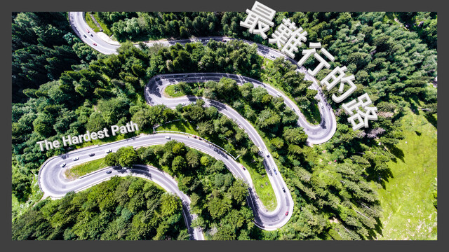

最難行的路 / The Hardest Path
===

## Summary

* **Thumbnail:** 
* **Song:** https://www.youtube.com/watch?v=lOwNC-JqUOc
* **Author:** mystiz
* **Categories:** Reverse, Misc, ★★★☆☆
* **Points:** 300
* **Solves:** 9/234 (Secondary: 0/103, Tertiary: 2/65, Open: 5/60, Invited: 2/6)

## Description

> 寧願不揀最易的路 行極還未到
> 寧願你最後未傾慕 但信念安好
> 在意的 不再是 愛的煩惱
> 是哪樣做人 更清高
> 餘生那段旅途
> 與哪類人共舞

When you think reverse engineering is hard, try working on reverse engineering challenges those need your algorithmic thinking skills!

```bash
nc chalp.hkcert21.pwnable.hk 28117
```

### Attachments

- [the-hardest-path_e00c6aa7b64b8dc2a06e577937b5b07c.zip](https://github.com/hkcert-ctf/CTF-Challenges/releases/download/CTF2021/the-hardest-path_e00c6aa7b64b8dc2a06e577937b5b07c.zip)

## Flag

`hkcert21{4lw4ys_l0ok_4t_s74ck_0verf1ow_wh3n_y0u_w4nt_t0_4v01d_s7ack_0v3rfl0ws}`
