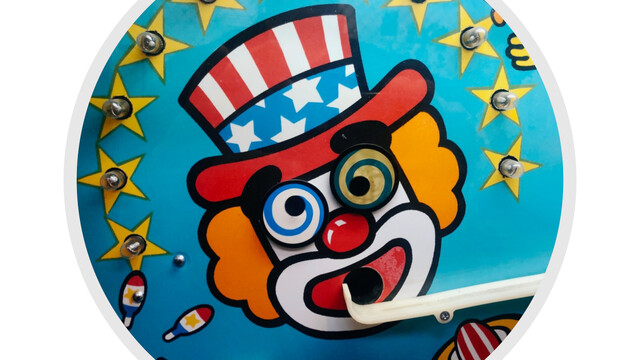

小諧星 / A Joke Cipher
===

## Summary

* **Thumbnail:** 
* **Song:** https://www.youtube.com/watch?v=LoHKilN1-Ug
* **Author:** mystiz
* **Categories:** Crypto, ☆☆☆☆☆
* **Points:** 50
* **Solves:** 88/234 (Secondary: 19/103, Tertiary: 35/65, Open: 27/60, Invited: 7/6)

## Description

> 早知不可獲勝
> 擠出喜感做諧星
> 無力當 你們崇尚的精英
> 有幸獻醜的 小丑 都不失敬

In the beginning of 2020, Khaled A. Nagaty invented a cryptosystem based on key exchange. The cipher is faster than ever... It is impossible to break, right?

To solve this challenge, you need to read the source code `chall.py`. Try to get those questions answered:

- Can `shared_key` generated from `y_A` and `y_B`?
- If so, how do we calculate `m` from `c` and `shared_key`?
- How can we convert the number `m` into a flag that is in the format `hkcert21{...}`?

### Attachments

- [the-little-comedian_58178adf8b732db76116f5bb7e0c4198.zip](https://github.com/hkcert-ctf/CTF-Challenges/releases/download/CTF2021/the-little-comedian_58178adf8b732db76116f5bb7e0c4198.zip)

## Hints

_(Updated hint at 13/11 18:56)_

This is a key exchange scheme, where two entity (Alice and Bob) use the "cryptosystem" to exchange a shared key (i.e. after the process, they can generate the same key). After the key exchange, they can then use the shared key to encrypt / decrypt any message.

Thus, to decrypt the ciphertext back to plaintext (i.e. the flag), you will have to know the shared key, then use the "cryptosystem" to decrypt the ciphertext.

Can you get the shared key from the provided information? You have `p`, `y_A` and `y_B`, can you generate the shared key?

From the `exchange` function, `self.shared_key = S_AB`, and `S_AB = (y_AB * y_B) * S_A % self.p`; `y_AB = y_A * y_B`.

You have `p`, `y_A` and `y_B`, what are you missing? What is the relation between `S_A` and `y_A` and how can we use that?

_(Updated hint at 14/11 00:25)_

We are given `output.txt` that contains `y_A` and `y_B`, which are the public keys for Alice and Bob respectively. In this challenge, you need to derive the shared key `S_AB` from those public keys.

Look at the below line:

```python
y_AB = y_A * y_B
S_AB = (y_AB * y_B) * S_A % self.p
```

From above, we can compute the shared key `S_AB` from `y_A`, `y_B` and `S_A`. However, the challenge is so "secure" that we don't even need any private keys. That said we can compute `S_AB` solely from `y_A` and `y_B`. How? Look at the relationship between `S_A` and `y_A`. In short, `S_AB = (y_A * y_B * y_B) * y_A % p = (y_A * y_B)^2 % p`.

One question is, how do we convert base 16 (those strings starting with `0x`) to base 10? We can use [Cyberchef](https://gchq.github.io/CyberChef/#recipe=From_Base(10)To_Base(16)) to convert numbers. You can also find a product of two large numbers with Cyberchef. There is one question remain: What does `%` mean? Try to find it yourself!

Now we have the shared key `S_AB` (it is called `sk` below). If we have the ciphertext `c`, we can look the decrypt function shows how they decrypt:

```python
def decrypt(self, c):
    sk = self.shared_key
    if sk is None: raise Exception('Key exchange is not completed')

    return c // sk
```

Okay, it is now a simple division. Now it is a primary-level math (actually not). Now you have a message represented as a number, you can convert the number here with [Cyberchef](https://gchq.github.io/CyberChef/#recipe=From_Base(10)To_Base(16)From_Hex('Auto')) again. Now put down the number for the flag!

_(Updated hint at 14/11 02:45)_

If you are getting something like `0x686B636572743231`, that is `hkcert21` in HEX. Find a HEX decoder online to grab your flag!


## Flag

`hkcert21{th1s_i5_wh4t_w3_c4ll3d_sn4k3o1l_crypt0sy5t3m}`
