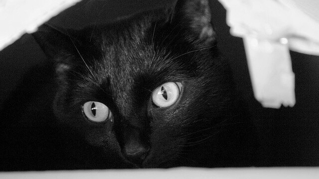

薛丁格的盒子 / Unobserved Box
===

## Summary

* **Thumbnail:** 
* **Song:** https://www.youtube.com/watch?v=j5PLde-B9so
* **Author:** cire_meat_pop
* **Categories:** Pwn, Reverse, ★★☆☆☆
* **Points:** 250
* **Solves:** 6/234 (Secondary: 0/103, Tertiary: 2/65, Open: 1/60, Invited: 3/6)

## Description

All codes are uncertain before the measurement, and you will never make it.

Observe the code to get the flag.

```bash
nc chalp.hkcert21.pwnable.hk 28132
```

## Flag

`hkcert21{l3akinG_the_world_giVE_U_7H3_FLAG}`
