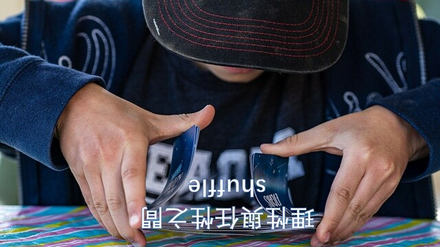

理性與任性之間 / Shuffle
===

## Summary

* **Thumbnail:** 
* **Song:** https://www.youtube.com/watch?v=xMLuHGu-BPU
* **Author:** harrier
* **Categories:** Reverse, ☆☆☆☆☆
* **Points:** 50
* **Solves:** 60/234 (Secondary: 12/103, Tertiary: 24/65, Open: 19/60, Invited: 5/6)

## Description

I heard perfect shuffle is reproducible...

Hint:

- What is `.pyc`? Are there some tools for reverting pyc to some readable source (maybe back to python script)?
- Next you have to revert the algorithm for flag, i.e. given the output, find the corresponding input (which is flag)
- Understanding random module should help a lot...
- Why do this always produces same result (for same input) but not randomly differ each time? Can you make use of this to revert back to flag?

### Attachments

- [shuffle_03f016d972f11c15bb25d038a2bd6bb3.zip](https://github.com/hkcert-ctf/CTF-Challenges/releases/download/CTF2021/shuffle_03f016d972f11c15bb25d038a2bd6bb3.zip)

## Hints

### Hint (Updated on 13 Nov 19:05):

- What is `.pyc`? Are there some tools for reverting pyc to some readable source (maybe back to python script)?
- Maybe you can use decompyle3 or uncompyle6 to convert to pyc back to python script?
- Next you have to revert the algorithm for flag, i.e. given the output, find the corresponding input (which is flag)
- Understanding random module should help a lot... What is `random.seed`?
- Why do this always produces same result (for same input) but not randomly differ each time? Can you make use of this to revert back to flag?
- If it generate the same "shuffling" everytime, you should be able to know how the flag shuffles, then revert the process to get the flag? 

### Hint: (Update on 13 Nov 22:32):

`random.seed` will reset the randomness state when you call it, so look carefully what the original script does!

### Hint: (Update on 14 Nov 4:10):

Check the python version outputted by decompyle3 / uncompyle6. Python 2 and 3 are VERY different!
Also try to decompose the code into different parts if you found it too hard to understand. Maybe give it some data to test?

### Attachments

- [shuffle_03f016d972f11c15bb25d038a2bd6bb3.zip](https://file.hkcert21.pwnable.hk/shuffle_03f016d972f11c15bb25d038a2bd6bb3.zip)

## Flag

`hkcert21{s1mp13_d3shu3ff3l3_1s_s1mp13}`
