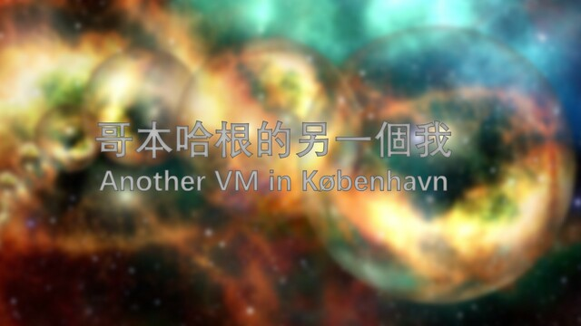

哥本哈根的另一個我 / Another VM in København
===

## Summary

* **Thumbnail:** 
* **Song:** https://www.youtube.com/watch?v=6u7aQV_2-2U
* **Author:** harrier
* **Categories:** Reverse, ★★★☆☆
* **Points:** 300
* **Solves:** 2/234 (Secondary: 0/103, Tertiary: 1/65, Open: 0/60, Invited: 1/6)

## Description

Folks in København seems develop an VM for fun. They want to test your skill by hiding a flag in a program that can be run with the VM.

Can you find the flag?

(The VM challenges shares the same VM binary)

P.S. You need `libsodium23`, `libgmpxx4ldbl` to run the binary

### Attachments

- [another-vm-in-københavn_073a3f140fd0759e81dddfb9001f3473.zip](https://github.com/hkcert-ctf/CTF-Challenges/releases/download/CTF2021/another-vm-in-kobenhavn_073a3f140fd0759e81dddfb9001f3473.zip)

## Update

The VM challenges (Another VM in København, Half-truth VM, Make it worse VM) shares the same VM binary. 虛擬機題目（一知半解，要做更壞的事，哥本哈根的另一個我）共用一個執行檔。

## Flag

`hkcert21{is_th13_s1m1laR_t0_4RM_0r_Thumb2?}`
