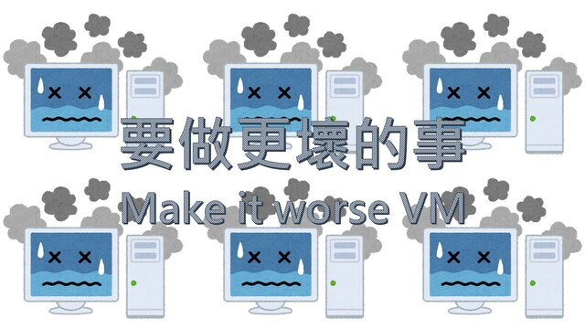

要做更壞的事 / Make it worse VM
===

## Summary

* **Thumbnail:** 
* **Song:** https://www.youtube.com/watch?v=BieBBz9tkZE
* **Author:** harrier
* **Categories:** Reverse, ★★★★★
* **Points:** 500
* **Solves:** 0/234 (Secondary: 0/103, Tertiary: 0/65, Open: 0/60, Invited: 0/6)

## Description

People often do VM escape for bounty in real world. Well, escaping a simple VM should be simple?

```bash
nc chalp.hkcert21.pwnable.hk 28246
```

### Attachments

- [make-it-worse-vm_10ae27200a5d28545839d71d4e6ff58e.zip](https://github.com/hkcert-ctf/CTF-Challenges/releases/download/CTF2021/make-it-worse-vm_10ae27200a5d28545839d71d4e6ff58e.zip)

## Update

The VM challenges (Another VM in København, Half-truth VM, Make it worse VM) shares the same VM binary. 虛擬機題目（一知半解，要做更壞的事，哥本哈根的另一個我）共用一個執行檔。

## Flag

`hkcert21{H0w_ab0u7_N0_B0un3_CCCCh3cKKs????}`
