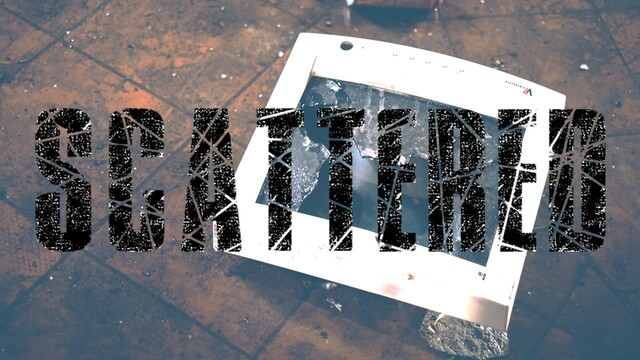

漫漫碎 / Scattered
===

## Summary

* **Thumbnail:** 
* **Song:** https://www.youtube.com/watch?v=4EONH-s1qw8
* **Author:** harrier
* **Categories:** Reverse, ★☆☆☆☆
* **Points:** 100
* **Solves:** 16/234 (Secondary: 0/103, Tertiary: 5/65, Open: 7/60, Invited: 4/6)

## Description

Looks like the binary contains no flag.....

Can you help us to find the flag? There is only weird strings inside....

### Attachments

- [scattered_605e04699fe3f83e375fc02c4ba09fe2.zip](https://github.com/hkcert-ctf/CTF-Challenges/releases/download/CTF2021/scattered_605e04699fe3f83e375fc02c4ba09fe2.zip)

## Flag

`hkcert21{str_0bfU5c4t1oN_x0r_X0r_w1tH_d3t3rm1n1st1c_h45h3s}`
