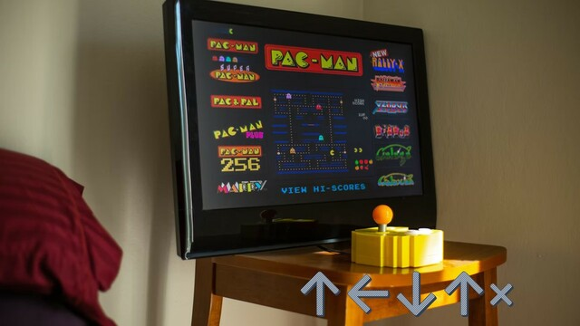

Old Fashioned / ↑←↓↑x
===

## Summary

* **Thumbnail:** 
* **Song:** https://www.youtube.com/watch?v=eDqYERnAJ7E
* **Author:** harrier
* **Categories:** Reverse, ★★☆☆☆
* **Points:** 250
* **Solves:** 11/234 (Secondary: 0/103, Tertiary: 5/65, Open: 3/60, Invited: 3/6)

## Description

What is this cheat code up-left-down-`upx`?

### Attachments

- [old-fashioned-up-left-down-up-x_361137df01363bfb8b90f911cdd09d54.zip](https://github.com/hkcert-ctf/CTF-Challenges/releases/download/CTF2021/old-fashioned-up-left-down-up-x_361137df01363bfb8b90f911cdd09d54.zip)

## Flag

`hkcert21{ju5t_s0m3_5imP13_upx&ru5T_m4cr0_c0d3g3n}`
