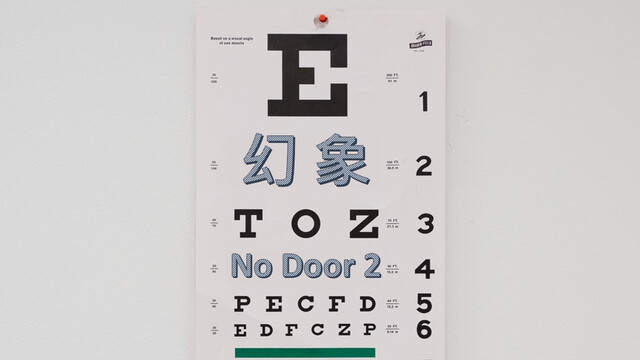

幻象 / No Door 2
===

## Summary

* **Thumbnail:** 
* **Song:** https://www.youtube.com/watch?v=_y7l0n86hM0
* **Author:** byronwai
* **Categories:** Forensics, ★★☆☆☆
* **Points:** 200
* **Solves:** 14/234 (Secondary: 0/103, Tertiary: 7/65, Open: 6/60, Invited: 1/6)

## Description

> 白雪般是幻象
> 侍女般是幻象
> 那角色是幻象
> 讓我關掉幻象
> 會勇敢和頑強
> 你也許亦像樣

There's must be some part the author can hide the flag.
If you can't solve the challenge, you better take a rest and go for an eye examination.

https://lihi1.com/6IvWe

Password: hkcertctf2021

## Update

受隨機因素影響，無門 & 幻象兩題均出現問題。我們現在在修理中，並會在解決問題之後發出另一個公告通知。如有不便，請入 @[blackb6a] byronwai 數。若你正在挑戰本題，請考慮先嘗試其他題目。 There is an issue on No Door 1 & 2 regarding to a random issue. We will fix it and another announcement will be made after it is fixed. Please blame @[blackb6a] byronwai if inconvenience is caused. If you are attempting this challenge, please consider trying something else at the moment.

~~https://lihi1.com/6IvWe Password: hkcertctf2021~~
https://gather.town/app/sWBohD9YwwnU00Sl/hidden-space

Backup:
https://gather.town/app/H4NHCY3Owcom1iyd/hidden-space

我們已修正幻象及無門：幻象及無門的網址已更換，而如果你曾提交過幻象的旗幟，請重新提交一次。 No Door 1 and 2 are fixed: The URL for No Door 1 and 2 is changed and if you ever attempted on No Door 2, please resubmit the flag.

若 Gather.town 場地太多人，可使用新加的備份地圖挑戰題目。新舊地圖為完全相同。 If there are too much contester in the Gather.town map, please use the new backup map to attempt the challenge. Both maps are identical to each others.

## Flag

`hkcert21{c0nfigur4ti0ns_f0r_finding_th3_l4st_f1ag}`
