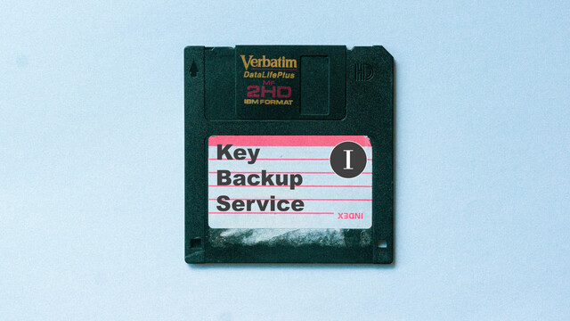

長話短說 / Key Backup Service 1
===

## Summary

* **Thumbnail:** 
* **Song:** https://www.youtube.com/watch?v=X8xnfwHPlK0
* **Author:** mystiz
* **Categories:** Crypto, ★☆☆☆☆
* **Points:** 150
* **Solves:** 6/234 (Secondary: 0/103, Tertiary: 2/65, Open: 1/60, Invited: 3/6)

## Description

> 長話𥚃短說
> 但察覺太短
> 或者真正意義
> 並不需要說穿

_Note: This is part one of a two-part series. Part two: **Braceless / Key Backup Service 2**._

Mystiz made a key vault which could encrypts his darkest secrets (i.e., the flag). Everything is protected with a bank-level encryption (i.e., a 256-bit key). You are welcome to look at the encrypted secrets and praise his cryptographic knowledge.

```bash
nc chalp.hkcert21.pwnable.hk 28157
```

### Attachments

- [long-story-short_55e7b1b931d8aaa5670e38b1e14c82ea.zip](https://github.com/hkcert-ctf/CTF-Challenges/releases/download/CTF2021/long-story-short_55e7b1b931d8aaa5670e38b1e14c82ea.zip)

## Flag

`hkcert21{y0u_d0nt_n33d_e_m3ss4g3s_f0r_br0adc4s7_4t7ack_wh3n_m_i5_sm41l}`
