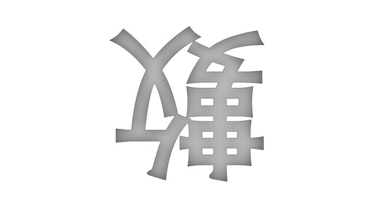

倒數 / babyre
===

## Summary

* **Thumbnail:** 
* **Song:** https://www.youtube.com/watch?v=I9i2kLvHmMQ
* **Author:** ken
* **Categories:** Reverse, ★★★★☆
* **Points:** 450
* **Solves:** 3/234 (Secondary: 0/103, Tertiary: 1/65, Open: 0/60, Invited: 2/6)

## Description

The slower you become, the more you are able to get.

### Attachments

- [babyre_e05b09c438ed9a504d81c4d441d4cf73.zip](https://github.com/hkcert-ctf/CTF-Challenges/releases/download/CTF2021/babyre_e05b09c438ed9a504d81c4d441d4cf73.zip)

## Flag

`hkcert21{h0p3_y0u_d1d_n07_r3ver53_1t}`
