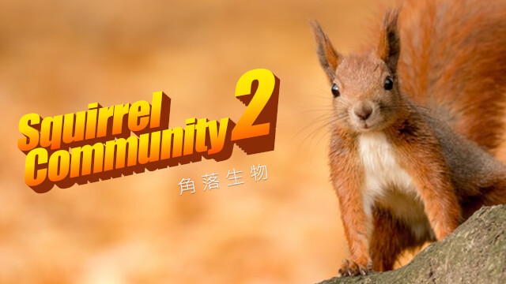

角落生物 2 / Squirrel Community 2
===

## Summary

* **Thumbnail:** 
* **Song:** https://www.youtube.com/watch?v=14bbnWkGHe4
* **Author:** apple
* **Categories:** Web, ★★☆☆☆
* **Points:** 250
* **Solves:** 2/234 (Secondary: 0/103, Tertiary: 0/65, Open: 0/60, Invited: 2/6)

## Description

Can you hack into the Squirrels' server with your squirrely Squirrel skills?

http://chalf.hkcert21.pwnable.hk:28062/

## Hint

已添加提示。 Hint is released. The Squirrel Master proudly open source the first chatting platform for squirrels!

**UPDATE (13 Nov 18:04):**

SqlChat platform is now open source: [squirrelcommunity_c3807d99880fc4b7a3381b4a4fd8870c.zip](https://github.com/hkcert-ctf/CTF-Challenges/releases/download/CTF2021/squirrelcommunity_c3807d99880fc4b7a3381b4a4fd8870c.zip)

(Irrelevant parts are removed. But if you want, [here is the full source code](https://github.com/hkcert-ctf/CTF-Challenges/releases/download/CTF2021/squirrelcommunity_full_e2aab6cb5bca84d455aa6937ff34e362.zip))

## Flag

`hkcert21{squirr3ls-in-sq1-w4rf4re}`
