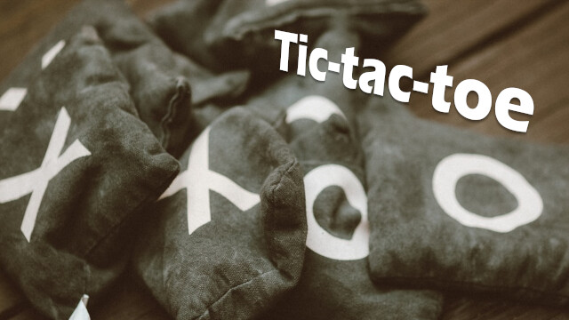

回到12歲 / scratch-tic-tac-toe
===

## Summary

* **Thumbnail:** 
* **Song:** https://www.youtube.com/watch?v=O8s-y6D2PxY
* **Author:** apple
* **Categories:** Misc, ★★☆☆☆
* **Points:** 200
* **Solves:** 86/234 (Secondary: 27/103, Tertiary: 30/65, Open: 25/60, Invited: 4/6)

## Description

If you can beat me in the game I'll give you the flag!

https://scratch.mit.edu/projects/596813541/

## Flag

`hkcert21{he11o_caesar_cipher}`
