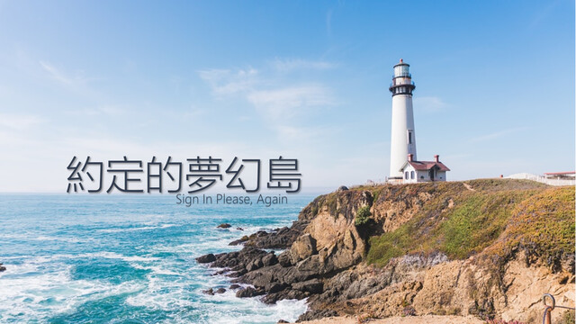

約定的夢幻島 / Sign In Please, Again
===

## Summary

* **Thumbnail:** 
* **Song:** https://www.youtube.com/watch?v=BFdj161FnBs
* **Author:** mystiz
* **Categories:** Crypto, ★★★★★
* **Points:** 500
* **Solves:** 2/234 (Secondary: 0/103, Tertiary: 1/65, Open: 0/60, Invited: 1/6)

## Description

> 不枉我們奮鬥過 和壞人拼搏過
> 燃亮如熊熊烈火
> 當初有誰諷刺過 胡亂抨擊過 亦也走得過
> 或誰也會照笑 笑我傻 說這裏也有折磨
> 卻有你有我 曾無懼逐關過
> 重新開始我們上多課

Okay. My secure authentication system was proved insecure (see [here](https://github.com/blackb6a/ctf-archive-created/tree/master/20201006-hkcert-ctf/sign-in-please)) as it got exploited last year by a bunch of bad guys. I improved the system and you would not be able to eavesdrop the passwords ever again.

```bash
nc chalp.hkcert21.pwnable.hk 28167
```

### Attachments

- [the-promised-neverland_b500babf2da78c9c68ee06d79aace461.zip](https://github.com/hkcert-ctf/CTF-Challenges/releases/download/CTF2021/the-promised-neverland_b500babf2da78c9c68ee06d79aace461.zip)

## Flag

`hkcert21{1t_d03sn7_h31p_by_4dd1n9_p3pp3r5}`
