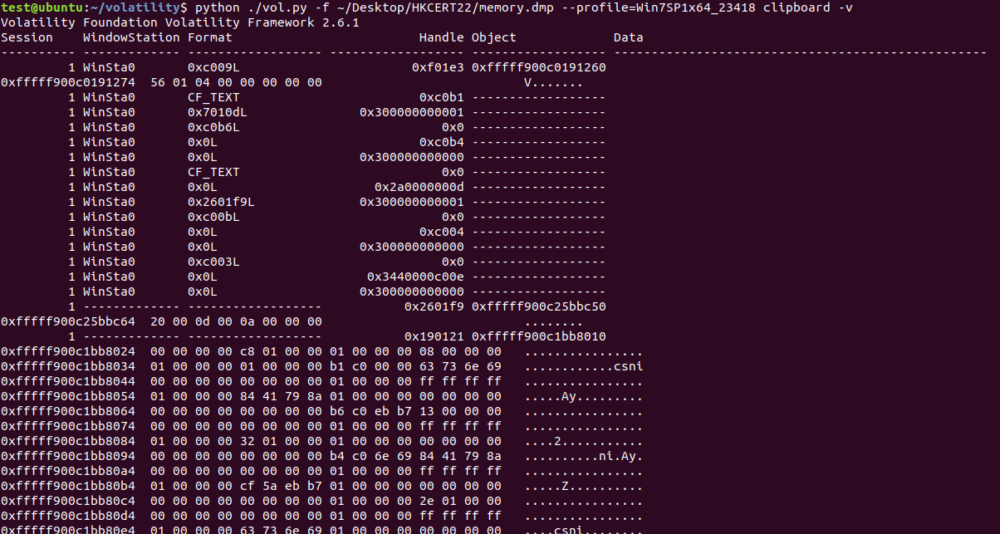
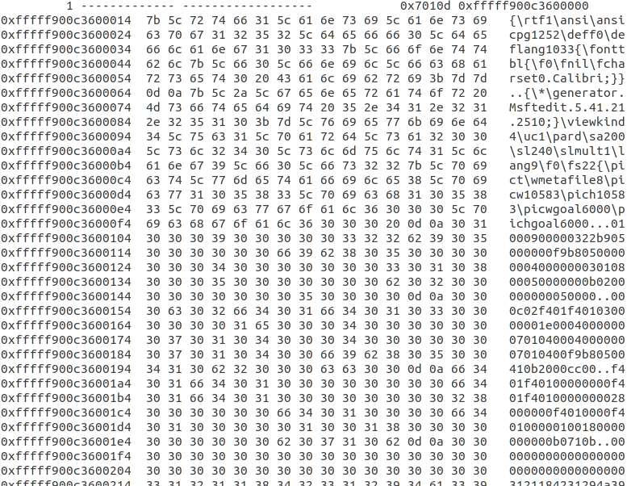

# Write-up

## Flow

0.	Install Volatility. I have demostarate it in 2020 / 2021.

1.	The file name should give you a hint of which OS it is. Run the following command:
`python ./vol.py -f ~/Desktop/HKCERT22/Windows 7 x64.mem --profile=Win7SP1x64_23418 clipboard -v | tee ~/Desktop/output.log`

I have attached the output `output.log` as a reference.

2.	From the output we know that it is a `.rtf` file.

3.	Refine the output with regex. We will only need the text part. Remove all unnecessary characters. The sample file is uploaded as `output.rtf` as a referece.

4.	Read the image to get flag.

## Flag

`hkcert22{f0r3ns1c_1s_fun_t0_pl4y_w1th}`
