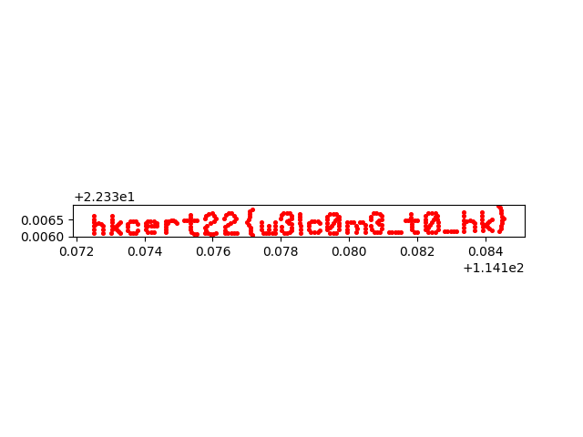

# Writeup

## Flow

1. Extract the GPS information (Latitude, Longitude) of all images in their EXIF:

```python
gpsphoto.getGPSData("pic/1.jpg")['Latitude']
gpsphoto.getGPSData("pic/1.jpg")['Longitude']
...
gpsphoto.getGPSData("pic/297.jpg")['Latitude']
gpsphoto.getGPSData("pic/297.jpg")['Longitude']
```

2. Plot all the points to geopandas

```python
gdf = geopandas.GeoDataFrame(df, geometry=geopandas.points_from_xy(df.Longitude, df.Latitude))
```

3. Export the locations as png

```python
gdf.plot(color='red', markersize=7).get_figure().savefig('flag.png')
```



## Flag

hkcert22{w3lc0m3_t0_hk}