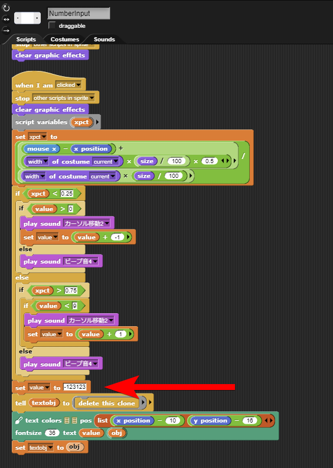
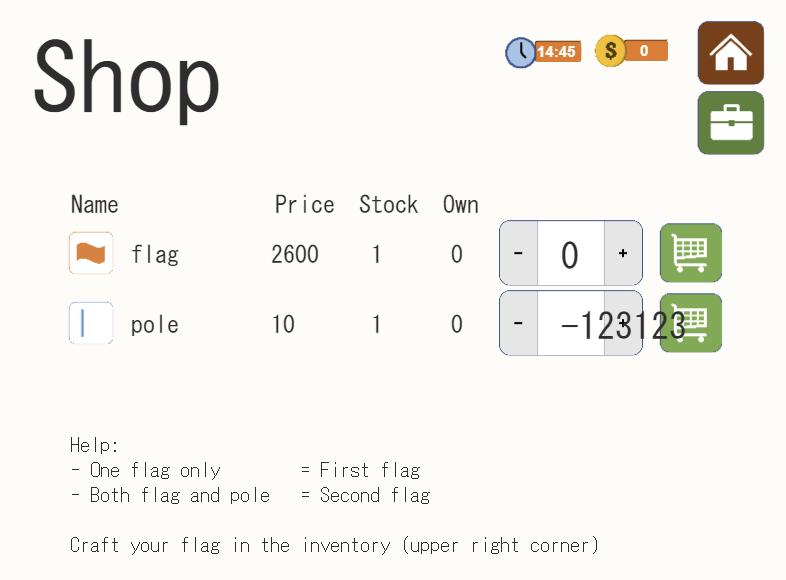
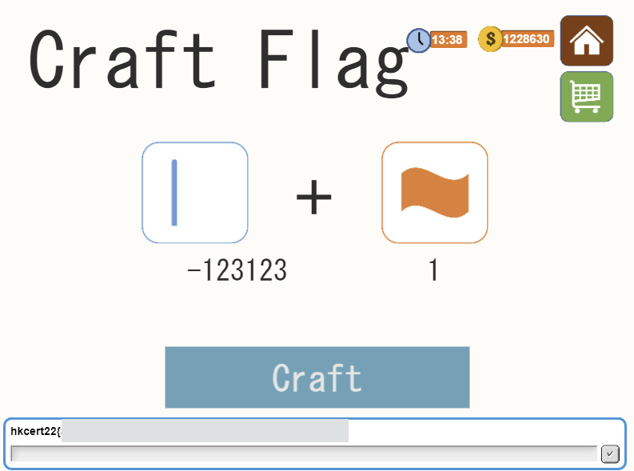

# Math24 (1)

## Part 1

There was a missing input validation in shop purchase that allows you to purchase minus amount of item. Therefore, purchasing minus amount of poles would allow you to buy flag.

Originally the shop page looks like this

Modify NumberInput element to set value as minus number

Of course, you can use web proxy like Burp or Fiddler to solve it, too!