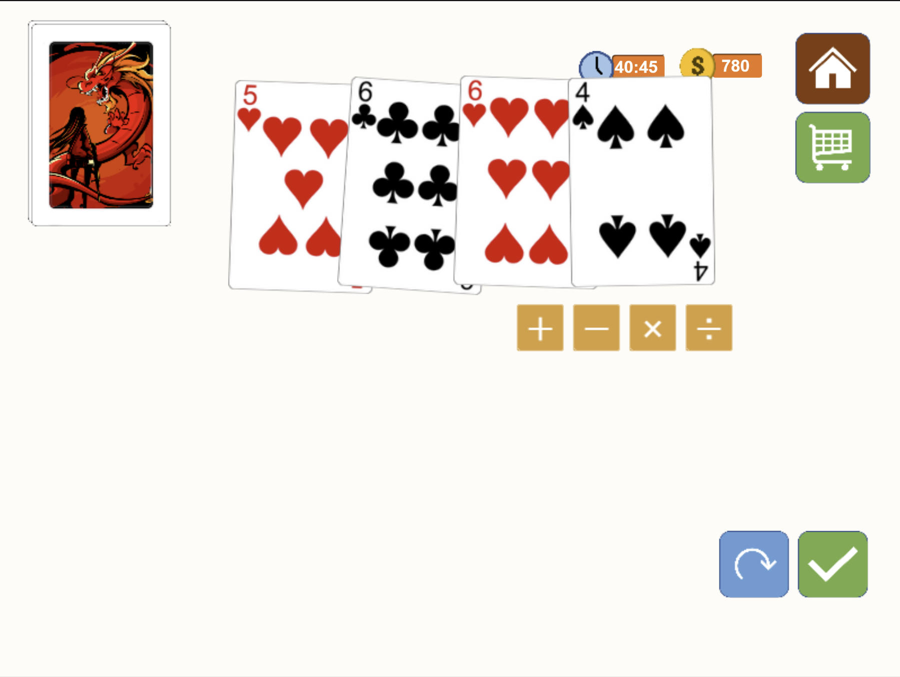
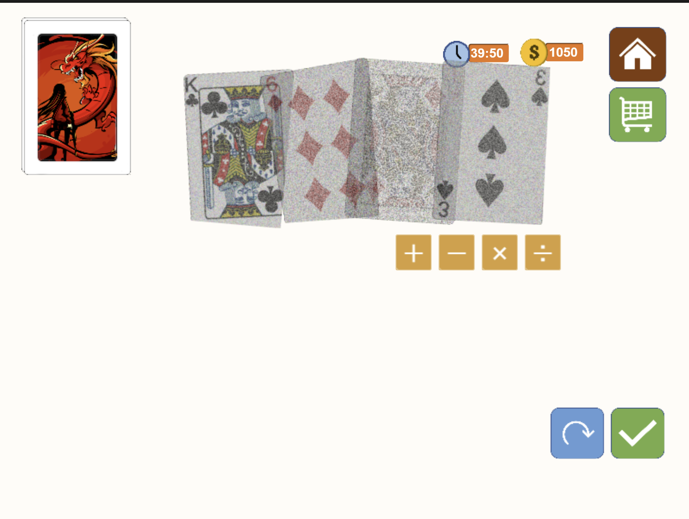

# Math24

## Part 2

Part 2 need the second flag, which need both flag and pole, therefore the method in part 1 doesn't work anymore.

In order to buy both flag and pole, 261 successful attempts in time limit of 15 min is required.

To add some more fun to the challenge, there are two stages in part 2. When the player win for over 100 rounds, noisy images will start appearing:

- Stage1: normal stage without noise (0-100)
  
- Stage2: noisy images (100-)
  

Not a human task huh, so ML image classification ;)

Code modified from tensorflow image classification tutorial: https://www.tensorflow.org/tutorials/images/classification

After completed training, the `solve.py` script should accumulate enough coins to buy flag in ~10 minutes.

1. Change the token value in the scripts to your token
2. Stage1: collect.py -> train.py -> solve.py
3. Stage2: collect.py -> train.py -> solve.py
4. Buy flag and pole

- collect.py: collect images from the game server
- train.py: train the model
- solve.py: use the trained model to play the game with ML
