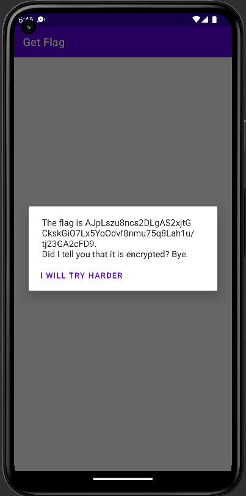
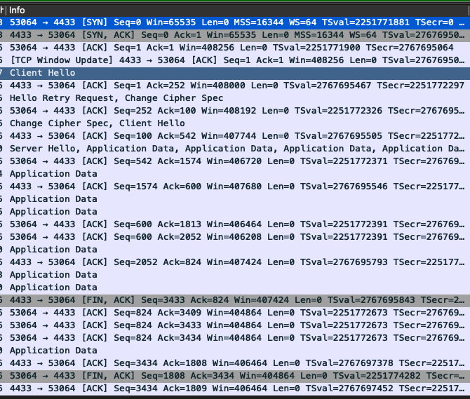
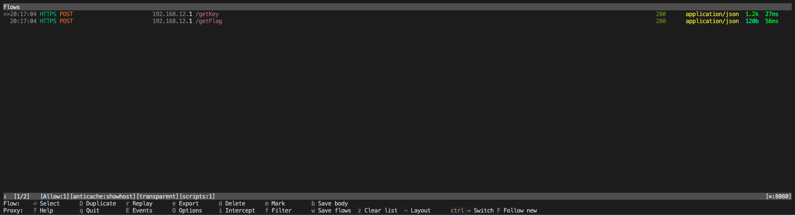
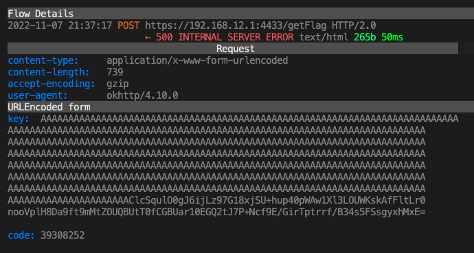

# Middle road

We are given an android app (app.apk). When we run the application we just see a button. When clicked this shows up:



Notice that everytime we click the button, we get a different "encrypted flag".

When sniffing the traffic with wireshark, we see that the traffic is encrypted with TLS.


## MITM

To understand what the app and the server are communicating, we need to use a TLS proxy. Here `mitmproxy` is used for reasons that will be clear later.

When the `GET FLAG` button is pressed, we find that there are two requests made by the phone, one POST request to `/getKey` and one POST request to `/getFlag`.



We saw that the request to `/getKey` sends a `code` and returns a `rsa_e` = 65537 and a `rsa_n` (= $630\cdots 1967$. For `/getFlag`, the device sends a `key` which is a base64-encoded string, and another `code` (which is different from the `/getKey` `code`), and received a `aes_cbc_iv` and `enc_flag` respectively, and the `enc_flag` is the string shown on the device. Running the request for a few times, we can see that `rsa_n` and `rsa_e` are the same everytime, while `key` is different each time. Also note that the code is sometimes the same for their respective API call. If you try it long enough you will even find that the `code` from `/getKey` 30 minutes ago would match the `code` in `/getFlag` (though it is not so important here).

### RSA

`mitmproxy` is an "active" TLS man-in-the-middle which allows us to not only read the contents of the HTTP requests, but also modify them. If we modify the `code`, we find that `GET FLAG` will fail. If we modify the response of `/getKey`, then `/getFlag` will fail. If we modify `rsa_e`, `/getFlag` may still be sent, but if we modify `rsa_n`, `/getFlag` may not even be sent at all.

The parameters in `/getKey` is suggestive that the server is sending some kind of *RSA public key* to the device (since `rsa_n` and `rsa_e` sounds like the `n` and `e` in the RSA public key, which are the modulus and the public exponent respectively).

To verify our hypothesis, let's use the following script to modify the `rsa_e` to `1`. This, however, will not work (because android do not support `e=1` so the device will throw an error) However, we can set `rsa_e` to be 3. Here we notice that the `key` sent by the client is base64-encoded, and the leading bytes are `A`'s. Decoding the `key` reveals that the leading `A`'s are actually null bytes in front, thus the decoded key is actually just a small integer (compared to the modulus). Thus we can try to take the cubic root to reveal the content of `key`, which is actually some 32-byte long bytestring.



```python
from mitmproxy import ctx
from mitmproxy import http
from base64 import b64decode
import decimal


class MiddleRoad:
    def __init__(self):
        pass

    def request(self, flow: http.HTTPFlow) -> None:
        if flow.request.pretty_url.endswith("getFlag"):
            key_b64 = flow.request.urlencoded_form["key"]
            key_int = int.from_bytes(b64decode(key_b64), 'big')
            # Take the cubic-root of key
            decimal.getcontext().prec = len(str(key_int))
            c_decimal = decimal.Decimal(key_int)
            decrypt_m = int((c_decimal**(decimal.Decimal(1)/decimal.Decimal(3))).quantize(decimal.Decimal('1.0')))
            ctx.log.info(decrypt_m.to_bytes(32, 'big'))
            


    def response(self, flow: http.HTTPFlow) -> None:
        if flow.request.pretty_url.endswith("getKey"):
            flow.response.content = flow.response.content.replace(b'"rsa_e":"65537"', b'"rsa_e":"3"')
        
addons = [MiddleRoad()]
```


### AES

Now for a moment we remove the script and inspect the contents in `/getFlag`. `aes_cbc_iv` seems to suggest *AES-CBC* encryption (where the `iv` serves as the *initial vector* in AES-CBC). Indeed, the length of the base64-decoded `aes_cbc_iv`, being 16 bytes, adds to the plausibility of the hypothesis. Since the byte-string in `key` is 32 bytes, and AES can take 32-byte key, we make the guess that `key` is actually an AES key that we send to the server, and the server would use the key to encrypt the flag for us.

Indeed, when we use the public key to encrypt a key (for example all 0's), the resulting `enc_flag` can be decrypted by our key (all 0's) and the `aes_cbc_iv`, an we get our flag.

Here is the code used by mitmproxy to recover the flag.

```python
from mitmproxy import ctx
from mitmproxy import http
from Crypto.PublicKey import RSA
from Crypto.Cipher import AES, PKCS1_v1_5
from Crypto.Util.Padding import pad, unpad
from base64 import b64decode, b64encode
from json import dumps

class MiddleRoad:
    def __init__(self):
        self.key = b"\x00"*32

    def request(self, flow: http.HTTPFlow) -> None:
        # Encrypting custom key
        if flow.request.pretty_url.endswith("getFlag"):
            ct = pow(int.from_bytes(self.key, 'big'), self.e, self.n)
            enc_key = b64encode(ct.to_bytes(len(str(self.n)), 'big')).decode()
            flow.request.urlencoded_form["key"] = enc_key


    def response(self, flow: http.HTTPFlow) -> None:
        # Get the RSA public parameters
        if flow.request.pretty_url.endswith("getKey"):
            self.n = int(flow.response.json()["rsa_n"])
            self.e = int(flow.response.json()["rsa_e"])
        # Decrypt flag
        elif flow.request.pretty_url.endswith("getFlag"):
            iv = b64decode(flow.response.json()["aes_cbc_iv"])
            enc_flag = b64decode(flow.response.json()["enc_flag"])
            aes_cipher = AES.new(self.key, AES.MODE_CBC, iv)
            flag = unpad(aes_cipher.decrypt(enc_flag), 16).decode()
            # Send the flag to the devide (optional)
            json = dumps({"enc_flag": flag})
            flow.response.text = json

addons = [MiddleRoad()]
```