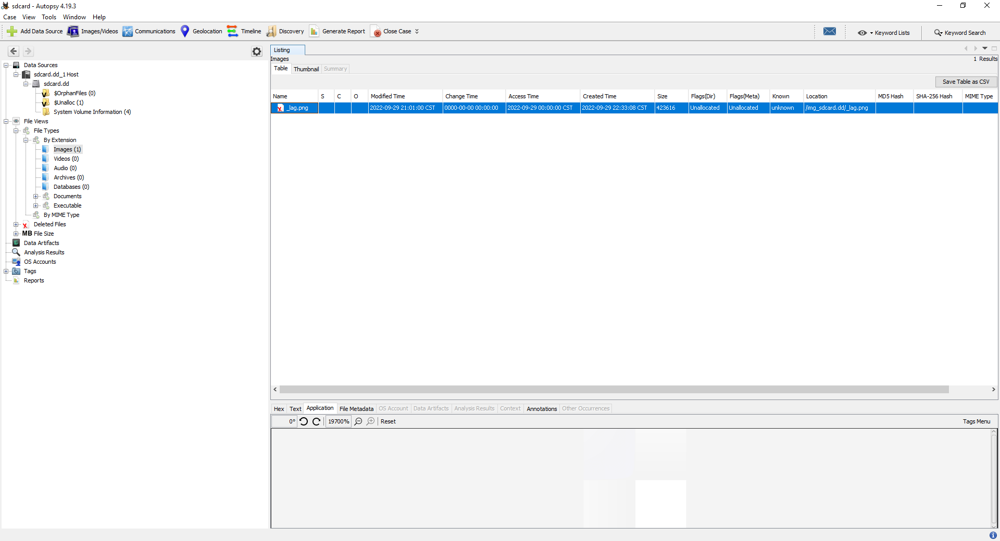
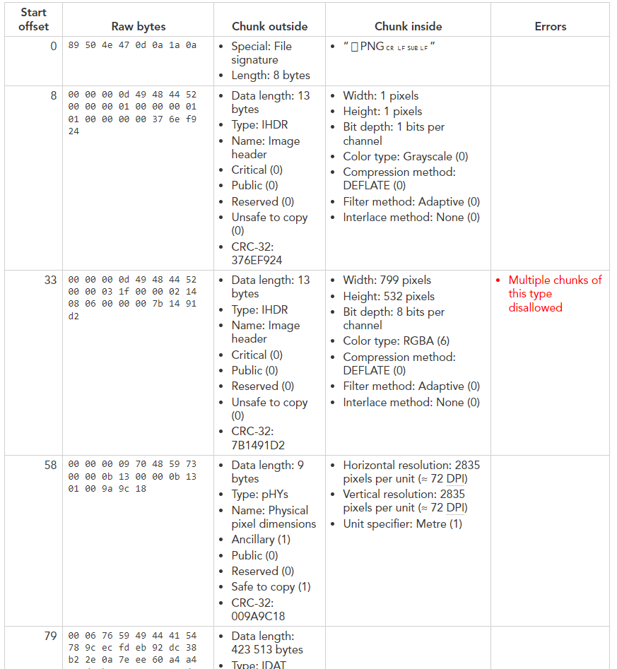
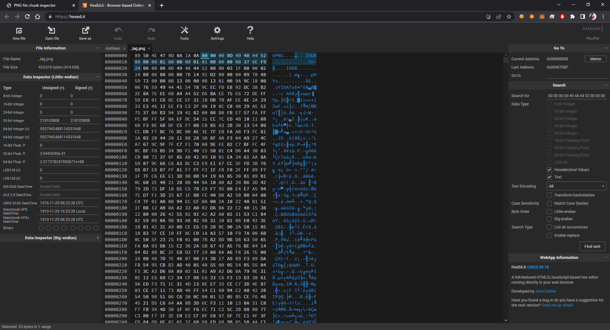
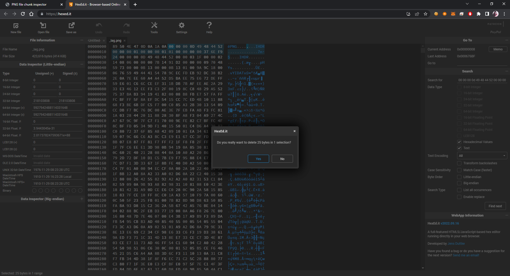
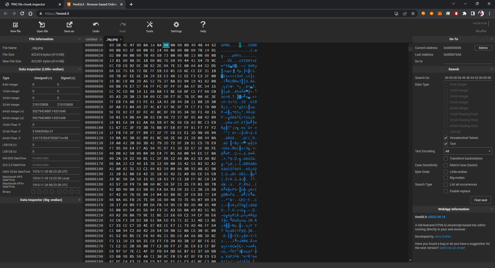
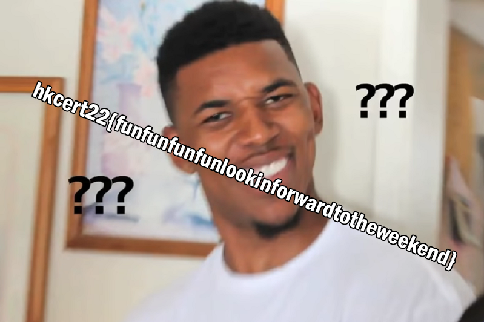

# Write-up

## Flow

1. Download `sdcard.zip`, extract it and put it into Autopsy. You should be able to find image under unallocated space and extract it. However, Autopsy can help filter out images directly. Depending on the tools you use, the image name may varies.

2. Put the image `_lag.png` into [PNG file chunk inspector](https://www.nayuki.io/page/png-file-chunk-inspector). Multiple `IHDR` chunk was found.

3. Open Hex editor to remove the first `IHDR` chunk in `_lag.png`

Note that an `IHDR` should have 25 bytes.

4. Recovered `_lag.png`

## Flag

`hkcert22{funfunfunfunlookinforwardtotheweekend}`