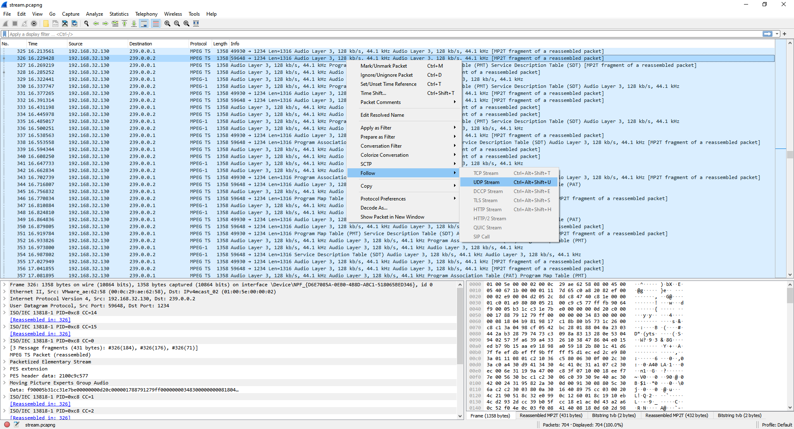
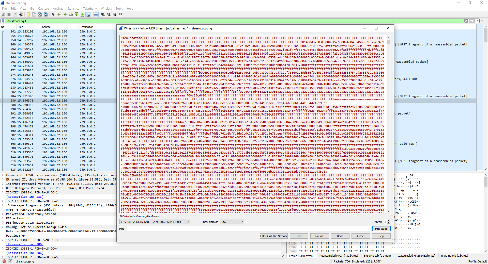
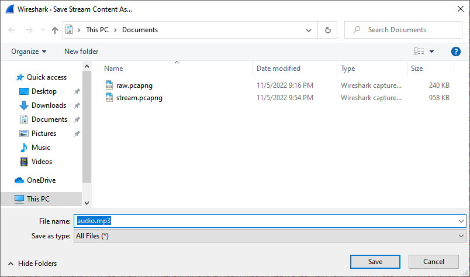
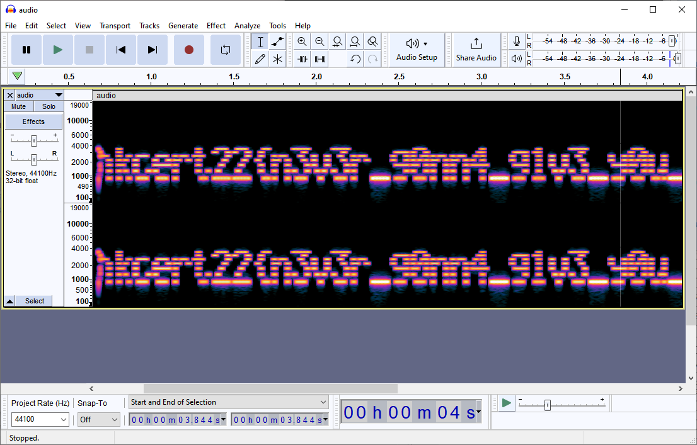

# Writeup

0. Download Wireshark

1. Open the PCAP, found that PCAP contains streaming data. Follow the UDP stream.

2. There are 2 UDP stream. You mau choose to filter data by choosing `udp.stream eq 1`. You may wish to dump all UDP streams out if you are not sure which stream contains the flag.

3. Save the stream result as raw. Save into a file.

4. The audio is weird. View the spectrogram to get flag.

## Flag

`hkcert22{n3v3r_g0nn4_g1v3_y0u_up_3xtr4ct_mp3_fr0m_pcap}`