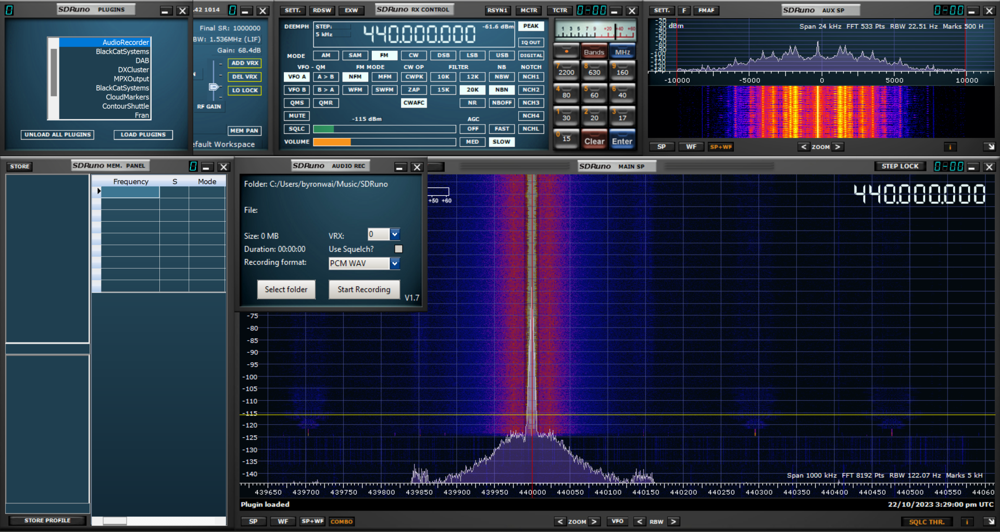
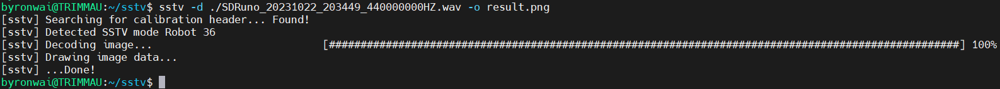
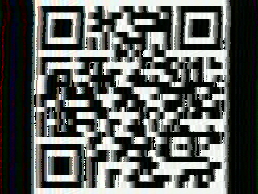

# Writeup

## Introduction

This question aims to set concepts on 2 areas:
1. SDR, signal de-modulation
2. SSTV decode (Robot 36)

## Flow

1. You are given an IQ recording, which can be playback on SDR software (e.g. SDR++, SDRSharp, SDRuno). Here I use SDRuno as an example.


2. The signal is demodulated as FM at 440 MHz as given in the challenge. Here I use a plugin in SDRuno to record signal as wav. However, you can use the mobile phone to decode the signal directly.


3. The wav file is put into [SSTV](https://github.com/colaclanth/sstv.git) for decoding.


```
git clone https://github.com/colaclanth/sstv.git
cd sstv
python setup.py install
sstv -d ./SDRuno_20231022_203449_440000000HZ.wav -o ./result.png
```

4. After the decoding, image is generated and scan the QR code to get flag.
