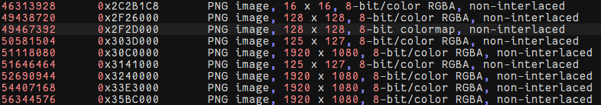
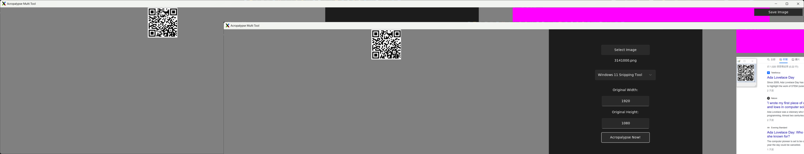
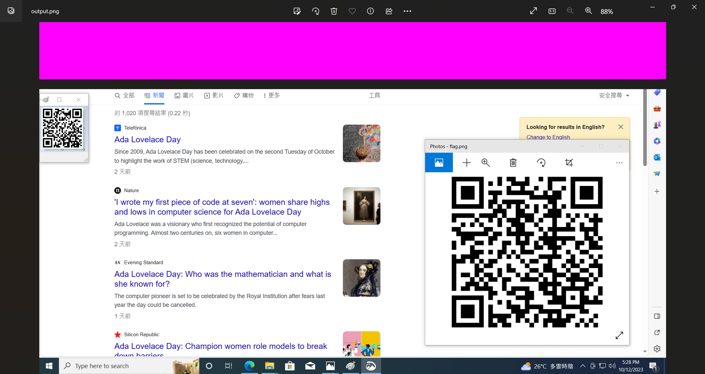

# Writeup

## Introduction

This challenge consist of 2 parts:
1. Data Recovery on VM snapshot (CBT)
2. Acropalyse of Windows 11 Snipping Tools

## Flow
0. Get the hints from the challenge description. The target image have resolution 125 x 127, with PNG format.

1. CBT cannot be opened in a usual way. We can use binwalk to brute force and get all PNG images from vmdk file.

`binwalk --dd='png image:png:' ./Windows\ 11\ x64-000003.vmdk --rm`

We can see that only 2 image have the same resolution as mentioned in challenge description.



2. Windows was known with bug in Snipping Tools (and Snip and Sketch). The image data was retained in the original sample after cropping.
Using the tool [Acropalypse-Multi-Tool](https://github.com/frankthetank-music/Acropalypse-Multi-Tool), you can extract the information back from PNG zlib.

```
git clone https://github.com/frankthetank-music/Acropalypse-Multi-Tool
cd Acropalypse-Multi-Tool
python3 ./gui.py
```

3. After uploading the image to Acropalypse-Multi-Tool, one can retrieve the image. The flag is hide in the second QR code.
Here I use `3141000.png` obtained from `binwalk` for extraction.




## Reference
<https://en.wikipedia.org/wiki/ACropalypse>