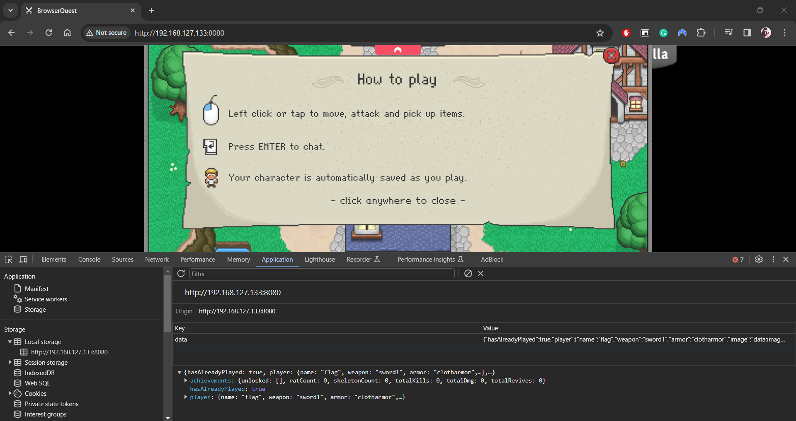
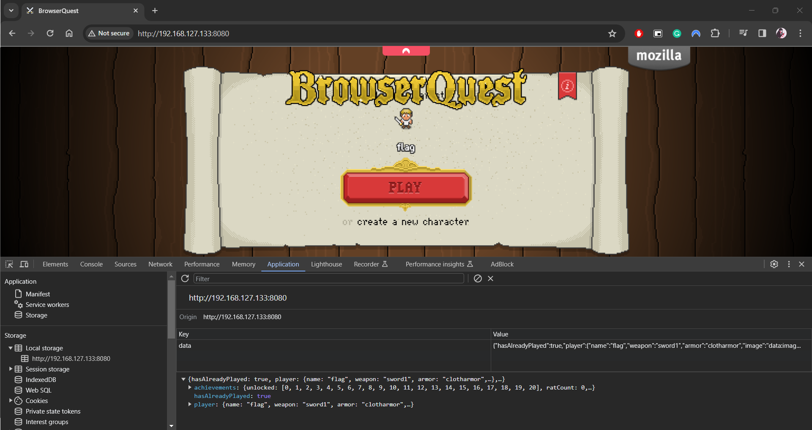
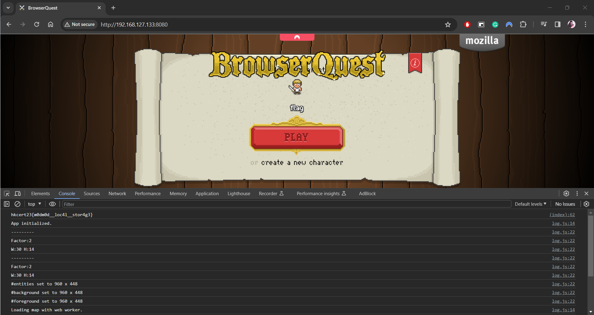

# Writeup

## Introduction

This challenge aims at playing with local storage. In other words, you can complete this challenge on client side only, or fully treat this challenge as de-obfuscation.

## Flow

0. Once the game is opened, you may see that the local storage has the following structure:
```
{"hasAlreadyPlayed":true,"player":{"name":"flag","weapon":"sword1","armor":"clotharmor","image":"data:image/png;base64,iVBORw0KGgoAAAANSUhEUgAAAEAAAABACAYAAACqaXHeAAAAAXNSR0IArs4c6QAAAzlJREFUeF7tmj+IE0EUxveUQzktxOaQ4MGBXqNiYTEpPFSsJCCKldEiXJHqQLvDwspCrlO4KsWRQiMINkIQhYOTs8gUFiKK5CAnStBrTgv/IFGUfZkP3SGzs7vsrMnOpJnMzpvNzvf95r3dJWOe5Z8xy9fvOQEcAZYr4LaA5QC4JOi2gNsClivgtoDlALgqkNkWYIz9jkMb5zyTa8vkR/yFWysAFn798iYBMHP0QigI7RcPaPzGnUlqTZNgnABrBcDCl6/9ICfH956mdveu8VACvnzt0Xhva4XauZs7jJJgjABrBZCRn96/J+A4SFBhAOcxvvH+s9GckDoBTgBR75H1ZaeR3ZEbsMfRh+OYh3j0064KxgmwVgAsHCTAyVtnpmno6qMNauW+at7IEWC9ALKzrVYrsBt69xaC1eHiYqBfLBYHEjIyOcB6AWDn2pUT/TtB4TCcxXHEzd5+Sl9BCgjB8ZHNAbkRQH6c1e1FxEOA5+13gT1+bGYq0FeNgwDd76nuLHXHI98HOAHEHV6j0SBRy+UytTpnZBLgiI4I087jOmITYL0AyNKdTieUBDhfq9UorlqtUitnf3mPwnl5no403V5XjccmwFoBoCCcVQmBONwIHZxfokPdbjdAgsoROF8oFChkfWmeWjw7pE1CZAKcAJJlOhLk+g8ScBoQgT4cRx/O437BVFWITUBUEnIvQFwh4GCz2QxN2KVSaWC1GDoCnACanPDz9XmKOD73IRAZlQC5mgxNFVDxKydFawV4tryPNGqvv6UWb30hXFQCUO8hbNr1H9eTuArIJOBCrRVAToroc87pwX/h7BF6IbC6ORFaBU5OfqPxxYcvD4jAPkqe9yt0YsLB1AhwAggFKpXKTv9rvV6f9VvG2BO/hbMQSiZBNc45Pyfm0Hk8z/ue0OyB01InwHoB/BfAQmpyjjF2328vHdpOh+++6m9lznn/lZL4MMboVVNI3GMRujXUBDgB/tqDPwYcFiSsDXJedhMkcM5PibE3ov2YpvM4V+o54J+LtF4AlWEQZpsi4JM4Hut/hUnpMEmAEyCpK1nO+x8EZLk+7W85AbQS5TzAEZBzg7XLcwRoJcp5wB8lr3Bf7AIbMwAAAABJRU5ErkJggg=="},"achievements":{"unlocked":[],"ratCount":0,"skeletonCount":0,"totalKills":0,"totalDmg":0,"totalRevives":0}}
```


1. As challenge description suggested, you will have the flag with:
	- Complete Achievement 0 - 20
	- No Retrive, No Kill, Due 0 damage in game

Replace the local storage with:
```
{"hasAlreadyPlayed":true,"player":{"name":"flag","weapon":"sword1","armor":"clotharmor","image":"data:image/png;base64,iVBORw0KGgoAAAANSUhEUgAAAEAAAABACAYAAACqaXHeAAAAAXNSR0IArs4c6QAAAzlJREFUeF7tmj+IE0EUxveUQzktxOaQ4MGBXqNiYTEpPFSsJCCKldEiXJHqQLvDwspCrlO4KsWRQiMINkIQhYOTs8gUFiKK5CAnStBrTgv/IFGUfZkP3SGzs7vsrMnOpJnMzpvNzvf95r3dJWOe5Z8xy9fvOQEcAZYr4LaA5QC4JOi2gNsClivgtoDlALgqkNkWYIz9jkMb5zyTa8vkR/yFWysAFn798iYBMHP0QigI7RcPaPzGnUlqTZNgnABrBcDCl6/9ICfH956mdveu8VACvnzt0Xhva4XauZs7jJJgjABrBZCRn96/J+A4SFBhAOcxvvH+s9GckDoBTgBR75H1ZaeR3ZEbsMfRh+OYh3j0064KxgmwVgAsHCTAyVtnpmno6qMNauW+at7IEWC9ALKzrVYrsBt69xaC1eHiYqBfLBYHEjIyOcB6AWDn2pUT/TtB4TCcxXHEzd5+Sl9BCgjB8ZHNAbkRQH6c1e1FxEOA5+13gT1+bGYq0FeNgwDd76nuLHXHI98HOAHEHV6j0SBRy+UytTpnZBLgiI4I087jOmITYL0AyNKdTieUBDhfq9UorlqtUitnf3mPwnl5no403V5XjccmwFoBoCCcVQmBONwIHZxfokPdbjdAgsoROF8oFChkfWmeWjw7pE1CZAKcAJJlOhLk+g8ScBoQgT4cRx/O437BVFWITUBUEnIvQFwh4GCz2QxN2KVSaWC1GDoCnACanPDz9XmKOD73IRAZlQC5mgxNFVDxKydFawV4tryPNGqvv6UWb30hXFQCUO8hbNr1H9eTuArIJOBCrRVAToroc87pwX/h7BF6IbC6ORFaBU5OfqPxxYcvD4jAPkqe9yt0YsLB1AhwAggFKpXKTv9rvV6f9VvG2BO/hbMQSiZBNc45Pyfm0Hk8z/ue0OyB01InwHoB/BfAQmpyjjF2328vHdpOh+++6m9lznn/lZL4MMboVVNI3GMRujXUBDgB/tqDPwYcFiSsDXJedhMkcM5PibE3ov2YpvM4V+o54J+LtF4AlWEQZpsi4JM4Hut/hUnpMEmAEyCpK1nO+x8EZLk+7W85AbQS5TzAEZBzg7XLcwRoJcp5wB8lr3Bf7AIbMwAAAABJRU5ErkJggg=="},"achievements":{"unlocked":[0,1,2,3,4,5,6,7,8,9,10,11,12,13,14,15,16,17,18,19,20],"ratCount":0,"skeletonCount":0,"totalKills":0,"totalDmg":0,"totalRevives":0}}
```

Note that achievement 0 is not an actual achievement of the original game. In addition, there are some contradictions between the condition of getting the achievements and getting the flag if you really want to get flag by beating the boss.



2. Refresh the browser to get flag
