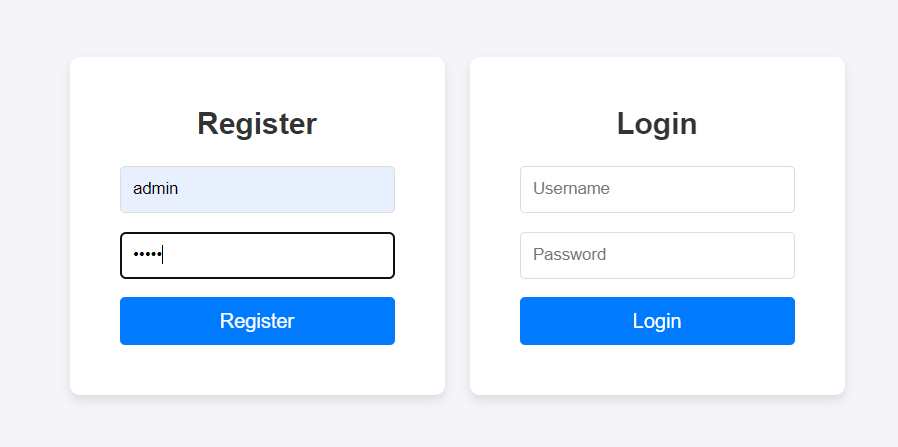
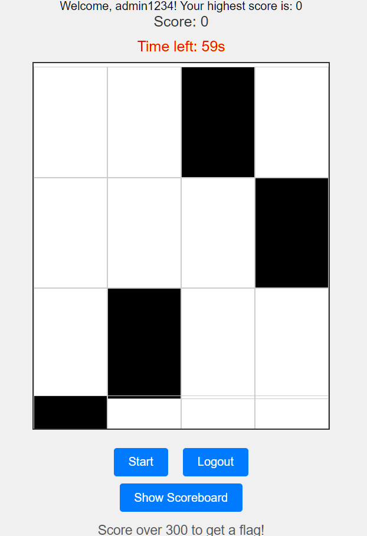
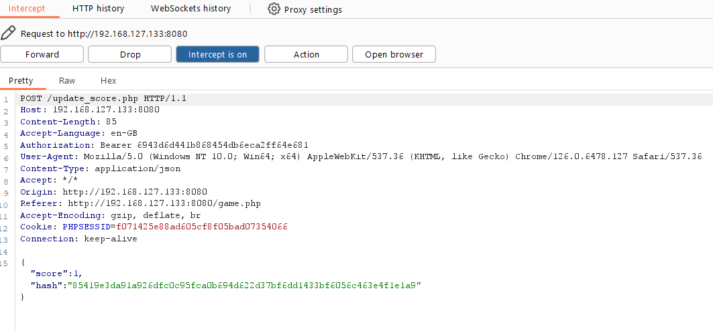
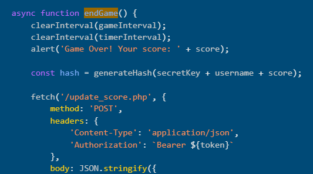
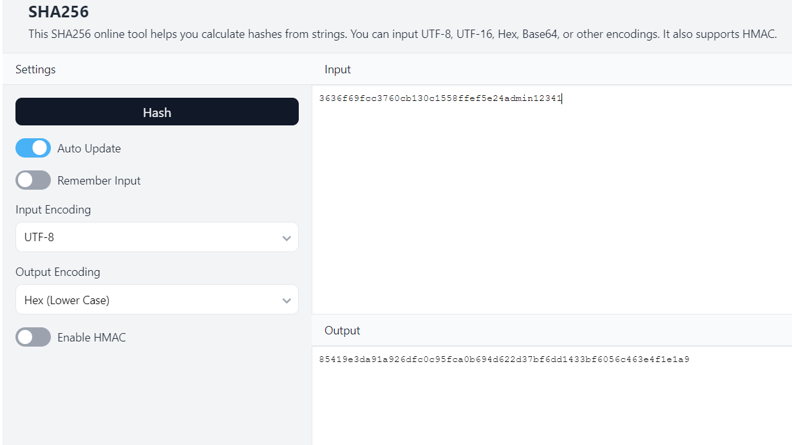
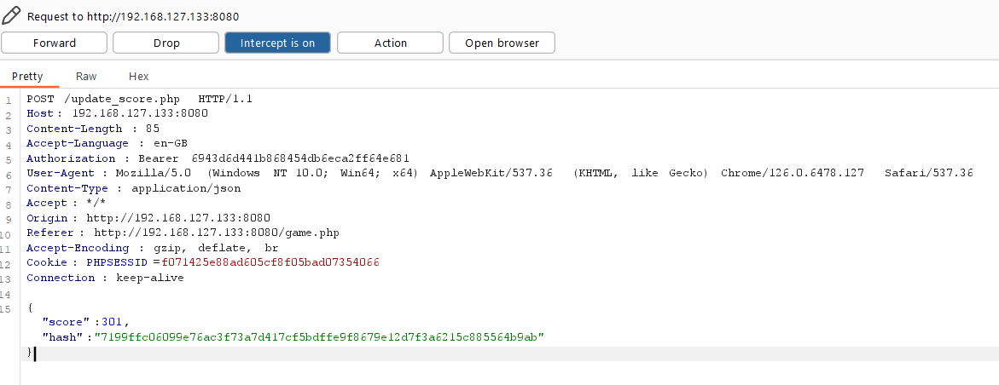
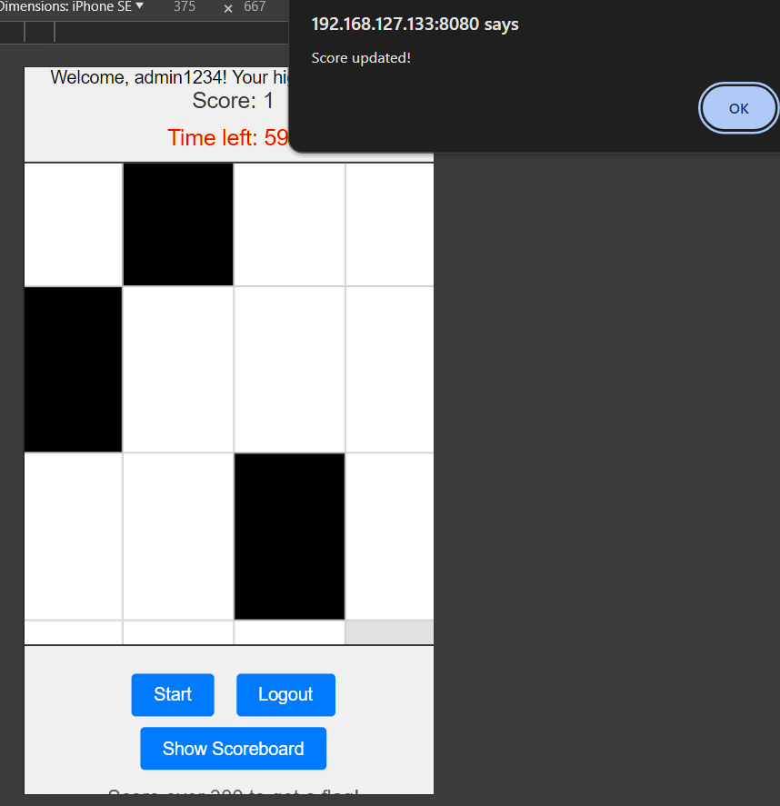
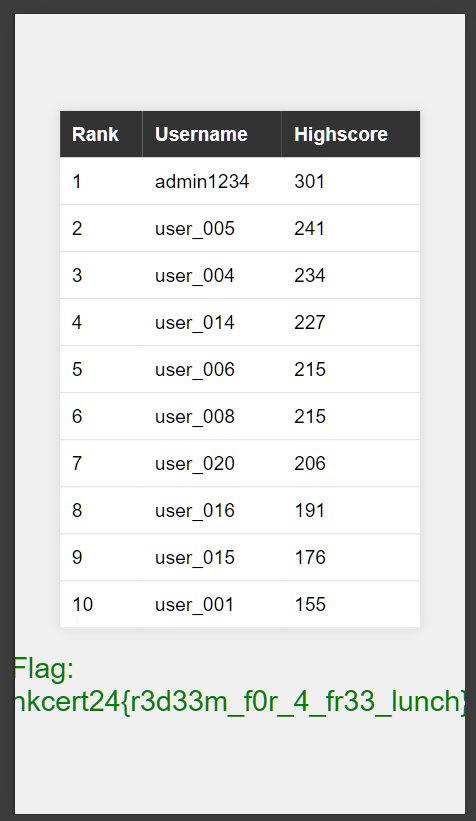

# Writeup

## Steps

1. Register account and login, play the game



2. Turn on burpsuite interception, find that the score is submitted with the following body:

```
{"score":1,"hash":"85419e3da91a926dfc0c95fca0b694d622d37bf6dd1433bf6056c463e4f1e1a9"}
```


3. Review sourcecode, find out how the hash is calculated


4. Use online calculator to change the hash: `key + username + score`


5. Change the hash correspondingly
```
{"score":301,"hash":"7199ffc06099e76ac3f73a7d417cf5bdffe9f8679e12d7f3a6215c885564b9ab"}
```


6. Win the game and go to `scoreboard.php` to get flag

