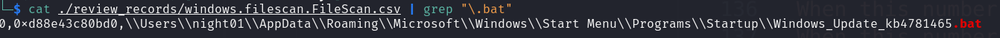
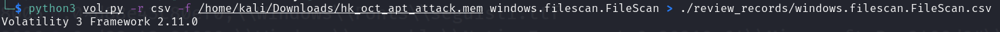
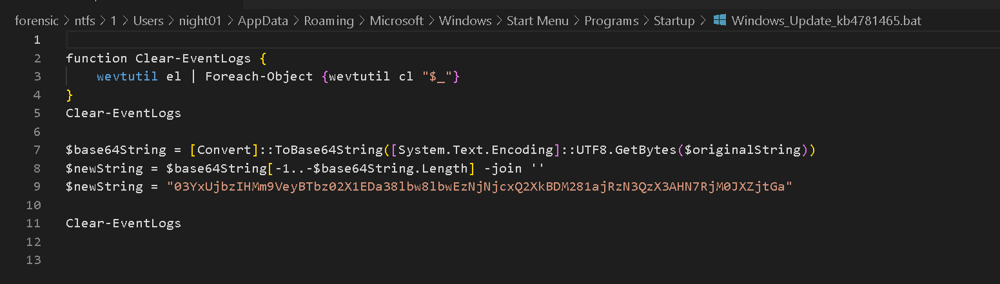
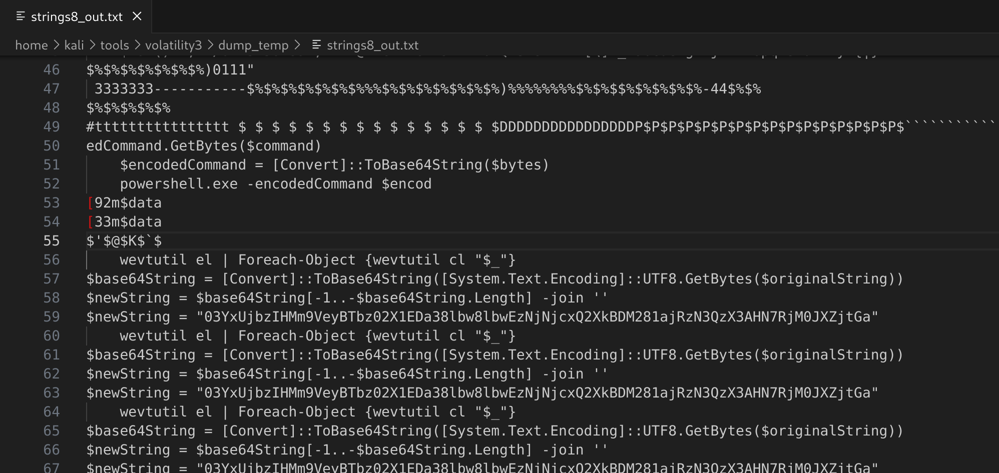
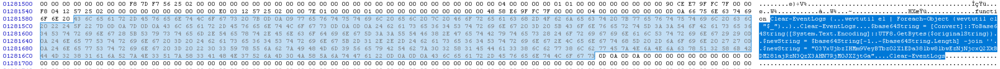
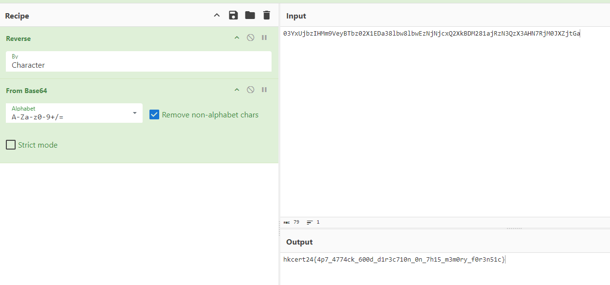

# Writeup

## Introduction

This challenge consist of 3 parts:
1. Open and analyze the memory image by using Volatility3 and MemProcFS
2. (Q1): Identify the interesting file and get flag from the process dump
3. (Q2): Identify the malicious process
4. (Q2): Identify the real malicious file and get flag from the process images
5. (Q3): Decrypt and Parse the C2, and get Cobalt Strike profile (the ultimate goal for all the C2 Cobalt Strike analysis~~~)

## Warning

1. Real Malware
2. Can bypass Anti-Virus Solutions
3. Almost no signature? maybe not?
4. Not useful: malfind (because no signature), yarascan (or you have your own great yara signature)

## Flow
From the title of the question, already told that it is an APT Attack, APT means "Advanced persistent threat".  

Therefore, if you understand this term, you can start with looking for persistent tactics on Windows OS.  

There is a good reference from MITRE ATT&CK framework.  

[Windows Matrix](https://attack.mitre.org/matrices/enterprise/windows/)

## 1. Basic Analysis to understand the environment
### 1.1 Using Volatility3 to understand the memory image first

```
vol.py -f hk_oct_apt_attack.mem windows.info.Info
vol.py -f hk_oct_apt_attack.mem windows.envars.Envars
vol.py -f hk_oct_apt_attack.mem windows.pstree.PsTree
more...
```

### 1.2 Using MemProcFS (Windows) to understand the memory image first
```
.\MemProcFS.exe -device .\hk_oct_apt_attack.mem -forensic 1 -v
```

### 1.3 Volatility3 result to CSV
Why CSV? Maybe easier for co-relate the items and/or create timeline in excel.
```
vol.py -r csv -f /home/kali/Downloads/hk_oct_apt_attack.mem windows.netscan.NetScan > ./review_records/windows.netscan.NetScan.csv
vol.py -r csv -f /home/kali/Downloads/hk_oct_apt_attack.mem windows.pstree.PsTree > ./review_records/windows.pstree.PsTree.csv
python3 vol.py -r csv -f /home/kali/Downloads/hk_oct_apt_attack.mem windows.filescan.FileScan > ./review_records/windows.filescan.FileScan.csv
```

## 2. (Q1) Identify the interesting file 
### 2.1. Way 1 - using the FileScan function to find the interesting file
```
python3 vol.py -r csv -f /home/kali/Downloads/hk_oct_apt_attack.mem windows.filescan.FileScan > ./review_records/windows.filescan.FileScan.csv
```

You can go through all files, and there is a `.bat` inside user(`night01`)'s Startup Folder `AppData\Roaming\Microsoft\Windows\Start Menu\Programs\Startup`.  



Dump it for analysis.
```
python3 vol.py -f /home/kali/Downloads/hk_oct_apt_attack.mem -o ./dump_temp/ windows.dumpfiles.DumpFiles --virtaddr 0xd88e43c80bd0
```

Failed to dump. sometimes like that, maybe the cache is corrupted or the MFT table is wrong.  
You can try to fix this, but it will be hard to recover.  

Suggested to use MemProcFS to find it directly. Because MemProcFS already helped to find out the ntfs table.  
`M:\forensic\ntfs\1\Users\night01\AppData\Roaming\Microsoft\Windows\Start Menu\Programs\Startup\Windows_Update_kb4781465.bat`  


### 2.2 investigate the powershell process
The cmd.exe and powershell.exe are always the interesting processes.  

We can dump the powershell process (PID: 2064). and grep strings with `$` because powershell script define variables are using `$`.  
```
python3 vol.py -f /home/kali/Downloads/hk_oct_apt_attack.mem -o ./dump_temp/ windows.memmap.Memmap --pid 2064 --dump
strings -n 8 ./dump_temp/pid.2064.dmp | grep "\$"  > ./dump_temp/strings8_out.txt
```

if MemProcFS, check minidump folder of the process.  


Now, The string output contains some interesting powershell commands:
- `wevtutil el...`
- `$base64String...`
- `$newString...`

Back to the dump file and check those keywords again. You will find the following script.  

Script contains following steps:
- clear the event logs
- Base64 string
- Reverse string

And the "Write-Host" command contains the flag but you need to Reverse the string and base64 decode it.  

Here is the flag.  



Looking at the persistence is a good direction.  
