## this is a writeup

## Q1：What is the computer username? e.g: bob

Just take a look at the user directories in the C: \ Users directory and you'll know

So the answer is Jack`

## Q2：设备名是什么？What is the device name? e.g: desktop-1d76lc4

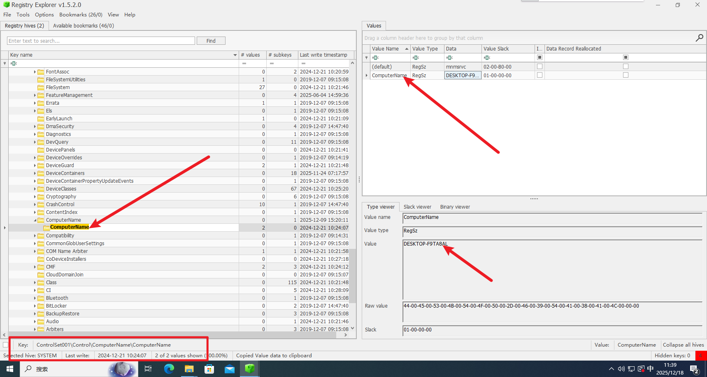

Violent search DESKTOP - or LAPTOP to find it

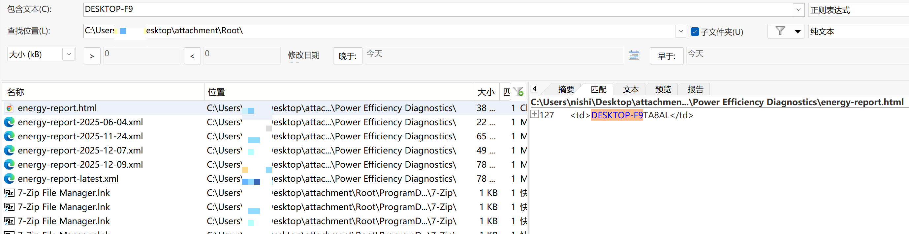

DESKTOP-F9TA8AL

## Q3：最后一次关机时间。What is the last time the device was shut down? e.g: e4d8b17ba7bdea5df12552034245edd7

Obtain the shutdown time through the registry ` SYSTEM: ControlSet001 \ Control \ Windows \ ShutdownTime `, and then convert it to the specified format to calculate md5

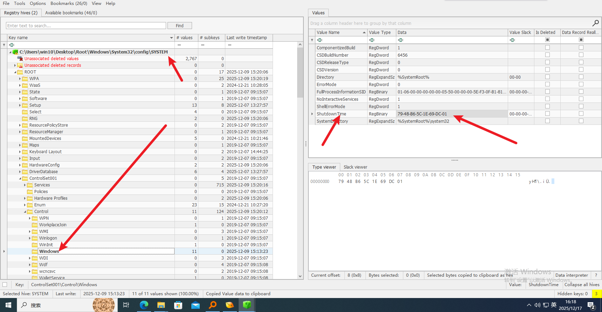

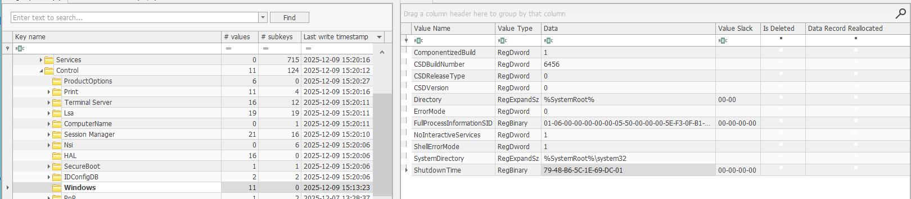

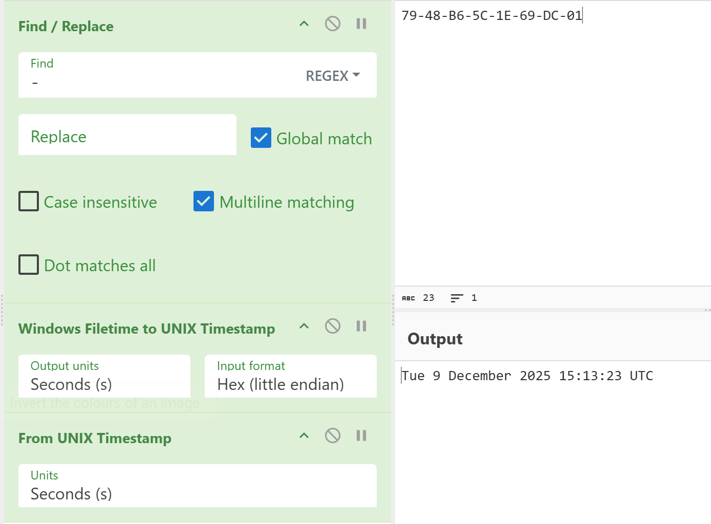

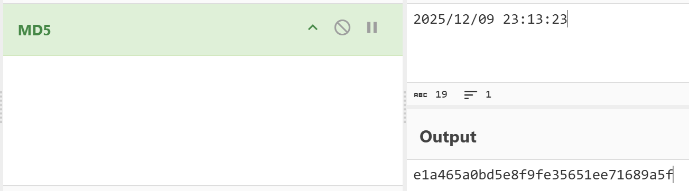

`e1a465a0bd5e8f9fe35651ee71689a5f`

## Q4: 嫌疑人计划的接头暗号是什么？What is the code word for the rendezvous planned by the suspect? e.g: c2443fd7e6e158b9497c3fde067af076 Format: md5(req:res).lowercase()

After replacing the 'AppSata \ Roaming \ CherryStudio \ IndixedDB \ file__0. indexed db. leveldb' directory in CherryStudio with the local application directory, restart CherryStudio and open devtools to view the data in the application.

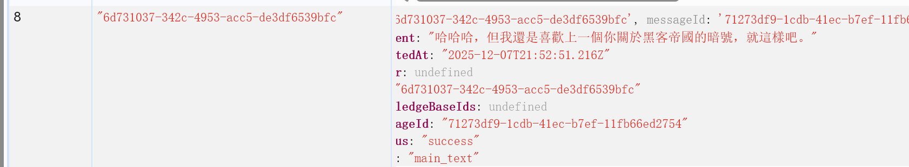

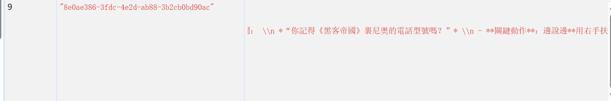

`md5(你記得《黑客帝國》裏尼奧的電話型號嗎？:諾基亞8110，但我覺得貪食蛇更好玩。)`

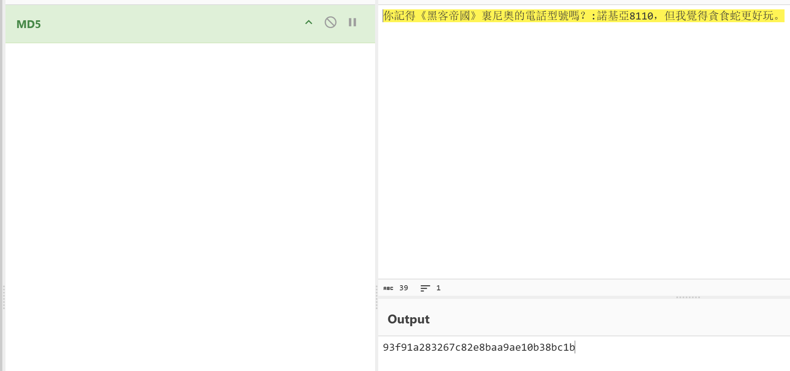

`93f91a283267c82e8baa9ae10b38bc1b`

## Q5: 嫌疑人曾经使用的即时聊天软件是什么？What instant messaging software did the suspect once use? e.g: line

Load software registry ` Root \ Windows \ System32 \ config \ SOFT. LOG1`

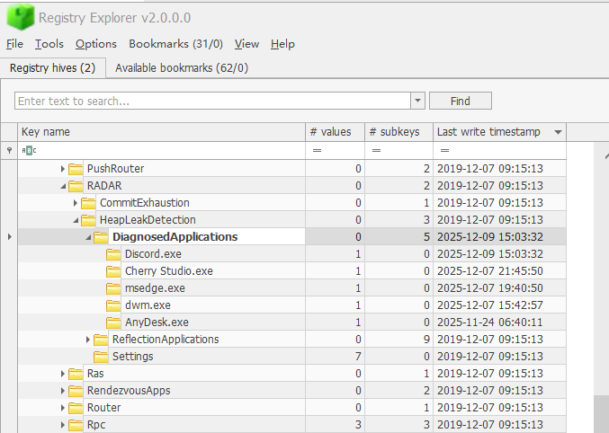

We found program detection records in the logs of Windows' built-in diagnostic system RADAR

So the answer is' Discord '`

## Q6: 聊天软件的密码是什么？What is the password for the suspect's instant messaging account? e.g: admin123

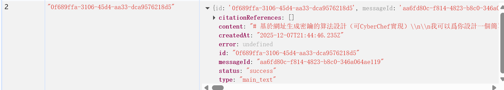

In the records of Cherry Studio, we noticed a piece about the key generation algorithm. Directly copying the algorithm would reveal problems because the key distribution algorithm was used, resulting in different results each time. However, we specifically mentioned Cyberchef

Explosive search on cyberchef reveals cache URI

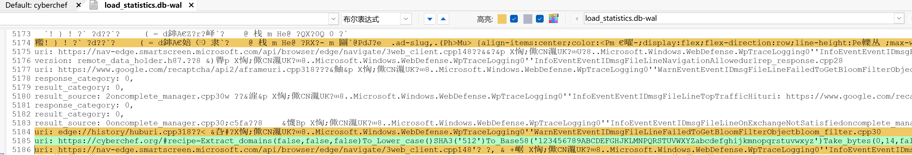

After visiting, obtain the complete recipe and enter the website address` https://cyberchef.org/#recipe=Extract_domains (false,false,false)To_Lower_case()SHA3('512')To_Base58('123456789ABCDEFGHJKLMNPQRSTUVWXYZabcdefghijkmnopqrstuvwxyz')Take_bytes(0,14,false)Substitute('a_D%23','_a%23D',false)`

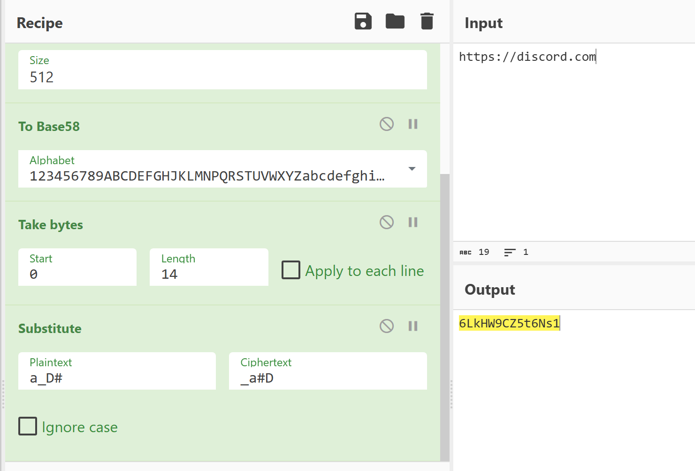

Calculated as 6LkHW9CZ5t6Ns1`

## Q7: 嫌疑人存储的主密钥是什么？What is the master key the suspect stored? e.g: admin123

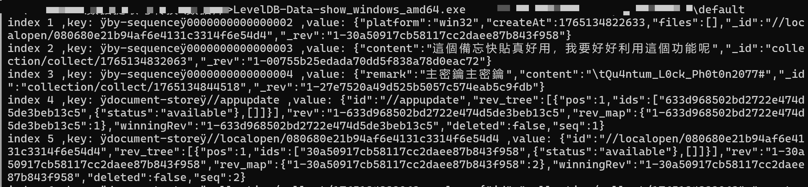

By parsing 'Users \ jack \ AppData \ Roaming \ uTools \ database \ default'`

Obtain 'Qu4ntum-L0ck-Ph0t0n2077'#`

