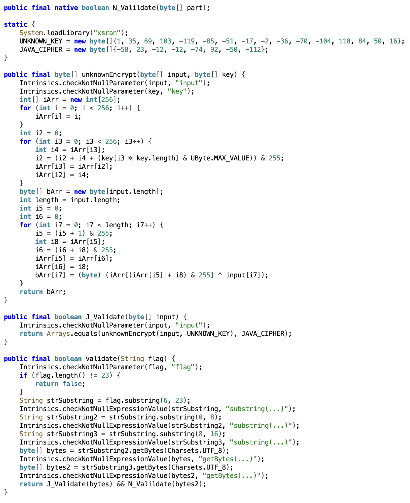
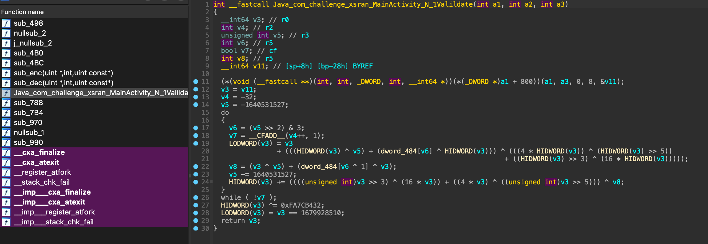
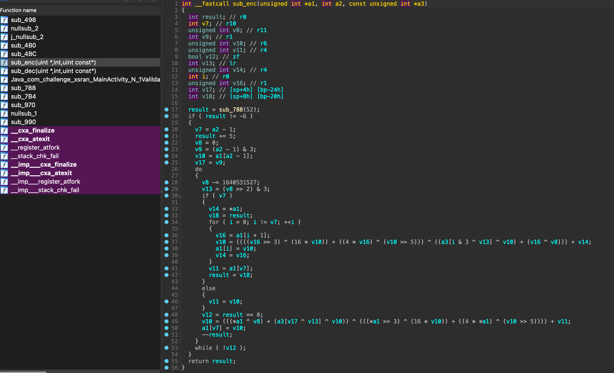

# JN

Open the APK using jadx



Discovered the existence of the `unknownEncrypt` method. The `validate` method splits the user input into two parts after removing the first and last characters. One part is passed to the `J_Validate` method, and the other is passed to the `N_Validate` method. The content passed to `J_Validate` is encrypted by `unknownEncrypt` and compared with `JAVA_CIPHER`. The `unknownEncrypt` method is standard RC4 encryption with the key `UNKNOWN_KEY`.

exp1

```python
def rc4_encrypt(data: bytes, key: bytes):
    S = list(range(256))
    K = [key[i % len(key)] for i in range(256)]
    # KSA
    j = 0
    for i in range(256):
        j = (j + S[i] + K[i]) % 256
        S[i], S[j] = S[j], S[i]
    # PRGA
    i = 0
    j = 0
    out = bytearray()
    for b in data:
        i = (i + 1) % 256
        j = (j + S[i]) % 256
        S[i], S[j] = S[j], S[i]
        t = (S[i] + S[j]) % 256
        out.append(b ^ S[t])
    return bytes(out)
s = bytes([0xc6, 0x17, 0xf4, 0xf4, 0xb6, 0x5c, 0xce, 0x90])
key = bytes([0x01,0x23,0x45,0x67,0x89,0xab,0xcd,0xef,0xfe,0xdc,0xba,0x98,0x76,0x54,0x32,0x10])
decrypted = rc4_encrypt(s, key)
print(decrypted)
```

The validation of the second part calls `N_Validate`, but the definition of this method cannot be found. This is because this method is a native layer method, defined in C++. Some characteristics of native layer methods:

- native keyword

```java
public final native boolean N_Valildate(byte[] part);
```

- loadLibrary loads external library

```java
System.loadLibrary("xsran");
```

Therefore, to obtain the second part of the flag, we need to analyze the external library, which is a `.so` file in this case. The method to obtain the `.so` file is to extract the APK as a ZIP file, find the `lib` folder inside, and then locate the folder corresponding to the phone architecture (here we use `armeabi-v7a` as an example). Then open the `.so` file with IDA. Functions starting with `Java` are exported functions, but this exported function uses other functions (`sub_enc`/`sub_dec`), so combining with the ciphertext, we should analyze the `enc` function.





The encryption method used by the `enc` function is XXTEA. The decryption script is as follows:

exp2

```C
#include <stdio.h>
#include <stdint.h>
#include <string.h>

void xxtea_decrypt(uint32_t* v, int n, uint32_t const key[4]) {
    uint32_t z, y = v[0], sum, e;
    uint32_t DELTA = 0x9e3779b9;
    unsigned p, q = 6 + 52 / n;

    sum = q * DELTA;

    while (sum != 0) {
        e = (sum >> 2) & 3;
        for (p = n - 1; p > 0; p--) {
            z = v[p - 1];
            v[p] -= ((z >> 5 ^ y << 2) + (y >> 3 ^ z << 4)) ^ ((sum ^ y) + (key[(p & 3) ^ e] ^ z));
            y = v[p];
        }
        z = v[n - 1];
        v[0] -= ((z >> 5 ^ y << 2) + (y >> 3 ^ z << 4)) ^ ((sum ^ y) + (key[(0 & 3) ^ e] ^ z));
        y = v[0];
        sum -= DELTA;
    }
}

int main() {
    uint8_t key_bytes[16] = { 0x0f, 0x1e, 0x2d, 0x3c, 0x4b, 0x5a, 0x69, 0x78,
                              0x87, 0x96, 0xa5, 0xb4, 0xc3, 0xd2, 0xe1, 0xf0 };
    uint32_t key[4];
    memcpy(key, key_bytes, 16);

    uint8_t cipher_bytes[8] = { 0xbe, 0xac, 0x21, 0x64, 0x32, 0xb4, 0x7c, 0xfa };
    uint32_t v[2];
    memcpy(v, cipher_bytes, 8);

    xxtea_decrypt(v, 2, key);

    char plain_text[9] = {0};
    memcpy(plain_text, v, 8);

    printf("%s\n", plain_text);
    return 0;
}
```
