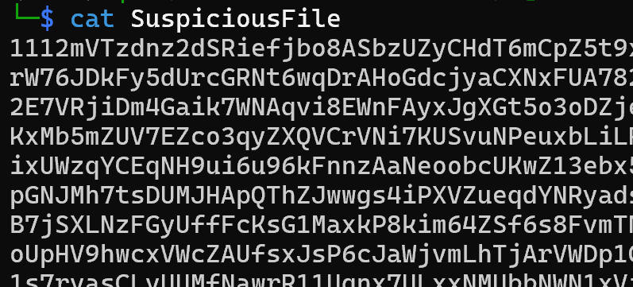
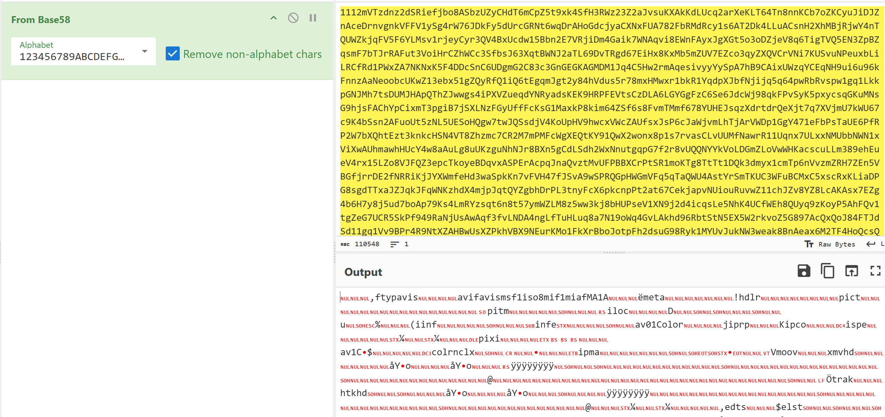
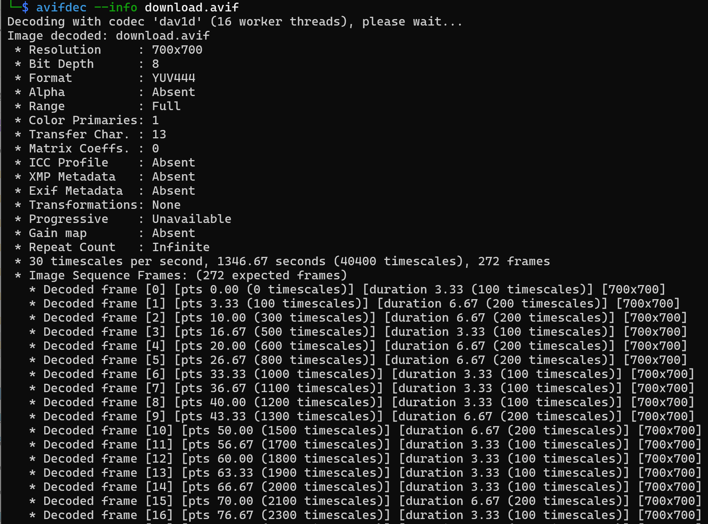
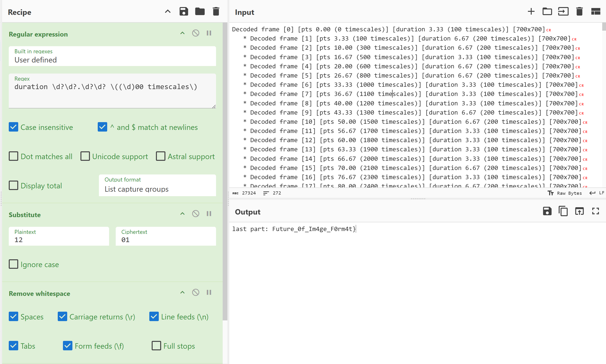
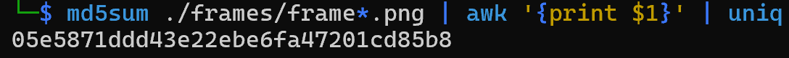
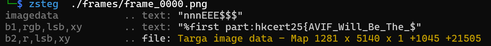

## this is a writeup

First, I checked the content of the file and found that it was encoded, suggesting a base family



After trying, it was found to be base58, and it was identified as an avif file



Using avifdec to inspect the image, we found that it is a multi-frame image, and the duration exhibits regularity, with values following a binary distribution



It naturally occurs to convert it into a 01 sequence

```
Regular_expression('User defined','duration \\d?\\d?.\\d?\\d? \\((\\d)00 timescales\\)',true,true,false,false,false,false,'List capture groups')
Substitute('12','01',false)
Remove_whitespace(true,true,true,true,true,false)
From_Binary('Space',8)
```



Thus, we obtain the last part of the flag: Future_0f_Im4ge_F0rm4t}

Let's continue to delve into the analysis of this file and attempt to extract the content of each frame

```
mkdir -p frames
for i in {0..271}; do
    avifdec --index $i download.avif frames/frame_$(printf "%04d" $i).png 2>/dev/null
done
```

Calculate whether there is a difference in each frame

```
md5sum ./frames/frame*.png | awk '{print $1}' | uniq
```



If the images are identical, analyze the single image



The first part of the flag obtained is `hkcert25{AVIF_Will_Be_The_`

So the flag is `hkcert25{AVIF_Will_Be_The_Future_0f_Im4ge_F0rm4t}`