## Writeup

The program code of the R3 layer is straightforward; it merely receives an input string and writes it to a specific address within its own process. From this, we can infer that the R0 driver has direct access to the process through some means, retrieves the string stored at the fixed address, and performs verification.

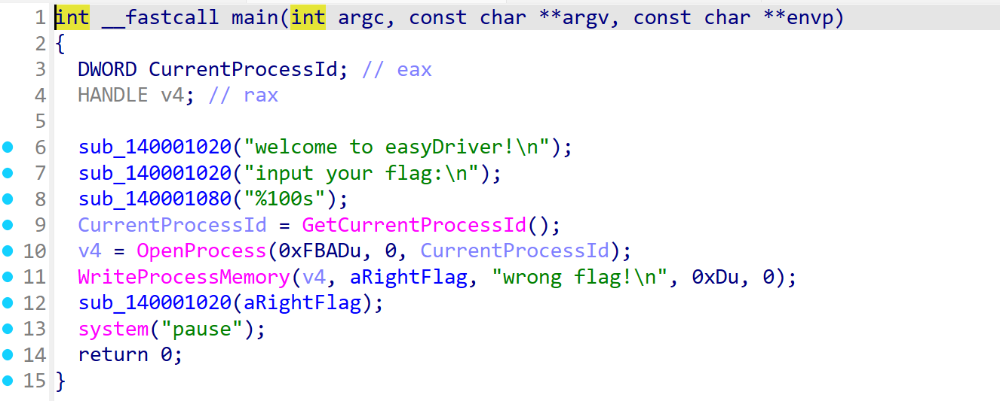

Set up a debugging environment using the project https://github.com/4d61726b/VirtualKD-Redux.

To load the driver, use the Driver Monitor project. To capture debugging characters, use DebugView. If you directly use the tool to load the driver, you will find that it will directly cause a blue screen.

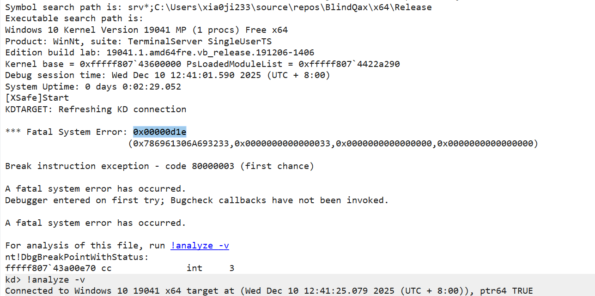

So I chose to use the [KACE](https://github.com/waryas/KACE) project to simulate the driver. This project has been out of maintenance for a long time and requires the installation of the zydis library for adaptation. Alternatively, you can use the version I have fixed: https://github.com/xia0ji233/KACE. After fixing it, the following results can be obtained:

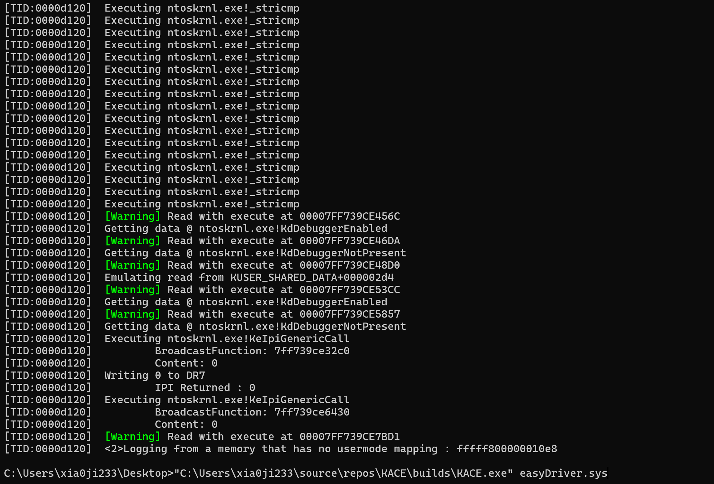

It can be observed that the driver has read the debugger fields on KUSER_SHARED_DATA and referenced the KdDebuggerEnabled and KdDebuggerNotPresent fields.

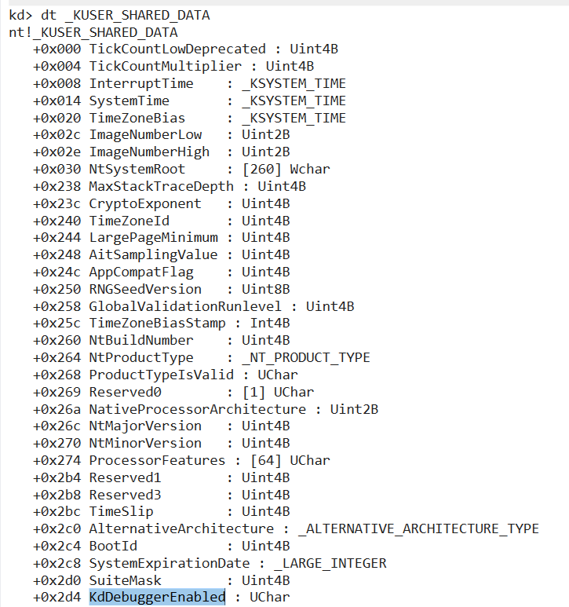

Subsequently, two functions were executed through the IPI interrupt. The first function cleared the hardware breakpoint register, while the second function performed some operations that directly led to the simulator crashing. Here, we can modify the code so that the function pointed to by the IPI is not executed, or simply NOP it out.

Through calculation, we can obtain the offset between these two functions as:
`0x7ff739ce32c0 - 0x7ff739ce0000 = 0x32c0`
and
`0x7ff739ce6430 - 0x7ff739ce0000 = 0x6430`.

IPI (Inter-Processor Interrupt) is an interrupt between processors. Executing this function will force all other CPUs to interrupt and execute the function. This is a common way to perform anti-debugging operations, such as clearing the hardware breakpoint register as seen above.

To simulate normal execution, we cancel the execution of the IPI interrupt broadcast function.

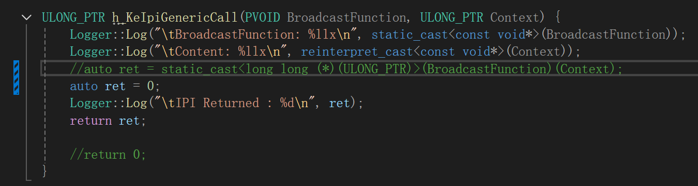

After canceling the execution:

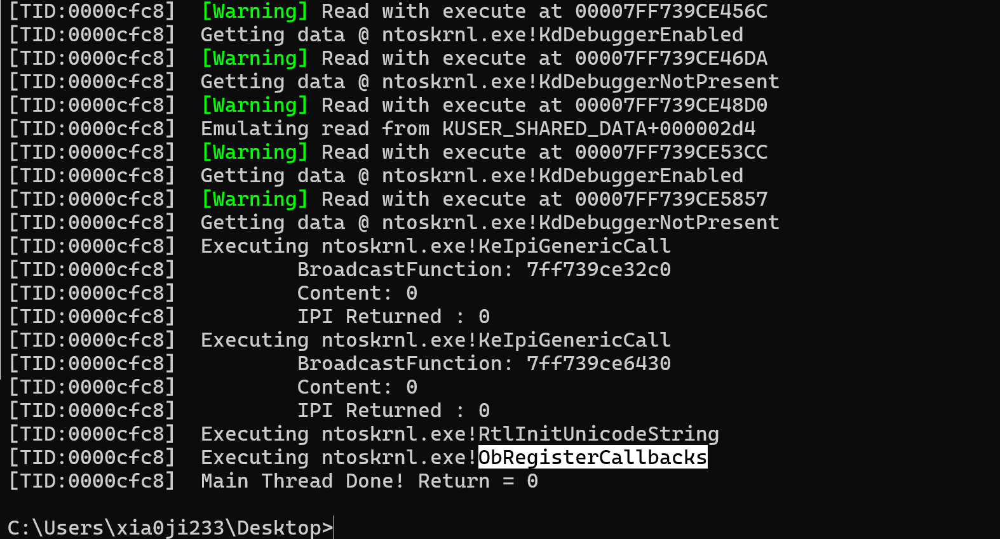

We can see that the driver exits after registering the callback. Therefore, what we need to do is to bypass the preceding anti-debugging measures. The best approach is to hook its anti-debugging function and make it return directly.

After simulation, it can be confirmed that the anti-debugging function is located at `+0x3FF5`, which can be directly overwritten with `c3`.

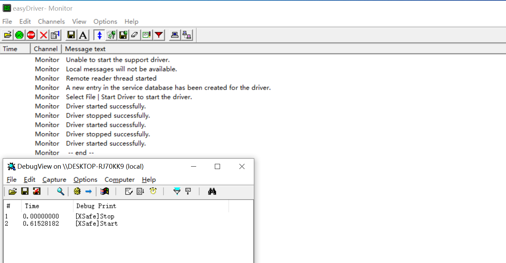

After bypassing anti-debugging, we can continue debugging and verifying the logic.

The next step is to use the Ark tool to view the callback address.

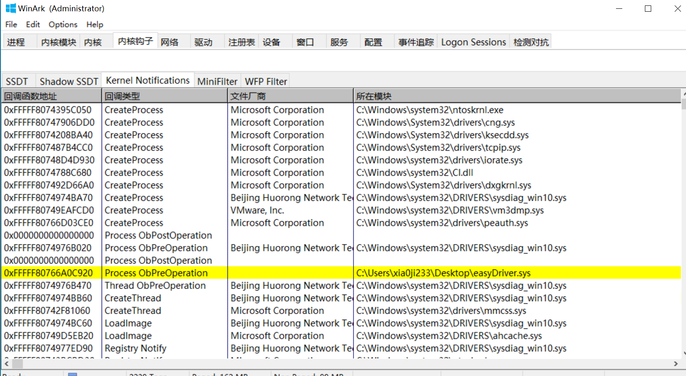

The address can be clearly seen as:
`0xFFFFF80766A0C920 - 0xFFFFF80766A00000 = 0xc920`.

Since this function is also obfuscated, it is difficult to directly view the logic. Therefore, we set a breakpoint, run the R3 program, and observe the logic. As the system continuously acquires process handles, this function is called frequently. We must find the location where it is only entered when verifying the flag.

Considering the given `xia0ji233.exe`, we speculate that it should internally check the EXE file name. We set a breakpoint at its `strcmp` function.

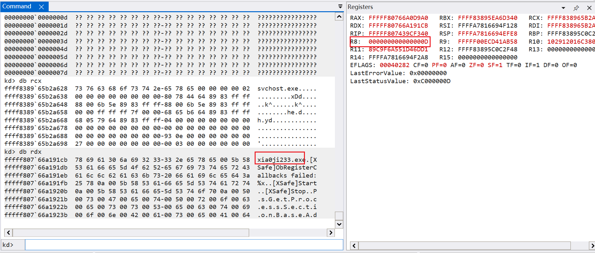

After checking the parameters, the target was indeed found. Based on the stack structure, key branches can be identified.

After tracing a few more steps forward, we discovered the crucial branch.

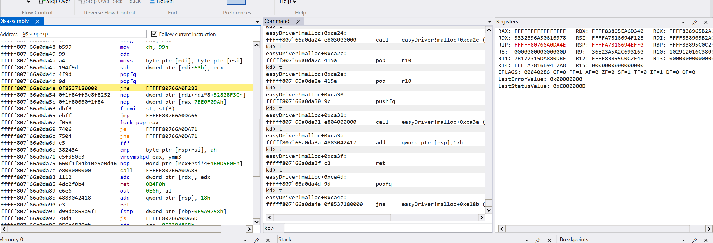

We set a breakpoint after the `jne` instruction, and then enter the flag, successfully entering the flag verification logic.

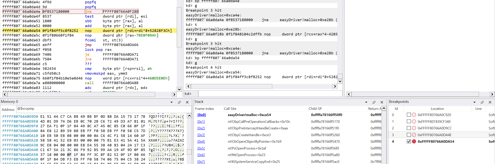

Next, we will open the debugger to debug the R3 program and obtain the program's base address.

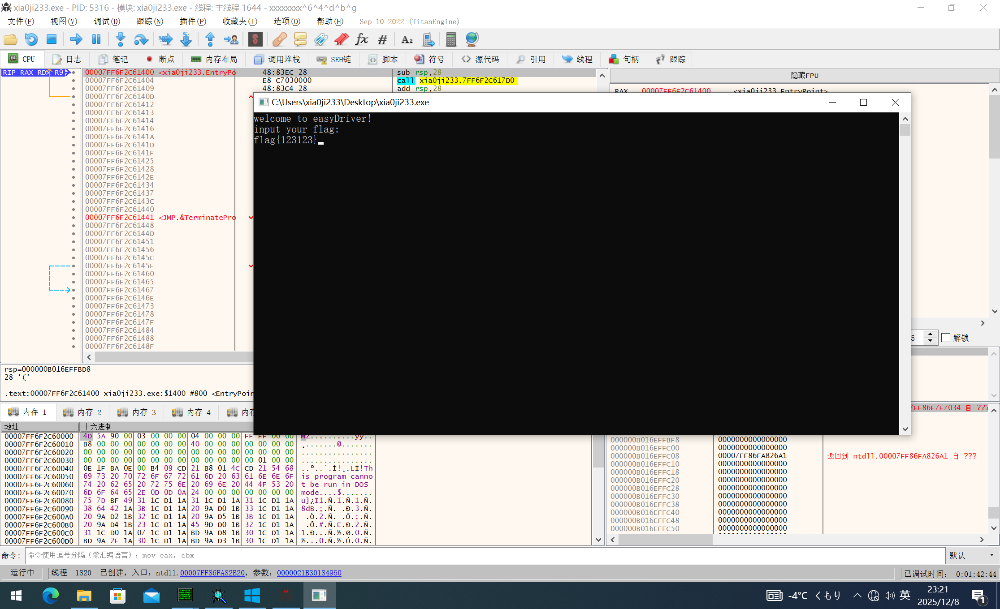

The kernel debugger was subsequently interrupted. If the flag needs to be verified, it will inevitably be read into the kernel. We first locate the position of the flag and set a hardware access breakpoint.

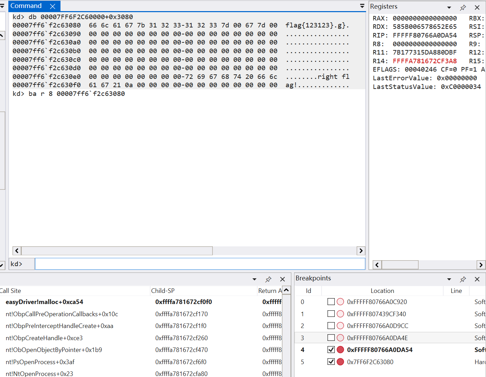

Then we successfully located the position of the kernel layer.

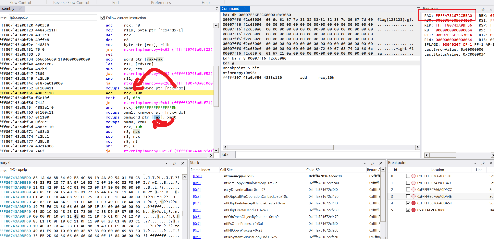

Similarly, we set hardware access and write breakpoints on the kernel-level data and observed the data changes. It is not difficult to deduce that TEA encryption is used, with a round number of 599. The encryption key is:

- 0x3c4ed885
- 0x12af3e87
- 0xd6e1b31f
- 0x25c10aa0


```C++
#include <iostream>
#include <Windows.h>

uint32_t key[] = { 0x3c4ed885, 0x12af3e87, 0xd6e1b31f, 0x25c10aa0 };


void decrypt_xtea(uint32_t num_rounds, uint32_t v[2], uint32_t const key[4]) {
	uint32_t i;
	uint32_t v0 = v[0], v1 = v[1], delta = 0x9E3779B9, sum = delta * num_rounds;
	for (i = 0; i < num_rounds; i++) {
		v1 -= (((v0 << 4) ^ (v0 >> 5)) + v0) ^ (sum + key[(sum >> 11) & 3]);
		sum -= delta;
		v0 -= (((v1 << 4) ^ (v1 >> 5)) + v1) ^ (sum + key[sum & 3]);
	}
	v[0] = v0; v[1] = v1;
}
char t[] = "\xd5\xbf\x90\x2a\xef\xb7\x53\xaa\x31\xb0\x23\xfc\x10\x5d\x98\xdd\xa4\xee\x5c\xff\xc1\x98\xde\x0a\xd3\x1d\xbb\xc5\xcc\xd0\xa3\x60\xa9\xcc\x2f\xc0\x2b\x25\x9f\xdd\x50\xcd\x50\x97\xe5\x76\x8a\x80";

int main(){
	for (size_t i = 0; i < strlen(t) / 8; i++) {
		decrypt_xtea(599, (uint32_t*)&t[i * 8], key);
	}
	puts(t);
}
```
