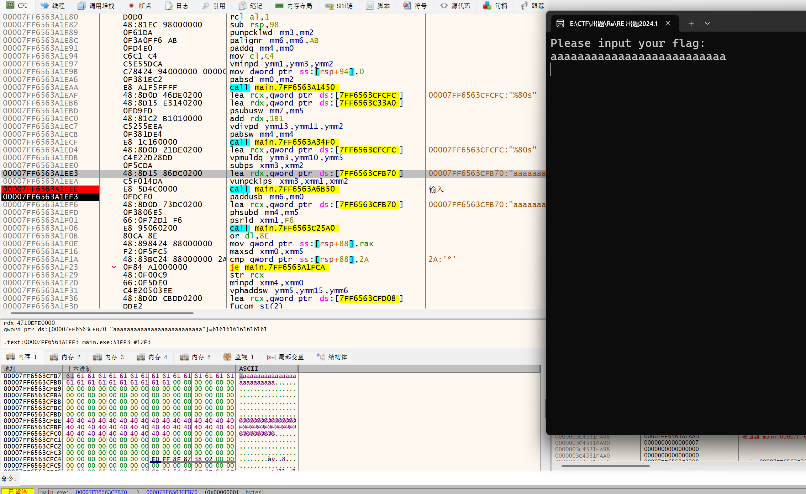
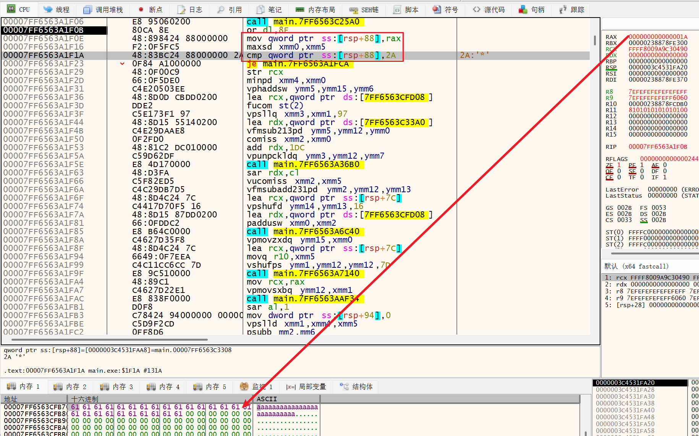
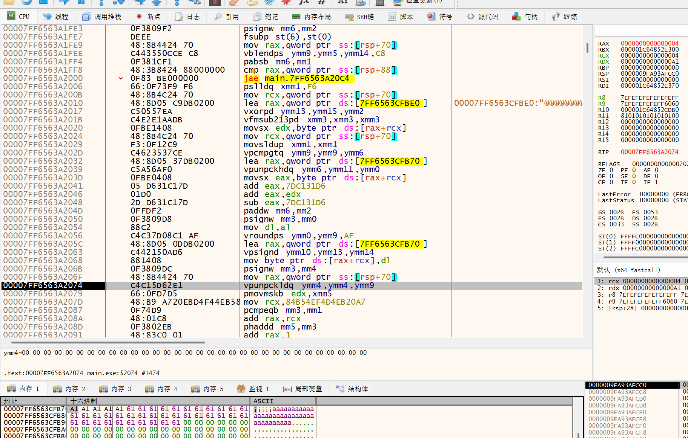
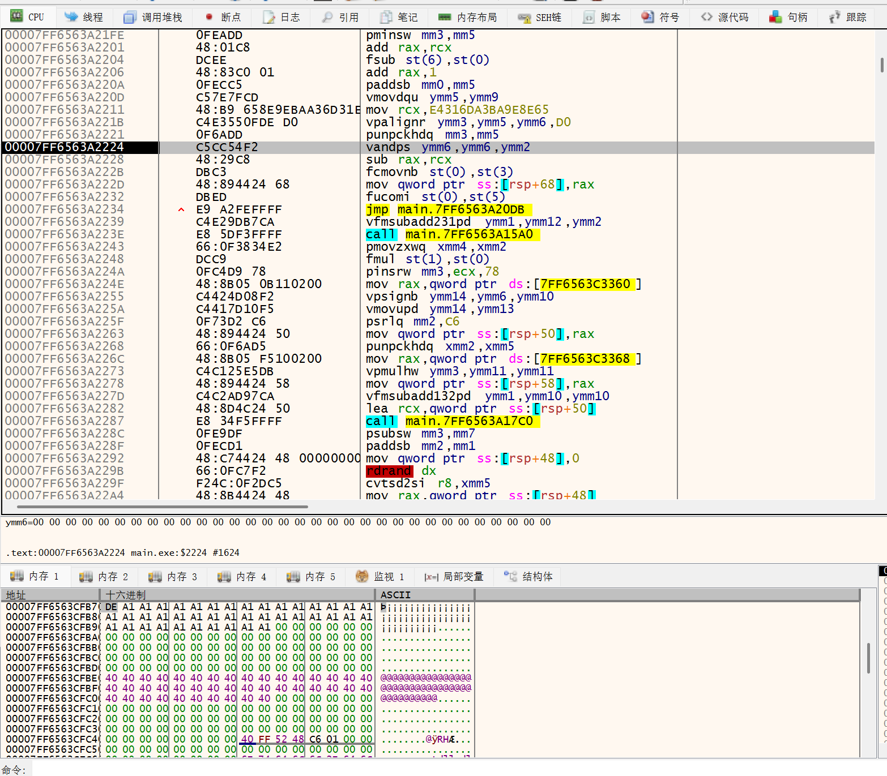
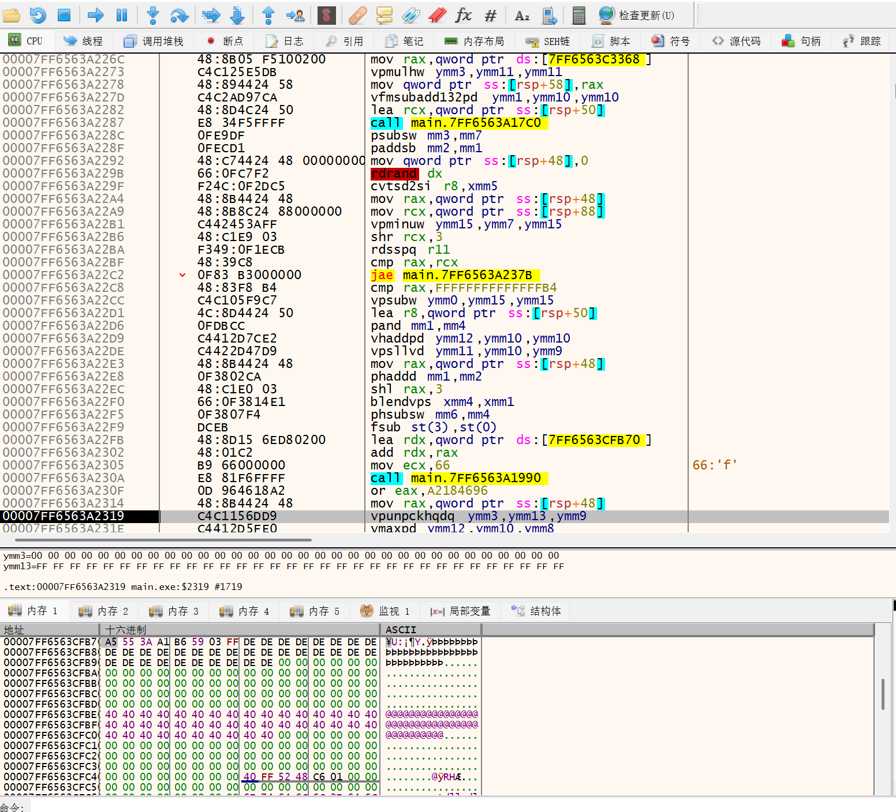
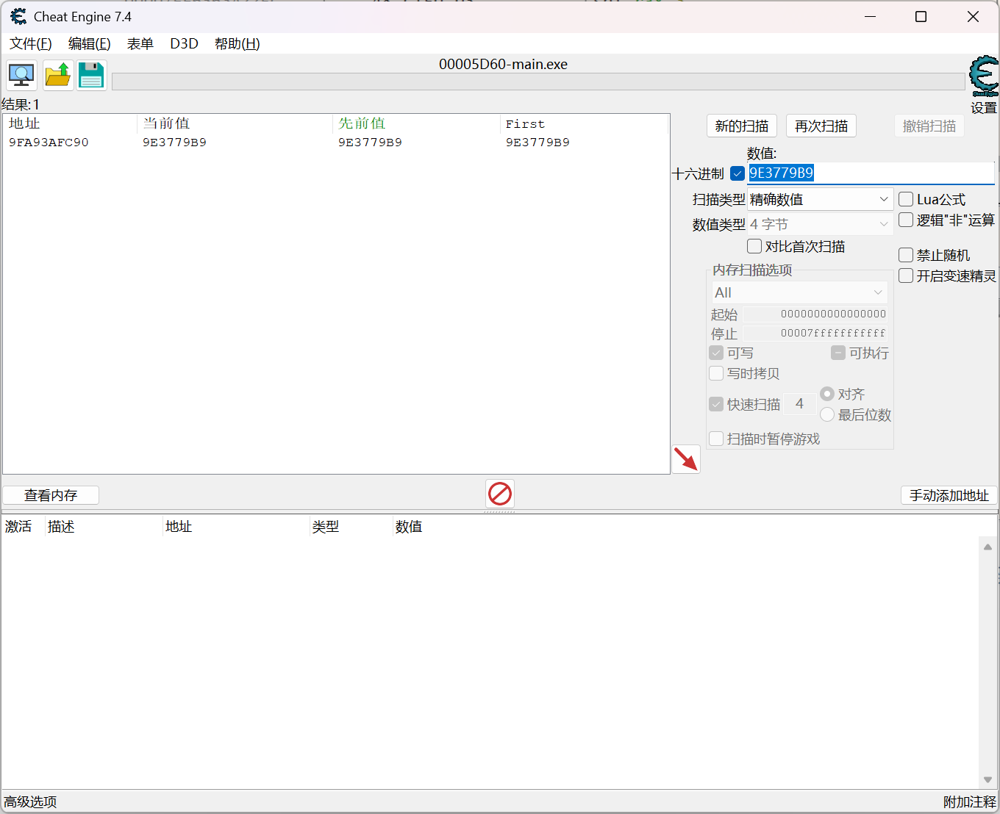
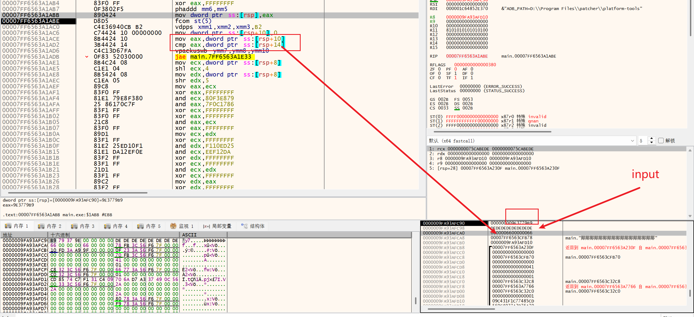
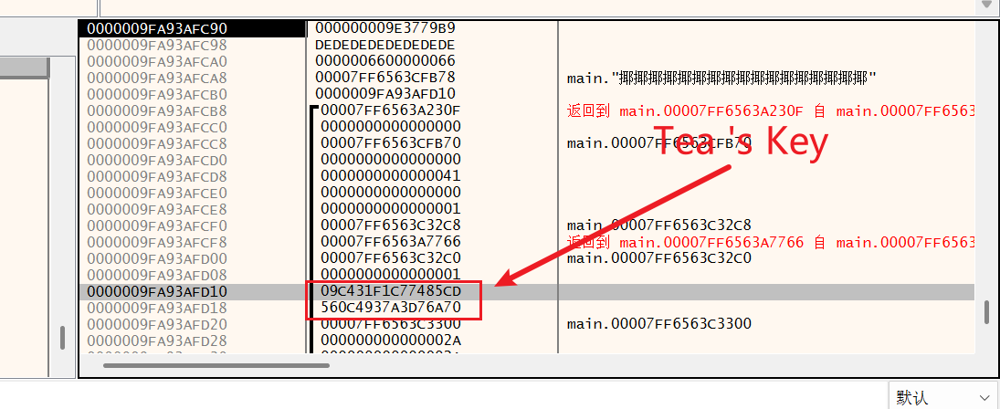

## WriteUp

After analyzing the problem with IDA, it was found that there is a significant amount of obfuscation. One can either use an idapy script to remove the obfuscation one by one for analysis, or use dynamic debugging to solve this problem. This write-up uses dynamic debugging as an example to solve the problem.



By stepping through repeatedly, it is easy to break at the input location and check the input address.



Next, based on the input and the subsequent functions, it can be determined that the length of the flag input is being checked, and it must be 0x2a.



After one loop, it was found that the input 0x61 was changed to 0xA1. After repeatedly testing, it was determined that `0x40` was added to each byte.



Then, it was found that 0xA1 changed to 0xDE. After modifying and verifying, it was determined that an XOR operation with `0x7F` was performed.



The last segment changed 8 bytes at once. Based on the problem name "easytea," it was initially guessed to be TEA encryption. TEA encryption involves XOR operations, so I started looking for the delta value to check if it existed.



Using CE (Cheat Engine), this value could be found.



By setting a hardware breakpoint, the structure on the stack can be observed.



After repeated dynamic debugging, the TEA key was determined, and the number of encryption rounds was found to be 66 rounds.


```C++

#include<stdio.h>
#include<stdint.h>
#include<string.h>

char target[]="\xba\x7a\xaa\x6a\x2f\x7e\xf8\x03\x2d\xb4\xab\x92\x6b\x91\x31\xda\x95\x37\x51\x13\x1f\xce\x1c\x62\x51\xbc\x3f\xb2\xb1\xb3\x54\x17\xef\x28\x93\xae\x52\xca\xce\xa7\xde\xc2";
void encrypt_xtea(uint32_t num_rounds, uint32_t v[2], uint32_t const key[4]) {
    uint32_t i;
    uint32_t v0 = v[0], v1 = v[1], sum = 0, delta = 0x9E3779B9;
    for (i = 0; i < num_rounds; i++) {
        v0 += (((v1 << 4) ^ (v1 >> 5)) + v1) ^ (sum + key[sum & 3]);
        sum += delta;
        v1 += (((v0 << 4) ^ (v0 >> 5)) + v0) ^ (sum + key[(sum >> 11) & 3]);
    }
    v[0] = v0; v[1] = v1;
}

void decrypt_xtea(uint32_t num_rounds, uint32_t v[2], uint32_t const key[4]) {
    uint32_t i;
    uint32_t v0 = v[0], v1 = v[1], delta = 0x9E3779B9, sum = delta * num_rounds;
    for (i = 0; i < num_rounds; i++) {
        v1 -= (((v0 << 4) ^ (v0 >> 5)) + v0) ^ (sum + key[(sum >> 11) & 3]);
        sum -= delta;
        v0 -= (((v1 << 4) ^ (v1 >> 5)) + v1) ^ (sum + key[sum & 3]);
    }
    v[0] = v0; v[1] = v1;
}

int main(){
    size_t len=sizeof(target)-1;
    uint32_t key[] = {0xc77485cd, 0x9c431f1, 0xa3d76a70, 0x560c4937};
    for (size_t i = 0; i < len / 8; i++){
        decrypt_xtea(0x66,(uint32_t *)&target[i*8],key);
    }
    for(size_t i=0;i<len;i++){
        target[i]=target[i]^0x7f;
    }
    for(size_t i=0;i<len;i++){
        target[i]-=0x40;
    }

    for(size_t i=0;i<len;i++){
        printf("%c",(unsigned char)target[i]);
    }

}
```