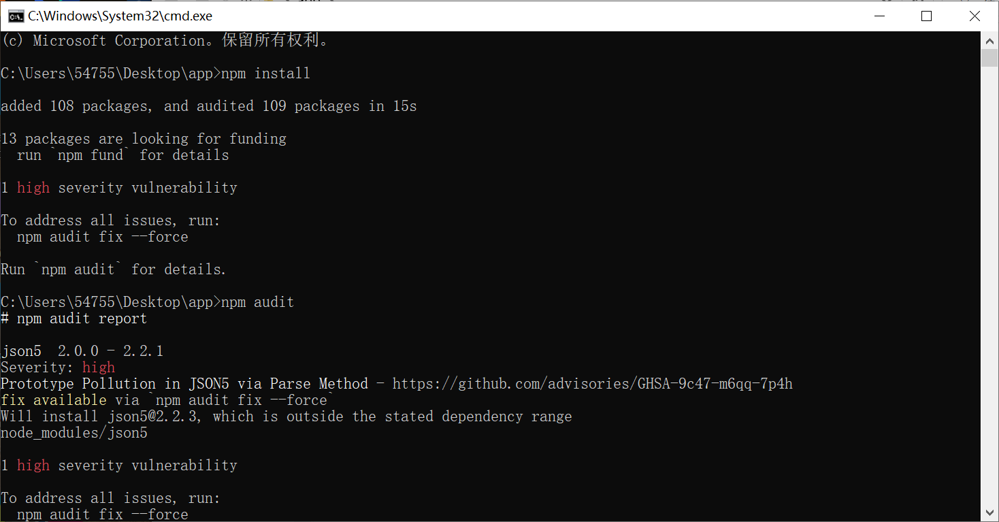
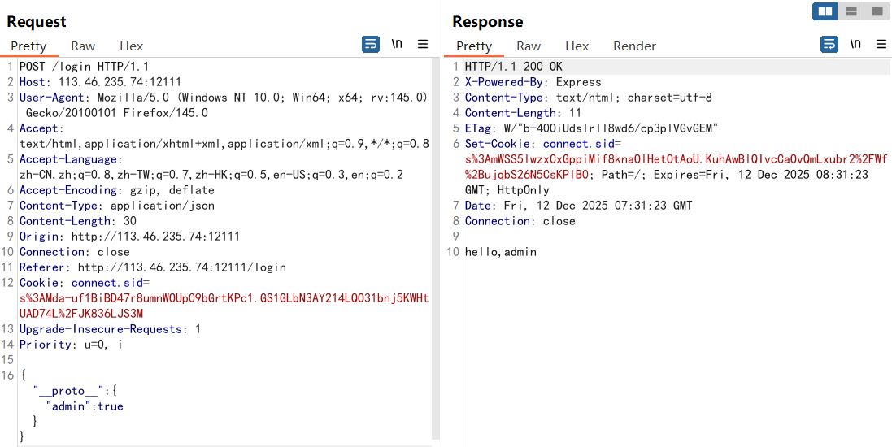
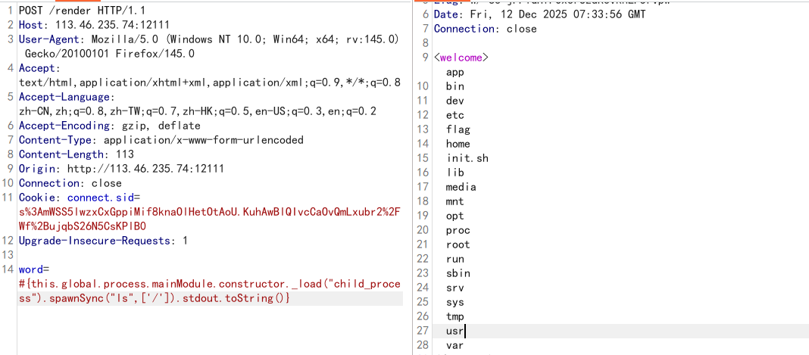
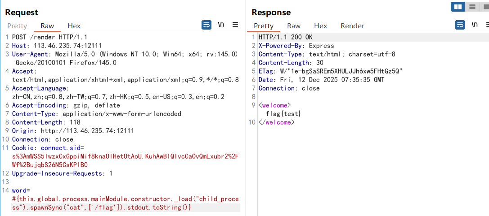

- **Challenge Name:** ezjs

- **Writeup:**

After obtaining the source code, conduct a simple audit first. The /login route receives the input data and modifies the session for identity identification, but "admin" is filtered and cannot be passed directly. The /render route directly renders data using pugjs. Since package.json is provided, you can start the environment locally using npm.

Found that the json5.parse method has a prototype pollution vulnerability. The /login route happens to use this method when processing input, so you can directly pollute admin to true through prototype pollution.

After obtaining the admin session, access the /render route. Through information gathering, it was discovered that pugjs also has an SSTI vulnerability, so directly use the corresponding payload for injection.

However, checking the source code reveals that "require" and "exec" keywords are filtered. "require" can be bypassed using constructor._load, and "exec" can be bypassed using spawn.

